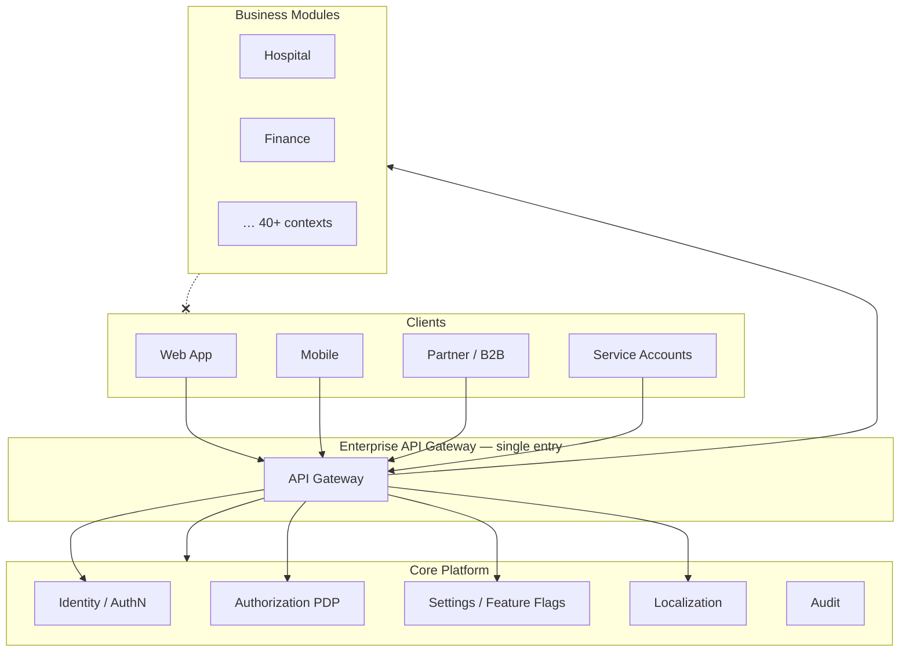
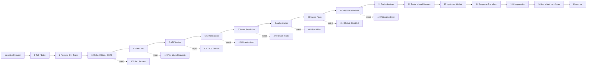
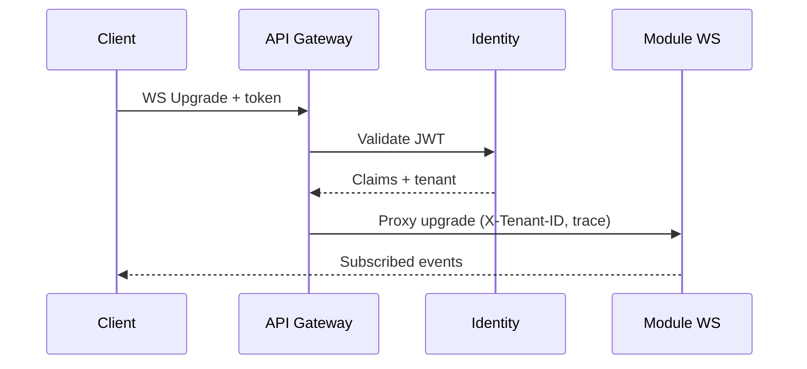
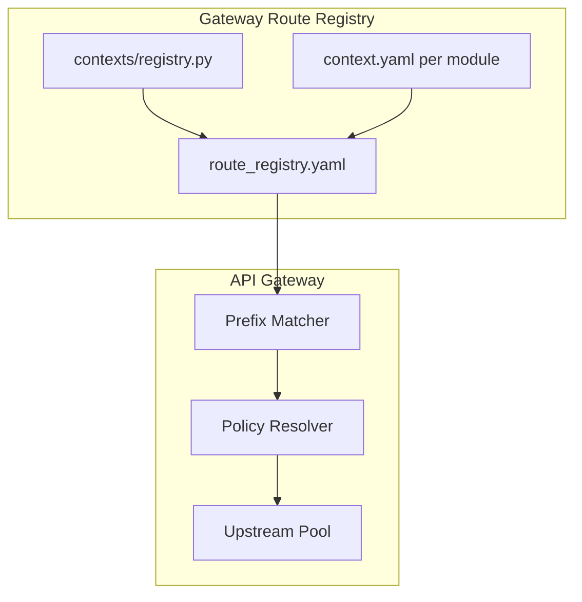
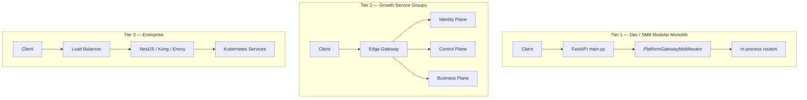
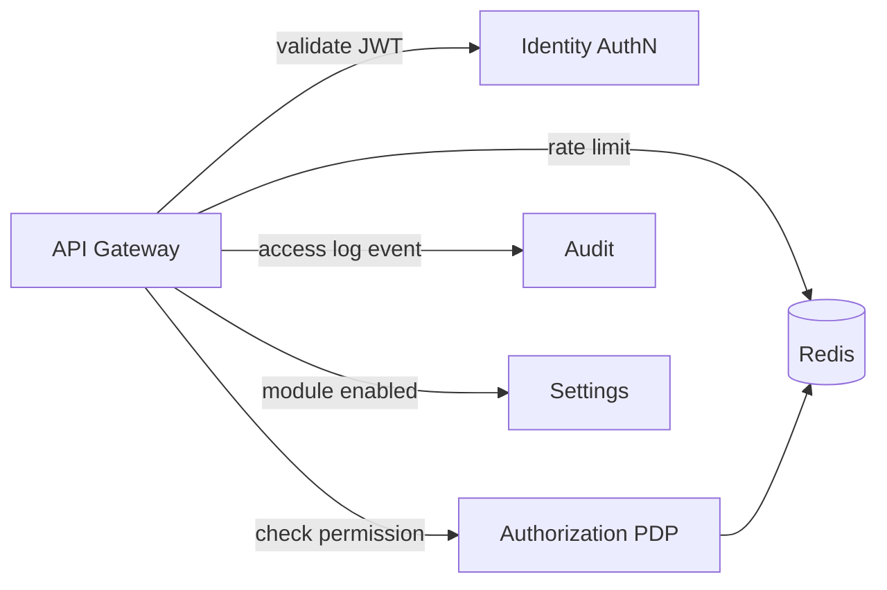

# Enterprise API Gateway — Marpich

**Status:** Canonical — single entry point for all external traffic  
**Audience:** Platform engineers, SRE, security, module authors, AI agents  
**Implementation:** `backend/core/presentation/middleware/` · `backend/modules/platform/gateway/` · `services/api-gateway/` (enterprise tier)  
**Companions:** [SECURITY_STANDARD.md](SECURITY_STANDARD.md) · [COMMUNICATION_ARCHITECTURE.md](COMMUNICATION_ARCHITECTURE.md) · [INTEGRATION_PLATFORM.md](INTEGRATION_PLATFORM.md) · [CORE_PLATFORM_DESIGN.md](CORE_PLATFORM_DESIGN.md) · [PERFORMANCE_STANDARD.md](PERFORMANCE_STANDARD.md)

**Law: The API Gateway is the single entry point. Reject invalid requests before they reach modules.**

---

## Platform position



**Forbidden:** Clients calling module backends directly. Modules are not internet-facing.

---

## The law

```
The API Gateway is the SINGLE entry point for all HTTP and WebSocket traffic.

Responsibilities (all mandatory at enterprise tier):
  Authentication · Authorization · JWT Validation · OpenID Connect · OAuth2
  Rate Limiting · API Versioning · Load Balancing · Caching · Compression
  Request Validation · Response Transformation
  Logging · Monitoring · Metrics · Distributed Tracing
  WebSocket Routing · Tenant Resolution · Localization
  API Documentation · Feature Flags

Invalid requests are REJECTED at the gateway — they never reach module handlers.
```

---

## Request pipeline — fail fast

Every request passes through an ordered **filter chain**. Each stage may **terminate** with `4xx`/`5xx` before the next stage runs.



### Rejection rules (before modules)

| Stage | Rejects when | HTTP | Module reached? |
|-------|--------------|------|-----------------|
| Method / size | Unsupported verb, body > limit, malformed `Content-Type` | 400 | No |
| CORS | Origin not in tenant allowlist (browser preflight) | 403 | No |
| Rate limit | Tenant/user/IP bucket exceeded | 429 | No |
| API version | Unknown `/api/v{n}/` or `Accept-Version` mismatch | 404 / 406 | No |
| Authentication | Missing/invalid/expired JWT; OIDC token invalid | 401 | No |
| Tenant | Missing `X-Tenant-ID` on scoped route; token tenant ≠ header | 400 / 403 | No |
| Authorization | PDP denies `module.resource.action` | 403 | No |
| Feature flags | Module not activated for tenant | 404 | No |
| Request validation | OpenAPI / JSON Schema body/query fail | 422 | No |
| Route | No registered upstream for path prefix | 404 | No |

**Principle:** Modules assume the gateway already authenticated, authorized, and scoped the request. Module handlers still enforce defense-in-depth (`require_permissions`) — never trust the network alone.

---

## Twenty gateway responsibilities

### 1. Authentication

| Item | Detail |
|------|--------|
| **Purpose** | Prove caller identity before any business logic |
| **Mechanisms** | JWT Bearer (`Authorization`), API keys (service), OIDC ID token (SSO) |
| **Owner** | Identity context — `/api/v1/auth/*` |
| **Gateway** | Validates token signature, `exp`, `iss`, `aud`; attaches `GatewayContext` |
| **Public routes** | `/auth/login`, `/auth/register`, `/auth/refresh`, `/health`, OIDC callbacks |

### 2. Authorization

| Item | Detail |
|------|--------|
| **Purpose** | Policy decision before routing to module |
| **Mechanisms** | RBAC + ABAC via Authorization PDP |
| **Owner** | Identity — `POST /api/v1/authorization/check` |
| **Gateway** | Resolves required permission from route registry; calls PDP or validates cached decision |
| **Cache** | Redis `authz:{tenant}:{user}:{permission}` — short TTL |

### 3. JWT validation

| Item | Detail |
|------|--------|
| **Algorithms** | HS256 (dev) · RS256 (production) |
| **Claims** | `sub`, `tenant_id`, `scopes`, `jti`, `exp`, `iat` |
| **Gateway** | Reject before upstream if invalid — no pass-through of bad tokens |
| **Code** | `contexts/identity/infrastructure/security/jwt.py` |

### 4. OpenID Connect

| Item | Detail |
|------|--------|
| **Purpose** | Enterprise SSO — discovery, authorization code flow, ID token |
| **Routes** | `/auth/oidc/{provider}/login`, `/auth/oidc/{provider}/callback` |
| **Gateway** | Callback routes public; issued platform JWT for subsequent API calls |
| **Config** | Per-tenant IdP in Settings (`oidc_providers` JSON Schema) |

### 5. OAuth2

| Item | Detail |
|------|--------|
| **Flows** | Authorization code (users) · Client credentials (service-to-service) |
| **Gateway** | Service tokens validated same as user JWT; scoped to `client_id` + permissions |
| **B2B** | Partner integrations via Integration context + gateway route allowlist |

### 6. Rate limiting

| Item | Detail |
|------|--------|
| **Dimensions** | `tenant_id` · `user_id` · `client_ip` · route class |
| **Store** | Redis — `ratelimit:{tenant}:{user}:{window}` |
| **Defaults** | 1000 req/min tenant · 100 req/min user · stricter on `/auth/login` |
| **Response** | `429` + `Retry-After` + audit `identity.rate_limit.exceeded` |

### 7. API versioning

| Item | Detail |
|------|--------|
| **URL** | `/api/v1/{context}/...` — primary |
| **Header** | `Accept-Version: 1` (optional explicit) |
| **Policy** | v1 stable; v2 parallel mount; sunset via `Deprecation` header |
| **Gateway** | Reject unknown version segments before routing |

### 8. Load balancing

| Item | Detail |
|------|--------|
| **Dev / SMB** | In-process FastAPI — single upstream |
| **Growth** | Service groups — round-robin / least-conn per plane |
| **Enterprise** | `services/api-gateway` → N upstream pods (K8s / Render) |
| **Health** | Upstream excluded when `/health` fails |

### 9. Caching

| Item | Detail |
|------|--------|
| **Scope** | Safe GET only; tenant-scoped keys |
| **Key** | `cache:{tenant}:{route_hash}:{query_hash}` |
| **Invalidation** | Module publishes `*.updated` events → cache bust rules |
| **Gateway** | `Cache-Control`, `ETag`, optional Redis edge cache |
| **Never** | Cache mutations or cross-tenant responses |

### 10. Compression

| Item | Detail |
|------|--------|
| **Algorithms** | gzip, br (brotli) when client `Accept-Encoding` supports |
| **Gateway** | Compress responses > 1 KB; decompress upstream if needed |
| **WebSocket** | permessage-deflate optional |

### 11. Request validation

| Item | Detail |
|------|--------|
| **Source** | Aggregated OpenAPI 3.1 per route |
| **Gateway** | Validate body, query, path params against schema **before** proxy |
| **Module** | Pydantic second line — defense in depth |
| **Reject** | 422 with `{ errors: [{ field, code, message }] }` |

### 12. Response transformation

| Item | Detail |
|------|--------|
| **Envelope** | Standard `{ data, meta, errors }` — [CORE_PLATFORM.md](CORE_PLATFORM.md) |
| **Gateway** | Inject `meta.request_id`, `meta.correlation_id`, `meta.locale` |
| **Errors** | Normalize upstream errors to platform shape |
| **PII** | Strip internal fields from error payloads |

### 13. Logging

| Item | Detail |
|------|--------|
| **Format** | Structured JSON — `request_id`, `tenant_id`, `user_id`, `method`, `path`, `status`, `duration_ms` |
| **Implementation** | `PlatformGatewayMiddleware` — `marpich.gateway` logger |
| **Never log** | Passwords, tokens, full PAN |

### 14. Monitoring

| Item | Detail |
|------|--------|
| **Health** | `GET /api/v1/health`, `GET /api/v1/health/ready` |
| **Synthetic** | Gateway probes upstream readiness |
| **Alerts** | 5xx rate, p99 latency, auth failure spike |

### 15. Metrics

| Item | Detail |
|------|--------|
| **Instrument** | `marpich.gateway` meter — request duration, status histogram |
| **Export** | Prometheus `/metrics` or OTLP |
| **Labels** | `method`, `route_template`, `status`, `tenant_id` (hashed) |

### 16. Distributed tracing

| Item | Detail |
|------|--------|
| **Standard** | OpenTelemetry — W3C `traceparent` |
| **Propagation** | Gateway → upstream via headers |
| **Spans** | `gateway.request`, `gateway.auth`, `gateway.route`, `upstream.call` |
| **Reference** | [ADR-013](../adr/013-opentelemetry.md) |

### 17. WebSocket routing

| Item | Detail |
|------|--------|
| **Paths** | `/api/v1/ws/{context}/{channel}` |
| **Auth** | JWT in query `?token=` or first message `auth` frame |
| **Gateway** | Upgrade proxy to module WS handler (notifications, workflow, POS) |
| **Tenant** | Required before subscription |



### 18. Tenant resolution

| Item | Detail |
|------|--------|
| **Header** | `X-Tenant-ID` (slug) — required on tenant-scoped routes |
| **JWT** | `tenant_id` claim must match header |
| **Resolution** | Gateway loads tenant metadata (status, plan, locale default) from cache |
| **Reject** | Suspended tenant → 403; unknown tenant → 400 |

### 19. Localization

| Item | Detail |
|------|--------|
| **Header** | `Accept-Language` — `en-US`, `fa-IR`, `ar-SA` |
| **Gateway** | Resolve effective locale; set `meta.locale`, `meta.direction` (ltr/rtl) |
| **Owner** | Localization context — gateway does not translate strings |
| **Pass-through** | Forward `Accept-Language` to upstream |

### 20. API documentation

| Item | Detail |
|------|--------|
| **Aggregate** | `GET /api/docs` — Swagger UI |
| **Spec** | `GET /api/openapi.json` — merged from all mounted routers |
| **Per-module** | `GET /api/v1/{prefix}/openapi.json` |
| **Gateway** | Serves docs at edge; hides internal/admin routes in public tier |

### 21. Feature flags

| Item | Detail |
|------|--------|
| **Source** | Settings — `platform.module.activated` + tenant feature JSON |
| **Gateway** | Route registry marks `required_module`; reject if disabled |
| **Response** | 404 (not 403) — module not available for tenant |
| **Bypass** | Platform admin routes with `platform.admin.*` permission |

---

## Enterprise routing architecture

### Route registry

All routes are declared — **no ad-hoc proxy paths**.



#### Route entry schema

```yaml
# backend/core/gateway/route_registry.yaml (canonical)
routes:
  - prefix: /api/v1/hospital
    context_id: hospital
    upstream: ${HOSPITAL_SERVICE_URL:-internal}
    auth: required          # required | optional | public
    tenant: required
    permissions: []         # empty = resolve from OpenAPI operation
    module: hospital        # feature flag key
    websocket: false
    rate_limit_class: standard
    cache: none             # none | short | long (GET only)
    version: 1
```

#### Standard prefix map (platform)

| Prefix | Context | Auth | Tenant |
|--------|---------|------|--------|
| `/api/v1/auth` | identity | public (login) / required | optional |
| `/api/v1/identity` | identity | required | required |
| `/api/v1/authorization` | identity | required | required |
| `/api/v1/platform` | core_platform | required | required |
| `/api/v1/organizations` | organization | required | required |
| `/api/v1/settings` | settings | required | required |
| `/api/v1/localization` | localization | required | required |
| `/api/v1/notifications` | notifications | required | required |
| `/api/v1/audit` | audit | required | required |
| `/api/v1/documents` | documents | required | required |
| `/api/v1/workflow` | workflow | required | required |
| `/api/v1/search` | search | required | required |
| `/api/v1/{business}` | business modules | required | required |

Full per-service matrix: [CORE_PLATFORM.md](CORE_PLATFORM.md).

### Routing decision flow

```mermaid
flowchart TD
    A[Request path] --> B{Match /api/v{n}/?}
    B -->|no| R404[404]
    B -->|yes| C{Version supported?}
    C -->|no| R406[406 / 404]
    C -->|yes| D{Route in registry?}
    D -->|no| R404
    D -->|yes| E{auth = public?}
    E -->|yes| H[Validate request schema]
    E -->|no| F[Authenticate JWT/OIDC]
    F -->|fail| R401[401]
    F -->|ok| G[Resolve tenant]
    G -->|fail| R400[400/403]
    G -->|ok| I[Authorize permission]
    I -->|fail| R403[403]
    I -->|ok| J{Module enabled?}
    J -->|no| R404m[404]
    J -->|yes| H
    H -->|fail| R422[422]
    H -->|ok| K{WebSocket?}
    K -->|yes| WS[Upgrade proxy]
    K -->|no| L[Cache / LB / Upstream]
```

### Deployment tiers



| Tier | Gateway component | Location |
|------|-------------------|----------|
| **Dev / SMB** | `PlatformGatewayMiddleware` + FastAPI | `backend/core/presentation/api/main.py` |
| **Growth** | Middleware + reverse proxy groups | Nginx / Traefik + monolith groups |
| **Enterprise** | Dedicated API Gateway service | `services/api-gateway/` → Kong/Envoy optional |

**Contracts identical across tiers** — same paths, headers, envelopes.

---

## Gateway context object

Propagated to upstream via headers and request state:

| Field | Source | Upstream header |
|-------|--------|-----------------|
| `request_id` | Generated / `X-Request-ID` | `X-Request-ID` |
| `correlation_id` | `X-Correlation-ID` | `X-Correlation-ID` |
| `tenant_id` | `X-Tenant-ID` + JWT | `X-Tenant-ID` |
| `user_id` | JWT `sub` | `X-User-ID` |
| `locale` | `Accept-Language` | `Accept-Language` |
| `trace` | OTel | `traceparent` |
| `client_id` | OAuth2 | `X-Client-ID` |

```python
# Target shape — backend/core/gateway/domain/gateway_context.py
@dataclass(frozen=True)
class GatewayContext:
    request_id: str
    correlation_id: str
    tenant_id: str | None
    user_id: str | None
    locale: str
    permissions: frozenset[str]
    auth_method: Literal["jwt", "oidc", "oauth2_client", "api_key"]
```

---

## Implementation status

| Responsibility | Dev (middleware) | Enterprise (external GW) | Owner |
|----------------|------------------|--------------------------|-------|
| Request ID + logging | ✅ `PlatformGatewayMiddleware` | ✅ | `core/presentation/middleware/` |
| Metrics + tracing | ✅ OTel hooks | ✅ | `shared/infrastructure/observability/` |
| CORS | ✅ FastAPI | ✅ | `main.py` |
| JWT validation | ⚠️ Module-level `Depends` | 🎯 Gateway filter | identity |
| Authorization PDP | ⚠️ `require_permissions` per route | 🎯 Gateway pre-check | identity |
| OIDC / OAuth2 | 📋 Contract in SECURITY_STANDARD | 🎯 | identity |
| Rate limiting | 📋 Redis design | 🎯 | gateway + cache |
| API versioning | ✅ `/api/v1/` mount | ✅ | gateway |
| Load balancing | N/A monolith | ✅ `services/api-gateway` | gateway |
| Caching | 📋 | 🎯 | shared/cache |
| Compression | ⚠️ Reverse proxy | 🎯 | edge |
| Request validation | ⚠️ Pydantic at module | 🎯 OpenAPI at gateway | gateway |
| Response envelope | ⚠️ Per-module | 🎯 Normalize at gateway | gateway |
| WebSocket routing | 📋 | 🎯 | gateway |
| Tenant resolution | ⚠️ `get_tenant_id` | 🎯 Gateway | identity + gateway |
| Localization | ⚠️ Module | 🎯 meta injection | localization |
| API docs | ✅ `/api/docs` | ✅ Aggregate | gateway |
| Feature flags | 📋 Settings integration | 🎯 | settings |

Legend: ✅ implemented · ⚠️ partial (module-level) · 🎯 gateway target · 📋 designed

**Migration path:** Move cross-cutting checks from per-route `Depends` into gateway filter chain without changing module contracts.

---

## Security integration



| Event | Trigger |
|-------|---------|
| `identity.login.failed` | Auth failure at gateway |
| `identity.rate_limit.exceeded` | 429 |
| `audit.api.access` | Every request (sampled or full) |
| `audit.api.denied` | 401 / 403 |

See [SECURITY_STANDARD.md](SECURITY_STANDARD.md).

---

## Module author rules

1. **Never** expose module HTTP port to the public internet — register routes in gateway registry only.
2. **Always** declare permissions on every mutating operation.
3. **Always** accept `X-Tenant-ID`, `X-Correlation-ID`, `X-Request-ID` from gateway.
4. **Never** implement gateway concerns in domain layer (rate limit, JWT parse, feature flags).
5. **Publish** OpenAPI — gateway aggregates documentation.

---

## Gateway checklist (new route)

```markdown
## API Gateway checklist

- [ ] Route registered in route_registry.yaml
- [ ] context_id matches bounded context
- [ ] auth + tenant policy set
- [ ] required_module feature flag
- [ ] permission mapped to OpenAPI operation
- [ ] rate_limit_class assigned
- [ ] OpenAPI schema for request validation
- [ ] WebSocket flag if applicable
- [ ] Integration test through gateway path
```

---

## Enforcement

| Mechanism | Location |
|-----------|----------|
| This document | `docs/architecture/API_GATEWAY_ARCHITECTURE.md` |
| Middleware | `backend/core/presentation/middleware/platform_gateway.py` |
| Enterprise proxy | `services/api-gateway/src/gateway.controller.ts` |
| Module scaffold | `backend/modules/platform/gateway/` |
| ADR | ADR-035 |
| Cursor rule | `.cursor/rules/marpich-api-gateway.mdc` |

---

## Related

| Document | Role |
|----------|------|
| [COMMUNICATION_ARCHITECTURE.md](COMMUNICATION_ARCHITECTURE.md) | REST as inter-module channel |
| [SECURITY_STANDARD.md](SECURITY_STANDARD.md) | Authn/authz/OIDC/OAuth2 |
| [CORE_PLATFORM.md](CORE_PLATFORM.md) | Per-service API prefixes |
| [PERFORMANCE_STANDARD.md](PERFORMANCE_STANDARD.md) | Caching, rate limits |
| [ADR-012](../adr/012-search-and-gateway.md) | Gateway middleware foundation |
| [ADR-013](../adr/013-opentelemetry.md) | Distributed tracing |
