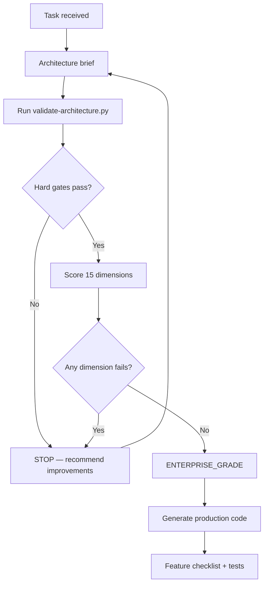

# Architecture Validation — Pre-Code Gate

**Status:** Canonical — mandatory **before** generating any code  
**Audience:** Chief Enterprise Architect, AI agents, lead engineers, reviewers  
**Enforcement:** `scripts/validate-architecture.py` · `.cursor/rules/marpich-architecture-validation.mdc`  
**Companions:** [DEVELOPMENT_PROTOCOL.md](DEVELOPMENT_PROTOCOL.md) · [CHIEF_ARCHITECT_MANDATE.md](CHIEF_ARCHITECT_MANDATE.md) · [ENGINEERING_QUALITY_STANDARD.md](ENGINEERING_QUALITY_STANDARD.md)

**Law: Before implementing any feature, validate all fifteen dimensions. If any validation fails — STOP implementation, recommend architectural improvements, only then generate production code.**

---

## Workflow



| Step | Action | Output |
|------|--------|--------|
| 1 | Write architecture brief | Capability, context, events, reuse ([CHIEF_ARCHITECT_MANDATE.md](CHIEF_ARCHITECT_MANDATE.md)) |
| 2 | Run automated hard gates | `python3 scripts/validate-architecture.py` |
| 3 | Score **15 dimensions** (1–5) | Scorecard in PR or agent response |
| 4 | **If any dimension fails** | **STOP** — list blockers, propose architecture improvements, re-score |
| 5 | Only when `ENTERPRISE_GRADE` | Generate production code |

---

## Enterprise Grade threshold

| Rule | Requirement |
|------|-------------|
| **Hard gates** | All automated gates **PASS** (zero tolerance) |
| **Minimum per dimension** | Every dimension **≥ 3** |
| **Average score** | **≥ 4.0** across 15 dimensions |
| **Critical dimensions** | Architecture, DDD, Security, Audit **≥ 4** each |
| **Verdict** | `ENTERPRISE_GRADE` or `BELOW_THRESHOLD — DO NOT CODE` |

### Scoring scale (1–5)

| Score | Meaning |
|-------|---------|
| **5** | Exemplary — reference implementation, fully aligned with canonical docs |
| **4** | Enterprise Grade — production-ready design, minor gaps documented |
| **3** | Acceptable with remediation plan — must improve before merge if new module |
| **2** | Weak — architectural rework required **before** code |
| **1** | Fail — violates platform law; **stop immediately** |

---

## Fifteen validation dimensions

### 1. Architecture

| Check | Pass criteria |
|-------|---------------|
| Capability mapped | Entry in [BUSINESS_CAPABILITIES_REGISTRY.md](BUSINESS_CAPABILITIES_REGISTRY.md) |
| Bounded context | Single context per capability; no monolith |
| Module tree | [MODULE_ARCHITECTURE.md](MODULE_ARCHITECTURE.md) / `_template/` compliance |
| Clean layers | Presentation → Application → Domain → Infrastructure ports |
| Dependency DAG | [DEPENDENCY_GRAPH.md](DEPENDENCY_GRAPH.md) — zero violations |
| Service boundaries | [SERVICE_BOUNDARIES.md](SERVICE_BOUNDARIES.md) ownership clear |
| Communication | Five channels only — [COMMUNICATION_ARCHITECTURE.md](COMMUNICATION_ARCHITECTURE.md) |

**Reference:** [MODULE_STRUCTURE_STANDARD.md](MODULE_STRUCTURE_STANDARD.md) · [PLATFORM_CHARTER.md](PLATFORM_CHARTER.md)

### 2. DDD

| Check | Pass criteria |
|-------|---------------|
| Aggregates | Clear roots; invariants inside aggregates |
| Ubiquitous language | Documented in `docs/architecture/` |
| Domain events | Versioned; integration events for cross-context |
| Isolation | No cross-context domain imports |
| Ports | Repository and adapter ports in `domain/ports/` |
| ACL | Event consumers use `infrastructure/acl/` |

**Reference:** [DDD_DOMAIN_ARCHITECTURE.md](DDD_DOMAIN_ARCHITECTURE.md) · [CONTEXT_MAP.md](CONTEXT_MAP.md)

### 3. Security

| Check | Pass criteria |
|-------|---------------|
| AuthN | JWT via Identity on every route |
| AuthZ | `require_permissions` on every route |
| Tenant isolation | `tenant_id` on all rows, cache keys, events |
| Input validation | Pydantic schemas; no raw dict bodies |
| Secrets | Env only — never in repo |
| Gateway | Edge validation via [API_GATEWAY_ARCHITECTURE.md](API_GATEWAY_ARCHITECTURE.md) |

**Reference:** [SECURITY_STANDARD.md](SECURITY_STANDARD.md)

### 4. Scalability

| Check | Pass criteria |
|-------|---------------|
| Stateless services | No server affinity; horizontal scale |
| Pagination | List endpoints bounded (`limit`/`offset` or cursor) |
| Async I/O | `async` handlers; no blocking calls in hot paths |
| Data growth | Indexes on `tenant_id`; no unbounded scans |
| Event-driven | Heavy work via outbox/jobs — not request thread |

**Reference:** [PERFORMANCE_STANDARD.md](PERFORMANCE_STANDARD.md) · [LONG_HORIZON_ARCHITECTURE.md](LONG_HORIZON_ARCHITECTURE.md)

### 5. Performance

| Check | Pass criteria |
|-------|---------------|
| Query bounds | Limits on lists; no N+1 in design |
| Caching plan | Hot reads identified; tenant-scoped keys `{tenant}:{module}:{entity}:{id}` |
| Indexes | New tables indexed on `tenant_id` + query fields |
| Background work | Heavy work off request thread |

**Reference:** [PERFORMANCE_STANDARD.md](PERFORMANCE_STANDARD.md)

### 6. Testing

| Check | Pass criteria |
|-------|---------------|
| Unit | `tests/unit/` — domain, validators, specifications |
| Integration | `tests/integration/` or `contexts/{ctx}/tests/` — API + event flow |
| Contracts | Event schema in `docs/architecture/events/` |
| Ports | Memory adapters for deterministic tests |
| Plan before code | Test cases identified in architecture brief |

### 7. AI Integration

| Check | Pass criteria |
|-------|---------------|
| Platform AI | Use Core AI — never embed models in modules |
| 14 surfaces | `context.yaml` `ai:` block per [AI_PLATFORM_STANDARD.md](AI_PLATFORM_STANDARD.md) |
| Embeddings | Domain content exposable for search/AI ingest |
| No PII leakage | AI prompts use contracts — not raw cross-context models |
| AI skills | Third-party AI via Plugin Platform `ai_skill` type |

**Reference:** [AI_PLATFORM_STANDARD.md](AI_PLATFORM_STANDARD.md) · [ENTERPRISE_PLUGIN_PLATFORM.md](ENTERPRISE_PLUGIN_PLATFORM.md)

### 8. Documentation

| Check | Pass criteria |
|-------|---------------|
| `docs/architecture/` | Ubiquitous language per module |
| `docs/api/` | Route + permission matrix |
| OpenAPI | Tags and operation descriptions |
| ADR | Non-trivial decisions recorded in `docs/adr/` |
| Scorecard | Architecture validation scorecard in PR/response |

### 9. Accessibility

| Check | Pass criteria |
|-------|---------------|
| API errors | Semantic, actionable error messages (screen-reader friendly text) |
| UI (if applicable) | WCAG 2.1 AA — labels, focus order, keyboard, ARIA |
| Forms | Associated labels; error announcements |
| Tables | Sortable headers accessible; row actions labeled |
| Dark mode | Theme tokens; contrast maintained |

**Reference:** [UI_PAGE_STANDARD.md](UI_PAGE_STANDARD.md) · [ENGINEERING_QUALITY_STANDARD.md](ENGINEERING_QUALITY_STANDARD.md)

### 10. Localization

| Check | Pass criteria |
|-------|---------------|
| API | Locale-aware formatting; no hardcoded user strings in domain |
| i18n keys | Frontend strings via localization namespace |
| RTL/LTR | `dir` attribute; logical CSS properties |
| Multi-language | Tenant language settings respected |
| Namespace | Module declares `localizationNamespace` in manifest |

**Reference:** Localization context · [MODULE_SYSTEM.md](MODULE_SYSTEM.md)

### 11. Observability

| Check | Pass criteria |
|-------|---------------|
| Structured logging | `request_id`, `tenant_id`, `context`, `action` |
| Metrics | OTel meters for domain counters |
| Tracing | FastAPI instrumentation + span attributes |
| Health | `/api/v1/health` + readiness hooks |
| Dashboard | Health dashboard widgets where applicable |

**Reference:** [ENTERPRISE_OBSERVABILITY_PLATFORM.md](ENTERPRISE_OBSERVABILITY_PLATFORM.md)

### 12. Workflow

| Check | Pass criteria |
|-------|---------------|
| Approvals | Workflow Engine hooks — no module-local approval state machines |
| Hooks | `workflow.hook.register` extension point for plugins |
| Events | `workflow.task.completed` / `workflow.process.approved` integration |
| Designer | Definitions via [ENTERPRISE_WORKFLOW_ENGINE.md](ENTERPRISE_WORKFLOW_ENGINE.md) |

**Reference:** [ENTERPRISE_WORKFLOW_ENGINE.md](ENTERPRISE_WORKFLOW_ENGINE.md)

### 13. Audit

| Check | Pass criteria |
|-------|---------------|
| Every mutation | Publishes integration event consumed by Audit |
| Immutable trail | No update/delete on audit records |
| Actor context | `correlation_id`, `actor_user_id` on commands |
| PHI/PII access | Audited with reason where required |
| Evidence | Audit catalog entry for new action types |

**Reference:** [ENTERPRISE_AUDIT_PLATFORM.md](ENTERPRISE_AUDIT_PLATFORM.md) · `docs/architecture/audit/AUDIT_CATALOG.yaml`

### 14. Policy Compliance

| Check | Pass criteria |
|-------|---------------|
| Business rules | Policy Engine — no hardcoded domain limits/rates/eligibility |
| Evaluation | `IPolicyEvaluator` for business outcomes |
| Violations | Compliance Framework maps denied evaluations |
| Feature flags | Capability gates via Feature Flag System — not `os.getenv` |
| Retention | Compliance controls for regulated data |

**Reference:** [ENTERPRISE_POLICY_ENGINE.md](ENTERPRISE_POLICY_ENGINE.md) · [ENTERPRISE_COMPLIANCE_FRAMEWORK.md](ENTERPRISE_COMPLIANCE_FRAMEWORK.md) · [ENTERPRISE_FEATURE_FLAG_SYSTEM.md](ENTERPRISE_FEATURE_FLAG_SYSTEM.md)

### 15. Plugin Compatibility

| Check | Pass criteria |
|-------|---------------|
| Extension points | Declared in manifest; no direct plugin imports |
| Sandbox | Profile assigned per plugin type |
| Permissions | Declared + granted at install |
| Signed packages | Signature verification before activation |
| Runtime | `IPluginRuntime.invoke()` — not inline third-party code |
| Upgrade path | Semver compatibility documented |

**Reference:** [ENTERPRISE_PLUGIN_PLATFORM.md](ENTERPRISE_PLUGIN_PLATFORM.md) · `docs/architecture/plugins/PLUGIN_CATALOG.yaml`

---

## Automated hard gates (must PASS)

Run before every implementation:

```bash
python3 scripts/validate-architecture.py
python3 scripts/check-dependency-graph.py
```

| Gate | Tool | Fail = stop |
|------|------|-------------|
| Dependency violations | `check-dependency-graph.py` | Any violation |
| Zero-tolerance kinds | `tests/architecture/test_dependency_graph.py` | circular, business→business, shared→contexts |
| Module scaffold (new context) | `validate-architecture.py --context {id}` | Missing mandatory folders |
| Capability registered | Manual / registry check | Unregistered capability |

---

## Scorecard template (copy per task)

```markdown
## Architecture validation scorecard

**Task:** …
**Context / module:** …
**Date:** …
**Validator:** …

### Hard gates
- [ ] `validate-architecture.py` PASS
- [ ] `check-dependency-graph.py` PASS

### Dimension scores (1–5)

| # | Dimension | Score | Notes |
|---|-----------|-------|-------|
| 1 | Architecture | | |
| 2 | DDD | | |
| 3 | Security | | |
| 4 | Scalability | | |
| 5 | Performance | | |
| 6 | Testing | | |
| 7 | AI Integration | | |
| 8 | Documentation | | |
| 9 | Accessibility | | |
| 10 | Localization | | |
| 11 | Observability | | |
| 12 | Workflow | | |
| 13 | Audit | | |
| 14 | Policy Compliance | | |
| 15 | Plugin Compatibility | | |

**Average:** … / 5.0
**Critical (Architecture, DDD, Security, Audit):** all ≥ 4?

### Verdict
- [ ] ENTERPRISE_GRADE — proceed to production code
- [ ] BELOW_THRESHOLD — STOP; improve architecture first (list blockers)

### Blockers (if below threshold)
1. …

### Recommended architectural improvements
1. …
```

---

## When any validation fails

**STOP. Do not generate production code.**

1. List blockers with dimension and score
2. **Recommend architectural improvements** — not code patches
3. Update brief, ADR, or module design
4. Re-run hard gates and re-score
5. Only proceed when verdict is `ENTERPRISE_GRADE`

### Common improvements (not shortcuts)

| Weakness | Improve |
|----------|---------|
| Monolithic module | Split by aggregate / capability |
| Cross-context import | Integration event + ACL adapter |
| Application → infrastructure | Port + `container.py` wiring |
| Missing tests plan | Add `tests/unit` + `tests/integration` to design |
| Page-first design | Rewrite as capability + use cases |
| Duplicate Core | Extend platform service |
| Local approval flow | Workflow Engine hook |
| Hardcoded business rule | Policy Engine definition |
| Local feature flag | Feature Flag System evaluate |
| Direct plugin import | `IPluginRuntime` + manifest |
| Missing audit event | Add integration event + audit catalog entry |
| No i18n plan | Localization namespace + RTL/LTR design |
| No observability plan | OTel spans + structured log fields |

---

## Enforcement

| Mechanism | Location |
|-----------|----------|
| Cursor rule | `.cursor/rules/marpich-architecture-validation.mdc` (`alwaysApply: true`) |
| Development protocol | [DEVELOPMENT_PROTOCOL.md](DEVELOPMENT_PROTOCOL.md) Step 0 |
| Chief Architect mandate | [CHIEF_ARCHITECT_MANDATE.md](CHIEF_ARCHITECT_MANDATE.md) |
| ADR-033 | Architecture validation gate |
| ADR-048 | Fifteen-dimension realignment |

**Never sacrifice architecture quality for delivery speed.**

---

## Related

| Document | Role |
|----------|------|
| [ENGINEERING_QUALITY_STANDARD.md](ENGINEERING_QUALITY_STANDARD.md) | Post-design code qualities |
| [DEPENDENCY_GRAPH.md](DEPENDENCY_GRAPH.md) | Layer and module import law |
| [COMMUNICATION_ARCHITECTURE.md](COMMUNICATION_ARCHITECTURE.md) | Inter-module communication law |
| [ENTERPRISE_AUDIT_PLATFORM.md](ENTERPRISE_AUDIT_PLATFORM.md) | Audit dimension |
| [ENTERPRISE_OBSERVABILITY_PLATFORM.md](ENTERPRISE_OBSERVABILITY_PLATFORM.md) | Observability dimension |
| [ENTERPRISE_WORKFLOW_ENGINE.md](ENTERPRISE_WORKFLOW_ENGINE.md) | Workflow dimension |
| [ENTERPRISE_POLICY_ENGINE.md](ENTERPRISE_POLICY_ENGINE.md) | Policy compliance dimension |
| [ENTERPRISE_PLUGIN_PLATFORM.md](ENTERPRISE_PLUGIN_PLATFORM.md) | Plugin compatibility dimension |
| [UI_PAGE_STANDARD.md](UI_PAGE_STANDARD.md) | Accessibility dimension (UI) |
