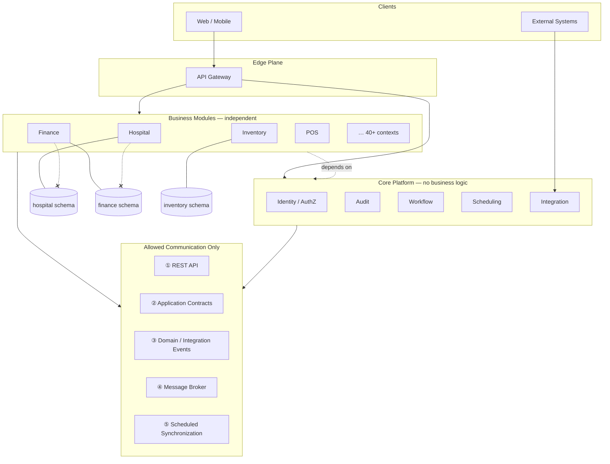
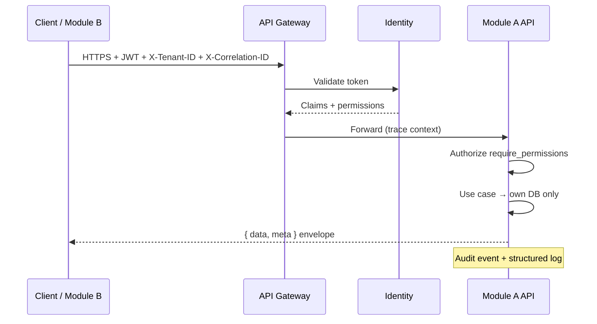
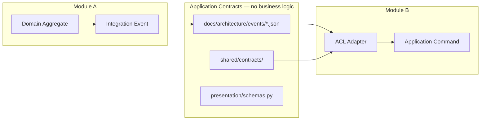
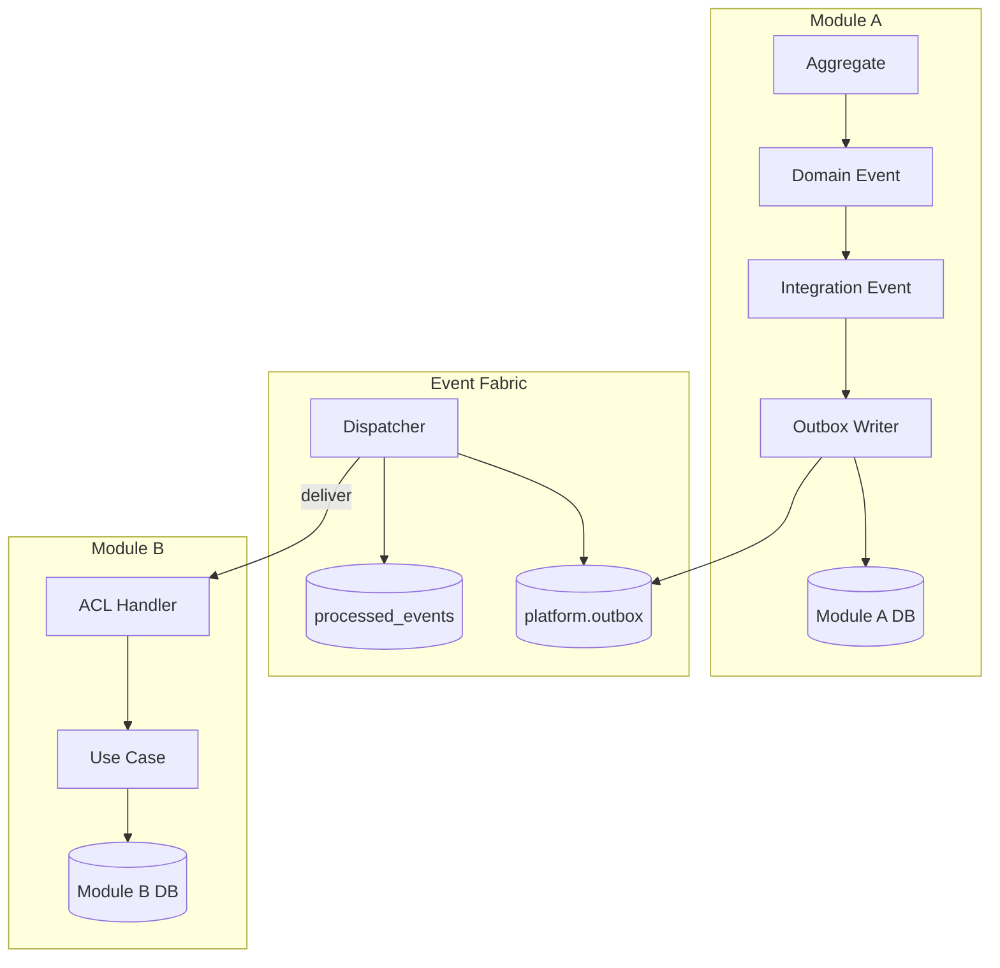
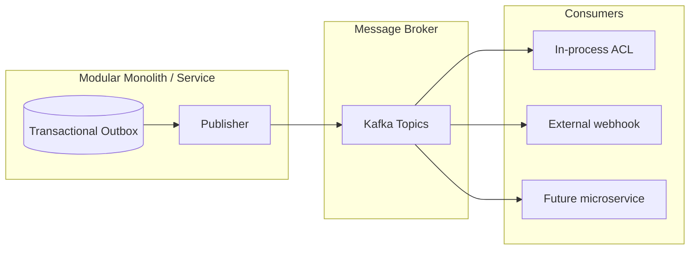
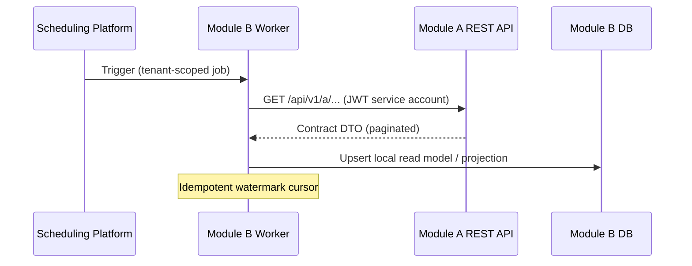
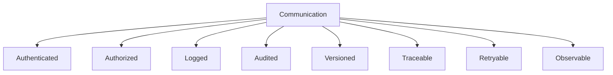
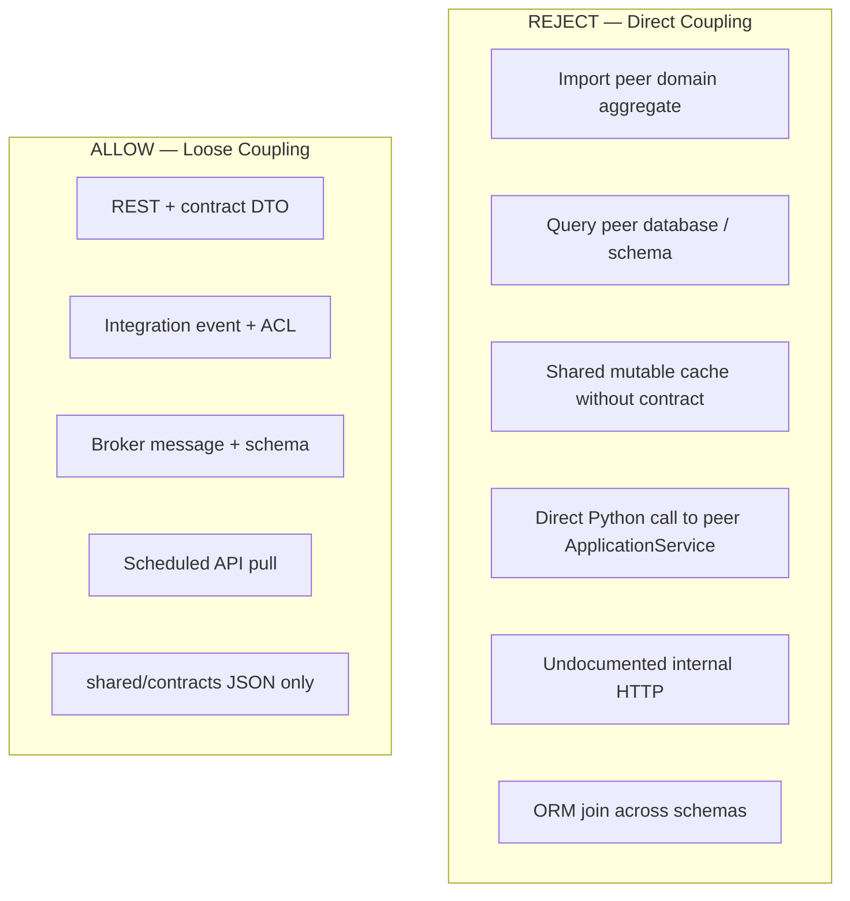
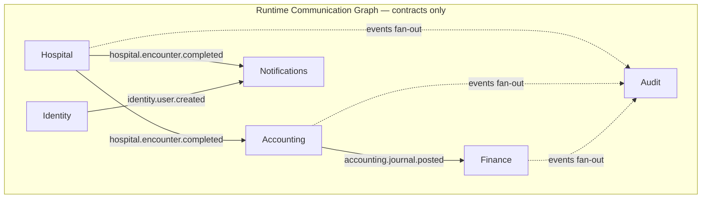

# Communication Architecture — Marpich Enterprise

**Status:** Canonical — non-negotiable inter-module communication law  
**Audience:** Chief Enterprise Architect, platform engineers, module authors, AI agents  
**Enforcement:** `scripts/check-dependency-graph.py` · ACL adapters · contract tests  
**Companions:** [SERVICE_BOUNDARIES.md](SERVICE_BOUNDARIES.md) · [DEPENDENCY_GRAPH.md](DEPENDENCY_GRAPH.md) · [ENTERPRISE_EVENT_BUS.md](ENTERPRISE_EVENT_BUS.md) · [CONTEXT_MAP.md](CONTEXT_MAP.md) · [INTEGRATION_PLATFORM.md](INTEGRATION_PLATFORM.md) · [DOMAIN_EVENTS_CATALOG.md](DOMAIN_EVENTS_CATALOG.md)

**Law: Independent business modules NEVER communicate by accessing each other's database. Reject direct coupling.**

---

## Platform model

Marpich is an **enterprise digital platform** of **independent business modules** (bounded contexts). Each module owns its database, business rules, API, events, and permissions. Modules compose on **Core Platform** services — they do not merge into a monolith.



**Forbidden:** dashed red paths — cross-schema reads/writes, shared tables, ORM joins across modules.

---

## The law

```
Modules must NEVER communicate by accessing each other's database.

Allowed only:
  ① REST API
  ② Internal Application Contracts
  ③ Domain Events
  ④ Message Broker
  ⑤ Scheduled Synchronization

Every communication must be:
  Authenticated · Authorized · Logged · Audited · Versioned
  · Traceable · Retryable · Observable
```

---

## Five allowed communication methods

### ① REST API (synchronous)

**When:** Command/query with immediate response; user-facing operations; service needs current state from owner.



| Rule | Implementation |
|------|----------------|
| Prefix | `/api/v1/{context}/` |
| Contract | OpenAPI + `presentation/rest/schemas.py` |
| Consumer | HTTP client — **never** import peer `router` or ORM |
| Cross-module | Prefer **events** for side effects; REST for intentional queries |

**Code:** `contexts/{id}/presentation/rest/router.py` · [API_GATEWAY_ARCHITECTURE.md](API_GATEWAY_ARCHITECTURE.md) · `core/presentation/middleware/platform_gateway.py`

---

### ② Internal Application Contracts (shared language only)

**When:** Stable payloads between modules without sharing domain models.



| Contract type | Location |
|---------------|----------|
| Integration event schemas | `docs/architecture/events/{name}.v{n}.json` |
| Capability registry | `shared/contracts/business_capabilities.json` |
| Industry packs | `shared/contracts/industry_packs.json` |
| HTTP request/response | Owner's `presentation/rest/schemas.py` (documented in OpenAPI) |
| Shared primitives only | `shared/domain/value_objects/` — Money, Address, IDs |

**Rule:** Contracts are **data** — never import peer `domain/aggregates/`.

---

### ③ Domain Events (internal + integration)

**When:** Something happened; other modules react asynchronously; eventual consistency.

| Type | Scope | Example |
|------|-------|---------|
| **Domain event** | Inside one module | `EncounterCompleted` on aggregate |
| **Integration event** | Cross-module published language | `hospital.encounter.completed.v1` |



| Rule | Detail |
|------|--------|
| Publish | `EventFabric.publish()` / `publish_integration_event()` only |
| Envelope | `event_id`, `event_name`, `event_version`, `tenant_id`, `correlation_id`, `payload` |
| Consumer | Idempotent `(tenant_id, event_id, consumer_id)` |
| ACL | `infrastructure/acl/{source}_events.py` → application command |

**Reference:** [ADR-010](../adr/010-event-fabric.md) · `backend/shared/infrastructure/messaging/`

---

### ④ Message Broker (durable transport)

**When:** Production-scale async delivery; external consumers; future service extraction.



| Mode | Config | Use |
|------|--------|-----|
| `direct` | `EVENT_BUS_MODE=direct` | Local dev, tests |
| `outbox` | `EVENT_BUS_MODE=outbox` | Production monolith |
| Kafka | `KAFKA_ENABLED=true` | Fan-out, external systems |

**Topic naming:** `marpich.{event_name}.v{version}`

**Rule:** Broker carries **contracts** — not domain entities. Consumers use ACL.

---

### ⑤ Scheduled Synchronization (batch / cron)

**When:** Projections, reconciliation, analytics rollups, search index refresh — **without** cross-database queries.



| Rule | Detail |
|------|--------|
| Read path | **Owner's REST API** or **replayed events** — never peer schema |
| Write path | **Own database only** — projection tables in consumer schema |
| Schedule | Core Scheduling Platform — `context.yaml` job registration |
| Idempotency | Cursor / `last_synced_at` per tenant |
| Auth | Service account JWT + least-privilege permissions |

**Examples:** Search ingest, analytics snapshots, integration `SyncJob`, external ERP pull.

---

## Eight requirements — every communication

Every allowed channel **must** satisfy all eight:



| # | Requirement | REST | Events | Broker | Contracts | Scheduled Sync |
|---|-------------|------|--------|--------|-----------|----------------|
| 1 | **Authenticated** | JWT + `X-Tenant-ID` | Service identity on dispatch | Broker ACL/SASL | N/A (data) | Service account JWT |
| 2 | **Authorized** | `require_permissions` | Consumer ACL + permission on replay API | Topic ACLs | Schema validation | Scoped API permissions |
| 3 | **Logged** | Structured log per request | Log publish/deliver | Broker client logs | Contract test failures | Job run log |
| 4 | **Audited** | Mutation → integration event | Audit subscribes to `*` | DLQ audit trail | Change = ADR | Job completion event |
| 5 | **Versioned** | `/api/v1/` | `event_version` in envelope | Topic `v{n}` suffix | `*.v{n}.json` | API version pinned |
| 6 | **Traceable** | `X-Correlation-ID`, OTel | `correlation_id`, `causation_id` | Trace headers propagated | — | `correlation_id` per run |
| 7 | **Retryable** | Client retry + idempotent POST keys | Outbox redelivery + idempotent consumer | Consumer offset + DLQ | — | Job retry + watermark |
| 8 | **Observable** | `/health`, metrics, spans | Dispatch metrics, lag alerts | Topic lag monitoring | CI contract tests | Job success/fail metrics |

### Implementation map

| Concern | Platform owner | Location |
|---------|----------------|----------|
| Authentication | Identity | `contexts/identity/` |
| Authorization | Identity + module permissions | `require_permissions()` |
| Logging | All modules | `logging` + `request_id`, `tenant_id` |
| Audit | Audit | `contexts/audit/` subscribes to events |
| Versioning | Each module | OpenAPI + event schema version |
| Tracing | Observability | [ENTERPRISE_OBSERVABILITY_PLATFORM.md](ENTERPRISE_OBSERVABILITY_PLATFORM.md) · [ADR-013](../adr/013-opentelemetry.md) |
| Retry | Event fabric | Outbox, `processed_events`, DLQ |
| Metrics | Analytics / OTel | Gateway + dispatcher meters |

---

## Reject direct coupling

### Forbidden patterns



| Anti-pattern | Why rejected | Correct |
|--------------|--------------|---------|
| `from contexts.hospital.domain...` in clinic | Compile-time coupling | `hospital.encounter.completed` event |
| `SELECT * FROM finance.journals` from accounting job | Database coupling | `GET /api/v1/finance/journals` or event |
| Shared table `patients` written by two modules | Ownership violation | Hospital owns patient; others store `patient_ref` |
| `get_hospital_service().admit(...)` from finance | In-process coupling | REST command or event |
| Ad-hoc dict over HTTP | No contract | Versioned OpenAPI + schema |
| Synchronous chain A→B→C→D in one request | Distributed monolith | Events + sagas |

**Enforcement:** `scripts/check-dependency-graph.py` · code review · architecture validation gate.

---

## Communication dependency graph

**Compile-time** (import graph) — must be a **DAG**. See [DEPENDENCY_GRAPH.md](DEPENDENCY_GRAPH.md).

**Runtime** (communication graph) — directed edges via **contracts only**:



| Graph type | What it measures | Tool |
|------------|------------------|------|
| **Import / layer DAG** | Python `import` between layers and modules | `dependency_graph.py` |
| **Event catalog** | Published / subscribed integration events | `DOMAIN_EVENTS_CATALOG.md`, `context.yaml` |
| **API catalog** | REST surfaces | OpenAPI per router |
| **Runtime coupling** | No static import — dynamic via bus | Event + API registry |

**Rule:** Runtime edges are **allowed**; compile-time business→business **imports** are **not**.

---

## Module communication checklist

```markdown
## Communication design checklist

### Channel selection
- [ ] REST — sync query/command to owner API
- [ ] Event — async fact; consumer builds local state
- [ ] Broker — production durable delivery
- [ ] Scheduled sync — batch projection via API/events
- [ ] NOT cross-database

### Contracts
- [ ] Event schema versioned in docs/architecture/events/
- [ ] ACL adapter in consumer infrastructure/acl/
- [ ] No peer domain imports

### Eight requirements
- [ ] Authenticated
- [ ] Authorized
- [ ] Logged
- [ ] Audited
- [ ] Versioned
- [ ] Traceable
- [ ] Retryable
- [ ] Observable

### Rejection
- [ ] No direct coupling (imports, shared DB, in-process peer calls)
```

---

## Channel selection guide

| Need | Use | Avoid |
|------|-----|-------|
| User clicks "Submit" | REST → owner module | Event-only for user feedback |
| Notify another domain of fact | Integration event | REST callback chain |
| External system hook | Broker + Integration webhooks | Shared DB view |
| Nightly rollup / search index | Scheduled sync via API | Cross-schema SQL |
| Read current inventory count | REST query to inventory owner | Cache of stale peer rows without event |
| Strong consistency across modules | Saga + events + compensations | Two-phase commit across DBs |

---

## Enforcement

| Mechanism | Location |
|-----------|----------|
| This document | `docs/architecture/COMMUNICATION_ARCHITECTURE.md` |
| Service boundaries | [SERVICE_BOUNDARIES.md](SERVICE_BOUNDARIES.md) |
| Dependency graph | [DEPENDENCY_GRAPH.md](DEPENDENCY_GRAPH.md) + `check-dependency-graph.py` |
| Event fabric | [ADR-010](../adr/010-event-fabric.md) |
| Contract tests | `backend/tests/contracts/` |
| Cursor rule | `.cursor/rules/marpich-communication-architecture.mdc` |
| ADR | ADR-034 |

**Direct coupling is an architecture rejection.**

---

## Related

| Document | Role |
|----------|------|
| [CONTEXT_MAP.md](CONTEXT_MAP.md) | Context relationships (Customer-Supplier, PL, OHS) |
| [DOMAIN_EVENTS_CATALOG.md](DOMAIN_EVENTS_CATALOG.md) | Event index |
| [CORE_PLATFORM_EVENTS.md](CORE_PLATFORM_EVENTS.md) | Platform event catalog |
| [ARCHITECTURE_VALIDATION.md](ARCHITECTURE_VALIDATION.md) | Pre-code gate |
| [SECURITY_STANDARD.md](SECURITY_STANDARD.md) | Authn/authz detail |
