# Context Map

Relationships between Marpich ERP bounded contexts.  
**No business domain has a compile-time dependency on another.**

> **Communication law:** [COMMUNICATION_ARCHITECTURE.md](COMMUNICATION_ARCHITECTURE.md) — five channels, eight requirements, reject direct coupling.  
> **API Gateway:** [API_GATEWAY_ARCHITECTURE.md](API_GATEWAY_ARCHITECTURE.md) — single entry point; reject invalid requests before modules.  
> **Integration Platform:** [INTEGRATION_PLATFORM.md](INTEGRATION_PLATFORM.md) — external systems connect ONLY through Integration.  
> **Workflow Engine:** [ENTERPRISE_WORKFLOW_ENGINE.md](ENTERPRISE_WORKFLOW_ENGINE.md) — visual designer; no module-local approvals.  
> **Notification Platform:** [ENTERPRISE_NOTIFICATION_PLATFORM.md](ENTERPRISE_NOTIFICATION_PLATFORM.md) — omnichannel queue; no module SMTP/SMS.  
> **Search Engine:** [ENTERPRISE_SEARCH_ENGINE.md](ENTERPRISE_SEARCH_ENGINE.md) — every search respects permissions; event-indexed only.  
> **Document Exchange:** [ENTERPRISE_DOCUMENT_EXCHANGE.md](ENTERPRISE_DOCUMENT_EXCHANGE.md) — modules store document_id only; full lifecycle platform.  
> **Audit Platform:** [ENTERPRISE_AUDIT_PLATFORM.md](ENTERPRISE_AUDIT_PLATFORM.md) — audit every operation; immutable append-only logs.  
> **Observability Platform:** [ENTERPRISE_OBSERVABILITY_PLATFORM.md](ENTERPRISE_OBSERVABILITY_PLATFORM.md) — logs, metrics, traces, health dashboard, AI analysis.  
> **Policy Engine:** [ENTERPRISE_POLICY_ENGINE.md](ENTERPRISE_POLICY_ENGINE.md) — configurable business rules; no hardcoded domain logic.  
> **Compliance Framework:** [ENTERPRISE_COMPLIANCE_FRAMEWORK.md](ENTERPRISE_COMPLIANCE_FRAMEWORK.md) — violations, dashboard, reports, alerts.
> **Feature Flag System:** [ENTERPRISE_FEATURE_FLAG_SYSTEM.md](ENTERPRISE_FEATURE_FLAG_SYSTEM.md) — multi-scope rollout, A/B, canary, emergency disable.
> **Plugin Platform:** [ENTERPRISE_PLUGIN_PLATFORM.md](ENTERPRISE_PLUGIN_PLATFORM.md) — third-party extensions, marketplace, SDK, sandbox runtime.
> **Financial Kernel:** [ENTERPRISE_FINANCIAL_KERNEL.md](ENTERPRISE_FINANCIAL_KERNEL.md) — platform financial foundation; every module posts through kernel.
> **General Ledger:** [ENTERPRISE_GENERAL_LEDGER.md](ENTERPRISE_GENERAL_LEDGER.md) — immutable journals, reversal-only, unlimited scale.
> **Core Platform design:** [CORE_PLATFORM_DESIGN.md](CORE_PLATFORM_DESIGN.md) — 29 enterprise services; business modules depend on Core, never the reverse.

```mermaid
flowchart TB
    subgraph edge [Edge]
        GW[API Gateway]
        HM[Health Monitoring]
    end

    subgraph platform [Platform Contexts — Core]
        CP[Core Platform / Tenant]
        ID[Identity + Auth + Permissions]
        ORG[Organization]
        SET[Settings]
        LOC[Localization]
        WF[Workflow]
        DOC[Documents]
        NOT[Notifications]
        MED[Media]
        SRCH[Search]
        ANA[Analytics]
        AI[AI]
        AUD[Audit]
        INT[Integration]
    end

    subgraph infra [Infrastructure Primitives]
        LOG[Logging]
        MON[Monitoring]
        CACHE[Cache]
        EVT[Event Bus]
    end

    GW --> platform
    platform --> infra

    subgraph generic [Generic Subdomains — Business]
        FIN[Finance]
        ACC[Accounting]
        TAX[Tax]
        TR[Treasury]
        PAY[Payroll]
        HR[Human Resources]
        CRM[CRM]
        SAL[Sales]
        PRO[Procurement]
        INV[Inventory]
        WH[Warehouse]
        MFG[Manufacturing]
        PRJ[Projects]
    end

    subgraph financial [Financial Specialized]
        BNK[Banking]
        ISB[Islamic Banking]
        FX[Currency Exchange]
    end

    subgraph industry [Industry Contexts — Business]
        UNI[University]
        SCH[School]
        HOS[Hospital]
        LAB[Laboratory]
        PHR[Pharmacy]
        HTL[Hotel]
        RST[Restaurant]
        RE[Real Estate]
        CON[Construction]
        GOV[Government]
        NGO[NGO]
    end

    generic -.->|depends on| platform
    industry -.->|depends on| platform
    financial -.->|depends on| platform

    CP -->|OHS: tenant.provisioned| ID
    CP -->|OHS: tenant.provisioned| SET

    ID -.->|PL: identity.*| generic
    ID -.->|PL: identity.*| industry
    ID -.->|PL: identity.*| financial

    HOS -->|CS: hospital.*| FIN
    HOS -->|CS: hospital.*| ACC
    LAB -->|CS: laboratory.*| HOS
    PHR -->|CS: pharmacy.*| INV

    SAL -->|CS: sales.order.placed| INV
    SAL -->|CS: sales.order.placed| FIN
    PRO -->|CS: procurement.*| INV
    WH -->|CS: warehouse.*| INV

    BNK -->|CS: banking.*| TR
    ISB -->|CS: islamic_banking.*| BNK
    FX -->|CS: forex.*| TR

    UNI -->|CS: university.*| FIN
    SCH -->|CS: school.*| FIN

    generic -->|events| ANA
    industry -->|events| ANA
    platform -->|events| ANA

    NOT -->|subscribes all| platform
    NOT -->|subscribes all| generic
    NOT -->|subscribes all| industry

    AI -->|subscribes| ANA
    SRCH -->|subscribes index| generic
    SRCH -->|subscribes index| industry
```



## Legend

| Symbol | Relationship | Description |
|--------|-------------|-------------|
| **OHS** | Open Host Service | Core Platform exposes stable provisioning API |
| **PL** | Published Language | Identity events are canonical user lifecycle |
| **CS** | Customer-Supplier | Upstream publishes; downstream consumes via ACL |
| **ACL** | Anti-Corruption Layer | Every event consumer has `infrastructure/acl/` |
| **SW** | Separate Ways | No relationship (e.g. Restaurant ↔ Banking) |

## Upstream / Downstream Summary

| Upstream (Publisher) | Downstream (Subscriber) | Key Events |
|---------------------|------------------------|------------|
| Identity | All | `identity.user.created`, `identity.role.assigned` |
| Core Platform | All | `platform.tenant.provisioned`, `platform.module.activated` |
| Sales | Inventory, Finance, Warehouse | `sales.order.placed`, `sales.order.fulfilled` |
| Procurement | Inventory, Finance | `procurement.po.approved`, `procurement.goods.received` |
| Hospital | Finance, Accounting, Laboratory | `hospital.encounter.completed`, `hospital.admission.registered` |
| Banking | Treasury, Analytics | `banking.transaction.posted`, `banking.loan.disbursed` |
| Islamic Banking | Banking, Treasury | `islamic_banking.murabaha.executed` |
| Manufacturing | Inventory, Warehouse | `manufacturing.order.completed` |
| Workflow | Any (orchestration) | `workflow.task.completed`, `workflow.process.approved` |
| Documents | Any | `documents.document.signed` |
| All contexts | Analytics, Search, Audit | Domain-specific `*.created/updated/deleted` |

## Anti-Corruption Layer Pattern

```python
# contexts/finance/infrastructure/acl/hospital_events.py
async def on_encounter_completed(envelope: dict) -> None:
    payload = envelope["payload"]
    # Translate external schema → local command — never import hospital domain
    await create_billing_encounter.execute(
        CreateBillingEncounterCommand(
            tenant_id=payload["tenant_id"],
            external_encounter_id=payload["encounter_id"],
            patient_ref=payload["patient_id"],  # ID only
            service_codes=payload["procedures"],
        )
    )
```

## Saga Examples (Event Choreography)

### Order-to-Cash
```
sales.order.placed → inventory.stock.reserved → warehouse.picklist.created
→ warehouse.shipment.dispatched → finance.invoice.issued → sales.order.fulfilled
```

### Patient Admission (Hospital)
```
hospital.admission.registered → finance.deposit.required
→ hospital.encounter.started → laboratory.order.requested
→ laboratory.result.available → hospital.encounter.completed → accounting.revenue.recognized
```

### Murabaha (Islamic Banking)
```
islamic_banking.murabaha.approved → banking.account.credited
→ treasury.liquidity.updated → notifications.customer.alert
```
