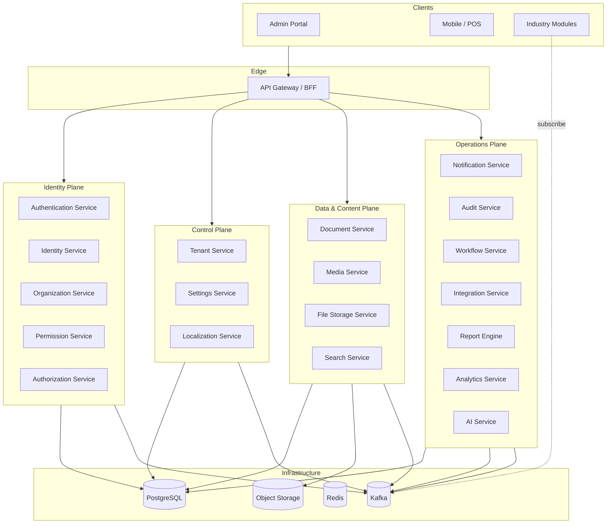
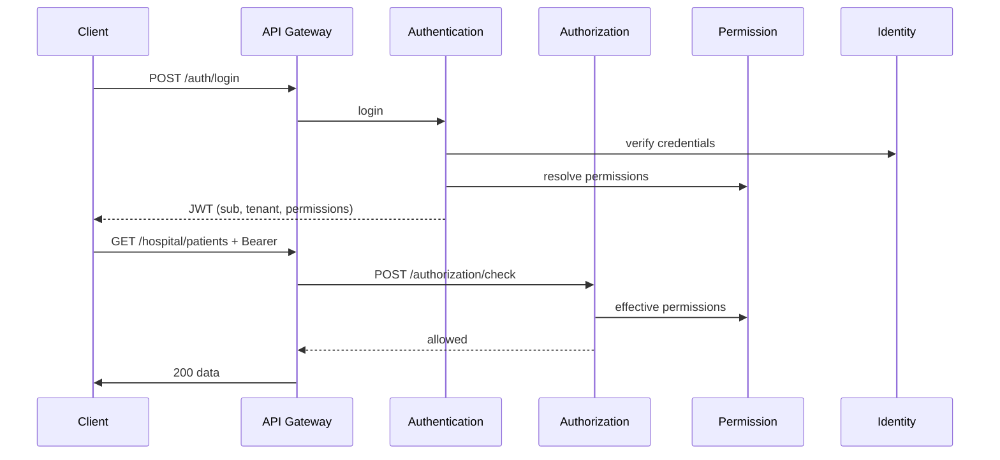

# Core Platform Architecture

Enterprise platform layer for **Marpich ERP** — reusable by every industry module, every tenant, and every deployment tier.

> **Master design:** [CORE_PLATFORM_DESIGN.md](CORE_PLATFORM_DESIGN.md) — 29 capabilities, six planes, no business logic law.  
> This document provides **per-service REST APIs, events, and implementation detail**.

## Design Principles

| Principle | Rule |
|-----------|------|
| **No business logic** | Core owns enterprise plumbing only — never patients, loans, permits, invoices, or industry rules |
| **Module reuse** | Platform services expose stable REST contracts + versioned integration events. Industry modules never embed platform logic. |
| **Tenant isolation** | Every table, event, and API call carries `tenant_id`. No cross-tenant reads without platform-admin scope. |
| **Event-first integration** | Cross-service communication uses integration events (Kafka). REST is for commands/queries, not domain coupling. |
| **No shared domain models** | Modules consume platform via APIs and event envelopes — never import platform aggregates. |
| **Idempotent consumers** | All event handlers use `(tenant_id, event_id)` deduplication. |
| **Outbox everywhere** | Every mutation that publishes an event writes to `platform.outbox` in the same transaction. |
| **REST uniformity** | All services mount under `/api/v1/{service-prefix}` with identical envelope, auth, pagination, and error shapes. |

## Platform Topology



## Service Catalog

Full 29-capability catalog and plane layout: [CORE_PLATFORM_DESIGN.md](CORE_PLATFORM_DESIGN.md).

| # | Service | Context ID | API Prefix | Schema | Always On |
|---|---------|------------|------------|--------|-----------|
| 1 | Identity | `identity` | `/identity` | `identity` | Yes |
| 2 | Tenant | `core_platform` | `/platform` | `platform` | Yes |
| 3 | Organization | `organization` | `/organizations` | `organization` | Yes |
| 4 | Permission | `identity` | `/permissions` | `identity` | Yes |
| 5 | Authentication | `identity` | `/auth` | `identity` | Yes |
| 6 | Authorization | `identity` | `/authorization` | `identity` | Yes |
| 7 | Notification | `notifications` | `/notifications` | `notifications` | Yes |
| 8 | Audit | `audit` | `/audit` | `audit` | Yes |
| 9 | Document | `documents` | `/documents` | `documents` | Yes |
| 10 | Media | `media` | `/media` | `media` | Yes |
| 11 | Search | `search` | `/search` | `search` | Yes |
| 12 | Workflow | `workflow` | `/workflow` | `workflow` | Yes |
| 13 | Integration | `integration` | `/integrations` | `integration` | Yes |
| 14 | Analytics | `analytics` | `/analytics` | `analytics` | Yes |
| 15 | AI | `ai` | `/ai` | `ai` | Optional |
| 16 | Localization | `localization` | `/localization` | `localization` | Yes |
| 17 | Settings | `settings` | `/settings` | `settings` | Yes |
| 18 | File Storage | `file_storage` | `/files` | `file_storage` | Yes |
| 19 | Report Engine | `reporting` | `/reports` | `reporting` | Yes |
| 20 | Scheduling | `scheduler` | `/scheduler` | `scheduler` | Yes |
| 21 | Secrets | `secrets` | `/secrets` | `secrets` | Yes |
| 22 | API Gateway | `core/gateway` | `/api/v1` | — | Yes |
| 23 | Health | `core/health` | `/health` | — | Yes |
| 24 | Logging | `shared/observability` | — | — | Yes |
| 25 | Monitoring | `shared/observability` | `/metrics` | — | Yes |
| 26 | Caching | `shared/cache` | internal | — | Yes |
| 27 | Workers | `workers` | internal | `workers` | Yes |
| 28 | Event Bus | `shared/messaging` | internal | `platform` | Yes |
| 29 | User / Role Mgmt | `identity` | `/identity/users`, `/identity/roles` | `identity` | Yes |

> **Deployment note:** Authentication, Authorization, Permission, and Identity can run as **one modular monolith** (`identity` context in Python) or as **four independently scaled services**. Contracts below are logical boundaries; physical deployment is configurable.

---

## Cross-Cutting REST Contract

Every platform service MUST implement:

```
GET  /api/v1/{prefix}/health          → { status, service, version }
GET  /api/v1/{prefix}/openapi.json    → OpenAPI 3.1 (or aggregate via gateway)
```

### Request headers

| Header | Required | Purpose |
|--------|----------|---------|
| `Authorization` | Protected routes | `Bearer {access_token}` |
| `X-Tenant-ID` | Tenant-scoped routes | Tenant slug |
| `X-Correlation-ID` | Recommended | Distributed tracing |
| `Accept-Language` | Optional | Localization (`en-US`, `fa-IR`, `ar-SA`) |
| `X-Module-ID` | Module callbacks | Calling module identifier for audit |

### Response envelope

```json
{
  "data": { },
  "meta": {
    "correlation_id": "uuid",
    "request_id": "uuid",
    "locale": "en-US",
    "direction": "ltr"
  },
  "errors": null
}
```

### Pagination

```
GET /resource?page=1&page_size=50&sort=-created_at&filter[status]=active
```

```json
{
  "data": [ ],
  "meta": { "page": 1, "page_size": 50, "total": 1234 }
}
```

### Error shape

```json
{
  "errors": [{
    "code": "identity.errors.user_not_found",
    "message": "User not found",
    "field": null,
    "details": {}
  }]
}
```

---

## Cross-Cutting Event Envelope

Every published event uses this envelope (see `shared/domain/events/integration_event.py`):

```json
{
  "event_id": "uuid",
  "event_name": "service.entity.action",
  "event_version": 1,
  "source_context": "identity",
  "tenant_id": "acme-hospital",
  "correlation_id": "uuid",
  "causation_id": "uuid|null",
  "occurred_at": "2026-07-02T12:00:00Z",
  "payload": { }
}
```

Topic naming: `marpich.{event_name}.v{version}` (e.g. `marpich.platform.tenant.provisioned.v1`).

---

## Module Reuse Contract

Industry modules (Hospital, Banking, University, …) integrate with platform through:

1. **REST** — HTTP calls via API Gateway with service JWT or user JWT.
2. **Events** — Subscribe to platform events; publish module events back.
3. **Permission declarations** — Each module registers permissions in Permission Service at activation time.
4. **Webhook registration** — Integration Service delivers outbound webhooks for tenant-configured endpoints.

```
Module manifest (module_registry)
  ├── required_platform_services: [identity, documents, workflow]
  ├── permissions: [{ code, resource, action }]
  ├── event_subscriptions: [platform.tenant.provisioned, ...]
  └── event_publications: [hospital.encounter.completed, ...]
```

---

# Service Specifications

---

## 1. Identity Service

**Purpose:** Canonical user lifecycle — profile, credentials metadata, MFA state, session references. Does **not** issue tokens (Authentication) or evaluate policies (Authorization).

| Aggregate | Responsibility |
|-----------|----------------|
| `User` | Profile, status, locale, MFA flags |
| `Credential` | Password hash, SSO subject links |
| `SessionRef` | Active session index (tokens held by Authentication) |

### REST API — `/api/v1/identity`

| Method | Path | Permission | Description |
|--------|------|------------|-------------|
| POST | `/users` | `identity.users.write` | Create user |
| GET | `/users` | `identity.users.read` | List/search users |
| GET | `/users/{id}` | `identity.users.read` | Get user |
| PATCH | `/users/{id}` | `identity.users.write` | Update profile |
| DELETE | `/users/{id}` | `identity.users.delete` | Deactivate (soft) |
| GET | `/users/me` | authenticated | Current user profile |
| POST | `/users/me/mfa/setup` | `identity.mfa.manage` | Begin MFA enrollment |
| POST | `/users/me/mfa/verify` | `identity.mfa.manage` | Confirm MFA |

### Events published

| Event | Payload highlights |
|-------|-------------------|
| `identity.user.created` | `user_id`, `email`, `display_name` |
| `identity.user.updated` | `user_id`, `changed_fields` |
| `identity.user.deactivated` | `user_id`, `reason` |
| `identity.mfa.enabled` | `user_id` |

### Events subscribed

| Event | Action |
|-------|--------|
| `platform.tenant.provisioned` | Seed system admin invitation workflow |
| `organization.member.added` | Link user to org unit |

---

## 2. Tenant Service

**Purpose:** Control plane — tenant provisioning, industry pack activation, subscription tier, module enablement.

| Aggregate | Responsibility |
|-----------|----------------|
| `Tenant` | Slug, status, tier, locale, data region |
| `Subscription` | Billing plan, limits, renewal |
| `ModuleActivation` | Enabled modules per tenant |

### REST API — `/api/v1/platform`

| Method | Path | Permission | Description |
|--------|------|------------|-------------|
| GET | `/industry-packs` | public | List 26+ industry packs |
| GET | `/industry-packs/{id}` | public | Pack detail + modules |
| POST | `/tenants` | public / `platform.tenants.write` | Provision tenant |
| GET | `/tenants` | `platform.tenants.read` | List tenants |
| GET | `/tenants/{slug}` | public | Tenant metadata |
| POST | `/tenants/{slug}/suspend` | `platform.tenants.write` | Suspend tenant |
| POST | `/tenants/{slug}/modules` | `platform.modules.write` | Activate optional module |
| GET | `/tenants/{slug}/modules` | `platform.modules.read` | Enabled modules |

### Events published

| Event | Subscribers |
|-------|-------------|
| `platform.tenant.provisioned` | identity, settings, documents, localization, audit |
| `platform.module.activated` | settings, permission, workflow, search |
| `platform.tenant.suspended` | authentication, integration, notifications |

### Events subscribed

| Event | Action |
|-------|--------|
| `integration.provisioning.completed` | Mark tenant active after external CRM sync |

---

## 3. Organization Service

**Purpose:** Multi-org hierarchy within a tenant — companies, branches, departments, cost centers, legal entities.

| Aggregate | Responsibility |
|-----------|----------------|
| `Organization` | Root legal entity |
| `OrgUnit` | Tree node (branch, department, ward, campus) |
| `Membership` | User ↔ org unit with title |
| `CostCenter` | Financial attribution node |

### REST API — `/api/v1/organizations`

| Method | Path | Permission | Description |
|--------|------|------------|-------------|
| POST | `/orgs` | `organization.orgs.write` | Create organization |
| GET | `/orgs` | `organization.orgs.read` | List orgs |
| GET | `/orgs/{id}/tree` | `organization.orgs.read` | Full org tree |
| POST | `/units` | `organization.units.write` | Create org unit |
| PATCH | `/units/{id}` | `organization.units.write` | Update unit |
| POST | `/units/{id}/members` | `organization.members.write` | Add member |
| DELETE | `/units/{id}/members/{user_id}` | `organization.members.write` | Remove member |
| GET | `/users/{user_id}/units` | `organization.orgs.read` | User's org assignments |

### Events published

| Event | Subscribers |
|-------|-------------|
| `organization.org.created` | settings, audit |
| `organization.unit.created` | hr, finance, hospital |
| `organization.member.added` | identity, authorization, notifications |
| `organization.member.removed` | authorization, audit |

### Events subscribed

| Event | Action |
|-------|--------|
| `platform.tenant.provisioned` | Create root organization node |
| `identity.user.created` | Optional auto-membership to default unit |

---

## 4. Permission Service

**Purpose:** Global permission catalog, role definitions, role-permission bindings. Source of truth for **what** can be done.

| Aggregate | Responsibility |
|-----------|----------------|
| `Permission` | Global catalog entry (`module.resource.action`) |
| `Role` | Tenant-scoped role with permission set |
| `RoleAssignment` | User ↔ role binding |

### REST API — `/api/v1/permissions`

| Method | Path | Permission | Description |
|--------|------|------------|-------------|
| GET | `/catalog` | `permission.catalog.read` | All registered permissions |
| POST | `/catalog/register` | `platform.modules.write` | Module registers permissions |
| GET | `/roles` | `permission.roles.read` | List roles |
| POST | `/roles` | `permission.roles.write` | Create role |
| PUT | `/roles/{id}/permissions` | `permission.roles.write` | Set permissions |
| POST | `/roles/{id}/assign` | `permission.roles.write` | Assign role to user |
| GET | `/users/{id}/roles` | `permission.roles.read` | User role list |
| GET | `/users/{id}/permissions` | `permission.roles.read` | Effective permissions (flat) |

### Events published

| Event | Subscribers |
|-------|-------------|
| `permission.catalog.registered` | authorization (cache invalidate) |
| `permission.role.created` | audit |
| `permission.role.assigned` | authorization, identity, audit |
| `permission.role.revoked` | authorization, audit |

### Events subscribed

| Event | Action |
|-------|--------|
| `platform.module.activated` | Register module permission bundle |
| `identity.user.created` | Assign default role if configured |

---

## 5. Authentication Service

**Purpose:** Prove identity — login, logout, token issue/refresh, MFA challenge, SSO (SAML/OIDC), API keys.

| Aggregate | Responsibility |
|-----------|----------------|
| `AuthSession` | Refresh token, device, expiry |
| `MfaChallenge` | Pending TOTP/WebAuthn challenge |
| `ApiKey` | Machine-to-machine credentials |
| `SsoConnection` | IdP metadata per tenant |

### REST API — `/api/v1/auth`

| Method | Path | Auth | Description |
|--------|------|------|-------------|
| POST | `/register` | public | Self-registration (tenant header) |
| POST | `/login` | public | Password login → JWT or MFA challenge |
| POST | `/login/mfa` | public | Complete MFA login |
| POST | `/refresh` | refresh token | Rotate access token |
| POST | `/logout` | bearer | Revoke session |
| POST | `/sso/{provider}/start` | public | Initiate SSO |
| POST | `/sso/callback` | public | SSO callback |
| POST | `/api-keys` | `auth.api_keys.write` | Create API key |
| DELETE | `/api-keys/{id}` | `auth.api_keys.write` | Revoke API key |

### Events published

| Event | Subscribers |
|-------|-------------|
| `authentication.login.succeeded` | audit, analytics, notifications |
| `authentication.login.failed` | audit, ai (fraud) |
| `authentication.session.revoked` | audit |
| `authentication.api_key.created` | audit, integration |

### Events subscribed

| Event | Action |
|-------|--------|
| `identity.user.deactivated` | Revoke all sessions |
| `platform.tenant.suspended` | Block login for tenant |
| `permission.role.revoked` | Invalidate permission cache in token claims |

---

## 6. Authorization Service

**Purpose:** Policy decision point (PDP) — evaluate RBAC + ABAC for every request. Modules call **check** API or use gateway-enforced policies.

**Business rules:** [ENTERPRISE_POLICY_ENGINE.md](ENTERPRISE_POLICY_ENGINE.md) — configurable domain policies (limits, rates, eligibility). Authorization answers *access*; Policy Engine answers *business outcomes*.

| Aggregate | Responsibility |
|-----------|----------------|
| `AbacPolicy` | Attribute-based rules |
| `PolicyDecision` | Cached evaluation result (ephemeral) |
| `ResourceScope` | Data-scope rules (org unit, branch) |

### REST API — `/api/v1/authorization`

| Method | Path | Permission | Description |
|--------|------|------------|-------------|
| POST | `/check` | service JWT / bearer | `{ subject, action, resource, context }` → `{ allowed }` |
| POST | `/check/batch` | service JWT | Bulk permission check |
| GET | `/policies` | `authorization.policies.read` | List ABAC policies |
| POST | `/policies` | `authorization.policies.write` | Create policy |
| PATCH | `/policies/{id}` | `authorization.policies.write` | Update policy |
| GET | `/scopes/{user_id}` | `authorization.scopes.read` | Data scopes for user |

### Events published

| Event | Subscribers |
|-------|-------------|
| `authorization.policy.created` | audit |
| `authorization.access.denied` | audit, analytics (security dashboard) |

### Events subscribed

| Event | Action |
|-------|--------|
| `permission.role.assigned` | Invalidate PDP cache |
| `organization.member.added` | Update subject attributes |

---

## 7. Notification Service

**Purpose:** Omnichannel delivery — email, SMS, push, in-app inbox. Templates, scheduling, delivery tracking.  
**Canonical design:** [ENTERPRISE_NOTIFICATION_PLATFORM.md](ENTERPRISE_NOTIFICATION_PLATFORM.md) — nine channels, notification queue, retry, read/delivery status.

| Aggregate | Responsibility |
|-----------|----------------|
| `NotificationTemplate` | Localized template per channel |
| `Notification` | Outbound message instance |
| `InboxMessage` | In-app notification |
| `DeliveryAttempt` | Retry / status per channel |

### REST API — `/api/v1/notifications`

| Method | Path | Permission | Description |
|--------|------|------------|-------------|
| POST | `/send` | `notifications.send` | Send notification (async) |
| POST | `/send/batch` | `notifications.send` | Bulk send |
| GET | `/inbox` | authenticated | User inbox |
| PATCH | `/inbox/{id}/read` | authenticated | Mark read |
| GET | `/templates` | `notifications.templates.read` | List templates |
| POST | `/templates` | `notifications.templates.write` | Create template |
| GET | `/preferences` | authenticated | User channel preferences |
| PUT | `/preferences` | authenticated | Update preferences |

### Events published

| Event | Subscribers |
|-------|-------------|
| `notifications.message.sent` | analytics, audit |
| `notifications.message.failed` | integration, audit |
| `notifications.inbox.created` | search (index) |

### Events subscribed (auto-notify)

| Event | Template |
|-------|----------|
| `identity.user.created` | Welcome email |
| `authentication.login.failed` | Security alert (threshold) |
| `workflow.task.assigned` | Task notification |
| `platform.tenant.provisioned` | Admin onboarding |
| `*` (configurable) | Tenant-defined routing rules |

---

## 8. Audit Service

**Purpose:** Immutable, append-only audit trail — who did what, when, on which resource. Compliance (HIPAA, SOX, GDPR).

**Canonical design:** [ENTERPRISE_AUDIT_PLATFORM.md](ENTERPRISE_AUDIT_PLATFORM.md) — audit every operation; login, API, DB changes, permissions, workflow, financial, medical/academic access, document downloads, AI actions. Catalog: `docs/architecture/audit/AUDIT_CATALOG.yaml`.

| Aggregate | Responsibility |
|-----------|----------------|
| `AuditEntry` | Immutable log record |
| `AuditExport` | Compliance export job |
| `RetentionPolicy` | Tenant retention rules |

### REST API — `/api/v1/audit`

| Method | Path | Permission | Description |
|--------|------|------------|-------------|
| GET | `/entries` | `audit.entries.read` | Query audit log |
| GET | `/entries/{id}` | `audit.entries.read` | Single entry |
| POST | `/exports` | `audit.exports.write` | Request compliance export |
| GET | `/exports/{id}` | `audit.exports.read` | Export status/download |
| GET | `/stats` | `audit.entries.read` | Activity summary |

### Events published

| Event | Subscribers |
|-------|-------------|
| `audit.export.completed` | notifications |
| `audit.retention.applied` | analytics |

### Events subscribed

| Event | Action |
|-------|--------|
| `*` (all platform + module events) | Append derived audit entry via outbox fan-out |
| `authentication.login.succeeded` | Security audit |
| `authorization.access.denied` | Security audit |

> Audit Service is primarily a **consumer** of all events plus a direct write API for services that log synchronously.

---

## 9. Document Service

**Purpose:** Business document management — folders, versioning, metadata, e-signatures, retention, legal hold.  
**Canonical design:** [ENTERPRISE_DOCUMENT_EXCHANGE.md](ENTERPRISE_DOCUMENT_EXCHANGE.md) — ten document classes, exchange, QR, OCR, retention.

| Aggregate | Responsibility |
|-----------|----------------|
| `Folder` | Hierarchy |
| `Document` | Metadata + current version pointer |
| `DocumentVersion` | Version history |
| `SignatureRequest` | E-sign workflow |

### REST API — `/api/v1/documents`

| Method | Path | Permission | Description |
|--------|------|------------|-------------|
| POST | `/folders` | `documents.folders.write` | Create folder |
| GET | `/folders/{id}/contents` | `documents.read` | List contents |
| POST | `/documents` | `documents.write` | Create document metadata |
| POST | `/documents/{id}/versions` | `documents.write` | Upload new version |
| GET | `/documents/{id}` | `documents.read` | Metadata + versions |
| GET | `/documents/{id}/download` | `documents.read` | Download current version |
| POST | `/documents/{id}/sign` | `documents.sign` | Request signature |
| POST | `/documents/{id}/archive` | `documents.write` | Archive |

### Events published

| Event | Subscribers |
|-------|-------------|
| `documents.document.uploaded` | search, ai, media, audit |
| `documents.document.signed` | workflow, audit, notifications |
| `documents.document.archived` | search, audit |
| `documents.version.created` | audit |

### Events subscribed

| Event | Action |
|-------|--------|
| `platform.tenant.provisioned` | Create root folder |
| `file_storage.object.committed` | Attach blob to document version |

---

## 10. Media Service

**Purpose:** Rich media processing — images, video, audio. Transcoding, thumbnails, CDN URLs, alt-text.

| Aggregate | Responsibility |
|-----------|----------------|
| `MediaAsset` | Original asset metadata |
| `MediaVariant` | Transcoded/thumbnail variant |
| `TranscodeJob` | Async processing job |

### REST API — `/api/v1/media`

| Method | Path | Permission | Description |
|--------|------|------------|-------------|
| POST | `/assets` | `media.assets.write` | Register upload (presigned URL) |
| POST | `/assets/{id}/complete` | `media.assets.write` | Finalize upload |
| GET | `/assets/{id}` | `media.assets.read` | Asset + variants |
| POST | `/assets/{id}/transcode` | `media.assets.write` | Request transcode |
| GET | `/assets/{id}/variants/{profile}` | public/authenticated | Variant URL |
| DELETE | `/assets/{id}` | `media.assets.delete` | Soft delete |

### Events published

| Event | Subscribers |
|-------|-------------|
| `media.asset.uploaded` | search, documents |
| `media.transcode.completed` | notifications, documents |
| `media.asset.deleted` | file_storage, search |

### Events subscribed

| Event | Action |
|-------|--------|
| `file_storage.object.committed` | Begin transcode pipeline |
| `documents.document.uploaded` | Extract embedded media |

---

## 11. Search Service

**Purpose:** Full-text and faceted search across all modules. Index from events; never query module DBs directly.  
**Canonical design:** [ENTERPRISE_SEARCH_ENGINE.md](ENTERPRISE_SEARCH_ENGINE.md) — eight modes, permission-filtered results, analytics, history.

| Aggregate | Responsibility |
|-----------|----------------|
| `SearchIndex` | Per-tenant index config |
| `IndexedDocument` | Search document (denormalized) |
| `SearchQuery` | Query audit (analytics) |

### REST API — `/api/v1/search`

| Method | Path | Permission | Description |
|--------|------|------------|-------------|
| GET | `/query` | authenticated | `?q=&types=&filters=` |
| GET | `/suggest` | authenticated | Autocomplete |
| POST | `/reindex` | `search.admin.write` | Trigger reindex |
| GET | `/indices` | `search.admin.read` | Index stats |

### Events published

| Event | Subscribers |
|-------|-------------|
| `search.index.updated` | analytics |
| `search.reindex.completed` | notifications |

### Events subscribed

| Event | Action |
|-------|--------|
| `*` (configurable per module) | Upsert/delete index document |
| `platform.module.activated` | Register index mappings |
| `documents.document.uploaded` | Index document content |
| `identity.user.created` | Index user profile |

---

## 12. Workflow Service

**Purpose:** BPMN-style process engine — approvals, escalations, SLAs, human tasks.  
**Canonical design:** [ENTERPRISE_WORKFLOW_ENGINE.md](ENTERPRISE_WORKFLOW_ENGINE.md) — visual designer, runtime engine, full capability matrix.

| Aggregate | Responsibility |
|-----------|----------------|
| `ProcessDefinition` | BPMN model (versioned) |
| `ProcessInstance` | Running process |
| `Task` | Human task inbox item |
| `Timer` | SLA / escalation timer |

### REST API — `/api/v1/workflow`

| Method | Path | Permission | Description |
|--------|------|------------|-------------|
| POST | `/definitions` | `workflow.definitions.write` | Deploy process |
| GET | `/definitions` | `workflow.definitions.read` | List definitions |
| POST | `/instances` | `workflow.instances.write` | Start process |
| GET | `/instances/{id}` | `workflow.instances.read` | Instance state |
| GET | `/tasks` | authenticated | My task inbox |
| POST | `/tasks/{id}/complete` | authenticated | Complete task |
| POST | `/tasks/{id}/delegate` | authenticated | Delegate task |

### Events published

| Event | Subscribers |
|-------|-------------|
| `workflow.process.started` | audit, analytics |
| `workflow.task.assigned` | notifications, search |
| `workflow.task.completed` | module-specific handlers |
| `workflow.process.completed` | audit, integration |
| `workflow.sla.breached` | notifications, analytics |

### Events subscribed

| Event | Action |
|-------|--------|
| `platform.module.activated` | Deploy default approval flows |
| `sales.order.placed` | Start order approval (if configured) |
| `procurement.po.approved` | Continue procurement saga |

---

## 13. Integration Service

**Purpose:** External system connectivity — **sole bridge to third parties**. See [INTEGRATION_PLATFORM.md](INTEGRATION_PLATFORM.md) for full enterprise design.

| Aggregate | Responsibility |
|-----------|----------------|
| `Connector` | Third-party connection config |
| `WebhookSubscription` | Outbound webhook registration |
| `SyncJob` | Scheduled / event-driven sync |
| `IntegrationLog` | Delivery and error log |

### REST API — `/api/v1/integrations`

| Method | Path | Permission | Description |
|--------|------|------------|-------------|
| POST | `/connectors` | `integration.connectors.write` | Register connector |
| GET | `/connectors` | `integration.connectors.read` | List connectors |
| POST | `/webhooks` | `integration.webhooks.write` | Subscribe to events |
| GET | `/webhooks` | `integration.webhooks.read` | List subscriptions |
| POST | `/webhooks/{id}/test` | `integration.webhooks.write` | Test delivery |
| POST | `/sync-jobs` | `integration.sync.write` | Trigger sync |
| GET | `/logs` | `integration.logs.read` | Integration logs |

### Events published

| Event | Subscribers |
|-------|-------------|
| `integration.webhook.delivered` | audit, analytics |
| `integration.webhook.failed` | notifications, audit |
| `integration.sync.completed` | audit |
| `integration.connector.registered` | audit |

### Events subscribed

| Event | Action |
|-------|--------|
| `*` (per webhook subscription) | Deliver outbound HTTP payload |
| `platform.tenant.provisioned` | Provision default CRM/ERP connector slots |

---

## 14. Analytics Service

**Purpose:** Metrics, KPIs, dashboards, anomaly detection. Consumes events into OLAP store.

**Observability companion:** [ENTERPRISE_OBSERVABILITY_PLATFORM.md](ENTERPRISE_OBSERVABILITY_PLATFORM.md) — business metrics layer; System Health Dashboard; AI health analysis.

| Aggregate | Responsibility |
|-----------|----------------|
| `MetricDefinition` | KPI definition |
| `Dashboard` | Widget layout |
| `AlertRule` | Threshold alert |
| `MetricSnapshot` | Time-series data point |

### REST API — `/api/v1/analytics`

| Method | Path | Permission | Description |
|--------|------|------------|-------------|
| GET | `/metrics` | `analytics.metrics.read` | Query metrics |
| GET | `/metrics/{id}/timeseries` | `analytics.metrics.read` | Time series |
| GET | `/dashboards` | `analytics.dashboards.read` | List dashboards |
| GET | `/dashboards/{id}` | `analytics.dashboards.read` | Dashboard data |
| POST | `/alerts` | `analytics.alerts.write` | Create alert rule |
| GET | `/events/summary` | `analytics.events.read` | Event volume stats |

### Events published

| Event | Subscribers |
|-------|-------------|
| `analytics.alert.triggered` | notifications |
| `analytics.report.generated` | notifications, documents |

### Events subscribed

| Event | Action |
|-------|--------|
| `*` (fan-out) | Increment counters, update OLAP |
| `sales.order.placed` | Revenue metrics |
| `authentication.login.failed` | Security metrics |

---

## 15. AI Service

**Purpose:** ML/LLM capabilities — insights, fraud detection, document intelligence, clinical assist, recommendations.

| Aggregate | Responsibility |
|-----------|----------------|
| `ModelDeployment` | Registered model/version |
| `InferenceJob` | Async inference request |
| `Insight` | Generated insight record |
| `PromptTemplate` | Tenant-scoped prompt |

### REST API — `/api/v1/ai`

| Method | Path | Permission | Description |
|--------|------|------------|-------------|
| POST | `/infer` | `ai.infer` | Sync inference |
| POST | `/jobs` | `ai.jobs.write` | Async job |
| GET | `/jobs/{id}` | `ai.jobs.read` | Job result |
| GET | `/insights` | `ai.insights.read` | List insights |
| POST | `/documents/extract` | `ai.documents.extract` | Document intelligence |
| POST | `/fraud/score` | `ai.fraud.score` | Fraud scoring |

### Events published

| Event | Subscribers |
|-------|-------------|
| `ai.insight.generated` | notifications, analytics |
| `ai.fraud.detected` | notifications, audit, workflow |
| `ai.prediction.completed` | module-specific handlers |
| `ai.job.failed` | notifications, audit |

### Events subscribed

| Event | Action |
|-------|--------|
| `documents.document.uploaded` | OCR / classification pipeline |
| `banking.transaction.posted` | Fraud scoring |
| `authentication.login.failed` | Anomaly detection |
| `hospital.encounter.completed` | Clinical assist (optional) |

---

## 16. Localization Service

**Purpose:** i18n/l10n — translations, locales, RTL/LTR, number/date/currency formats.

| Aggregate | Responsibility |
|-----------|----------------|
| `Locale` | Supported locale config |
| `TranslationBundle` | Key-value translations per module |
| `FormatProfile` | Date/number/currency formats |

### REST API — `/api/v1/localization`

| Method | Path | Permission | Description |
|--------|------|------------|-------------|
| GET | `/locales` | public | Supported locales |
| GET | `/bundles/{module_id}` | public | Translation bundle |
| PUT | `/bundles/{module_id}` | `localization.bundles.write` | Update translations |
| GET | `/formats/{locale}` | public | Format profile |
| POST | `/translate/missing` | `localization.admin.write` | Report missing keys |

### Events published

| Event | Subscribers |
|-------|-------------|
| `localization.bundle.updated` | settings (cache bust), notifications |
| `localization.locale.added` | settings, tenant |

### Events subscribed

| Event | Action |
|-------|--------|
| `platform.tenant.provisioned` | Set default locale from industry pack |
| `platform.module.activated` | Load module translation bundle |

---

## 17. Settings Service

**Purpose:** Tenant configuration — feature flags, module config, branding, email templates reference.

| Aggregate | Responsibility |
|-----------|----------------|
| `TenantConfig` | Key-value config per tenant |
| `FeatureFlag` | Boolean/tier flags |
| `BrandingProfile` | Logo, colors, theme |
| `ModuleConfig` | Per-module settings blob |

### REST API — `/api/v1/settings`

| Method | Path | Permission | Description |
|--------|------|------------|-------------|
| GET | `/config` | `settings.config.read` | All config (scoped) |
| GET | `/config/{key}` | `settings.config.read` | Single key |
| PUT | `/config/{key}` | `settings.config.write` | Update config |
| GET | `/features` | authenticated | Feature flags for tenant |
| PUT | `/features/{key}` | `settings.features.write` | Toggle feature |
| GET | `/branding` | public (tenant) | Branding profile |
| PUT | `/branding` | `settings.branding.write` | Update branding |

### Events published

| Event | Subscribers |
|-------|-------------|
| `settings.config.updated` | all modules (cache invalidate) |
| `settings.feature.toggled` | analytics, audit, modules |

### Events subscribed

| Event | Action |
|-------|--------|
| `platform.tenant.provisioned` | Seed industry pack defaults |
| `platform.module.activated` | Merge module default config |

---

## 18. File Storage Service

**Purpose:** Low-level object storage abstraction — S3/MinIO/Azure Blob. Presigned URLs, multipart, virus scan hook.

| Aggregate | Responsibility |
|-----------|----------------|
| `StorageBucket` | Tenant-scoped bucket config |
| `StoredObject` | Object metadata (key, size, checksum) |
| `UploadSession` | Multipart upload state |

### REST API — `/api/v1/files`

| Method | Path | Permission | Description |
|--------|------|------------|-------------|
| POST | `/uploads` | `files.upload` | Initiate upload (presigned URL) |
| POST | `/uploads/{id}/parts` | `files.upload` | Multipart part URL |
| POST | `/uploads/{id}/complete` | `files.upload` | Commit object |
| GET | `/objects/{id}` | `files.read` | Metadata |
| GET | `/objects/{id}/download` | `files.read` | Presigned download URL |
| DELETE | `/objects/{id}` | `files.delete` | Delete object |

### Events published

| Event | Subscribers |
|-------|-------------|
| `file_storage.object.committed` | documents, media, ai, virus-scan |
| `file_storage.object.deleted` | audit, search |

### Events subscribed

| Event | Action |
|-------|--------|
| `platform.tenant.provisioned` | Create tenant storage prefix |
| `documents.version.created` | Link blob lifecycle |

---

## 19. Report Engine

**Purpose:** Formatted report generation — PDF, Excel, CSV. Scheduled reports, parameter templates.

| Aggregate | Responsibility |
|-----------|----------------|
| `ReportDefinition` | Template + query binding |
| `ReportRun` | Execution instance |
| `ReportSchedule` | Cron schedule |
| `ReportOutput` | Generated file reference |

### REST API — `/api/v1/reports`

| Method | Path | Permission | Description |
|--------|------|------------|-------------|
| GET | `/definitions` | `reports.definitions.read` | List report templates |
| POST | `/definitions` | `reports.definitions.write` | Create template |
| POST | `/runs` | `reports.runs.write` | Execute report |
| GET | `/runs/{id}` | `reports.runs.read` | Run status |
| GET | `/runs/{id}/download` | `reports.runs.read` | Download output |
| POST | `/schedules` | `reports.schedules.write` | Schedule report |
| GET | `/schedules` | `reports.schedules.read` | List schedules |

### Events published

| Event | Subscribers |
|-------|-------------|
| `reporting.run.completed` | notifications, documents, audit |
| `reporting.run.failed` | notifications, audit |
| `reporting.schedule.triggered` | analytics |

### Events subscribed

| Event | Action |
|-------|--------|
| `finance.period.closed` | Generate period-end financial pack |
| `payroll.run.completed` | Generate payslip batch report |
| `analytics.report.generated` | Optional handoff to formatted export |

---

## Identity Plane — Interaction Flow



---

## Physical Deployment Options

| Mode | Description | When |
|------|-------------|------|
| **Modular monolith** | All platform contexts in one FastAPI app (`backend/core/presentation/api/main.py`) | Dev, SMB, early launch |
| **Service groups** | Identity plane, data plane, ops plane as 3 deployables | Mid-scale |
| **Full microservices** | 29 logical services + Kafka + gateway | Enterprise, multi-region |

Current Python implementation: **modular monolith** with bounded context folders. Each service spec above maps to `backend/contexts/{context_id}/`.

---

## Implementation Status (Python Backend)

| Service | Context folder | REST | Events | Postgres |
|---------|---------------|------|--------|----------|
| Identity + Auth | `contexts/identity` | Partial | Yes | Yes |
| Tenant | `contexts/core_platform` | Yes | Yes | Yes |
| Organization | `contexts/organization` | Yes | Yes | Migration |
| Permission | merged in identity | Partial | Partial | — |
| Authorization | merged in identity | Partial | — | — |
| Notification | `contexts/notifications` | Yes | Yes | Migration |
| Audit | `contexts/audit` | Yes | Yes | Migration |
| Document | `contexts/documents` | Yes | Yes | Migration |
| Media | `contexts/media` | Yes | Yes | Migration |
| Search | `contexts/search` | Yes | Yes | Migration |
| Workflow | `contexts/workflow` | Yes | Yes | Migration |
| Integration | `contexts/integration` | Yes | Yes | Migration |
| Analytics | `contexts/analytics` | Yes | Yes | Migration |
| AI | `contexts/ai` | Scaffold | — | — |
| Localization | `contexts/localization` | Yes | Yes | Migration |
| Settings | `contexts/settings` | Yes | Yes | Migration |
| File Storage | scaffold | — | — | — |
| Report Engine | scaffold | — | — | — |
| Scheduler / Secrets / Workers | planned | — | — | — |
| Gateway / OTel / Outbox | `core/`, `shared/` | Partial | Yes | — |

---

## Related Documents

- [Core Platform Design](./CORE_PLATFORM_DESIGN.md)
- [DDD Architecture](./DDD_ARCHITECTURE.md)
- [Context Map](./CONTEXT_MAP.md)
- [Domain Events Catalog](./DOMAIN_EVENTS_CATALOG.md)
- [Multi-Tenancy](./MULTI_TENANCY.md)
- [Module System](./MODULE_SYSTEM.md)
- [Identity Service](../services/IDENTITY_SERVICE.md)
