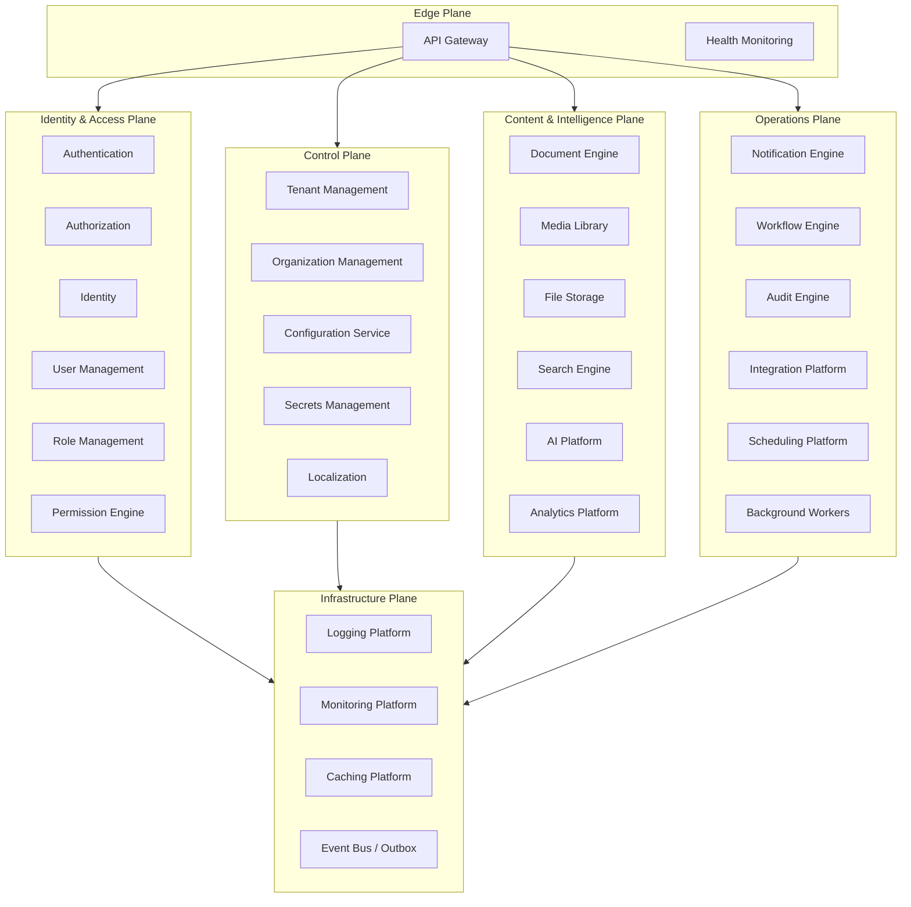

# Core Platform Design

**Status:** Canonical — master design for the Marpich enterprise platform layer  
**Audience:** Chief Enterprise Architect, platform engineers, module authors, AI agents  
**Companions:** [PLATFORM_CHARTER.md](PLATFORM_CHARTER.md) · [CORE_PLATFORM.md](CORE_PLATFORM.md) · [CONTEXT_MAP.md](CONTEXT_MAP.md) · [SECURITY_STANDARD.md](SECURITY_STANDARD.md)

---

## Mandate

**Every business module depends on Core Platform. Core Platform never depends on business modules.**

The Core Platform is the **only** place for reusable enterprise services — identity, tenancy, audit, workflow, search, notifications, AI, and the rest of the cross-cutting stack. Industry modules (hospital, banking, municipality, POS, …) **consume** these services. They **never** reimplement them.

```
                    ┌─────────────────────────────────────┐
                    │         BUSINESS MODULES             │
                    │  hospital · banking · pos · tax …   │
                    │  (domain logic + industry rules)     │
                    └──────────────────┬──────────────────┘
                                       │ depends on (REST + events)
                                       ▼
┌──────────────────────────────────────────────────────────────────┐
│                        CORE PLATFORM                              │
│   Reusable enterprise services — NO business / industry logic     │
└──────────────────────────────────────────────────────────────────┘
```

---

## The Law — No Business Logic in Core

| Core Platform **owns** | Core Platform **never** owns |
|------------------------|------------------------------|
| User login, JWT, MFA | Patient diagnosis rules |
| Role & permission catalog | Invoice posting rules |
| Tenant provisioning | Murabaha profit calculation |
| Audit trail format | Permit approval business rules |
| Workflow task routing | POS pricing promotions |
| Document versioning | GL chart of accounts |
| Search index pipeline | Payroll tax brackets |
| Notification delivery | Inventory reorder points |
| AI inference gateway | Admission bed allocation |
| File upload & presign | Municipal utility tariffs |

**Test:** If the rule references an industry noun (patient, loan, permit, student, SKU) as the **subject** of the rule, it belongs in a **business module**, not Core.

**Exception:** Core may hold **industry-agnostic configuration** (tenant settings JSON, feature flags, locale packs) — not industry **rules**.

---

## Platform Planes

Core Platform is organized into **six planes**. Each plane contains one or more **logical services**. Services may be deployed as separate processes or co-located in the modular monolith.



---

## Service Catalog — 29 Capabilities

| # | Capability | Logical service | Bounded context | API prefix | Always on |
|---|------------|-----------------|-----------------|------------|-----------|
| 1 | Authentication | Authentication Service | `identity` | `/auth` | Yes |
| 2 | Authorization | Authorization Service | `identity` | `/authorization` | Yes |
| 3 | Identity | Identity Service | `identity` | `/identity` | Yes |
| 4 | User Management | *(facet of Identity)* | `identity` | `/identity/users` | Yes |
| 5 | Role Management | *(facet of Identity)* | `identity` | `/identity/roles` | Yes |
| 6 | Permission Engine | Permission Service | `identity` | `/permissions` | Yes |
| 7 | Tenant Management | Tenant Service | `core_platform` | `/platform` | Yes |
| 8 | Organization Management | Organization Service | `organization` | `/organizations` | Yes |
| 9 | Configuration Service | Settings Service | `settings` | `/settings` | Yes |
| 10 | Localization | Localization Service | `localization` | `/localization` | Yes |
| 11 | Notification Engine | Notification Service | `notifications` | `/notifications` | Yes |
| 12 | Workflow Engine | Workflow Service | `workflow` | `/workflow` | Yes |
| 13 | Search Engine | Search Service | `search` | `/search` | Yes |
| 14 | Audit Engine | Audit Service | `audit` | `/audit` | Yes |
| 15 | Document Engine | Document Service | `documents` | `/documents` | Yes |
| 16 | Media Library | Media Service | `media` | `/media` | Yes |
| 17 | AI Platform | AI Service | `ai` | `/ai` | Optional |
| 18 | Analytics Platform | Analytics Service | `analytics` | `/analytics` | Yes |
| 19 | Integration Platform | Integration Service | `integration` | `/integrations` | Yes |
| 20 | File Storage | File Storage Service | `file_storage` | `/files` | Yes |
| 21 | Scheduling Platform | Scheduler Service | `scheduler` | `/scheduler` | Yes |
| 22 | Background Workers | Worker Runtime | `workers` | internal | Yes |
| 23 | Logging Platform | Logging Service | `shared/observability` | — | Yes |
| 24 | Monitoring Platform | Observability Service | `shared/observability` | `/metrics` | Yes |
| 25 | Caching Platform | Cache Service | `shared/cache` | internal | Yes |
| 26 | Secrets Management | Secrets Service | `secrets` | `/secrets` | Yes |
| 27 | API Gateway | Gateway | `core/gateway` | `/api/v1` | Yes |
| 28 | Health Monitoring | Health Service | `core/health` | `/health` | Yes |
| 29 | Report Engine | Reporting Service | `reporting` | `/reports` | Yes |

> **Identity plane note:** Authentication, Authorization, Identity, User Management, Role Management, and Permission Engine are **six logical services** with **one physical bounded context** (`identity`) in the modular monolith. They may split into separate deployables at enterprise scale without changing contracts.

> **Infrastructure note:** Logging, Monitoring, Caching, and Workers are **platform primitives** — modules never implement their own Redis client policy, structured log format, or job queue.

---

## Capability Specifications (summary)

### Identity & Access Plane

| Service | Responsibility | Key aggregates / concepts |
|---------|----------------|----------------------------|
| **Authentication** | Login, logout, refresh, MFA challenge, SSO/OIDC, session lifecycle | `Session`, `RefreshToken`, `MfaChallenge` |
| **Authorization** | Policy evaluation (RBAC + ABAC), `check(permission, resource, context)` | `PolicyDecision`, `AbacPolicy` |
| **Identity** | Canonical user identity, profile metadata, credential references | `User`, `Credential` |
| **User Management** | CRUD users, invite, deactivate, profile, locale preference | `User` |
| **Role Management** | Role definitions, assignments, inheritance | `Role`, `RoleAssignment` |
| **Permission Engine** | Global catalog `module.resource.action`, module registration at activation | `Permission`, `PermissionCatalog` |

**Events:** `identity.user.created`, `identity.role.assigned`, `identity.login.succeeded`, `identity.mfa.enabled`

### Control Plane

| Service | Responsibility | Key aggregates |
|---------|----------------|----------------|
| **Tenant Management** | Provision tenant, industry pack, module activation, suspend | `Tenant`, `ModuleActivation`, `Subscription` |
| **Organization Management** | Org tree, branches, departments, memberships | `Organization`, `OrgUnit`, `Membership` |
| **Configuration Service** | Tenant config JSON, feature flags, branding, module defaults | `TenantSettings` |
| **Localization** | Locales, translation keys, bundles, RTL/LTR, missing-key events | `Locale`, `TranslationKey`, `TranslationBundle` |
| **Secrets Management** | Tenant-scoped secret references, rotation metadata (values in vault/KMS) | `SecretRef`, `SecretVersion` |

**Events:** `platform.tenant.provisioned`, `platform.module.activated`, `settings.config.updated`, `localization.locale.changed`

### Content & Intelligence Plane

| Service | Responsibility | Key aggregates |
|---------|----------------|----------------|
| **Document Engine** | Folders, versions, retention, e-signature requests | `Folder`, `Document`, `DocumentVersion`, `SignatureRequest` |
| **Media Library** | Assets, variants, transcode jobs | `Asset`, `Variant`, `TranscodeJob` |
| **File Storage** | Blob upload, presigned URLs, checksum, lifecycle | `StoredObject` |
| **Search Engine** | Index definitions, ingest, query, reindex | `SearchIndex`, `IndexDocument` |
| **AI Platform** | Inference, embeddings, insights, prompt templates ([14 surfaces](AI_PLATFORM_STANDARD.md)) | `InferenceJob`, `Insight`, `ModelDeployment` |
| **Analytics Platform** | Metric definitions, snapshots, dashboards, alerts | `MetricDefinition`, `Dashboard`, `AlertRule` |

**Events:** `documents.document.signed`, `media.asset.completed`, `search.document.indexed`, `ai.insight.generated`

### Operations Plane

| Service | Responsibility | Key aggregates |
|---------|----------------|----------------|
| **Notification Engine** | Inbox, delivery channels (email, SMS, push, in-app) | `InboxMessage`, `Delivery` |
| **Workflow Engine** | BPMN definitions, process instances, human tasks | `ProcessDefinition`, `ProcessInstance`, `Task` |
| **Audit Engine** | Immutable audit entries, export, retention policies | `AuditEntry`, `AuditExport`, `RetentionPolicy` |
| **Integration Platform** | Connectors, webhooks, sync jobs, external system ACL | `Connector`, `WebhookSubscription`, `SyncJob` |
| **Scheduling Platform** | Cron schedules, one-shot jobs, tenant job registry | `ScheduledJob`, `JobRun` |
| **Background Workers** | Execute async jobs from outbox, schedules, and module queues | `WorkerLease`, `JobPayload` |
| **Report Engine** | Report templates, runs, scheduled exports | `ReportDefinition`, `ReportRun` |

**Events:** `workflow.task.assigned`, `audit.entry.recorded`, `integration.webhook.delivered`, `scheduler.job.triggered`

### Edge & Infrastructure Plane

| Service | Responsibility | Implementation |
|---------|----------------|----------------|
| **API Gateway** | Routing, auth passthrough, rate limits, request ID, CORS | `PlatformGatewayMiddleware`, `route_registry.yaml`, [API_GATEWAY_ARCHITECTURE.md](../architecture/API_GATEWAY_ARCHITECTURE.md) |
| **Health Monitoring** | Liveness, readiness, dependency checks | `GET /api/v1/health`, per-service `/health` |
| **Logging Platform** | Structured JSON logs, correlation ID, tenant context | `logging` + gateway middleware |
| **Monitoring Platform** | Metrics, traces, spans (OpenTelemetry) | `shared/infrastructure/observability/telemetry.py` |
| **Caching Platform** | Redis: sessions, permission cache, rate limits, hot reads | `shared/infrastructure/cache/` |
| **Event Bus / Outbox** | Integration events, idempotent consumers, transactional outbox | `shared/infrastructure/messaging/` |

---

## Dependency Model

### Rule 1 — Modules depend on Core; Core never depends on modules

```
business_module → core_platform_service   ✅
core_platform_service → business_module   ❌ FORBIDDEN
```

Core may subscribe to **its own** events or **other Core** events. It must not import `contexts.hospital`, `contexts.banking`, etc.

### Rule 2 — Integration only via contracts

| Mechanism | Use |
|-----------|-----|
| REST | Commands and queries with JWT + `X-Tenant-ID` |
| Integration events | State change fan-out (audit, search, notifications) |
| Application contracts | `shared/contracts/` — industry packs, event schemas |

### Rule 3 — Module activation registers with Core

When `platform.module.activated` fires, Core services react:

| Core service | On module activation |
|--------------|---------------------|
| Permission Engine | Register module permission catalog |
| Settings | Merge module default config |
| Search | Create module index definitions |
| Workflow | Load module process definitions |
| Analytics | Register module metric hooks |

### Rule 4 — Tenant isolation everywhere

Every Core table, cache key, event envelope, and log line includes `tenant_id`. No cross-tenant reads without `platform.admin` scope.

---

## Module Integration Checklist

Every business module **must** integrate with Core (see [MODULE_STRUCTURE_STANDARD.md](MODULE_STRUCTURE_STANDARD.md)):

```markdown
- [ ] Authentication — all routes behind JWT
- [ ] Authorization — `require_permissions("module.resource.action")`
- [ ] Tenant scope — `X-Tenant-ID` on every mutation
- [ ] Audit — emit auditable actions (via events or audit API)
- [ ] Events — publish versioned integration events; subscribe via ACL
- [ ] Notifications — trigger via events, not custom email code
- [ ] Search — register indexable entities + index events
- [ ] Workflow — hook approvals where needed
- [ ] Localization — externalize UI strings; no hardcoded copy
- [ ] Settings — declare config JSON Schema in context.yaml
- [ ] AI — wire [14 AI surfaces](AI_PLATFORM_STANDARD.md) if applicable
- [ ] Analytics — emit metric events or subscribe hooks
- [ ] Documents / Media — use platform storage, not local disk
```

---

## Bounded Context Map (Core only)

Core Platform spans **multiple bounded contexts** — each with independent schema, terminology, and evolution:

| Context | Schema | Business logic? |
|---------|--------|-----------------|
| `core_platform` | `platform` | No — tenant lifecycle only |
| `identity` | `identity` | No — authn/authz/users/roles |
| `organization` | `organization` | No — org hierarchy |
| `settings` | `settings` | No — config storage |
| `localization` | `localization` | No — i18n data |
| `notifications` | `notifications` | No — delivery plumbing |
| `workflow` | `workflow` | No — process orchestration |
| `search` | `search` | No — indexing/query |
| `audit` | `audit` | No — compliance trail |
| `documents` | `documents` | No — DMS metadata |
| `media` | `media` | No — asset pipeline |
| `ai` | `ai` | No — inference gateway |
| `analytics` | `analytics` | No — metrics/dashboards |
| `integration` | `integration` | No — connectors/webhooks |
| `secrets` | `secrets` | No — secret references |
| `scheduler` | `scheduler` | No — job schedules |
| `reporting` | `reporting` | No — report execution |
| `file_storage` | `file_storage` | No — blob storage |

**Not Core (business modules):** `hospital`, `clinic`, `banking`, `municipality`, `pos`, `finance`, `accounting`, …

---

## Scheduling & Background Workers

Modules **register** jobs; Core **executes** them.

```
Module defines job type + handler contract
        │
        ▼
Scheduling Platform stores cron / delay
        │
        ▼
Background Worker picks job (tenant-scoped lease)
        │
        ▼
Module handler invoked via registered callback (events or internal RPC)
        │
        ▼
Audit + metrics recorded by Core
```

**Forbidden:** Module spawning its own Celery/RQ worker fleet without registering with Core Worker Runtime.

---

## Secrets Management

| Layer | Stores |
|-------|--------|
| **Secrets Service** | Secret metadata, rotation schedule, `secret_ref` IDs |
| **Vault / KMS** | Actual secret values (HashiCorp Vault, AWS Secrets Manager, …) |
| **Configuration Service** | Non-secret tenant config only |

Modules reference secrets by `secret_ref` — never store API keys in module tables.

---

## API Gateway & Health

> **Canonical design:** [API_GATEWAY_ARCHITECTURE.md](API_GATEWAY_ARCHITECTURE.md) — single entry point, 20 responsibilities, fail-fast pipeline, route registry.

| Endpoint | Purpose |
|----------|---------|
| `GET /api/v1/health` | Platform liveness |
| `GET /api/v1/health/ready` | DB, Redis, Kafka, object storage checks |
| `GET /api/v1/{service}/health` | Per-service health |
| `GET /api/docs` | Aggregated OpenAPI |

Gateway responsibilities: JWT/OIDC/OAuth2 validation, authorization PDP, `X-Tenant-ID` enforcement, rate limiting, API versioning, load balancing, caching, compression, request validation, response transformation, `X-Correlation-ID` / `X-Request-ID`, CORS, WebSocket routing, localization, feature flags, logging, metrics, distributed tracing. **Reject invalid requests before modules.**

---

## Physical Deployment

| Tier | Shape | Core services |
|------|-------|---------------|
| **Dev / SMB** | Modular monolith (`backend/core/presentation/api/main.py`) | All contexts in one process |
| **Growth** | Service groups | Identity plane · Control plane · Content plane · Ops plane |
| **Enterprise** | Full microservices + Kafka + gateway | 29 logical services independently scaled |

Contracts (REST + events) are **identical** across deployment tiers.

---

## Implementation Status

| Plane | Implemented contexts | Planned |
|-------|---------------------|---------|
| Identity & Access | `identity` (auth + users + roles partial) | Split authorization API |
| Control | `core_platform`, `organization`, `settings`, `localization` | `secrets`, `scheduler` |
| Content | `documents`, `media`, `search`, `analytics`, `ai` (scaffold) | `file_storage`, `reporting` |
| Operations | `notifications`, `workflow`, `audit`, `integration` | `scheduler`, `workers` |
| Infrastructure | gateway middleware, OTel optional, outbox, in-process bus | Redis cache, Kafka, vault |

Per-service REST and event specs: [CORE_PLATFORM.md](CORE_PLATFORM.md).

---

## Related Documents

| Document | Content |
|----------|---------|
| [CORE_PLATFORM.md](CORE_PLATFORM.md) | Per-service REST APIs, events, payloads |
| [API_GATEWAY_ARCHITECTURE.md](API_GATEWAY_ARCHITECTURE.md) | Enterprise gateway — single entry point |
| [PLATFORM_CHARTER.md](PLATFORM_CHARTER.md) | Product law — never duplicate Core |
| [SECURITY_STANDARD.md](SECURITY_STANDARD.md) | Authn/authz requirements |
| [AI_PLATFORM_STANDARD.md](AI_PLATFORM_STANDARD.md) | AI as Core service |
| [PERFORMANCE_STANDARD.md](PERFORMANCE_STANDARD.md) | Caching, async, pagination |
| [BOUNDED_CONTEXTS_REGISTRY.md](BOUNDED_CONTEXTS_REGISTRY.md) | Full context catalog |
| ADR-009 | Original 19-service decomposition |
| ADR-027 | Expanded 29-capability Core Platform design |
