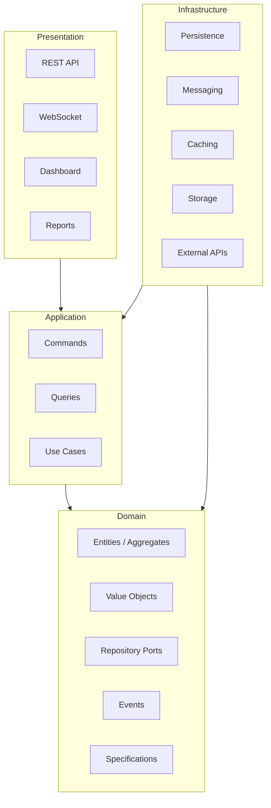
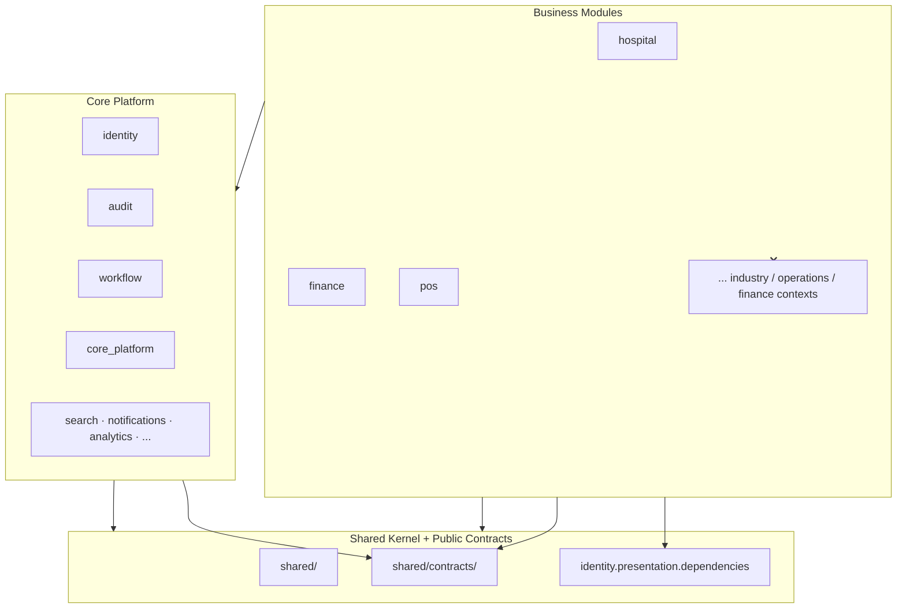

# Dependency Graph

**Status:** Canonical — non-negotiable dependency law  
**Audience:** Architects, module authors, AI agents  
**Enforcement:** `backend/shared/kernel/dependency_graph.py` · `scripts/check-dependency-graph.py` · `tests/architecture/test_dependency_graph.py`  
**Companions:** [MODULE_ARCHITECTURE.md](MODULE_ARCHITECTURE.md) · [SERVICE_BOUNDARIES.md](SERVICE_BOUNDARIES.md) · [SHARED_KERNEL.md](SHARED_KERNEL.md) · [COMMUNICATION_ARCHITECTURE.md](COMMUNICATION_ARCHITECTURE.md)

**Law: Never allow circular dependency. Automatically detect dependency violations.**

---

## Within-module layer graph

Every bounded context module (`backend/contexts/{module_id}/`) follows the same directed acyclic graph:



### Rules (within one module)

| Layer | May depend on | Must never depend on |
|-------|---------------|----------------------|
| **Presentation** | Application, composition (`container.py`) | Domain (direct), Infrastructure (direct) |
| **Application** | Domain | Infrastructure, Presentation |
| **Infrastructure** | Application, Domain (ports/contracts) | Presentation |
| **Domain** | Same-module domain, **Shared Kernel** only | Application, Infrastructure, Presentation, other modules |

**Infrastructure implements Domain contracts** — repository ports and ACL handlers live in `infrastructure/` and import `domain/ports/`.

**Domain depends on nothing** external except Shared Kernel primitives (`shared.domain.*`, `shared.kernel.*`).

**Composition root** (`container.py`, `core/presentation/api/main.py`) may wire all layers for DI and routing.

---

## Platform dependency graph



### Cross-module rules

| From | May import | Must never import |
|------|------------|-------------------|
| **Business module** | Core public contracts, Shared Kernel, `shared/contracts/` | Other business modules |
| **Core Platform** | Shared Kernel, public contracts | Any business module |
| **Shared Kernel** | Stdlib, third-party libs | `contexts.*` (any bounded context) |
| **Composition (`core/`, `main.py`)** | All modules (wiring only) | — |

### Core Platform context IDs

`core_platform`, `identity`, `workflow`, `integration`, `documents`, `notifications`, `analytics`, `ai`, `media`, `search`, `settings`, `localization`, `organization`, `audit`

### Published Core public contracts (business may import)

| Import path | Purpose |
|-------------|---------|
| `contexts.identity.presentation.dependencies` | `get_tenant_id`, `require_permissions`, JWT |
| `contexts.identity.presentation.schemas` | Auth request/response shapes (gateway) |
| `core.presentation.*` | Platform gateway, middleware |

All other `contexts.{core}.*` imports from business code are **violations** — use REST, events, or broker.

### Business ↔ business communication

**Forbidden:** `from contexts.hospital...` inside `contexts.clinic...`

**Required:** one of the five channels in [COMMUNICATION_ARCHITECTURE.md](COMMUNICATION_ARCHITECTURE.md) — REST, contracts, events, broker, scheduled sync. Local ACL in `infrastructure/acl/`.

**Compile-time graph** (this document) ≠ **runtime communication graph** (event/API catalog in COMMUNICATION_ARCHITECTURE).

---

## Circular dependency

Module-level import graph (production code, excluding tests) must be a **DAG**.

```
hospital → finance → hospital   ❌ circular
identity → audit → identity     ❌ circular (if via imports)
```

Cycles are detected automatically and fail CI.

---

## Automatic detection

### CLI

```bash
cd backend
python3 ../scripts/check-dependency-graph.py
python3 ../scripts/check-dependency-graph.py --update-baseline  # after fixing debt
```

### Pytest

```bash
cd backend && pytest tests/architecture/test_dependency_graph.py -q
```

### What is scanned

- All `backend/contexts/**/*.py` (except `_template/`)
- All `backend/shared/**/*.py`
- AST import analysis (no runtime import side effects)
- Module graph cycle detection

### Baseline

Known legacy violations are listed in `tests/architecture/dependency_baseline.json`.  
**New violations fail CI.** Removing violations requires updating the baseline downward.

Current legacy debt: application services importing infrastructure adapters directly — migrate to ports + `container.py` wiring.

---

## Violation kinds

| Kind | Meaning |
|------|---------|
| `layer` | Presentation/Application/Infrastructure imported wrong layer in same module |
| `domain_external` | Domain imported non–Shared-Kernel external code |
| `shared_imports_context` | Shared Kernel imported a bounded context |
| `business_imports_business` | Business module imported another business module |
| `business_imports_non_core` | Business imported unpublished Core internals |
| `core_imports_business` | Core imported business module |
| `circular` | Module import cycle |

---

## Migration guidance

| Legacy pattern | Target pattern |
|----------------|----------------|
| `application/service.py` imports `infrastructure.*` | Inject ports via constructor; wire in `container.py` |
| `presentation/dependencies.py` imports JWT infra | Move token parsing behind application port |
| `accounting` ACL imports hospital event types | Use event envelope dict + schema validation from `shared/contracts/` |
| Cross-module domain model import | Integration event + local read model |

---

## Checklist (PR)

- [ ] No new entries in `dependency_baseline.json`
- [ ] Domain layer imports only `shared.*` + same-module domain
- [ ] Presentation calls use cases, not repositories
- [ ] Business module does not import another business module
- [ ] Shared Kernel does not import `contexts.*`

---

## Related

| Document | Role |
|----------|------|
| [MODULE_ARCHITECTURE.md](MODULE_ARCHITECTURE.md) | Identical folder tree |
| [SERVICE_BOUNDARIES.md](SERVICE_BOUNDARIES.md) | Nine ownership dimensions |
| [CONTEXT_MAP.md](CONTEXT_MAP.md) | Event-only coupling between contexts |
| ADR-032 | Dependency graph law |
