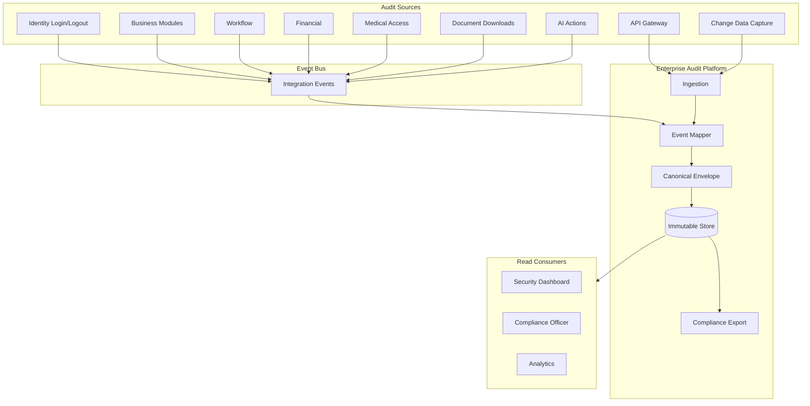
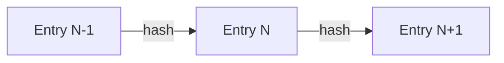
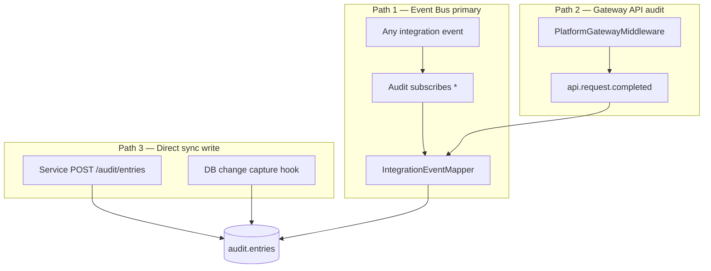
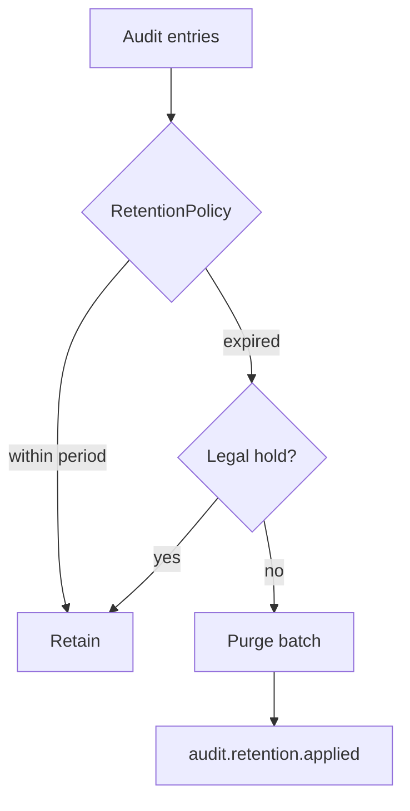

# Enterprise Audit Platform — Marpich

**Status:** Canonical — immutable audit trail for every operation  
**Audience:** Compliance, security, platform engineers, module authors, AI agents  
**Owner context:** `backend/contexts/audit/` · `shared/domain/audit/`  
**Companions:** [SECURITY_STANDARD.md](SECURITY_STANDARD.md) · [ENTERPRISE_EVENT_BUS.md](ENTERPRISE_EVENT_BUS.md) · [API_GATEWAY_ARCHITECTURE.md](API_GATEWAY_ARCHITECTURE.md) · [CORE_PLATFORM.md](CORE_PLATFORM.md)

**Law: Audit every operation. Immutable audit logs — append-only, tamper-evident, permission-gated read access.**

---

## Platform position



---

## The law

```
Audit EVERY operation.

Track:
  Login · Logout · API Calls · Database Changes · Permission Changes
  Workflow Actions · Financial Transactions · Medical Records Access
  Academic Records Access · Document Downloads · AI Actions

Store (every entry):
  Timestamp · User · Tenant · Organization · IP · Browser · Location
  Old Value · New Value · Reason

Generate IMMUTABLE audit logs — append-only, no in-place edits, tamper-evident chain.
```

---

## Tracked operation categories

Catalog: [`audit/AUDIT_CATALOG.yaml`](audit/AUDIT_CATALOG.yaml)

| Category | Action examples | Severity | Source |
|----------|-----------------|----------|--------|
| **Login** | `identity.login.succeeded`, `identity.login.failed` | security | Identity |
| **Logout** | `identity.session.revoked`, `authentication.logout` | security | Identity |
| **API calls** | `api.request.completed` | info | API Gateway middleware |
| **Database changes** | `data.record.created/updated/deleted` | info/compliance | Module events + CDC |
| **Permission changes** | `identity.role.assigned`, `permission.role.revoked` | security | Identity |
| **Workflow actions** | `workflow.task.completed`, `workflow.process.started` | info | Workflow |
| **Financial transactions** | `finance.journal.posted`, `accounting.payment.received` | compliance | Finance/Accounting |
| **Medical records access** | `hospital.encounter.read`, `hospital.patient.viewed` | compliance | Hospital (HIPAA) |
| **Academic records access** | `university.student.record.accessed`, `school.grade.viewed` | compliance | University/School |
| **Document downloads** | `documents.document.downloaded` | compliance | Document Exchange |
| **AI actions** | `ai.inference.completed`, `ai.job.failed` | info/security | AI Service |

---

## Canonical audit entry

Every log record uses this envelope — **immutable after write**.

```json
{
  "id": "uuid",
  "tenant_id": "acme",
  "organization_id": "org-finance",
  "correlation_id": "corr-uuid",
  "occurred_at": "2026-07-03T10:00:00Z",
  "recorded_at": "2026-07-03T10:00:00.100Z",

  "actor_id": "user-uuid",
  "actor_display_name": "Jane Doe",
  "ip_address": "203.0.113.10",
  "user_agent": "Mozilla/5.0 ...",
  "geo_location": { "country": "IR", "city": "Tehran" },

  "action": "hospital.patient.viewed",
  "event_name": "hospital.patient.accessed",
  "source_context": "hospital",
  "resource_type": "patient",
  "resource_id": "patient-uuid",
  "severity": "compliance",

  "old_value": { "status": "admitted" },
  "new_value": { "status": "discharged" },
  "reason": "Clinical review — encounter closed",

  "payload": { },
  "integrity_hash": "sha256-chain-link",
  "previous_entry_hash": "sha256-previous"
}
```

| Field | Required | Notes |
|-------|----------|-------|
| **Timestamp** | `occurred_at` + `recorded_at` | Event time vs ingest time |
| **User** | `actor_id` | JWT `sub` or system |
| **Tenant** | `tenant_id` | Hard partition |
| **Organization** | `organization_id` | Org unit scope |
| **IP** | `ip_address` | From gateway / request |
| **Browser** | `user_agent` | Parsed client info |
| **Location** | `geo_location` | GeoIP (optional) |
| **Old value** | `old_value` | Before state (updates) |
| **New value** | `new_value` | After state |
| **Reason** | `reason` | User justification when required |

Schema: `docs/architecture/audit/AUDIT_ENTRY.v1.json`

---

## Immutability



| Rule | Enforcement |
|------|-------------|
| **Append-only** | No UPDATE/DELETE on `audit.entries` (except retention policy job) |
| **No in-place edit** | API has no PATCH on entries |
| **Tamper-evident chain** | `integrity_hash = SHA256(previous_hash + canonical_json)` 📋 |
| **Retention purge** | Only via `RetentionPolicy` — itself audited as `audit.retention.applied` |
| **Legal hold** | Blocks purge for compliance investigations |
| **Export integrity** | Signed export bundle (RSA) for external auditors |

```python
# ❌ FORBIDDEN
await audit_repo.update_entry(entry_id, new_payload=...)
await audit_repo.delete_entry(entry_id)

# ✅ ALLOWED
await audit_repo.append(entry)  # only operation
```

---

## Ingestion architecture

Three ingestion paths — all converge to canonical `AuditEntry`.



### Path 1: Integration events (primary) ✅

Audit subscribes to `*` — maps envelopes via `infrastructure/acl/event_mapper.py`.

Every module **must** publish integration events for mutations. Audit derives entries automatically.

### Path 2: API Gateway ✅ partial

Gateway middleware logs every HTTP request → `api.request.completed` event with:

- method, path, status, duration_ms
- `actor_id`, `tenant_id`, `ip_address`, `user_agent`, `correlation_id`

See [API_GATEWAY_ARCHITECTURE.md](API_GATEWAY_ARCHITECTURE.md).

### Path 3: Direct record

Sensitive sync paths where event latency is unacceptable:

```
POST /api/v1/audit/entries
```

Used for: medical record view, document download, permission denial at PDP.

**Rule:** Modules never write to `audit.*` tables directly — always via Audit API or events.

---

## Category deep-dives

### Login / logout

| Event | Fields captured |
|-------|-----------------|
| `identity.login.succeeded` | user, IP, user_agent, geo, MFA used |
| `identity.login.failed` | attempted email, IP, failure reason |
| `identity.session.revoked` | session_id, revoked_by, reason |

Severity: **security** — triggers anomaly detection.

### API calls

Gateway emits per request:

```json
{
  "action": "api.request.completed",
  "resource_type": "api_route",
  "resource_id": "GET /api/v1/hospital/patients/{id}",
  "payload": { "status": 200, "duration_ms": 45 }
}
```

### Database changes

Modules publish domain events with change sets:

```json
{
  "event_name": "accounting.journal.posted",
  "old_value": null,
  "new_value": { "journal_id": "...", "amount": 10000 },
  "reason": "Month-end close"
}
```

Optional CDC adapter for critical schemas (finance, medical) — **never** cross-module DB triggers.

### Permission changes

| Event | old_value / new_value |
|-------|----------------------|
| `identity.role.assigned` | roles before → after |
| `permission.role.revoked` | permission list diff |

Severity: **security**

### Workflow actions

All `workflow.*` events mapped — task assign, complete, delegate, SLA breach, rollback.

### Financial transactions

| Event | Compliance |
|-------|------------|
| `finance.journal.posted` | SOX |
| `accounting.payment.received` | SOX |
| `treasury.transfer.executed` | SOX |

Severity: **compliance** — extended retention (7+ years).

### Medical records access (HIPAA)

**Mandatory direct audit** on every read of PHI:

```
POST /audit/entries
action: hospital.patient.viewed
resource_type: patient
reason: required for break-glass access
severity: compliance
```

Module publishes `hospital.patient.accessed` with `actor_id`, `patient_id`, `encounter_id`.

### Academic records access (FERPA)

Same pattern for `university.student.record.accessed`, `school.grade.viewed`.

### Document downloads

Document Exchange emits `documents.document.downloaded` on every authorized download — includes version, checksum, actor.

### AI actions

| Event | Captured |
|-------|----------|
| `ai.inference.completed` | model, prompt_ref, input_hash, output_summary |
| `ai.fraud.detected` | score, entity_ref |
| `ai.job.failed` | error, job_type |

No raw PII in audit payload — hashes and references only.

---

## Severity model

| Level | Use | Retention default |
|-------|-----|-----------------|
| `info` | General operations | 3 years |
| `security` | Auth, permissions, denied access | 7 years |
| `compliance` | Financial, medical, academic, documents | 10+ years |

Configurable per tenant via `RetentionPolicy`.

---

## Query & export

### Query

```
GET /api/v1/audit/entries?severity=compliance&actor_id=&date_from=&date_to=
Permission: audit.entries.read
```

Tenant-scoped — no cross-tenant queries.

### Compliance export ✅

```
POST /api/v1/audit/exports
{ "format": "csv|json|pdf", "filters": { ... } }
→ audit.export.completed
```

Signed export for external auditors. Download via `GET /exports/{id}`.

### Stats dashboard ✅

```
GET /api/v1/audit/stats
→ total, security_events, last_24h, top_events
```

---

## Permissions

| Permission | Scope |
|------------|-------|
| `audit.entries.read` | Query audit log |
| `audit.entries.write` | Direct record (services) |
| `audit.exports.read` | Download exports |
| `audit.exports.write` | Create compliance export |
| `audit.admin` | Retention policy, legal hold |

**Reading audit logs is itself audited** — meta-audit on export and bulk query.

---

## Module integration

### Required

1. Publish integration events for all mutations with auditable payload
2. Emit access events for sensitive reads (medical, academic, documents)
3. Include `old_value` / `new_value` / `reason` on updates when applicable
4. Never implement local audit tables — use Audit Platform only

### Event enrichment template

```yaml
# context.yaml
audit:
  sensitive_reads:
    - hospital.patient.read
  compliance_events:
    - hospital.encounter.completed
  include_change_set: true
```

### Forbidden

```python
# ❌ FORBIDDEN
class LocalAuditLog(Model):
    ...  # module-owned audit table

# ✅ ALLOWED
await publish_integration_event(PatientAccessedIntegration(...))
# or
await audit_client.record(action="hospital.patient.viewed", ...)
```

---

## Retention & legal hold



Default policies by severity in `AUDIT_CATALOG.yaml`. Scheduler runs daily.

---

## Implementation status

| Area | Today | Target |
|------|-------|--------|
| Event ingestion `*` | ✅ | Per-event enrichment |
| AuditEntry aggregate | ✅ | Full canonical envelope |
| Query + stats + export | ✅ | PDF signed export |
| Retention purge | ✅ | Legal hold |
| Security event mapping | ✅ partial | Full catalog |
| Gateway API audit | ⚠️ logging only | `api.request.completed` event |
| old_value / new_value / reason | ⚠️ in payload | First-class fields |
| organization_id, geo | 📋 | Gateway + GeoIP |
| Integrity hash chain | 📋 | Tamper detection |
| Medical/academic access events | 📋 | Mandatory module events |
| Document download audit | 📋 | Document Exchange event |
| AI action audit | 📋 | AI Service events |
| Meta-audit on read | 📋 | Query/export logged |

Legend: ✅ implemented · ⚠️ partial · 📋 designed

---

## Module checklist

```markdown
## Audit checklist

- [ ] All mutations publish integration events
- [ ] Sensitive reads emit access audit (medical/academic/documents)
- [ ] old_value / new_value on updates where applicable
- [ ] reason captured for break-glass / admin actions
- [ ] No local audit tables in module
- [ ] audit.* permissions registered
```

---

## Enforcement

| Mechanism | Location |
|-----------|----------|
| This document | `docs/architecture/ENTERPRISE_AUDIT_PLATFORM.md` |
| Event catalog | `docs/architecture/audit/AUDIT_CATALOG.yaml` |
| Entry schema | `docs/architecture/audit/AUDIT_ENTRY.v1.json` |
| Context | `backend/contexts/audit/` |
| ADR | ADR-042 |
| Cursor rule | `.cursor/rules/marpich-audit-platform.mdc` |

---

## Related

| Document | Role |
|----------|------|
| [SECURITY_STANDARD.md](SECURITY_STANDARD.md) | Every action audited |
| [ENTERPRISE_EVENT_BUS.md](ENTERPRISE_EVENT_BUS.md) | Event ingestion |
| [API_GATEWAY_ARCHITECTURE.md](API_GATEWAY_ARCHITECTURE.md) | API call audit |
| [ENTERPRISE_DOCUMENT_EXCHANGE.md](ENTERPRISE_DOCUMENT_EXCHANGE.md) | Download events |
| [AI_PLATFORM_STANDARD.md](AI_PLATFORM_STANDARD.md) | AI action audit |
| [ENTERPRISE_OBSERVABILITY_PLATFORM.md](ENTERPRISE_OBSERVABILITY_PLATFORM.md) | Ops telemetry (distinct from audit) |
| [ENTERPRISE_POLICY_ENGINE.md](ENTERPRISE_POLICY_ENGINE.md) | Configurable business rules |
| [ENTERPRISE_COMPLIANCE_FRAMEWORK.md](ENTERPRISE_COMPLIANCE_FRAMEWORK.md) | Compliance monitoring layer |
