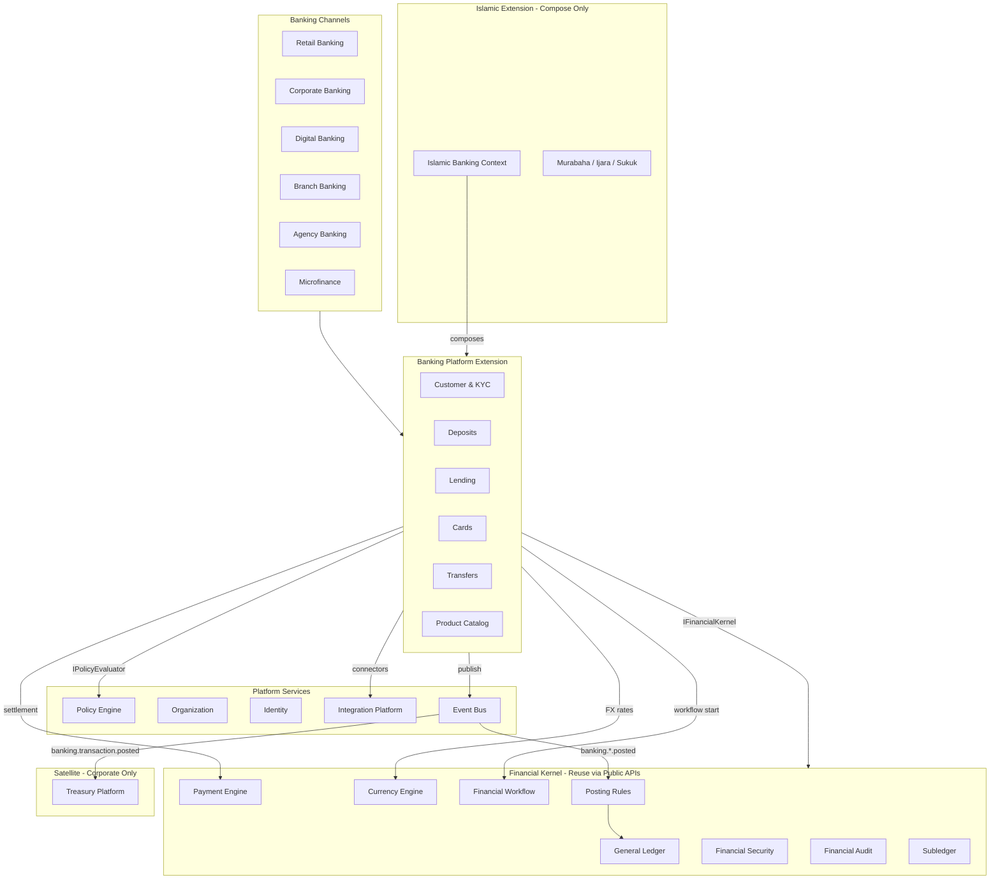
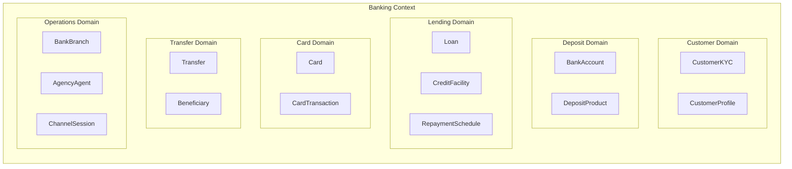
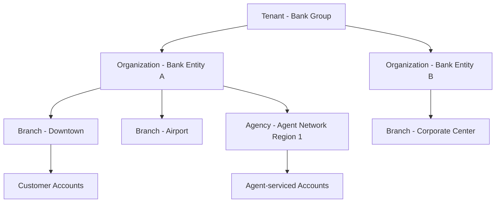

# Enterprise Banking Platform — Marpich

**Status:** Canonical v1 — industry extension on Financial Kernel  
**Audience:** Chief Banking Architect, product owners, compliance, platform engineers, module authors  
**Owner context:** `backend/contexts/banking/` (Financial Kernel industry satellite)  
**Companions:** [banking/BANKING_GL_BRIDGE.md](banking/BANKING_GL_BRIDGE.md) · [banking/BANKING_CATALOG.yaml](banking/BANKING_CATALOG.yaml) · [ENTERPRISE_FINANCIAL_KERNEL.md](ENTERPRISE_FINANCIAL_KERNEL.md) · [ENTERPRISE_POLICY_ENGINE.md](ENTERPRISE_POLICY_ENGINE.md) · [ADR-087](../adr/087-enterprise-banking-platform.md)

**Law: Banking owns customer products. Financial Kernel owns GL, payments, currency, workflow, security, and audit. Treasury owns corporate liquidity. Never duplicate financial logic. Never hardcode country-specific regulations — all limits via Policy Engine.**

---

## Platform position

The Banking Platform is an **Industry Extension** built on the Enterprise Financial Kernel. It provides core banking capabilities for multiple segments and channels while delegating all financial infrastructure to kernel and platform services.



---

## What banking owns vs what it must NOT duplicate

| Capability | Owner | Banking action |
|---|---|---|
| General Ledger, COA, journals | Financial Kernel | `IFinancialKernel.execute_posting()` |
| Payment settlement, allocation | Payment Engine (kernel) | `POST /financial-kernel/payments` |
| FX rates, conversion, revaluation | Currency Engine (kernel) | `POST /financial-kernel/currency/convert` |
| Maker-checker, period close, RBAC | Financial Security (kernel) | Kernel security APIs |
| Approval workflows | Financial Workflow (kernel) | `POST /financial-kernel/workflows` |
| Immutable financial audit | Financial Audit (kernel) | Publish events with facts |
| Corporate liquidity, pools | Treasury (satellite) | Subscribe only — do not build |
| Regulatory limits, rates, thresholds | Policy Engine | `IPolicyEvaluator.evaluate(banking.*)` |
| Bank/card/KYC external APIs | Integration Platform | Connector commands only |

---

## Banking segments

All segments share the **same bounded contexts and aggregates**. Segment differences are expressed through:

- **Product catalog** configuration (rates, terms, eligibility)
- **Policy Engine** keys (`banking.retail.*`, `banking.corporate.*`, etc.)
- **Channel adapters** (branch teller, mobile API, agency agent app)
- **Organization/branch** scoping

| Segment | Primary products | Channel | Policy namespace |
|---|---|---|---|
| **Retail Banking** | Savings, current, personal loans, cards | Branch, digital, ATM | `banking.retail.*` |
| **Corporate Banking** | Corporate accounts, trade finance, facilities | Branch, corporate portal | `banking.corporate.*` |
| **Islamic Banking** | Murabaha, Ijara, Sukuk (extension) | All channels | `banking.sharia.*` via `islamic_banking` |
| **Microfinance** | Group lending, small deposits | Agency, field officer | `banking.microfinance.*` |
| **Digital Banking** | Mobile-first accounts, instant transfers | API, mobile, web | `banking.digital.*` |
| **Branch Banking** | Full-service counter operations | Branch teller | `banking.branch.*` |
| **Agency Banking** | Agent-led onboarding, cash-in/out | Agent network | `banking.agency.*` |

### Islamic banking (extension-ready)

Islamic products live in `backend/contexts/islamic_banking/` and **compose** banking aggregates — they do not fork the kernel or duplicate deposit/loan infrastructure.

```
islamic_banking.murabaha.approved → banking.loan.disbursed (with sharia metadata)
islamic_banking.ijara.executed    → banking.account.credited
```

Sharia compliance review is a policy + workflow concern (`banking.sharia.product_eligibility`), not a code branch.

---

## Domain-Driven Design

### Bounded contexts



### Aggregates

| Aggregate | Responsibility | Invariants |
|---|---|---|
| `CustomerProfile` | CIF, demographics, segment | Unique per tenant + national ID hash |
| `CustomerKYC` | Verification tiers, documents | Policy-driven tier thresholds |
| `BankAccount` | Deposit account lifecycle | Balance ≥ policy minimum; status gates |
| `DepositProduct` | Product terms (rates, fees) | Configurable — not hardcoded |
| `Loan` | Loan lifecycle, disbursement, repayment | Exposure limits via policy |
| `CreditFacility` | Corporate revolving limits | Corporate segment only |
| `RepaymentSchedule` | Installment plan | Generated from product terms |
| `Card` | Card issuance, limits, status | Linked to deposit account |
| `Transfer` | Internal/external transfers | Daily limits via policy |
| `Beneficiary` | Registered payees | Verification via policy |
| `BankBranch` | Physical branch registry | Scoped to organization |
| `AgencyAgent` | Agent network, float, commission | Agency channel only |
| `ChannelSession` | Digital/branch session context | Audit trail input |

### Domain services (pure logic)

| Service | Responsibility |
|---|---|
| `BankingProductEngine` | Product eligibility, fee calculation |
| `LendingEngine` | Amortization, exposure check (policy facts) |
| `KycEngine` | Tier resolution (policy-driven) |
| `TransferEngine` | Routing, limit checks (policy facts) |
| `ChannelEngine` | Branch/agency/digital session rules |

### Application services

| Service | Orchestrates |
|---|---|
| `CustomerApplicationService` | Onboarding, KYC submission |
| `DepositApplicationService` | Account open, deposit, withdrawal |
| `LendingApplicationService` | Application, approval, disburse, repay |
| `CardApplicationService` | Issue, activate, settle |
| `TransferApplicationService` | Initiate, approve, execute |
| `BranchApplicationService` | Branch operations, teller sessions |
| `AgencyApplicationService` | Agent transactions, float management |

---

## Multi-tenant, multi-organization, multi-branch



| Scope | Identifier | Usage |
|---|---|---|
| **Tenant** | `tenant_id` | Hard isolation — all tables, events, policies |
| **Organization** | `organization_id` | Bank legal entity within tenant (multi-bank groups) |
| **Branch** | `branch_id` | Physical/digital outlet — dimension on all transactions |
| **Agency** | `agency_id` | Agent outlet — subset of branch dimension |
| **Channel** | `channel` | `retail`, `corporate`, `digital`, `branch`, `agency`, `microfinance` |

Provisioning flow:

1. `platform.tenant.provisioned` → seed `coa.banking` COA template
2. Seed `banking.*` policy templates (empty parameters — tenant configures)
3. Create root organization + default branch
4. Activate industry pack (`bank`, `islamic_bank`, or `microfinance`)

---

## Policy Engine integration

**Law: No hardcoded country-specific banking regulations. All limits, rates, thresholds, and compliance rules are Policy Engine keys.**

### Evaluation pattern

```python
decision = await policy_evaluator.evaluate(
    tenant_id=tenant_id,
    domain="banking",
    policy_key="transaction.daily_limit",
    facts={
        "customer_id": customer_id,
        "amount": amount,
        "currency": currency,
        "channel": channel,
        "segment": segment,
        "kyc_tier": kyc_tier,
        "organization_id": organization_id,
        "branch_id": branch_id,
    },
    organization_id=organization_id,
)
if not decision.matched or decision.outcome == "deny":
    return Result.fail("banking.errors.policy_denied")
```

### Policy key catalog

See [banking/BANKING_POLICY_CATALOG.yaml](banking/BANKING_POLICY_CATALOG.yaml) for the full configurable key registry. Examples:

| Key | Purpose | Facts required |
|---|---|---|
| `banking.kyc.verification_threshold` | Amount requiring KYC tier | `amount`, `kyc_tier` |
| `banking.transaction.daily_limit` | Per-customer daily cap | `customer_id`, `amount`, `channel` |
| `banking.lending.single_exposure_limit` | Max loan per customer | `customer_id`, `amount`, `segment` |
| `banking.aml.suspicious_amount` | AML alert threshold | `amount`, `currency`, `channel` |
| `banking.interest.rate.retail` | Retail deposit rate | `product_code`, `tenure_days` |
| `banking.sharia.product_eligibility` | Islamic product gate | `product_code`, `sharia_board_approved` |
| `banking.agency.float_limit` | Agent cash float cap | `agency_id`, `float_balance` |
| `banking.microfinance.group_size_limit` | Group lending size | `group_id`, `member_count` |

Policies support versioning, effective dates, exceptions, simulation, and rollback (Policy Engine ADR-044).

---

## Public API reuse map

Banking calls kernel/platform services — never reimplements them.

| Banking operation | Delegates to | API / Port |
|---|---|---|
| Post deposit to GL | Financial Kernel | `IFinancialKernel.execute_posting(rule_id="bank_deposit")` |
| Settle transfer | Payment Engine | `POST /api/v1/financial-kernel/payments` |
| FX conversion | Currency Engine | `POST /api/v1/financial-kernel/currency/convert` |
| Loan approval workflow | Financial Workflow | `POST /api/v1/financial-kernel/workflows` |
| Large transfer approval | Financial Workflow | `POST /api/v1/financial-kernel/workflows` |
| Maker-checker on disbursement | Financial Security | Kernel security evaluate |
| Regulatory limit check | Policy Engine | `IPolicyEvaluator.evaluate(banking.*)` |
| SWIFT / card network | Integration Platform | Connector commands |
| Immutable audit | Financial Audit | Event publication (automatic) |
| Org/branch hierarchy | Organization context | `GET /api/v1/organizations` |

---

## Integration events

### Banking publishes

| Event | Trigger | Subscribers |
|---|---|---|
| `banking.account.opened` | Account activated | islamic_banking, analytics |
| `banking.deposit.posted` | Deposit executed | financial_kernel (GL bridge) |
| `banking.withdrawal.posted` | Withdrawal executed | financial_kernel (GL bridge) |
| `banking.transfer.posted` | Transfer completed | financial_kernel, treasury |
| `banking.transaction.posted` | Generic transaction | treasury, analytics |
| `banking.loan.disbursed` | Loan funded | financial_kernel (GL bridge) |
| `banking.loan.repayment.posted` | Repayment received | financial_kernel (GL bridge) |
| `banking.kyc.verified` | KYC tier upgraded | audit |
| `banking.aml.alert.raised` | AML threshold breached | workflow, audit |
| `banking.card.issued` | Card activated | integration (card network) |

### Banking subscribes

| Event | Action |
|---|---|
| `platform.tenant.provisioned` | Seed COA, policies, default branch |
| `identity.user.created` | Link customer profile |
| `financial_kernel.payment.settled` | Confirm transfer settlement |
| `financial_kernel.journal.posted` | Confirm GL posting |
| `islamic_banking.murabaha.executed` | Post Islamic disbursement |
| `workflow.approval.completed` | Resume pending operation |

---

## REST API structure

**Prefix:** `/api/v1/banking`

| Domain | Endpoints |
|---|---|
| Catalog | `GET /catalog`, `GET /dashboard` |
| Customers | `POST /customers`, `GET /customers/{id}`, `POST /customers/{id}/kyc` |
| Accounts | `POST /accounts`, `GET /accounts`, `POST /accounts/{id}/deposit`, `POST /accounts/{id}/withdraw` |
| Loans | `POST /loans`, `POST /loans/{id}/submit`, `POST /loans/{id}/disburse`, `POST /loans/{id}/repay` |
| Cards | `POST /cards`, `POST /cards/{id}/activate`, `GET /cards/{id}/transactions` |
| Transfers | `POST /transfers`, `POST /transfers/{id}/execute` |
| Branches | `GET /branches`, `POST /branches/{id}/sessions` |
| Agencies | `GET /agencies`, `POST /agencies/{id}/transactions` |
| Products | `GET /products`, `POST /products` (admin) |
| Policies | `POST /policies/evaluate` (proxy to Policy Engine) |

Permissions: `banking.customers.read`, `banking.accounts.write`, `banking.lending.approve`, `banking.transfers.execute`, `banking.admin`, `banking.agency.operate`.

---

## Layer architecture (hexagonal)

```
backend/contexts/banking/
├── domain/
│   ├── aggregates/          # BankAccount, Loan, Card, Transfer, CustomerKYC, ...
│   ├── services/            # LendingEngine, KycEngine, TransferEngine (pure)
│   ├── ports/               # I*Repository, IFinancialKernel, IPolicyEvaluator
│   └── events/              # integration_events.py
├── application/             # *ApplicationService per domain
├── infrastructure/
│   └── persistence/         # InMemory → Postgres adapters
├── presentation/
│   ├── banking_router.py
│   └── banking_schemas.py
├── container.py
└── context.yaml
```

---

## Implementation phases

| Phase | Scope | Priority |
|---|---|---|
| **1 — Foundation** | Customer, KYC, deposit accounts, policy integration, GL bridge | Now |
| **2 — Lending** | Loan lifecycle, disbursement, repayment, subledger | Next |
| **3 — Channels** | Branch teller, digital API, transfer execution via Payment Engine | Next |
| **4 — Cards & Agency** | Card issuance, agency agent network, float management | Later |
| **5 — Corporate** | Credit facilities, trade finance hooks | Later |
| **6 — Islamic compose** | Wire `islamic_banking` to banking aggregates | Parallel with 2 |

---

## Enforcement

| Layer | Artifact |
|---|---|
| Architecture law | This document |
| API catalog | `banking/BANKING_CATALOG.yaml` |
| GL bridge | `banking/BANKING_GL_BRIDGE.md` |
| Policy keys | `banking/BANKING_POLICY_CATALOG.yaml` |
| ADR | `docs/adr/087-enterprise-banking-platform.md` |
| Context manifest | `backend/contexts/banking/context.yaml` |
| Industry packs | `INDUSTRY_FINANCIAL_PACKS.yaml` |
| Cursor rules | `.cursor/rules/lokal-banking.mdc` (to add) |

---

## Related documents

- [ENTERPRISE_FINANCIAL_KERNEL.md](ENTERPRISE_FINANCIAL_KERNEL.md)
- [ENTERPRISE_TREASURY.md](ENTERPRISE_TREASURY.md) — corporate liquidity boundary
- [ENTERPRISE_PAYMENT_PLATFORM.md](ENTERPRISE_PAYMENT_PLATFORM.md)
- [ENTERPRISE_POLICY_ENGINE.md](ENTERPRISE_POLICY_ENGINE.md)
- [ENTERPRISE_FINANCIAL_WORKFLOW.md](ENTERPRISE_FINANCIAL_WORKFLOW.md)
- [ENTERPRISE_FINANCIAL_SECURITY.md](ENTERPRISE_FINANCIAL_SECURITY.md)
- [CONTEXT_MAP.md](CONTEXT_MAP.md)
