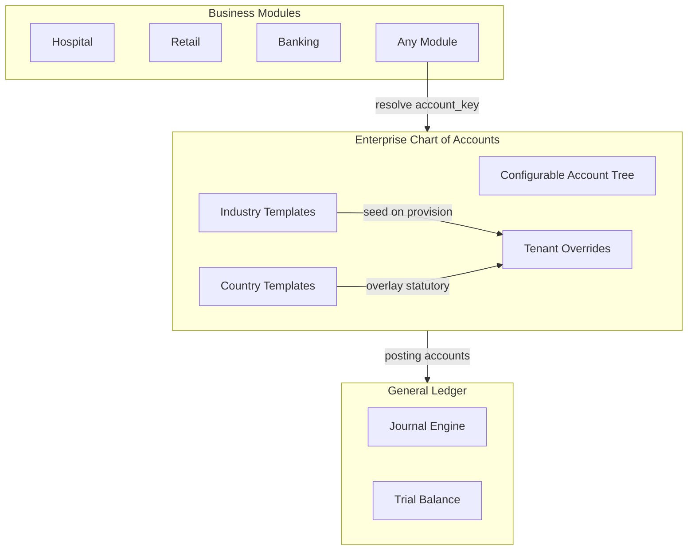

# Enterprise Chart of Accounts — Marpich

**Status:** Canonical — configurable account trees for every tenant and industry  
**Audience:** CFO, controllers, platform engineers, module authors, AI agents  
**Owner context:** `backend/contexts/financial_kernel/`  
**Companions:** [ENTERPRISE_FINANCIAL_KERNEL.md](ENTERPRISE_FINANCIAL_KERNEL.md) · [ENTERPRISE_GENERAL_LEDGER.md](ENTERPRISE_GENERAL_LEDGER.md) · [financial_kernel/ACCOUNT_TREE_TEMPLATES.v1.yaml](financial_kernel/ACCOUNT_TREE_TEMPLATES.v1.yaml) · [financial_kernel/COA_CATALOG.yaml](financial_kernel/COA_CATALOG.yaml)

**Law: No hardcoded account numbers in application code. Account codes are tenant-configurable. Templates provide optional `code_suggestion` defaults only.**

---

## Platform position



---

## Capabilities

| Capability | Description |
|---|---|
| **Unlimited levels** | Parent → child → grandchild … no depth limit |
| **Parent accounts** | Summary/group accounts (`is_posting: false`) |
| **Child accounts** | Posting leaf accounts under any parent |
| **Account groups** | `current_assets`, `operating_expense`, `memorandum`, etc. |
| **Account categories** | Asset, Liability, Equity, Revenue, Expense, Off Balance, Statistical |
| **Tenant-specific accounts** | Create custom nodes under any parent |
| **Industry templates** | 14 industry packs (`coa.healthcare`, `coa.retail`, …) |
| **Country templates** | Statutory overlays (`coa.country.us_gaap`, `coa.country.ir_ifrs`, …) |
| **Configurable codes** | `code_overrides` + `code_prefix` on template apply |

---

## Account model

| Field | Purpose |
|---|---|
| `account_key` | Stable semantic slug (`patient_receivables`) — use in integrations |
| `code` | Tenant-facing account number — fully configurable |
| `parent_account_id` | Parent link for tree hierarchy |
| `level` | Depth (0 = root) |
| `tree_path` | Materialized path (`assets/patient_receivables`) |
| `account_group` | Grouping within category |
| `account_category` | Primary classification |
| `is_posting` | `false` for summary parents |
| `template_source` | `industry`, `country`, or `tenant` |

### Categories

| Category | GL posting | Balance |
|---|---|---|
| Asset | Yes (if posting) | Normal debit |
| Liability | Yes | Normal credit |
| Equity | Yes | Normal credit |
| Revenue | Yes | Normal credit |
| Expense | Yes | Normal debit |
| Off Balance | No | Memorandum only |
| Statistical | No | `statistical_balance` field |

---

## API

Prefix: `/api/v1/financial-kernel/coa`

| Method | Path | Description |
|---|---|---|
| GET | `/tree` | Full nested account tree |
| GET | `/templates` | Industry + country templates |
| POST | `/templates/apply` | Seed/merge template with custom codes |
| POST | `/accounts` | Create tenant child account |
| GET | `/accounts/{id}` | Account detail |
| GET | `/accounts/{id}/children` | Direct children |
| GET | `/resolve/{account_key}` | Key → tenant code |

### Apply template example

```json
POST /api/v1/financial-kernel/coa/templates/apply
{
  "template_key": "coa.healthcare",
  "template_type": "industry",
  "code_prefix": "H-",
  "code_overrides": {
    "patient_receivables": "AR-PAT"
  }
}
```

### Module integration pattern

```python
# Resolve semantic key — never hardcode "1200" in module code
code = await kernel.resolve_account_code(tenant_id, "patient_receivables")
await kernel.post_journal(..., lines=[{"account_code": code, "debit": 100, "credit": 0}, ...])
```

---

## Template catalog

- **Industry:** `docs/architecture/financial_kernel/ACCOUNT_TREE_TEMPLATES.v1.yaml`
- **Schema:** `docs/architecture/financial_kernel/ACCOUNT_TREE_SCHEMA.v1.json`
- **Loader:** `backend/contexts/financial_kernel/application/services/coa_template_loader.py`

Tenant provision (`handle_tenant_provisioned`) seeds industry template automatically from `industry_pack`.

Country overlay applied separately via `POST /coa/templates/apply` with `template_type: "country"` and `merge: true`.

---

## Posting rules

1. Journal lines may only target `is_posting: true` accounts
2. Off-balance and statistical accounts reject GL journal lines
3. Summary parent accounts aggregate children in reports — never receive direct postings
4. Budget validation uses `account_category == expense`

---

## Cross-context events

| Event | When |
|---|---|
| `coa.seeded` | Industry template provisioned on tenant create |
| `journal.posted` | GL posting (unchanged) |

---

## ADR

See [ADR-051](../adr/051-enterprise-chart-of-accounts.md).
