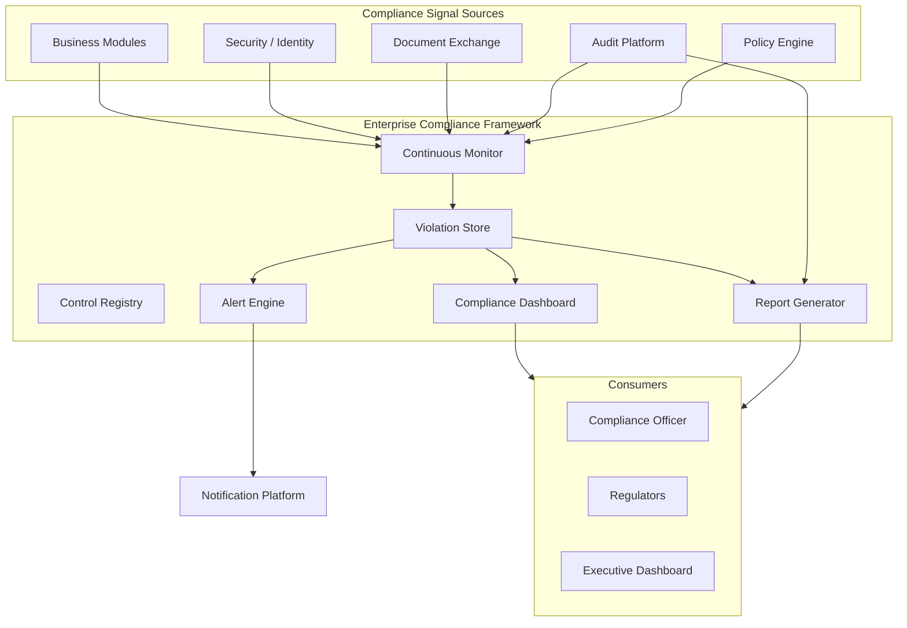
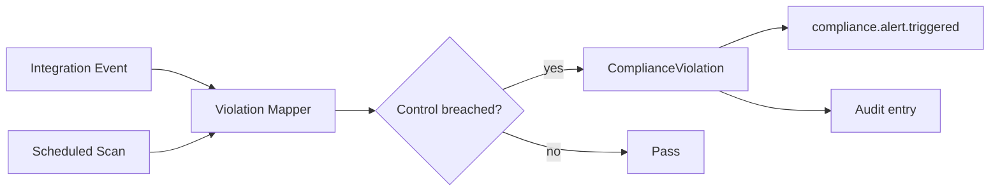

# Enterprise Compliance Framework — Marpich

**Status:** Canonical — unified compliance monitoring, violations, reports, and alerts  
**Audience:** Compliance officers, auditors, security, platform engineers, AI agents  
**Owner context:** `backend/contexts/compliance/`  
**Companions:** [ENTERPRISE_AUDIT_PLATFORM.md](ENTERPRISE_AUDIT_PLATFORM.md) · [ENTERPRISE_POLICY_ENGINE.md](ENTERPRISE_POLICY_ENGINE.md) · [ENTERPRISE_DOCUMENT_EXCHANGE.md](ENTERPRISE_DOCUMENT_EXCHANGE.md) · [SECURITY_STANDARD.md](SECURITY_STANDARD.md) · [INDUSTRY_CATALOG.md](INDUSTRY_CATALOG.md)

**Law: Compliance is continuous — monitor every domain, detect violations, alert immediately, report on demand. Modules never implement local compliance engines.**

---

## Platform position



---

## The law

```
Support:
  Internal Policies · Financial Compliance · Tax Compliance
  Educational Compliance · Healthcare Compliance · Document Compliance
  Security Compliance · Audit Compliance · Data Privacy · Retention Policies

Generate:
  Compliance Reports · Compliance Dashboard
  Compliance Violations · Compliance Alerts
```

**Compliance Framework orchestrates — it does not replace Audit, Policy, or Document services.**

| Platform service | Compliance role |
|------------------|-----------------|
| **Policy Engine** | Internal + industry business rules |
| **Audit Platform** | Immutable evidence trail |
| **Document Exchange** | Document lifecycle + retention |
| **Security Standard** | Access controls + encryption |
| **Compliance Framework** | Control mapping, violation detection, scoring, alerts, reports |

---

## Compliance domains

Catalog: [`compliance/COMPLIANCE_DOMAIN_CATALOG.yaml`](compliance/COMPLIANCE_DOMAIN_CATALOG.yaml)

| Domain | Frameworks | Primary signals |
|--------|------------|-----------------|
| **Internal policies** | Corporate governance | Policy Engine evaluations, policy publish gaps |
| **Financial compliance** | SOX, IFRS | Journal posting, segregation of duties, audit severity |
| **Tax compliance** | VAT/GST, withholding | Tax policy evaluation, filing deadlines |
| **Educational compliance** | FERPA | Student record access audit, grade publish controls |
| **Healthcare compliance** | HIPAA | PHI access audit, break-glass without reason |
| **Document compliance** | Records management | Retention applied, legal hold, unsigned contracts |
| **Security compliance** | ISO 27001, SOC-2 | Access denied spikes, MFA gaps, failed logins |
| **Audit compliance** | SOX, GDPR audit trail | Audit coverage gaps, export integrity |
| **Data privacy** | GDPR, CCPA | Consent, erasure requests, cross-border transfer |
| **Retention policies** | Legal hold, industry retention | Audit + document retention enforcement |

---

## Control registry

Each **compliance control** maps a requirement to automated checks:

```yaml
control:
  id: HIPAA-164.312-b
  domain: healthcare_compliance
  name: Audit controls for PHI access
  severity: critical
  check_type: event_pattern
  pattern: hospital.patient.accessed
  required_fields: [actor_id, reason]
  violation_if: missing_field(reason) on break_glass
```

Controls are tenant-scoped and seeded from industry pack — see catalog.

---

## Violation detection



### Automatic violation triggers

| Event | Domain | Violation |
|-------|--------|-----------|
| `authorization.access.denied` (threshold) | security_compliance | Excessive access denials |
| `policy.evaluation.denied` | internal_policies | No active policy for required key |
| `audit.retention.applied` without legal hold check | retention_policies | Premature purge risk |
| `documents.document.downloaded` without audit | document_compliance | Undocumented download |
| `hospital.patient.accessed` missing `reason` | healthcare_compliance | HIPAA break-glass gap |
| `university.student.record.accessed` | educational_compliance | FERPA access without role |
| `finance.journal.posted` by non-finance role | financial_compliance | SOX segregation |

Schema: [`compliance/VIOLATION_SCHEMA.v1.json`](compliance/VIOLATION_SCHEMA.v1.json)

### Violation record

```json
{
  "id": "uuid",
  "tenant_id": "acme",
  "domain": "healthcare_compliance",
  "control_id": "HIPAA-164.312-b",
  "severity": "critical",
  "status": "open",
  "title": "PHI access without documented reason",
  "description": "Break-glass patient view missing reason field",
  "source_event": "hospital.patient.accessed",
  "correlation_id": "corr-uuid",
  "detected_at": "2026-07-03T10:00:00Z",
  "resolved_at": null,
  "resolution_notes": null
}
```

---

## Compliance alerts

Alerts route through [ENTERPRISE_NOTIFICATION_PLATFORM.md](ENTERPRISE_NOTIFICATION_PLATFORM.md).

| Severity | Channel | SLA |
|----------|---------|-----|
| `critical` | email + in-app + optional SMS | Immediate |
| `high` | email + in-app | 1 hour |
| `medium` | in-app | 24 hours |
| `low` | dashboard only | Weekly digest |

```
POST violation detected
→ compliance.violation.detected
→ compliance.alert.triggered
→ notifications (compliance officer role)
```

**Rule:** No module-local compliance email — always via Notification Platform.

---

## Compliance dashboard

Definition: [`compliance/COMPLIANCE_DASHBOARD.v1.yaml`](compliance/COMPLIANCE_DASHBOARD.v1.yaml)

```
GET /api/v1/compliance/dashboard
```

| Widget | Data |
|--------|------|
| Overall compliance score | Weighted pass rate across controls |
| Open violations by domain | Bar chart |
| Critical alerts (24h) | Count + list |
| Domain heatmap | 10 compliance domains status |
| Retention compliance | Audit + document retention on track |
| Policy coverage | Required policies active vs missing |
| Recent reports | Last 5 generated reports |

---

## Compliance reports

```
POST /api/v1/compliance/reports
{
  "report_type": "full|domain|audit|retention",
  "domain": "healthcare_compliance",
  "date_from": "2026-01-01",
  "date_to": "2026-06-30",
  "format": "pdf|json|csv"
}
→ compliance.report.generated
```

| Report type | Contents |
|-------------|----------|
| **full** | All domains, controls, violations, score |
| **domain** | Single domain deep dive |
| **audit** | Audit coverage + export integrity summary |
| **retention** | Retention policy adherence + legal holds |

Reports pull evidence from Audit exports and violation store — signed PDF for regulators (planned).

---

## Retention policies (compliance view)

Retention is **enforced** by Audit + Document Exchange; Compliance **monitors**:

| Layer | Owner | Compliance check |
|-------|-------|------------------|
| Audit logs | Audit `RetentionPolicy` | Purge without legal hold → violation |
| Documents | Document Exchange retention | Expired without archive → violation |
| Personal data | Data privacy controls | Erasure not completed → violation |

```
GET /api/v1/compliance/retention/status
→ audit retention, document retention, open legal holds
```

---

## Data privacy

| Control | Mechanism |
|---------|-----------|
| Consent tracking | `privacy.consent.recorded` event |
| Right to erasure | Workflow + audit trail |
| Data minimization | Policy Engine field masks |
| Cross-border | Tenant region + policy block |
| Breach notification | Violation → critical alert → 72h workflow |

Domain: `data_privacy` in compliance catalog.

---

## REST API — `/api/v1/compliance`

| Method | Path | Permission | Description |
|--------|------|------------|-------------|
| GET | `/domains` | `compliance.read` | List compliance domains |
| GET | `/controls` | `compliance.read` | List controls (filter domain) |
| GET | `/violations` | `compliance.violations.read` | Query violations |
| GET | `/violations/{id}` | `compliance.violations.read` | Violation detail |
| POST | `/violations/{id}/resolve` | `compliance.violations.write` | Resolve with notes |
| GET | `/dashboard` | `compliance.dashboard.read` | Dashboard data |
| GET | `/alerts` | `compliance.alerts.read` | Active alerts summary |
| POST | `/reports` | `compliance.reports.write` | Generate report |
| GET | `/reports/{id}` | `compliance.reports.read` | Report status/download |
| GET | `/retention/status` | `compliance.retention.read` | Retention compliance view |

---

## Event integration

### Subscribed

| Event | Action |
|-------|--------|
| `*` (filtered) | Evaluate violation rules |
| `platform.tenant.provisioned` | Seed domain controls from industry pack |
| `policy.evaluation.denied` | Internal policy violation |
| `authorization.access.denied` | Security compliance counter |
| `audit.retention.applied` | Retention compliance check |
| `documents.document.archived` | Document compliance pass signal |

### Published

| Event | Subscribers |
|-------|-------------|
| `compliance.violation.detected` | audit, analytics, notifications |
| `compliance.alert.triggered` | notifications |
| `compliance.report.generated` | notifications, documents |

---

## Module integration

### Required

1. Publish auditable integration events for regulated actions
2. Use Policy Engine for business rules — never hardcode
3. Declare compliance domain in `context.yaml`
4. Never implement local violation stores or compliance dashboards

```yaml
# context.yaml
compliance:
  domains:
    - healthcare_compliance
  required_controls:
    - HIPAA-164.312-b
```

### Forbidden

```python
# ❌ FORBIDDEN
class LocalComplianceViolation(Model): ...
if is_hipaa_violation(): send_email(...)  # local alert

# ✅ ALLOWED
# Events flow to Compliance Framework automatically
# Resolve via POST /compliance/violations/{id}/resolve
```

---

## Implementation status

| Area | Today | Target |
|------|-------|--------|
| Compliance bounded context | ✅ | `contexts/compliance/` |
| Control registry + seeding | ✅ | Industry pack controls |
| Violation detection | ✅ partial | Full catalog coverage |
| Dashboard API | ✅ | UI widgets |
| Report generation | ✅ partial | Signed PDF export |
| Alert routing | ✅ | Notification integration |
| Retention monitoring | ✅ partial | Legal hold integration |
| Scheduled compliance scans | 📋 | Cron worker |
| Regulator signed reports | 📋 | Document Exchange |

Legend: ✅ implemented · ⚠️ partial · 📋 designed

---

## Module checklist

```markdown
## Compliance checklist

- [ ] context.yaml lists compliance domains
- [ ] Regulated actions publish integration events
- [ ] Policy Engine used for business rules
- [ ] No local compliance violation tables
- [ ] No local compliance alerting
- [ ] Audit events include required fields for controls
```

---

## Enforcement

| Mechanism | Location |
|-----------|----------|
| This document | `docs/architecture/ENTERPRISE_COMPLIANCE_FRAMEWORK.md` |
| Domain catalog | `docs/architecture/compliance/COMPLIANCE_DOMAIN_CATALOG.yaml` |
| Dashboard | `docs/architecture/compliance/COMPLIANCE_DASHBOARD.v1.yaml` |
| Violation schema | `docs/architecture/compliance/VIOLATION_SCHEMA.v1.json` |
| Context | `backend/contexts/compliance/` |
| ADR | ADR-045 |
| Cursor rule | `.cursor/rules/marpich-compliance-framework.mdc` |

---

## Related

| Document | Role |
|----------|------|
| [ENTERPRISE_AUDIT_PLATFORM.md](ENTERPRISE_AUDIT_PLATFORM.md) | Evidence trail |
| [ENTERPRISE_POLICY_ENGINE.md](ENTERPRISE_POLICY_ENGINE.md) | Internal + industry rules |
| [ENTERPRISE_DOCUMENT_EXCHANGE.md](ENTERPRISE_DOCUMENT_EXCHANGE.md) | Document + retention |
| [SECURITY_STANDARD.md](SECURITY_STANDARD.md) | Security controls |
| [ENTERPRISE_NOTIFICATION_PLATFORM.md](ENTERPRISE_NOTIFICATION_PLATFORM.md) | Alert delivery |
