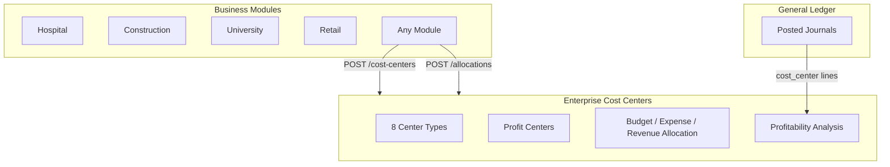

# Enterprise Cost Centers — Marpich

**Status:** Canonical — unified cost/profit center management for all business modules  
**Audience:** CFO, FP&A, platform engineers, module authors, AI agents  
**Owner context:** `backend/contexts/financial_kernel/` (Cost Centers Engine)  
**Companions:** [ENTERPRISE_FINANCIAL_KERNEL.md](ENTERPRISE_FINANCIAL_KERNEL.md) · [ENTERPRISE_GENERAL_LEDGER.md](ENTERPRISE_GENERAL_LEDGER.md) · [financial_kernel/COST_CENTER_CATALOG.yaml](financial_kernel/COST_CENTER_CATALOG.yaml)

**Law: All modules assign cost/profit centers through Financial Kernel. Never duplicate dimension or allocation logic.**

---

## Platform position



---

## Center types

| Type | Key | Example |
|---|---|---|
| Department | `department` | Finance Dept |
| Project | `project` | Highway Phase 2 |
| Branch | `branch` | Downtown Branch |
| Faculty | `faculty` | Engineering Faculty |
| Hospital Ward | `hospital_ward` | ICU |
| Construction Site | `construction_site` | Site A |
| Warehouse | `warehouse` | Central DC |
| Business Unit | `business_unit` | Retail Division |

---

## Capabilities

| Capability | Description |
|---|---|
| **Profit Center** | Revenue attribution unit linked to business units |
| **Budget Allocation** | Planned spend per cost center |
| **Expense Allocation** | Distribute actual costs across centers |
| **Revenue Allocation** | Attribute revenue to centers |
| **Split Allocation** | Weighted split across multiple centers |
| **Profitability Analysis** | Revenue − expenses per center from posted journals |

---

## API

Prefix: `/api/v1/financial-kernel/cost-centers`

| Method | Path | Description |
|---|---|---|
| POST | `/` | Create cost center |
| GET | `/` | List cost centers (filter by `center_type`) |
| GET | `/{id}` | Cost center detail |
| POST | `/profit-centers` | Create profit center |
| GET | `/profit-centers/list` | List profit centers |
| POST | `/allocations` | Create allocation |
| POST | `/allocations/split` | Split allocation across centers |
| GET | `/allocations/list` | List allocations |
| GET | `/profitability` | Profitability analysis |

---

## Profitability example

```
GET /api/v1/financial-kernel/cost-centers/profitability?cost_center_code=ER

{
  "cost_center_code": "ER",
  "revenue": 500,
  "expenses": 200,
  "profit": 300,
  "margin_percent": 60,
  "budget_allocated": 1000
}
```

---

## Integration events

- `financial_kernel.cost_center.created`
- `financial_kernel.profit_center.created`
- `financial_kernel.allocation.created`

---

## Relationship to GL

Journal lines carry `cost_center` and `profit_center` codes. Profitability analysis aggregates posted journal lines by account type (revenue/expense) per center.
