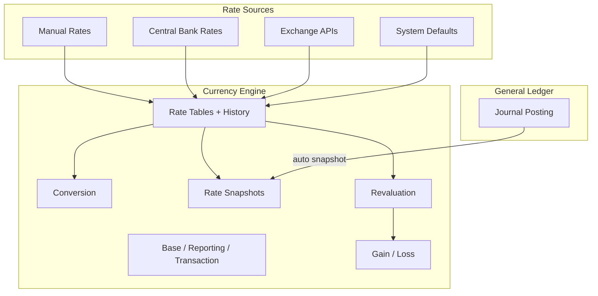

# Enterprise Currency Engine — Marpich

**Status:** Canonical — multi-currency foundation with immutable rate snapshots  
**Audience:** CFO, treasury, platform engineers, module authors, AI agents  
**Owner context:** `backend/contexts/financial_kernel/`  
**Companions:** [ENTERPRISE_FINANCIAL_KERNEL.md](ENTERPRISE_FINANCIAL_KERNEL.md) · [ENTERPRISE_GENERAL_LEDGER.md](ENTERPRISE_GENERAL_LEDGER.md) · [financial_kernel/CURRENCY_CATALOG.yaml](financial_kernel/CURRENCY_CATALOG.yaml)

**Law: Every financial transaction stores an exchange rate snapshot. Never hardcode conversion rates in module code.**

---

## Platform position



---

## Capabilities

| Capability | Description |
|---|---|
| **Unlimited currencies** | Tenant enables any ISO 4217 code |
| **Base currency** | Functional currency for GL balances |
| **Reporting currency** | Consolidation / group reporting currency |
| **Transaction currency** | Currency on each journal (`currency` field) |
| **Historical rates** | Dated rate table with effective_date |
| **Spot rates** | Current market rates via exchange API |
| **Average rates** | Period-average rate type |
| **Manual rates** | User-entered overrides (highest priority) |
| **Central bank rates** | Statutory reference rates (Fed, ECB, CBI) |
| **Exchange APIs** | Auto-fetch via `POST /rates/fetch` |
| **Automatic updates** | `auto_update_enabled` on tenant config |
| **Currency gain/loss** | `GET /gain-loss` report |
| **Revaluation** | `POST /revaluation` with balance input |
| **Exchange history** | `GET /rates/history` |

---

## Rate resolution priority

1. Manual
2. Central bank
3. Spot (exchange API)
4. Average
5. Historical

Same currency pair → rate `1.0` (system).

---

## Rate snapshot on every transaction

When a journal is posted, the engine:

1. Resolves transaction → base and transaction → reporting rates
2. Creates immutable `ExchangeRateSnapshot`
3. Attaches `rate_snapshot_id` to journal
4. Enriches lines with `base_debit`, `base_credit`, `reporting_debit`, `reporting_credit`

```json
{
  "rate_snapshot_id": "uuid",
  "transaction_currency": "EUR",
  "base_currency": "USD",
  "reporting_currency": "USD",
  "transaction_to_base_rate": 1.1,
  "rate_type": "spot",
  "rate_source": "exchange_api"
}
```

---

## API

Prefix: `/api/v1/financial-kernel/currency`

| Method | Path | Description |
|---|---|---|
| GET | `/config` | Base + reporting currency settings |
| PUT | `/config` | Update currency configuration |
| GET | `/currencies` | Enabled currencies |
| POST | `/currencies` | Add currency |
| GET | `/rates` | Current rate table |
| GET | `/rates/history` | Exchange rate history |
| POST | `/rates/manual` | Create manual rate |
| POST | `/rates/central-bank` | Import central bank rates |
| POST | `/rates/fetch` | Auto-update from exchange API |
| POST | `/convert` | Convert amount with resolved rate |
| GET | `/snapshots` | All transaction rate snapshots |
| POST | `/revaluation` | Run currency revaluation |
| GET | `/gain-loss` | Gain/loss summary |

Legacy compat: `POST /api/v1/financial-kernel/currency/convert` (kernel router) delegates to same engine.

---

## Module integration

```python
# Convert before posting
converted = await kernel.convert_currency(
    tenant_id, amount="1000", from_currency="EUR", to_currency="USD"
)

# Post journal — snapshot created automatically
await kernel.post_journal(
    tenant_id=tenant_id,
    currency="EUR",
    base_currency="USD",
    lines=[...],
)
# journal.rate_snapshot_id is set; lines have base_debit/base_credit
```

Resolve accounts by `account_key` (COA); resolve rates by currency engine — never hardcode.

---

## Events

| Event | When |
|---|---|
| `financial_kernel.currency.rates.updated` | Central bank import or API fetch |
| `financial_kernel.currency.revaluation.completed` | Revaluation run finished |
| `financial_kernel.journal.posted` | Includes rate snapshot reference |

---

## ADR

See [ADR-052](../adr/052-enterprise-currency-engine.md).
