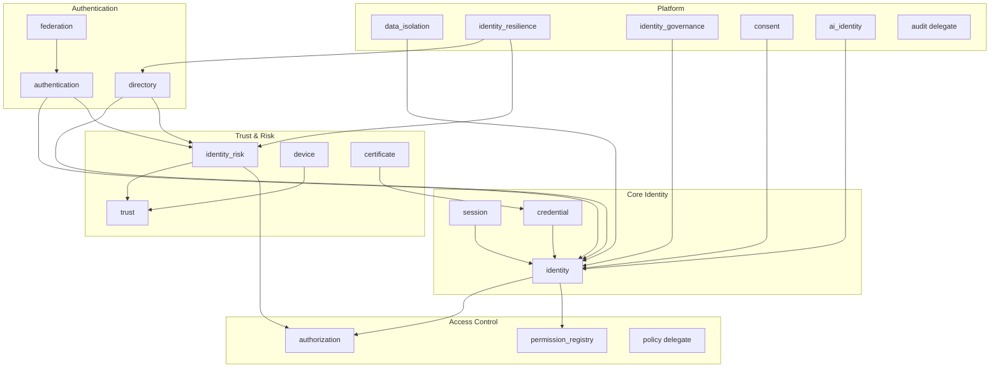
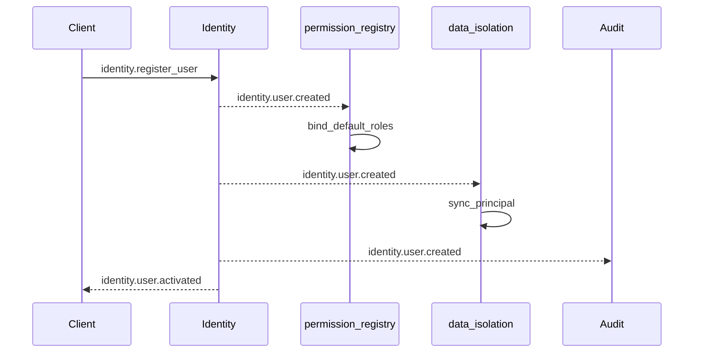
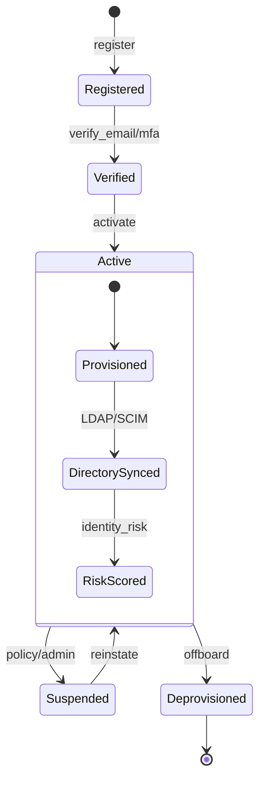

# Enterprise Digital Identity Fabric (EIF)

**Version:** 1.0  
**Status:** Architecture Blueprint  
**Chief Identity Architect**  
**Aligns with:** ADR-009, ADR-036, ADR-161, ADR-182–190, MEIAAP P1–P8  

---

## Executive Summary

The **Enterprise Digital Identity Fabric (EIF)** is Marpich's authoritative identity platform for every **human, organization, application, device, service, and AI agent** across 12+ industry verticals. EIF extends the implemented **MEIAAP** foundation (Phases P1–P8) into a policy-driven, event-sourced, multi-region identity control plane.

**North star:** No domain module hardcodes identity logic. All authentication, authorization, provisioning, risk, and lifecycle decisions flow through EIF contexts governed by the Policy Engine.

---

## 1. Mission & Business Objectives

### 1.1 Vision

> *One fabric, every identity, every industry — policy-governed, explainable, and resilient by design.*

EIF unifies identity across Marpich ERP modules (Banking, Tax, Treasury, Hospital, Municipality, etc.) and external federation (OIDC, SAML, LDAP, Azure AD) under a single tenant-scoped principal model with PostgreSQL RLS defense-in-depth.

### 1.2 Strategic Objectives

| Objective | Measure |
|-----------|---------|
| **Single source of identity** | 0 duplicate user stores in domain modules |
| **Policy-driven control** | 100% authn/authz via Policy Engine + PDP |
| **Regulatory readiness** | Audit trail 7 years; consent tracking; SoD |
| **Zero Trust** | Continuous risk scoring + step-up authentication |
| **Multi-industry** | Vertical packs configure EIF without code forks |
| **AI-native** | AI agents registered as first-class principals |

### 1.3 Industry Support Matrix

| Industry | Principal Types | Federation | Risk Profile | Lifecycle |
|----------|----------------|------------|--------------|-----------|
| **Banking** | Customer, employee, API service | OIDC, mTLS | High — AML, device trust | KYC-linked activation |
| **Islamic Banking** | Same + Sharia auditor | SAML | Dual-control SoD | Segregated duties |
| **Currency Exchange** | Teller, customer, remittance agent | LDAP, AD | Real-time transaction risk | Shift-based sessions |
| **Government** | Civil servant, citizen | PIV/CAC, SAML | Nation-state threat model | Clearance levels |
| **University** | Student, faculty, staff | Shibboleth SAML | Low–medium | Term-based deprovision |
| **Hospital** | Clinician, patient, device | OIDC, SMART on FHIR | HIPAA — break-glass | Consent-gated access |
| **Construction** | Contractor, inspector | LDAP | Medium — temp access | Project-scoped expiry |
| **Manufacturing** | Operator, OT device | Certificate | OT/IT segmentation | Device certificates |
| **Retail** | Associate, POS terminal | OIDC | Fraud — velocity checks | Store-scoped RBAC |
| **Insurance** | Agent, policyholder | OIDC, SCIM | Delegation graph | Policy-bound access |
| **Real Estate** | Broker, client | OIDC | Relationship graph | Listing-scoped |
| **NGO** | Volunteer, donor | Email/password | Minimal PII | Volunteer term limits |

Each vertical ships an **Industry Identity Pack** — a policy bundle (`industry.{vertical}.*` keys) applied at tenant provisioning. No EIF code changes per industry.

---

## 2. Domain-Driven Design

### 2.1 Context Map (C4 Level 1)

```mermaid
C4Context
  title EIF — System Context
  Person(user, "Human User")
  Person(admin, "Identity Admin")
  Person(ai, "AI Agent")
  System(eif, "Enterprise Digital Identity Fabric")
  System_Ext(idp, "External IdP (Azure AD, Okta)")
  System_Ext(ldap, "LDAP / Active Directory")
  System(banking, "Banking Module")
  System(hospital, "Hospital Module")
  System(gateway, "Enterprise API Gateway")

  user --> eif : Authenticates
  admin --> eif : Manages identity
  ai --> eif : Agent principal
  idp --> eif : Federation
  ldap --> eif : Directory sync
  banking --> gateway : API calls
  hospital --> gateway : API calls
  gateway --> eif : AuthN/AuthZ/Risk
  eif --> banking : identity.* events
```

### 2.2 Bounded Contexts (16)



| Context | API | Schema | Status |
|---------|-----|--------|--------|
| `identity` | `/api/v1/identity` | `identity` | ✅ Implemented |
| `authentication` | `/api/v1/authentication` | `authentication` | ✅ P4 |
| `authorization` | `/api/v1/authorization` | `authorization` | ✅ P1 |
| `permission_registry` | `/api/v1/permissions` | `permission_registry` | ✅ P2 |
| `directory` | `/api/v1/directory` | `directory` | ✅ P6 |
| `federation` | `/api/v1/federation` | `federation` | 🔜 P9 (extract) |
| `credential` | `/api/v1/credentials` | `credential` | 🔜 P10 |
| `trust` | `/api/v1/trust` | `trust` | 🔜 P11 (extends P7) |
| `session` | `/api/v1/sessions` | `session_mgmt` | 🔜 P10 |
| `consent` | `/api/v1/consent` | `consent` | 🔜 P11 |
| `device` | `/api/v1/devices` | `device` | 🔜 P11 |
| `certificate` | `/api/v1/certificates` | `certificate` | 🔜 P12 |
| `ai_identity` | `/api/v1/ai-identity` | `ai_identity` | 🔜 P13 |
| `data_isolation` | `/api/v1/data-isolation` | `identity` | ✅ P5 |
| `identity_governance` | `/api/v1/identity-governance` | `identity_governance` | ✅ ADR-161 |
| `identity_resilience` | `/api/v1/identity-resilience` | `identity_resilience` | ✅ P8 |

### 2.3 Aggregate Catalog (per Context)

#### Identity (`identity`)

| Aggregate | Entities | Value Objects | Domain Events |
|-----------|----------|---------------|---------------|
| `User` | — | `Email`, `TenantId`, `UserStatus` | `identity.user.created`, `.verified`, `.suspended`, `.deprovisioned` |
| `Role` | — | `RoleCode`, `PermissionSet` | `identity.role.created`, `.assigned` |
| `Organization` | `Department` | `IndustryPack`, `OrgRef` | `identity.organization.created` |
| `Tenant` | — | `TenantSlug`, `TenantProfile` | `platform.tenant.provisioned` |

**Repositories:** `IUserRepository`, `IRoleRepository`, `IOrganizationRepository`  
**Domain Services:** `SessionPolicy`, `PasswordPolicy`, `MfaEnrollment`

#### Authentication (`authentication`) — P4

| Aggregate | Key Fields | Events |
|-----------|------------|--------|
| `AuthenticationProfile` | policy flags per tenant | — |
| `WebAuthnCredential` | credential_id, public_key, sign_count | `authentication.passkey.registered` |
| `OidcProvider` | issuer, client_id | `authentication.oidc.provider.registered` |

#### Authorization (`authorization`) — P1

| Aggregate | Key Fields | Events |
|-----------|------------|--------|
| `AuthorizationProfile` | rbac/abac/pbac flags | — |
| `AbacPolicy` | conditions, effect | — |
| `AccessDecision` | principal, resource, action, decision | `authorization.access.granted/denied` |

**Domain Service:** `AuthorizationEngine` — evaluation order: deny → RBAC → ABAC → PBAC → default_deny

#### Directory (`directory`) — P6

| Aggregate | Events |
|-----------|--------|
| `SamlProvider`, `LdapConnector`, `ScimProvider`, `DirectorySyncJob` | `directory.sync.completed`, `integration.directory.synced` |

#### Trust / Risk (`identity_risk`) — P7

| Aggregate | Events |
|-----------|--------|
| `RiskProfile`, `RiskSignal`, `RiskScore`, `AnomalyAlert` | `identity_risk.score.computed`, `.step_up.recommended` |

#### Credential (`credential`) — Planned

| Aggregate | Events |
|-----------|--------|
| `ApiClient`, `ServiceAccount`, `SecretRotation` | `credential.client.created`, `.secret.rotated`, `.revoked` |

#### Session (`session`) — Planned

| Aggregate | Events |
|-----------|--------|
| `Session`, `RefreshToken`, `StepUpChallenge` | `session.created`, `.revoked`, `.step_up.completed` |

#### Device (`device`) — Planned

| Aggregate | Events |
|-----------|--------|
| `Device`, `DeviceTrustProfile` | `device.registered`, `device.trust.changed` |

#### AI Identity (`ai_identity`) — Planned

| Aggregate | Events |
|-----------|--------|
| `AiAgent`, `AgentCapability`, `AgentDelegation` | `ai_identity.agent.registered`, `.delegation.granted` |

---

## 3. Database Design

### 3.1 Schema Overview

```
identity/          — users, roles, permissions, principals, organizations, departments, identity_graph, audit_log
authorization/     — access_decisions (partitioned), abac_policies
authentication/    — webauthn_credentials, oidc_providers (P9 migration)
directory/         — saml_providers, ldap_connectors, scim_providers, sync_jobs (P9)
federation/        — identity_providers (unified IdP registry)
credential/        — api_clients, service_accounts
session_mgmt/      — sessions (partitioned)
device/            — devices
certificate/       — certificates
trust/             — trust_scores (partitioned)
consent/           — consent_records
ai_identity/       — agents
```

### 3.2 Migrations

| Migration | Content |
|-----------|---------|
| `002_identity_full.sql` | Core users, roles, sessions |
| `003_contexts.sql` | Tenant normalization |
| `016_identity_rls_principals.sql` | RLS + HASH principals + access_decisions |
| `017_eif_fabric_schema.sql` | Organizations, graph, devices, credentials, federation, consent, AI agents |

### 3.3 Row-Level Security

All tenant-scoped tables enforce:

```sql
CREATE POLICY tenant_isolation ON {schema}.{table}
  USING (tenant_id = identity.current_tenant_id());
```

Session variable `app.tenant_id` set by `TenantRlsMiddleware` from `X-Tenant-ID` + JWT validation.

### 3.3 Identity Graph

`identity.identity_graph_edges` models relationships:

| `relationship_type` | Example |
|---------------------|---------|
| `manages` | Manager → Employee |
| `delegates_to` | Insurance agent → Policyholder |
| `member_of` | User → Department |
| `owns` | Organization → ApiClient |
| `trusts` | Device → User |

Graph queries power ABAC (`subject.manages.resource.owner`) and AI access review recommendations.

---

## 4. API Contracts

### 4.1 Protocol Matrix

| Protocol | Gateway Path | Use Case |
|----------|--------------|----------|
| **REST** | `/api/v1/{context}/*` | Primary — all EIF contexts |
| **OpenAPI 3.1** | `/api/openapi.json` | Contract generation, SDK |
| **SCIM 2.0** | `/api/v1/directory/scim/v2/*` | Inbound provisioning (Okta, Azure AD) |
| **GraphQL** | `/graphql/v1/identity` | Admin portal, identity graph queries |
| **gRPC** | `identity.v1.IdentityService` | Service-to-service PDP (low latency) |
| **WebSocket** | `/ws/v1/sessions` | Real-time session revoke, step-up prompts |

### 4.2 REST Surface (Implemented + Planned)

```
# Core
GET    /api/v1/identity/users/me
POST   /api/v1/auth/login | /register | /refresh

# Authorization PDP (P1)
POST   /api/v1/authorization/check
POST   /api/v1/authorization/check/batch
POST   /api/v1/authorization/simulate

# Permissions (P2)
GET    /api/v1/permissions/catalog
GET    /api/v1/permissions/principals/{id}/resolve

# Authentication (P4)
POST   /api/v1/authentication/webauthn/login/options
POST   /api/v1/authentication/federation/oidc/callback

# Directory (P6)
POST   /api/v1/directory/federation/saml/acs
POST   /api/v1/directory/scim/v2/Users
POST   /api/v1/directory/ldap/sync

# Risk (P7)
POST   /api/v1/identity-risk/evaluate
GET    /api/v1/identity-risk/alerts

# Resilience (P8)
POST   /api/v1/identity-resilience/failover
POST   /api/v1/identity-resilience/health-check

# Planned P9–P13
POST   /api/v1/sessions/{id}/step-up
POST   /api/v1/credentials/clients
POST   /api/v1/devices/register
POST   /api/v1/certificates/verify
POST   /api/v1/consent/grant
POST   /api/v1/ai-identity/agents
```

### 4.3 gRPC Service (Planned)

```protobuf
service IdentityService {
  rpc CheckAccess(CheckAccessRequest) returns (CheckAccessResponse);
  rpc ResolvePrincipal(ResolvePrincipalRequest) returns (Principal);
  rpc EvaluateRisk(EvaluateRiskRequest) returns (RiskScore);
  rpc RevokeSession(RevokeSessionRequest) returns (google.protobuf.Empty);
}
```

### 4.4 GraphQL Schema (Excerpt)

```graphql
type Query {
  me: User
  principal(id: ID!): Principal
  identityGraph(from: ID!, depth: Int = 2): [GraphEdge!]!
  accessDecisions(filter: DecisionFilter): [AccessDecision!]!
}

type Mutation {
  grantConsent(input: ConsentInput!): ConsentRecord
  registerDevice(input: DeviceInput!): Device
}
```

---

## 5. Event Architecture

See `docs/architecture/identity/EIF_EVENT_CATALOG.yaml` for full catalog.

### 5.1 Principles

- **Commands** mutate state via application services; published to `marpich.identity.commands`
- **Events** are immutable facts; published via **Outbox → Kafka**
- **Idempotent consumers** keyed by `(tenant_id, event_id, consumer_id)`
- **DLQ** `marpich.identity.dlq` for poison messages
- **Versioning:** additive evolution; breaking changes → new event name suffix

### 5.2 Saga: Identity Registration



---

## 6. Identity Lifecycle Workflows



| Stage | Trigger | EIF Contexts | Policy Keys |
|-------|---------|--------------|-------------|
| **Registration** | Self-serve or admin | `identity` | `identity.registration.enabled` |
| **Verification** | Email, MFA, KYC | `identity`, `authentication` | `identity.verification.required` |
| **Activation** | Policy pass | `identity`, `permission_registry` | `identity.activation.auto` |
| **Provisioning** | Directory sync | `directory`, `data_isolation` | `directory.sync.auto_provision` |
| **Suspension** | Risk/admin | `identity`, `session` | `identity.suspension.risk_threshold` |
| **Recovery** | Password reset, MFA | `authentication`, `identity_risk` | `identity.recovery.mfa_required` |
| **Deprovisioning** | HR offboard, SCIM delete | Saga: session → credential → directory → identity | `identity.deprovision.cascade` |

---

## 7. Security Architecture

### 7.1 Zero Trust Model

```
Request → Gateway (tenant + JWT) → Risk Evaluation → PDP Check → Domain API
              ↓                         ↓                ↓
         identity_resilience      identity_risk    authorization
              ↓                         ↓
         session context          step_up if needed
```

### 7.2 Authentication Methods (Policy-Gated)

| Method | Context | Policy Key |
|--------|---------|------------|
| Password + MFA | `identity` | `authentication.password.enabled` |
| WebAuthn / Passkeys | `authentication` | `authentication.webauthn.enabled` |
| OIDC | `authentication` | `authentication.oidc.enabled` |
| SAML | `directory` | `directory.saml.enabled` |
| LDAP bind | `directory` | `directory.ldap.enabled` |
| Certificate (mTLS) | `certificate` | `certificate.auth.enabled` |
| API Client credentials | `credential` | `credential.client.enabled` |

### 7.3 Authorization Models

| Model | Implementation | When |
|-------|----------------|------|
| **RBAC** | `permission_registry` + `authorization` | Default — role → permissions |
| **ABAC** | `authorization.AbacPolicy` | Attribute conditions (department, clearance) |
| **PBAC** | Delegates to `policy` engine | Business rules per vertical |
| **Risk-Based** | `identity_risk` → step-up | Score > `identity_risk.step_up.threshold` |
| **Device Trust** | `device` → `trust` | Untrusted device → deny/step-up |

### 7.4 Session Security

- Refresh token rotation on every use
- Absolute + idle timeout from policy (`session.absolute_ttl`, `session.idle_ttl`)
- Concurrent session limits per tenant
- Immediate revoke propagation via WebSocket + Redis pub/sub
- IP binding optional per industry pack

---

## 8. AI Integration

### 8.1 AI Identity Assistant

| Capability | Context | Output |
|------------|---------|--------|
| Identity Risk Prediction | `identity_risk` | Explainable score + factors |
| Step-Up Recommendation | `identity_risk` | `identity_risk.step_up.recommended` |
| Access Review Assistant | `ai_identity` + `identity_governance` | Certification suggestions |
| Anomaly Detection | `identity_risk` | `identity_risk.anomaly.detected` |
| AI Agent Registry | `ai_identity` | Agent principals with capability bounds |

**Constraints:** `autonomous_execution: false` — AI recommends; humans or policy approve.

### 8.2 Explainability Contract

Every AI IAM output includes:

```json
{
  "score": 75,
  "risk_level": "high",
  "factors": [{"factor": "auth_method", "weight": 20, "value": "saml"}],
  "explanation": "Human-readable rationale",
  "explainable": true,
  "evidence": { "events": [], "policies": [] }
}
```

---

## 9. Frontend Architecture

### 9.1 Stack

| Layer | Technology |
|-------|------------|
| Framework | Next.js 15 (App Router) |
| UI | React 19, Tailwind CSS |
| Auth | `@marpich/auth-provider` (P3) |
| State | `useAuth`, `usePermission`, `useAuthorization` |
| i18n | `@marpich/localization` — RTL/LTR |
| Theme | CSS variables — dark mode |

### 9.2 Identity Admin Surfaces

| Route | Purpose |
|-------|---------|
| `/login` | Centralized login + passkey + federation redirect |
| `/identity/users` | User lifecycle management |
| `/identity/roles` | RBAC role editor |
| `/identity/federation` | IdP registry |
| `/identity/risk` | Risk dashboard + alerts |
| `/identity/resilience` | Multi-region HA status |
| `/identity/governance` | Access reviews, SoD |

### 9.3 Accessibility

- WCAG 2.1 AA for login and MFA flows
- Keyboard-navigable passkey registration
- Screen reader labels on all auth forms
- `prefers-reduced-motion` respected

---

## 10. Testing Strategy

| Tier | Scope | Tooling |
|------|-------|---------|
| **Unit** | Domain engines, scoring, PDP evaluation | pytest |
| **Integration** | API smoke per context | httpx + FastAPI TestClient |
| **Contract** | Event JSON Schema, OpenAPI diff | jsonschema, schemathesis |
| **Performance** | PDP 1000 rps, directory sync 10k users | k6, locust |
| **Security** | OWASP ZAP, SAML signature bypass | CI pipeline |
| **Chaos** | Kill directory leader pod, verify failover < 60s | Litmus/K6 |

**Current:** 47 IAM integration tests passing (MEIAAP P1–P8).

---

## 11. DevSecOps

```mermaid
flowchart LR
  subgraph CI["GitHub Actions"]
    Lint --> Test --> Contract --> Build
  end
  subgraph CD["Deployment"]
    Build --> Docker --> Helm --> K8s
  end
  subgraph Observability
    K8s --> OTel --> Grafana
    K8s --> Prometheus
  end
  subgraph Secrets
    Vault --> JWT Keys
    Vault --> IdP Secrets
  end
```

| Component | Implementation |
|-----------|----------------|
| **Docker** | `marpich-iam` multi-stage image per context group |
| **Kubernetes** | Helm chart `charts/marpich-iam` — HPA on PDP |
| **Terraform** | RDS Postgres + RLS, ElastiCache Redis, MSK Kafka |
| **Secrets** | Vault KV — JWT signing, OIDC client secrets, SCIM tokens |
| **Monitoring** | Prometheus metrics: `eif_pdp_latency`, `eif_risk_scores`, `eif_failover_total` |
| **Tracing** | OpenTelemetry — correlation_id from gateway through PDP |

---

## 12. Documentation Index

| Artifact | Path |
|----------|------|
| **This blueprint** | `docs/architecture/ENTERPRISE_DIGITAL_IDENTITY_FABRIC.md` |
| **ADR-190** | `docs/adr/190-enterprise-digital-identity-fabric.md` |
| **MEIAAP ADRs** | `docs/adr/182` – `189` |
| **Event catalog** | `docs/architecture/identity/EIF_EVENT_CATALOG.yaml` |
| **Acceptance checklist** | `docs/architecture/identity/EIF_ACCEPTANCE_CHECKLIST.md` |
| **PostgreSQL schema** | `infrastructure/docker/migrations/017_eif_fabric_schema.sql` |
| **Gateway routes** | `backend/core/gateway/route_registry.yaml` |
| **Security standard** | `docs/architecture/SECURITY_STANDARD.md` |

### Runbooks (Planned)

| Runbook | Scenario |
|---------|----------|
| `RB-IAM-001` | Directory sync failure |
| `RB-IAM-002` | SAML IdP certificate rotation |
| `RB-IAM-003` | Regional failover execution |
| `RB-IAM-004` | Mass session revocation |
| `RB-IAM-005` | Risk score anomaly investigation |

---

## 13. Performance & High Availability

| Concern | Strategy |
|---------|----------|
| **Horizontal scaling** | Stateless PDP/auth pods behind gateway; HPA on CPU + request rate |
| **Caching** | Redis: session lookups, permission resolution (TTL from policy) |
| **Connection pooling** | PgBouncer transaction mode; `session_scope(tenant_id=)` per request |
| **Failover** | `identity_resilience` leader election; RPO < 60s, RTO < 5min |
| **Partitioning** | HASH principals by tenant; RANGE sessions/decisions by time |
| **Read replicas** | Postgres read replica for permission catalog + graph queries |

**Targets:**

| Endpoint | p99 Latency | Throughput |
|----------|-------------|------------|
| `POST /authorization/check` | < 50ms | 2,000 rps |
| `POST /authentication/webauthn/login/verify` | < 200ms | 500 rps |
| `POST /identity-risk/evaluate` | < 100ms | 1,000 rps |
| Directory sync (10k users) | < 5min | Background |

---

## 14. Localization & White Label

| Feature | Implementation |
|---------|----------------|
| **RTL/LTR** | `dir` attribute from `@marpich/localization`; Tailwind logical properties |
| **Locales** | en-US (default), fa-IR, ar-SA |
| **Calendars** | Gregorian + Jalali (fa-IR) via localization context |
| **White label** | Tenant `branding` in settings: logo, colors, login background |
| **Industry terminology** | i18n keys namespaced by pack: `banking.role.teller` vs `hospital.role.clinician` |

---

## 15. Acceptance Criteria

See **`docs/architecture/identity/EIF_ACCEPTANCE_CHECKLIST.md`** for the full measurable checklist.

### Summary Gates

| Gate | Status |
|------|--------|
| **G1 — MEIAAP (P1–P8)** | ✅ 12/12 criteria met |
| **G2 — EIF Persistence (P9–P10)** | 🔜 Migration 017 + Postgres adapters |
| **G3 — Production Security** | 🔜 SAML sig validation, mTLS, Vault |
| **G4 — Multi-Region Prod** | 🔜 P8 foundation in place |
| **G5 — Industry GA** | 🔜 3+ vertical packs |

---

## Appendix A — Policy Key Namespace

```
identity.*                    # Core lifecycle
authentication.*              # Auth methods (P4)
authorization.*               # PDP models (P1)
permissions.*                 # Registry (P2)
directory.*                   # SAML/LDAP/SCIM (P6)
identity_risk.*               # Risk scoring (P7)
identity_resilience.*         # HA (P8)
federation.*                  # Unified IdP (P9)
credential.*                  # API clients (P10)
session.*                     # Session policy (P10)
device.*                      # Device trust (P11)
certificate.*                 # mTLS (P12)
consent.*                     # GDPR/HIPAA (P11)
ai_identity.*                 # AI agents (P13)
industry.{vertical}.*         # Vertical packs
```

**Rule:** Domain modules NEVER check permissions directly. They call `POST /authorization/check` or use `@marpich/auth-provider` `useAuthorization()`.

---

## Appendix B — MEIAAP → EIF Roadmap

| Phase | Deliverable | Status |
|-------|-------------|--------|
| P1 | Authorization PDP | ✅ |
| P2 | Permission Registry | ✅ |
| P3 | `@marpich/auth-provider` | ✅ |
| P4 | WebAuthn + OIDC | ✅ |
| P5 | PostgreSQL RLS | ✅ |
| P6 | SAML/LDAP/SCIM | ✅ |
| P7 | AI Risk Scoring | ✅ |
| P8 | Multi-Region HA | ✅ |
| **P9** | Federation + Postgres persistence | 🔜 |
| **P10** | Session + Credential contexts | 🔜 |
| **P11** | Device Trust + Consent | 🔜 |
| **P12** | Certificate Auth + gRPC PDP | 🔜 |
| **P13** | AI Identity + GraphQL | 🔜 |
| **P14** | Industry packs (Banking, Hospital, Gov) | 🔜 |
| **P15** | Production hardening + Vault | 🔜 |
| **P16** | EIF GA sign-off | 🔜 |

---

*Document owner: Chief Identity Architect · Marpich ERP · 2026-07-13*
