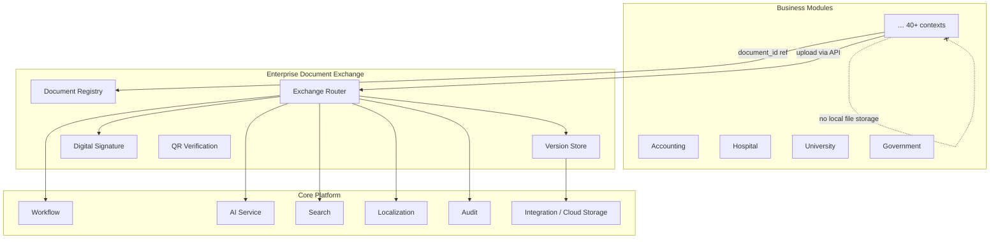
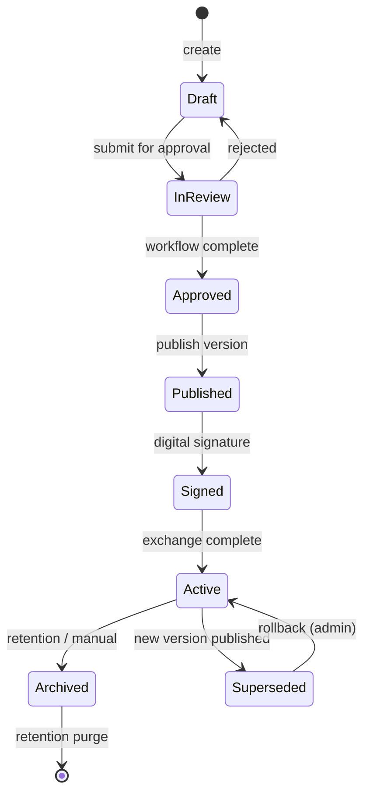
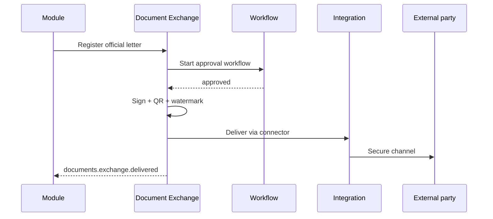
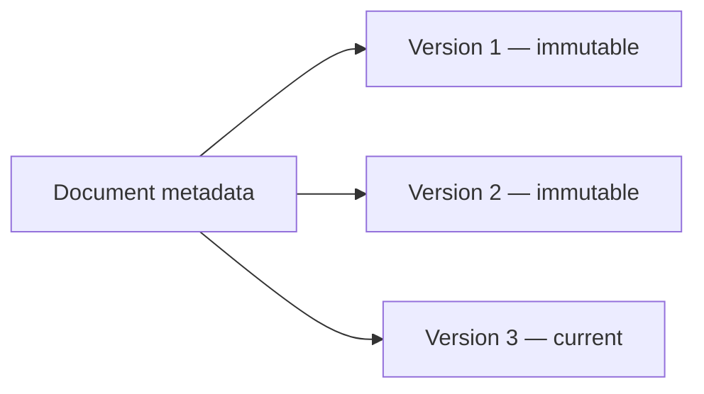
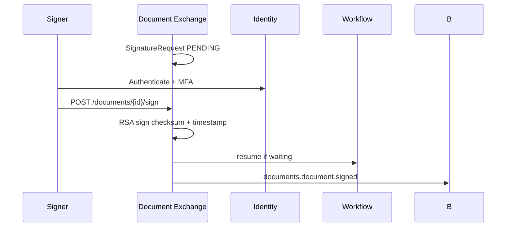
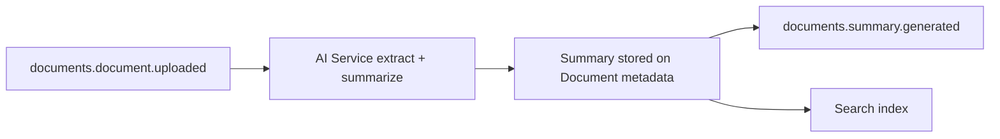
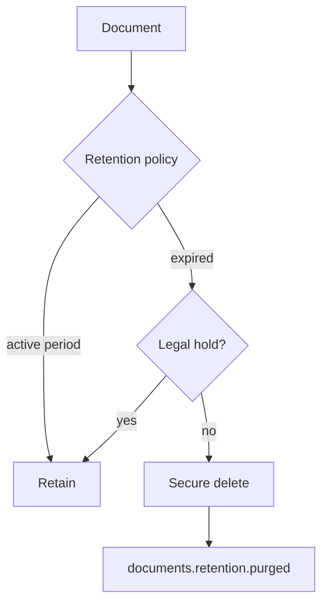

# Enterprise Document Exchange — Marpich

**Status:** Canonical — sole document management and exchange layer  
**Audience:** Product, platform engineers, module authors, compliance, AI agents  
**Owner context:** `backend/contexts/documents/` · `modules/platform/documents/`  
**Companions:** [ENTERPRISE_WORKFLOW_ENGINE.md](ENTERPRISE_WORKFLOW_ENGINE.md) · [ENTERPRISE_SEARCH_ENGINE.md](ENTERPRISE_SEARCH_ENGINE.md) · [AI_PLATFORM_STANDARD.md](AI_PLATFORM_STANDARD.md) · [INTEGRATION_PLATFORM.md](INTEGRATION_PLATFORM.md) · [SECURITY_STANDARD.md](SECURITY_STANDARD.md)

**Law: Business modules store document references only — never file blobs. All document lifecycle flows through Document Exchange.**

---

## Platform position



---

## The law

```
All documents live in Enterprise Document Exchange.

Supported document classes:
  Internal · Official Letters · Contracts · Invoices · Reports · Certificates
  Academic · Medical · Tax · Financial Statements

Every document supports:
  Versioning · Approval Workflow · Digital Signature · QR Verification
  Encryption · Watermark · Comments · History
  AI Summaries · Translation · OCR · Retention Policy

Modules reference document_id — never store files in domain tables.
```

---

## Document classes

Canonical catalog: [`documents/DOCUMENT_TYPES.yaml`](documents/DOCUMENT_TYPES.yaml)

| Class | Type key | Typical module | Compliance |
|-------|----------|----------------|------------|
| **Internal Documents** | `internal` | All modules | RBAC |
| **Official Letters** | `official_letter` | government, organization | Immutable after sign |
| **Contracts** | `contract` | sales, procurement, real_estate | Signature + retention |
| **Invoices** | `invoice` | accounting, finance | Tax archive period |
| **Reports** | `report` | analytics, reporting | Versioned snapshots |
| **Certificates** | `certificate` | university, school, hospital | QR verification |
| **Academic Documents** | `academic` | university, school | Transcript integrity |
| **Medical Documents** | `medical` | hospital, clinic, pharmacy | HIPAA-style encryption |
| **Tax Documents** | `tax` | tax, accounting | Legal retention |
| **Financial Statements** | `financial_statement` | finance, banking | Audit trail |

Each class defines default: workflow template, retention years, encryption tier, watermark policy.

---

## Cross-cutting capabilities

| Capability | Mechanism | Integration |
|------------|-----------|-------------|
| **Versioning** | Immutable `DocumentVersion` chain ✅ | `documents.version.created` |
| **Approval workflow** | Workflow Engine before publish | `documents.approval.requested` |
| **Digital signature** | `SignatureRequest` + RSA/AES ✅ partial | Workflow wait on sign |
| **QR verification** | Signed QR payload on certificate PDF | Public verify endpoint |
| **Encryption** | AES-256 at rest; tenant keys via Secrets | Column + object storage SSE |
| **Watermark** | Dynamic overlay on download/preview | Tenant branding config |
| **Comments** | Thread on document (not version body) | `DocumentComment` aggregate |
| **History** | Append-only audit trail | Audit + `DocumentHistory` |
| **AI summaries** | AI Service `{module}.summarize` | `documents.summary.generated` |
| **Translation** | Localization + AI translate | `documents.translation.completed` |
| **OCR** | AI `documents/extract` | Search index ingest |
| **Retention policy** | Scheduled purge / legal hold | `documents.retention.applied` |

---

## Document lifecycle



| Status | Meaning |
|--------|---------|
| `draft` | Editable, not yet approved |
| `in_review` | Workflow running |
| `approved` | Ready to publish |
| `published` | Current official version |
| `signed` | Legally signed |
| `archived` | Read-only, retention clock |
| `legal_hold` | Retention suspended |

---

## Exchange model

### Internal exchange

Documents shared within tenant — folders, permissions, module links.

```
Module creates invoice PDF → POST /documents (type=invoice)
→ Workflow approval → Sign → Module stores document_id on Invoice aggregate
```

### External exchange (official)

Outbound to partners, government, patients — via Integration Platform.



| Channel | Integration connector |
|---------|----------------------|
| Email attachment | `email_provider` |
| Government portal | `government_api` |
| Secure link | Signed URL + expiry |
| Cloud handoff | `cloud_storage` |

---

## Versioning



| Rule | Detail |
|------|--------|
| **Immutable versions** | Content never overwritten — new version only |
| **Checksum** | SHA-256 per version ✅ |
| **Pointer** | `Document.current_version_id` |
| **Download** | Specific version or current |
| **Compare** | Diff metadata between versions |
| **Rollback** | Publish previous version as new version number (audit event) |

---

## Approval workflow

Documents requiring approval **must** use Workflow Engine — not module-local state.

```yaml
# Trigger on submit
event: documents.approval.requested
workflow_key: documents.{document_type}.approval

# On workflow.process.completed
action: publish_version + documents.document.approved
```

| Document type | Default workflow |
|---------------|------------------|
| `contract` | Legal + manager parallel |
| `official_letter` | Director sequential |
| `invoice` | Finance approval |
| `medical` | Clinical reviewer |

See [ENTERPRISE_WORKFLOW_ENGINE.md](ENTERPRISE_WORKFLOW_ENGINE.md).

---

## Digital signature



| Element | Standard |
|---------|----------|
| Algorithm | RSA-SHA256 / tenant HSM |
| Multi-signer | Sequential or parallel config |
| Evidence | Signature certificate stored with version |
| Revocation | `documents.signature.revoked` + audit |

**Current:** simplified instant sign ✅ — target full multi-signer flow.

---

## QR verification

For certificates, diplomas, official letters — public authenticity check.

```
GET /api/v1/documents/verify/{qr_token}
→ { valid, document_id, version, issuer, signed_at, checksum }
```

| QR payload | Signed with tenant key |
|------------|------------------------|
| `document_id` | Yes |
| `version_number` | Yes |
| `checksum` | Yes |
| `tenant_id` | Yes |
| `expires_at` | Optional |

No authentication required for verify — read-only public endpoint.

---

## Encryption

| Layer | Method |
|-------|--------|
| **At rest** | AES-256-GCM — object storage + sensitive metadata |
| **In transit** | TLS 1.2+ |
| **Medical / tax** | Enhanced tier — field-level encryption |
| **Keys** | Secrets Service — per-tenant `secret_ref` |
| **Download** | Decrypt on authorized read only |

**Rule:** Plaintext content never in module databases — only in Document Exchange storage.

---

## Watermark

Applied on **preview** and **download** for sensitive classes:

| Type | Watermark |
|------|-----------|
| `medical` | Patient ID + timestamp + CONFIDENTIAL |
| `financial_statement` | Tenant name + user email |
| `internal` | DRAFT until published |
| `certificate` | None on final signed PDF |

Dynamic generation — does not mutate stored version; overlay at serve time.

---

## Comments

| Field | Purpose |
|-------|---------|
| `document_id` | Thread anchor |
| `version_id` | Optional — comment on specific version |
| `author_id` | User |
| `body` | Text (localized) |
| `created_at` | Timestamp |

```
POST /api/v1/documents/{id}/comments
GET  /api/v1/documents/{id}/comments
```

Comments do not change version checksum — separate aggregate `DocumentComment`.

---

## History

Append-only trail — every state transition:

| Event | Logged |
|-------|--------|
| Created | ✅ |
| Version added | ✅ `documents.version.created` |
| Downloaded | 📋 |
| Signed | ✅ |
| Archived | ✅ |
| Comment added | 📋 |
| Retention applied | 📋 |

```
GET /api/v1/documents/{id}/history
```

Dual write: `DocumentHistory` + Audit Service integration events.

---

## AI summaries



```
GET /api/v1/documents/{id}/summary?locale=fa-IR
POST /api/v1/documents/{id}/summarize  # trigger AI job
```

Permission: `documents.read` + AI tenant quota.

---

## Translation

| Step | Owner |
|------|-------|
| Source version | Document Exchange |
| Translate | Localization + AI Service |
| Store | New metadata field `translations.{locale}` or derived version |
| Event | `documents.translation.completed` |

User selects target locale — does not replace official signed version.

---

## OCR

| Stage | Owner |
|-------|-------|
| Upload PDF/image | Document Exchange |
| OCR extract | AI Service `POST /api/v1/ai/documents/extract` |
| Store text | `DocumentVersion.ocr_text` facet |
| Search | [ENTERPRISE_SEARCH_ENGINE.md](ENTERPRISE_SEARCH_ENGINE.md) |

Event: `documents.ocr.completed` → Search indexes `ocr_text`.

---

## Retention policy



| Class | Default retention |
|-------|-----------------|
| `tax` | 7–10 years (jurisdiction config) |
| `medical` | 10+ years |
| `contract` | Life + 7 years |
| `internal` | 3 years |
| `invoice` | 7 years |

Configured per tenant in Settings JSON Schema. Scheduler job evaluates daily.

---

## Security & permissions

| Permission | Scope |
|------------|-------|
| `documents.read` | View metadata + download |
| `documents.write` | Create, version, archive |
| `documents.sign` | Request / complete signature |
| `documents.folders.write` | Folder management |
| `documents.exchange.send` | External delivery |
| `documents.admin` | Legal hold, retention override |

Every download: JWT + tenant + permission + optional org scope.

---

## Module integration

### Correct pattern

```python
# domain aggregate — reference only
@dataclass
class Invoice:
    document_id: UniqueId | None  # points to Document Exchange

# application — register document
result = await documents_client.create(
    type="invoice",
    title=f"Invoice {number}",
    content=pdf_bytes,
    metadata={"invoice_id": str(invoice.id)},
)
invoice.attach_document(result.document_id)
```

### Forbidden

```python
# ❌ FORBIDDEN
invoice.pdf_content = base64_data  # blob in module table
open("/var/invoices/123.pdf").read()  # local file store in module
```

---

## REST API summary

Base: `/api/v1/documents`

| Method | Path | Status |
|--------|------|--------|
| GET | `/folders/root` | ✅ |
| POST | `/folders` | ✅ |
| GET | `/folders/{id}/contents` | ✅ |
| POST | `/documents` | ✅ |
| POST | `/documents/{id}/versions` | ✅ |
| GET | `/documents/{id}` | ✅ |
| GET | `/documents/{id}/download` | ✅ |
| POST | `/documents/{id}/sign` | ✅ |
| POST | `/documents/{id}/archive` | ✅ |
| GET | `/documents/{id}/history` | 📋 |
| POST | `/documents/{id}/comments` | 📋 |
| GET | `/documents/{id}/summary` | 📋 |
| POST | `/documents/{id}/translate` | 📋 |
| POST | `/documents/{id}/exchange` | 📋 external send |
| GET | `/verify/{qr_token}` | 📋 public QR |
| GET | `/documents/{id}/preview` | 📋 watermarked |

---

## Events

| Published | When |
|-----------|------|
| `documents.document.uploaded` | ✅ New document |
| `documents.version.created` | ✅ New version |
| `documents.document.signed` | ✅ Signature complete |
| `documents.document.archived` | ✅ Archived |
| `documents.approval.requested` | 📋 Submit for workflow |
| `documents.document.approved` | 📋 Workflow approved |
| `documents.summary.generated` | 📋 AI summary |
| `documents.ocr.completed` | 📋 OCR done |
| `documents.translation.completed` | 📋 |
| `documents.exchange.delivered` | 📋 External send |
| `documents.retention.purged` | 📋 Policy purge |

---

## Implementation status

| Area | Today | Target |
|------|-------|--------|
| Folders + documents | ✅ | + document type registry |
| Versioning + checksum | ✅ | Object storage (S3) |
| Signature (basic) | ✅ instant | Multi-signer + HSM |
| Archive | ✅ | Legal hold |
| Workflow integration | 📋 | Approval gates |
| QR verification | 📋 | Public verify API |
| Encryption at rest | 📋 | AES + Secrets |
| Watermark | 📋 | Serve-time overlay |
| Comments | 📋 | DocumentComment |
| History API | 📋 | Full audit trail |
| AI summary / OCR | 📋 | AI Service pipeline |
| Translation | 📋 | Localization |
| Retention scheduler | 📋 | Policy engine |
| External exchange | 📋 | Integration connectors |

---

## Module checklist

```markdown
## Document Exchange checklist

- [ ] Module stores document_id only — no file blobs
- [ ] Document type registered in DOCUMENT_TYPES.yaml
- [ ] Workflow template for approvals (if required)
- [ ] Retention class configured
- [ ] Sensitive types use encryption tier
- [ ] OCR/search via documents.document.uploaded event
- [ ] Permissions: documents.read / write / sign
```

---

## Enforcement

| Mechanism | Location |
|-----------|----------|
| This document | `docs/architecture/ENTERPRISE_DOCUMENT_EXCHANGE.md` |
| Document types | `docs/architecture/documents/DOCUMENT_TYPES.yaml` |
| Context | `backend/contexts/documents/` |
| ADR | ADR-041 |
| Cursor rule | `.cursor/rules/marpich-document-exchange.mdc` |

---

## Related

| Document | Role |
|----------|------|
| [ENTERPRISE_WORKFLOW_ENGINE.md](ENTERPRISE_WORKFLOW_ENGINE.md) | Approval + signature nodes |
| [ENTERPRISE_SEARCH_ENGINE.md](ENTERPRISE_SEARCH_ENGINE.md) | OCR + document search |
| [AI_PLATFORM_STANDARD.md](AI_PLATFORM_STANDARD.md) | OCR, summarize, translate |
| [INTEGRATION_PLATFORM.md](INTEGRATION_PLATFORM.md) | External delivery + cloud storage |
| [SECURITY_STANDARD.md](SECURITY_STANDARD.md) | Encryption, digital signature |
