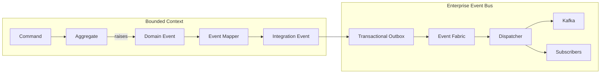
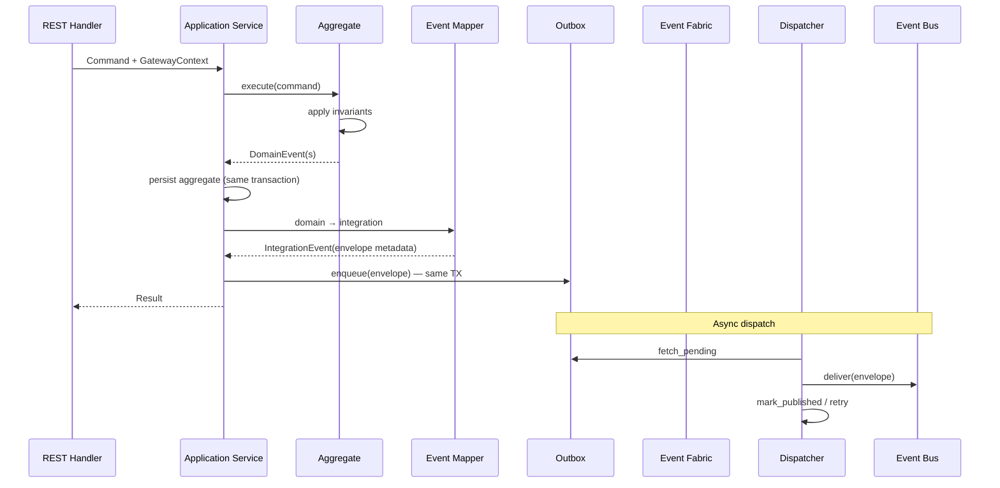
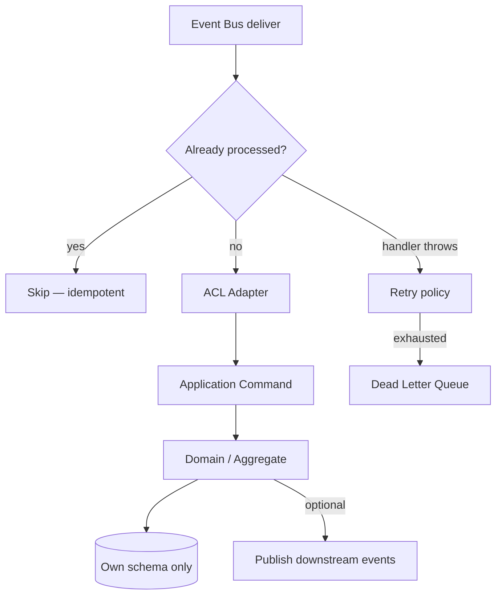
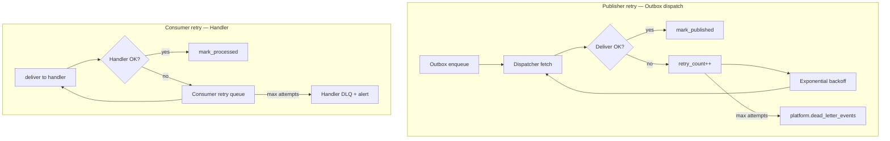
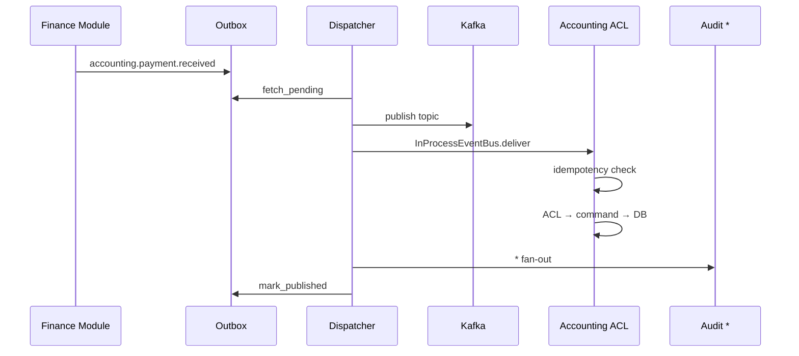

# Enterprise Event Bus — Marpich

**Status:** Canonical — all cross-module facts flow through the Event Bus  
**Audience:** Architects, module authors, integrators, AI agents  
**Implementation:** `backend/shared/infrastructure/messaging/` · `shared/domain/events/`  
**Companions:** [COMMUNICATION_ARCHITECTURE.md](COMMUNICATION_ARCHITECTURE.md) · [DOMAIN_EVENTS_CATALOG.md](DOMAIN_EVENTS_CATALOG.md) · [INTEGRATION_PLATFORM.md](INTEGRATION_PLATFORM.md) · [ADR-010](../adr/010-event-fabric.md)

**Law: Every business fact becomes a Domain Event. Published cross-context facts become Integration Events on the Enterprise Event Bus. Events are immutable.**

---

## Event model



| Layer | Scope | Type | Example |
|-------|-------|------|---------|
| **Domain Event** | Inside one module | Internal fact on aggregate | `InvoiceIssued` on `Invoice` aggregate |
| **Integration Event** | Cross-module published language | Versioned envelope on bus | `accounting.invoice.issued.v1` |
| **External webhook** | Partner systems | Integration Platform | Signed HTTP POST |

**Rule:** Domain events never cross context boundaries directly. Application layer maps domain → integration.

---

## The law

```
Every business event becomes a Domain Event.

Cross-context facts are published as Integration Events on the Enterprise Event Bus.

Every envelope MUST include:
  Tenant · Organization · Correlation ID · Timestamp · User · Security Context

Events are IMMUTABLE — append-only, no updates, no deletes.
Publish ONLY via EventFabric.publish() / publish_integration_event().
Subscribe ONLY via registered handlers + ACL.
```

---

## Business event examples

PascalCase (ubiquitous language) maps to Marpich integration event names:

| Business event (UL) | Integration event | Publisher | Typical subscribers |
|---------------------|-------------------|-----------|---------------------|
| **InvoiceCreated** | `accounting.invoice.issued` | accounting | crm, real_estate |
| **PaymentReceived** | `accounting.payment.received` | accounting | finance, real_estate |
| **StudentRegistered** | `university.student.enrolled` | university | identity, finance |
| **PatientAdmitted** | `hospital.admission.registered` | hospital | finance, notifications |
| **ExchangeCompleted** | `currency_exchange.deal.settled` | currency_exchange | treasury, finance |
| **TaxCalculated** | `tax.liability.calculated` | tax | accounting, finance |
| **EmployeeHired** | `human_resources.employee.hired` | human_resources | payroll, identity, projects |
| **PurchaseApproved** | `procurement.po.approved` | procurement | warehouse, inventory |
| **InventoryReserved** | `inventory.stock.reserved` | inventory | warehouse, sales |
| **ProjectCompleted** | `projects.milestone.reached` | projects | finance, ngo |

Full catalog: [DOMAIN_EVENTS_CATALOG.md](DOMAIN_EVENTS_CATALOG.md)

### Domain event (internal)

```python
# contexts/accounting/domain/events/invoice_issued.py
@dataclass(frozen=True, kw_only=True)
class InvoiceIssued(DomainEvent):
    invoice_id: UniqueId
    customer_id: UniqueId
    amount: Money

    @property
    def event_name(self) -> str:
        return "invoice.issued"  # local name — not on bus
```

### Integration event (published language)

```python
# contexts/accounting/domain/events/integration_events.py
@dataclass(frozen=True, kw_only=True)
class InvoiceIssuedIntegration(IntegrationEvent):
    invoice_id: UniqueId
    customer_id: UniqueId
    amount_cents: int
    currency: str

    @property
    def event_name(self) -> str:
        return "accounting.invoice.issued"

    @property
    def source_context(self) -> str:
        return "accounting"

    @property
    def event_version(self) -> int:
        return 1
```

---

## Event envelope — mandatory metadata

Every integration event envelope **must** include:

| Field | Key | Required | Description |
|-------|-----|----------|-------------|
| **Tenant** | `tenant_id` | Yes | Tenant slug — isolation boundary |
| **Organization** | `organization_id` | Yes* | Org unit within tenant (*null for platform-only) |
| **Correlation ID** | `correlation_id` | Yes | End-to-end trace / saga |
| **Timestamp** | `occurred_at` | Yes | ISO-8601 UTC — when fact occurred |
| **User** | `user_id` | Yes* | Actor who caused the fact (*null for system). Set via `actor_user_id` on event class |
| **Security Context** | `security_context` | Yes | Auth/session metadata at publish time |

Plus: `event_id`, `event_name`, `event_version`, `source_context`, `causation_id`, `payload`.

### Security context schema

```json
{
  "auth_method": "jwt",
  "ip_address": "203.0.113.10",
  "user_agent": "Marpich-Web/1.0",
  "scopes": ["accounting.invoice.write"],
  "session_id": "uuid-or-null"
}
```

| `auth_method` | When |
|---------------|------|
| `jwt` | User-initiated API command |
| `oauth2_client` | Service account |
| `system` | Background job / scheduler |
| `integration` | Inbound connector callback |

**Contract:** `docs/architecture/events/_envelope.v1.json`

### Immutability

| Rule | Enforcement |
|------|-------------|
| Events are **append-only** | No UPDATE/DELETE on outbox or event store |
| Dataclasses **`frozen=True`** | `DomainEvent`, `IntegrationEvent` |
| Corrections | Publish compensating event — never mutate original |
| Replay | Re-deliver same `event_id` — idempotent consumers |
| Audit | `event_id` + envelope hash stored immutably |

```python
# ❌ FORBIDDEN
event.payload["amount"] = 999  # mutable envelope

# ✅ ALLOWED — compensating event
await publish_integration_event(
    InvoiceVoidedIntegration(invoice_id=..., reason="correction", ...)
)
```

---

## Publisher architecture



### Publisher rules

| # | Rule |
|---|------|
| 1 | Aggregate raises **domain events** — application does not invent business facts |
| 2 | Map domain → integration in **application** or dedicated mapper |
| 3 | Populate envelope from **GatewayContext** — tenant, org, user, security_context, correlation_id |
| 4 | **Same database transaction** as aggregate persist → outbox enqueue |
| 5 | Publish via **`EventFabric.publish()`** only — never call subscribers |
| 6 | One integration event per published fact — no batching unlike payloads |
| 7 | Version bump on breaking payload change |

### Publisher entry points

```python
from shared.infrastructure.messaging.event_fabric import publish_integration_event

await publish_integration_event(
    InvoiceIssuedIntegration(
        tenant_id=TenantId.create(ctx.tenant_id),
        organization_id=ctx.organization_id,
        correlation_id=ctx.correlation_id,
        actor_user_id=ctx.user_id,
        security_context=ctx.security_context,
        causation_id=str(domain_event.event_id),
        invoice_id=invoice.id,
        ...
    )
)
```

### Code map

| Component | Path |
|-----------|------|
| Domain event base | `shared/domain/events/domain_event.py` |
| Integration event base | `shared/domain/events/integration_event.py` |
| Publish API | `shared/infrastructure/messaging/event_fabric.py` |
| Outbox | `shared/infrastructure/messaging/outbox_repository.py` |
| Dispatcher | `shared/infrastructure/messaging/dispatcher.py` |
| Kafka transport | `shared/infrastructure/messaging/kafka_transport.py` |

---

## Subscriber architecture



### Subscription registration

```python
# contexts/finance/container.py
from shared.infrastructure.messaging.event_bus import InProcessEventBus
from contexts.finance.infrastructure.acl.accounting_events import handle_invoice_issued

InProcessEventBus.subscribe("accounting.invoice.issued", handle_invoice_issued)
```

Also declared in `context.yaml`:

```yaml
subscribes:
  - accounting.invoice.issued
  - accounting.payment.received
```

### Subscriber rules

| # | Rule |
|---|------|
| 1 | Handlers in **`infrastructure/acl/`** — translate envelope → local command |
| 2 | **Idempotent** — safe under at-least-once delivery |
| 3 | **Never** import peer domain aggregates |
| 4 | **Never** write peer database |
| 5 | Mark processed **after** successful handler `(tenant_id, event_id, consumer_id)` |
| 6 | Side effects via **own** aggregates or outbound integration events |
| 7 | Wildcard `*` only for platform services (audit, search, integration webhooks) |

### ACL pattern

```
Integration Event Envelope
    → infrastructure/acl/{source}_events.py
    → Parse payload to value objects
    → Application Command
    → Use case → own DB
```

```python
async def handle_invoice_issued(envelope: dict) -> None:
    payload = envelope["payload"]
    await get_finance_service().record_receivable(
        RecordReceivableCommand(
            tenant_id=envelope["tenant_id"],
            invoice_id=payload["invoice_id"],
            correlation_id=envelope["correlation_id"],
        )
    )
```

### Idempotency ledger

| Key | Store |
|-----|-------|
| `(tenant_id, event_id, consumer_id)` | `platform.processed_events` |
| `consumer_id` | `{module}.{handler.__qualname__}` |

Implementation: `shared/infrastructure/messaging/idempotency.py`

---

## Retry mechanism

Two retry layers — **dispatch** (outbox → bus) and **consume** (handler failure).



### Dispatch retry (outbox)

| Setting | Default | Env |
|---------|---------|-----|
| Poll interval | 500 ms | `OUTBOX_POLL_INTERVAL_MS` |
| Batch size | 100 | `OUTBOX_BATCH_SIZE` |
| Max dispatch attempts | 10 | `OUTBOX_MAX_RETRIES` |
| Backoff | Exponential from 1s | `OUTBOX_RETRY_MULTIPLIER` |

On failure: `outbox.mark_failed()` increments `retry_count`, stores `last_error`. After max → `platform.dead_letter_events`.

### Consumer retry

| Setting | Default |
|---------|---------|
| Max handler attempts | 5 |
| Initial delay | 1s |
| Multiplier | 2.0 |
| Max delay | 5 min |

**Important:** Handler must be **idempotent** before retry — ledger marks processed only on success.

Non-retryable errors (validation, 403 semantics) → DLQ immediately without retry.

### Event bus modes

| Mode | Config | Use |
|------|--------|-----|
| `direct` | `EVENT_BUS_MODE=direct` | Dev, unit tests — in-process |
| `outbox` | `EVENT_BUS_MODE=outbox` | Production — durable + dispatcher |
| Kafka | `KAFKA_ENABLED=true` | Fan-out, external consumers |

Topic: `marpich.{event_name}.v{version}`

---

## End-to-end flow



---

## Monitoring

| Metric | Description |
|--------|-------------|
| `eventbus_publish_total` | Events enqueued |
| `eventbus_dispatch_total` | Successful dispatches |
| `eventbus_dispatch_failures_total` | Outbox failures |
| `eventbus_handler_duration_ms` | Consumer latency |
| `eventbus_dlq_depth` | Dead letter count |
| `eventbus_lag_seconds` | Outbox oldest unpublished |

| Event | When |
|-------|------|
| `platform.eventbus.dlq.enqueued` | Dispatch or handler DLQ |
| `audit.*` | Audit subscribes to `*` |

---

## Module checklist

```markdown
## Event checklist (new business fact)

### Domain
- [ ] Domain event on aggregate (frozen dataclass)
- [ ] Invariants enforced before event raised

### Integration
- [ ] Integration event class with event_name + version
- [ ] JSON schema in docs/architecture/events/
- [ ] Envelope: tenant, organization, correlation_id, occurred_at, user, security_context
- [ ] Contract test passes

### Publish
- [ ] Outbox enqueue in same transaction as persist
- [ ] publish_integration_event() only

### Subscribe (if consumer)
- [ ] ACL handler in infrastructure/acl/
- [ ] Registered in container.py + context.yaml
- [ ] Idempotent handler
- [ ] No peer domain imports
```

---

## Enforcement

| Mechanism | Location |
|-----------|----------|
| This document | `docs/architecture/ENTERPRISE_EVENT_BUS.md` |
| Event fabric | `shared/infrastructure/messaging/event_fabric.py` |
| Envelope contract | `docs/architecture/events/_envelope.v1.json` |
| Contract tests | `backend/tests/contracts/` |
| ADR | ADR-037 |
| Cursor rule | `.cursor/rules/marpich-event-bus.mdc` |

---

## Related

| Document | Role |
|----------|------|
| [ADR-010](../adr/010-event-fabric.md) | Outbox, idempotency, Kafka |
| [ADR-011](../adr/011-contract-tests.md) | Schema validation |
| [COMMUNICATION_ARCHITECTURE.md](COMMUNICATION_ARCHITECTURE.md) | Events as channel ③ |
| [INTEGRATION_PLATFORM.md](INTEGRATION_PLATFORM.md) | External webhooks |
| [ENTERPRISE_AUDIT_PLATFORM.md](ENTERPRISE_AUDIT_PLATFORM.md) | Audit consumes all events |
| [SERVICE_BOUNDARIES.md](SERVICE_BOUNDARIES.md) | Event ownership |
