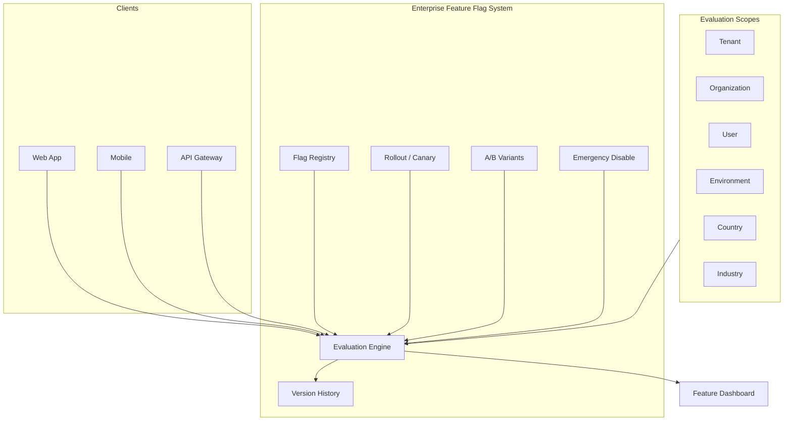

# Enterprise Feature Flag System — Marpich

**Status:** Canonical — multi-dimensional flags, rollout, A/B, canary, emergency kill  
**Audience:** Product, platform engineers, module authors, AI agents  
**Owner context:** `backend/contexts/feature_flags/`  
**Companions:** [CORE_PLATFORM.md](CORE_PLATFORM.md) · [API_GATEWAY_ARCHITECTURE.md](API_GATEWAY_ARCHITECTURE.md) · [ENTERPRISE_OBSERVABILITY_PLATFORM.md](ENTERPRISE_OBSERVABILITY_PLATFORM.md) · [SETTINGS context](CORE_PLATFORM.md)

**Law: Every feature gate reads from the Feature Flag System. No hardcoded `if env == prod` or local flag stores in modules.**

---

## Platform position



---

## The law

```
Support:
  Tenant · Organization · User · Environment · Country · Industry levels
  Feature Rollout · A/B Testing · Canary Deployment · Emergency Disable · Version Control

Generate Feature Dashboard.

Every module calls evaluate() — never local flag dictionaries.
```

**Settings `features` dict is legacy — new flags use Feature Flag System. Settings delegates reads for backward compatibility.**

---

## Evaluation scopes

Catalog: [`feature_flags/FLAG_CATALOG.yaml`](feature_flags/FLAG_CATALOG.yaml)

| Scope | Context field | Example |
|-------|---------------|---------|
| **Tenant** | `tenant_id` | Enable `saved_listings` for tenant acme |
| **Organization** | `organization_id` | Branch-specific POS mode |
| **User** | `user_id` | Beta tester access |
| **Environment** | `environment` | `development` · `staging` · `production` |
| **Country** | `country` | GDPR UI for `DE` |
| **Industry** | `industry_pack` | Hospital-only clinical AI |

Schema: [`feature_flags/FLAG_EVALUATION.v1.json`](feature_flags/FLAG_EVALUATION.v1.json)

---

## Evaluation priority

```
1. Emergency disable (global kill)     → OFF immediately
2. User override                       → on/off/variant
3. Organization override               → on/off/variant
4. Tenant override                     → on/off/variant
5. Country rule                        → match country code
6. Industry rule                       → match industry pack
7. Environment rule                    → match env
8. Canary rollout (percentage)       → consistent hash bucket
9. A/B test assignment                 → variant A/B/C
10. Default enabled                    → flag default
```

Consistent bucketing uses `hash(flag_key + user_id|tenant_id)` for stable A/B and canary.

---

## Flag definition

```yaml
flag:
  key: saved_listings
  name: Saved Listings
  version: 4
  default_enabled: false
  emergency_disabled: false

  tenant_rules:
    acme: true

  organization_rules:
    org-finance: false

  user_rules:
    user-beta-1: true

  environment_rules:
    development: true
    production: false

  country_rules:
    IR: true
    US: false

  industry_rules:
    hospital: true
    retail: false

  rollout:
    percentage: 25          # canary 25%
    stage: canary           # off | canary | full

  ab_test:
    enabled: true
    variants:
      - id: control
        weight: 50
      - id: treatment
        weight: 50

  metadata:
    owner: product-team
    ticket: LOK-1234
```

---

## Capabilities

### Feature rollout

Gradual enablement by percentage — `stage: canary` → increase → `full`.

```
POST /api/v1/feature-flags/{key}/rollout
{ "percentage": 50, "stage": "canary" }
→ feature_flag.rollout.updated
```

### A/B testing

Assign variant per user/tenant bucket. Track via analytics events.

```
POST /api/v1/feature-flags/{key}/ab-test
{ "variants": [{"id": "control", "weight": 50}, {"id": "treatment", "weight": 50}] }
```

Evaluate response includes `variant_id` when A/B active.

### Canary deployment

Rollout percentage + environment scope — e.g. 10% in `production`, 100% in `staging`.

### Emergency disable

Instant global kill — overrides all rules.

```
POST /api/v1/feature-flags/{key}/emergency-disable
{ "reason": "Checkout regression INC-4421" }
→ feature_flag.emergency_disabled
```

**Rule:** Emergency disable requires `feature_flags.admin` and is audited.

### Version control

Every mutation appends to immutable version history — rollback supported.

```
GET /api/v1/feature-flags/{key}/history
POST /api/v1/feature-flags/{key}/rollback
{ "target_version": 3 }
```

---

## Evaluation API

```
POST /api/v1/feature-flags/evaluate
{
  "flags": ["saved_listings", "multi_org"],
  "context": {
    "tenant_id": "acme",
    "organization_id": "org-1",
    "user_id": "user-uuid",
    "environment": "production",
    "country": "IR",
    "industry_pack": "hospital"
  }
}
```

Response:

```json
{
  "data": {
    "saved_listings": {
      "enabled": true,
      "variant_id": "treatment",
      "reason": "ab_test",
      "flag_version": 4
    },
    "multi_org": {
      "enabled": false,
      "variant_id": null,
      "reason": "emergency_disabled",
      "flag_version": 2
    }
  }
}
```

### Module integration

```python
# ✅ REQUIRED
flags = await feature_flags.evaluate(
    tenant_id=tenant_id,
    user_id=user_id,
    keys=["saved_listings"],
    context={"country": "IR", "industry_pack": "hospital"},
)
if flags["saved_listings"].enabled:
    ...

# ❌ FORBIDDEN
if os.getenv("ENABLE_SAVED_LISTINGS") == "1": ...
if settings.features.get("saved_listings"): ...  # use evaluate port
```

Port: `IFeatureFlagEvaluator` in `shared/application/ports/feature_flags.py`

---

## Feature dashboard

Definition: [`feature_flags/FEATURE_DASHBOARD.v1.yaml`](feature_flags/FEATURE_DASHBOARD.v1.yaml)

```
GET /api/v1/feature-flags/dashboard
```

| Widget | Data |
|--------|------|
| Total flags | Active registry count |
| Emergency disabled | Kill-switch flags |
| Canary in progress | Rollout stage = canary |
| A/B tests running | Active experiments |
| Flags by scope | Tenant/org/user/env/country/industry |
| Recent changes | Version history (24h) |
| Evaluation volume | OTel counter (planned) |

---

## REST API — `/api/v1/feature-flags`

| Method | Path | Permission | Description |
|--------|------|------------|-------------|
| GET | `/` | `feature_flags.read` | List flags |
| GET | `/{key}` | `feature_flags.read` | Flag detail + version |
| POST | `/` | `feature_flags.write` | Create flag |
| PATCH | `/{key}` | `feature_flags.write` | Update rules (new version) |
| POST | `/evaluate` | `feature_flags.evaluate` | Batch evaluate |
| POST | `/{key}/rollout` | `feature_flags.write` | Update rollout |
| POST | `/{key}/ab-test` | `feature_flags.write` | Configure A/B |
| POST | `/{key}/emergency-disable` | `feature_flags.admin` | Kill switch ON |
| POST | `/{key}/emergency-enable` | `feature_flags.admin` | Clear kill switch |
| GET | `/{key}/history` | `feature_flags.read` | Version history |
| POST | `/{key}/rollback` | `feature_flags.admin` | Rollback version |
| GET | `/dashboard` | `feature_flags.dashboard.read` | Dashboard data |

---

## Gateway integration

API Gateway evaluates `required_module` and route-level flags before upstream:

```yaml
# route_registry.yaml
- prefix: /api/v1/hospital
  required_flag: module.hospital.enabled
```

Gateway calls `POST /feature-flags/evaluate` with tenant + user context.

See [API_GATEWAY_ARCHITECTURE.md](API_GATEWAY_ARCHITECTURE.md).

---

## Events

| Event | When |
|-------|------|
| `feature_flag.created` | New flag registered |
| `feature_flag.updated` | Version incremented |
| `feature_flag.rollout.updated` | Canary/full change |
| `feature_flag.emergency_disabled` | Kill switch |
| `feature_flag.rollback.applied` | Version rollback |

Subscribers: audit, analytics, notifications (emergency disable).

---

## Default flags (tenant provision)

Seeded on `platform.tenant.provisioned`:

| Key | Default | Industry override |
|-----|---------|-------------------|
| `saved_listings` | false | — |
| `image_attachments` | true | — |
| `multi_org` | false | bank: true |
| `advanced_analytics` | false | hospital, bank, university: true |
| `module.{pack}.enabled` | true | Per activated module |

---

## Settings migration

| Legacy | Canonical |
|--------|-----------|
| `GET /settings/features` | `GET /feature-flags` (compat shim) |
| `PUT /settings/features/{key}` | `PATCH /feature-flags/{key}` |

Settings service may delegate to Feature Flag System — do not duplicate state.

---

## Module checklist

```markdown
## Feature flag checklist

- [ ] No os.getenv / hardcoded env feature gates
- [ ] evaluate() via IFeatureFlagEvaluator
- [ ] Flag keys registered in FLAG_CATALOG.yaml
- [ ] Emergency disable tested in runbook
- [ ] No local flag dict in module code
```

---

## Implementation status

| Area | Today | Target |
|------|-------|--------|
| Feature flags context | ✅ | `contexts/feature_flags/` |
| Multi-scope evaluation | ✅ | All 6 scopes |
| Rollout / canary | ✅ | Percentage buckets |
| A/B variants | ✅ | Weighted assignment |
| Emergency disable | ✅ | Admin + audit event |
| Version history + rollback | ✅ | Immutable versions |
| Feature dashboard API | ✅ | Dashboard widgets |
| Gateway flag check | 📋 | Route registry integration |
| Settings delegation | 📋 | Deprecate local dict |
| OTel evaluation metrics | 📋 | Observability |

---

## Enforcement

| Mechanism | Location |
|-----------|----------|
| This document | `docs/architecture/ENTERPRISE_FEATURE_FLAG_SYSTEM.md` |
| Catalog | `docs/architecture/feature_flags/FLAG_CATALOG.yaml` |
| Dashboard | `docs/architecture/feature_flags/FEATURE_DASHBOARD.v1.yaml` |
| Evaluation schema | `docs/architecture/feature_flags/FLAG_EVALUATION.v1.json` |
| Context | `backend/contexts/feature_flags/` |
| ADR | ADR-046 |
| Cursor rule | `.cursor/rules/marpich-feature-flags.mdc` |

---

## Related

| Document | Role |
|----------|------|
| [API_GATEWAY_ARCHITECTURE.md](API_GATEWAY_ARCHITECTURE.md) | Route-level flags |
| [ENTERPRISE_POLICY_ENGINE.md](ENTERPRISE_POLICY_ENGINE.md) | Business rules ≠ feature flags |
| [ENTERPRISE_OBSERVABILITY_PLATFORM.md](ENTERPRISE_OBSERVABILITY_PLATFORM.md) | Flag evaluation metrics |
| [CORE_PLATFORM.md](CORE_PLATFORM.md) | Settings service |

**Feature flags gate capability. Policy Engine gates business outcomes.**
