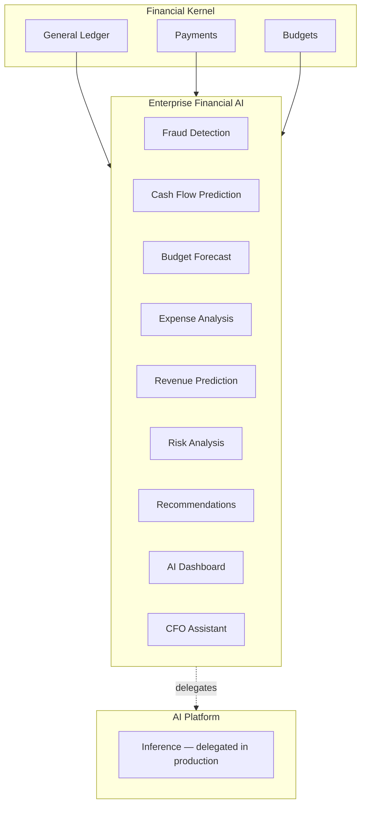

# Enterprise Financial AI — Marpich

**Status:** Canonical — AI-powered financial intelligence within Financial Kernel  
**Audience:** CFO, finance analysts, platform engineers, AI agents  
**Owner context:** `backend/contexts/financial_kernel/` (Financial AI Engine)  
**Companions:** [ENTERPRISE_FINANCIAL_KERNEL.md](ENTERPRISE_FINANCIAL_KERNEL.md) · [AI_PLATFORM_STANDARD.md](AI_PLATFORM_STANDARD.md) · [financial_kernel/AI_CATALOG.yaml](financial_kernel/AI_CATALOG.yaml)

**Law: Autonomous posting forbidden. AI suggests; humans approve.**

---

## Platform position

---

## Capabilities

| Capability | Description |
|---|---|
| **Fraud Detection** | Flags unusual payment amounts and chargeback patterns |
| **Cash Flow Prediction** | Projects net cash flow from posted journals |
| **Budget Forecast** | Utilization and overrun risk per budget line |
| **Expense Analysis** | Expense breakdown by cost center |
| **Revenue Prediction** | Historical revenue and forward forecast |
| **Financial Summary** | P&L summary from journals and payments |
| **Risk Analysis** | Aggregated payment, budget, and data risks |
| **Recommendation Engine** | Actionable recommendations from signals |
| **Invoice Classification** | Classify invoice type from text |
| **Document OCR** | Extract vendor, amount, description from text |
| **Financial Chatbot** | Conversational financial Q&A |
| **AI Dashboard** | KPI widgets, alerts, recommendations |
| **CFO Assistant** | Executive copilot with KPIs and recommended actions |

---

## API

Prefix: `/api/v1/financial-kernel/financial-ai`

| Method | Path | Description |
|---|---|---|
| GET | `/capabilities` | List all AI capabilities |
| GET | `/dashboard` | Generate AI dashboard |
| GET | `/jobs` | List analysis jobs |
| GET | `/jobs/{id}` | Get job result |
| POST | `/analyze/{capability}` | Run analysis job |
| POST | `/chat` | Financial chatbot |
| POST | `/cfo-assistant` | CFO executive assistant |
| POST | `/invoice/classify` | Invoice classification |
| POST | `/document/ocr` | Document OCR extraction |

---

## Integration events

- `financial_kernel.ai.analysis.completed`
- `financial_kernel.ai.dashboard.generated`
- `financial_kernel.ai.chat.completed`

---

## Permissions

| Permission | Scope |
|---|---|
| `financial_kernel.ai.read` | Capabilities, jobs |
| `financial_kernel.ai.analyze` | Analysis, classify, OCR |
| `financial_kernel.ai.chat` | Chatbot, CFO assistant |
| `financial_kernel.ai.dashboard` | AI dashboard |
