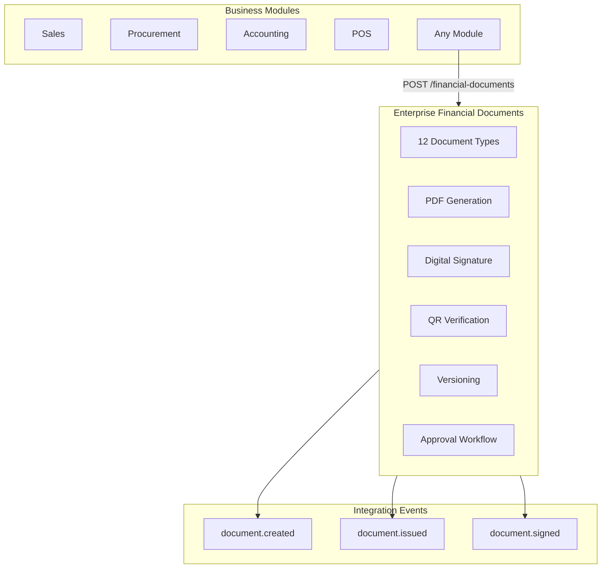

# Enterprise Financial Documents — Marpich

**Status:** Canonical — unified financial document generation for all business modules  
**Audience:** CFO, accounting ops, platform engineers, module authors, AI agents  
**Owner context:** `backend/contexts/financial_kernel/` (Financial Documents Engine)  
**Companions:** [ENTERPRISE_FINANCIAL_KERNEL.md](ENTERPRISE_FINANCIAL_KERNEL.md) · [ENTERPRISE_DOCUMENT_EXCHANGE.md](ENTERPRISE_DOCUMENT_EXCHANGE.md) · [financial_kernel/DOCUMENT_CATALOG.yaml](financial_kernel/DOCUMENT_CATALOG.yaml)

**Law: All modules generate financial documents through Financial Kernel. Never duplicate document numbering, PDF, or approval logic.**

---

## Platform position



---

## Document types

| Type | Key | Approval | QR |
|---|---|---|---|
| Invoice | `invoice` | No | Yes |
| Bill | `bill` | No | Yes |
| Voucher | `voucher` | No | — |
| Receipt | `receipt` | No | Yes |
| Payment Order | `payment_order` | Yes | — |
| Purchase Invoice | `purchase_invoice` | Yes | Yes |
| Sales Invoice | `sales_invoice` | Yes | Yes |
| Credit Note | `credit_note` | Yes | — |
| Debit Note | `debit_note` | Yes | — |
| Journal Voucher | `journal_voucher` | Yes | — |
| Cash Voucher | `cash_voucher` | Yes | — |
| Bank Voucher | `bank_voucher` | Yes | — |

---

## Capabilities

| Capability | Description |
|---|---|
| **PDF** | Auto-generated on create/version; `GET /{id}/pdf` |
| **Digital Signature** | HMAC-SHA256 stub (RS256); `POST /{id}/sign` |
| **QR Verification** | Signed token; `GET /verify/{token}` (public) |
| **Versioning** | Immutable versions with SHA-256 checksum |
| **Approval Workflow** | Request → complete; delegates to Workflow Engine |

---

## Document lifecycle

`draft` → `pending_approval` → `approved` → `signed` → `issued` | `voided`

Simple documents (receipt, bill, invoice) can issue directly from `draft`.

---

## API

Prefix: `/api/v1/financial-kernel/financial-documents`

| Method | Path | Description |
|---|---|---|
| POST | `/` | Create document (PDF + QR on create) |
| GET | `/` | List documents |
| GET | `/{id}` | Document detail with versions |
| GET | `/{id}/pdf` | Download PDF (base64) |
| POST | `/{id}/versions` | New immutable version |
| POST | `/{id}/approval` | Request approval workflow |
| POST | `/{id}/approval/complete` | Complete approval |
| POST | `/{id}/sign` | Apply digital signature |
| POST | `/{id}/issue` | Issue finalized document |
| POST | `/{id}/void` | Void document |
| GET | `/verify/{token}` | QR verification (no auth) |

---

## Create example

```json
POST /api/v1/financial-kernel/financial-documents
{
  "source_context": "sales",
  "source_document_id": "order-100",
  "document_type": "sales_invoice",
  "total_amount": 1500,
  "counterparty_name": "Acme Corp",
  "reference": "SI-100",
  "lines": [
    {"description": "Widget", "quantity": 10, "unit_price": 150}
  ]
}
```

---

## Integration events

- `financial_kernel.document.created`
- `financial_kernel.document.version.created`
- `financial_kernel.document.approval.requested`
- `financial_kernel.document.approved`
- `financial_kernel.document.signed`
- `financial_kernel.document.issued`

---

## Relationship to Document Exchange

Financial Kernel owns **financial document semantics** (numbering, amounts, approval, GL linkage).  
Enterprise Document Exchange (`contexts/documents/`) owns **file storage, retention, and general document classes**.  
Modules may store `financial_document_id` references; PDF blobs are versioned within the kernel.
