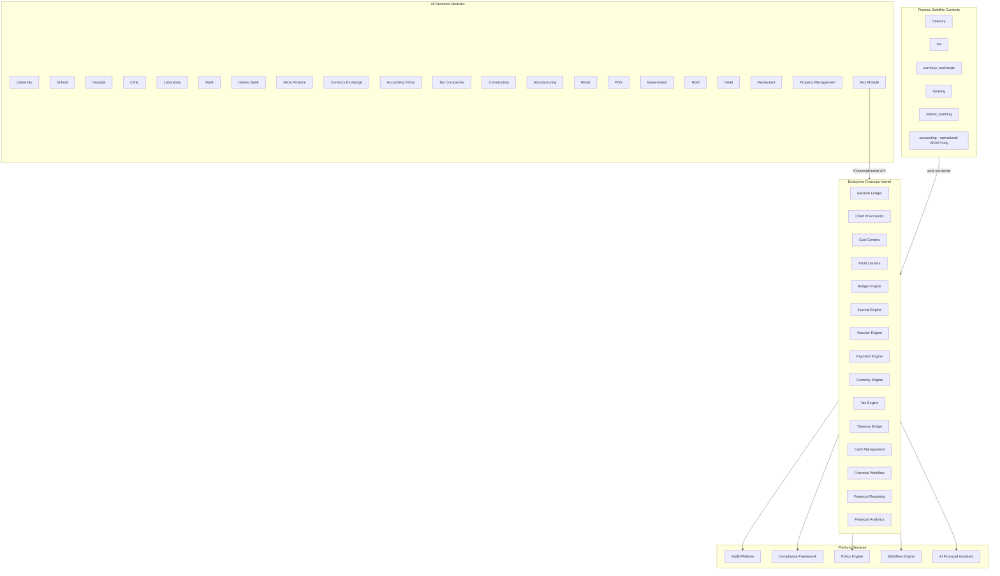
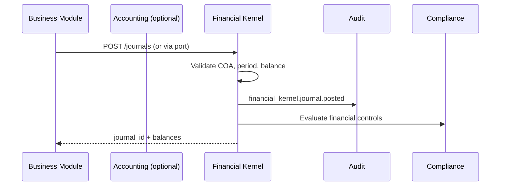

# Enterprise Financial Kernel — Marpich

**Status:** Canonical — single financial foundation for every business module  
**Audience:** Chief Financial Systems Architect, platform engineers, module authors, AI agents  
**Owner context:** `backend/contexts/financial_kernel/`  
**Companions:** [INDUSTRY_CATALOG.md](INDUSTRY_CATALOG.md) · [ENTERPRISE_AUDIT_PLATFORM.md](ENTERPRISE_AUDIT_PLATFORM.md) · [ENTERPRISE_COMPLIANCE_FRAMEWORK.md](ENTERPRISE_COMPLIANCE_FRAMEWORK.md) · [ENTERPRISE_POLICY_ENGINE.md](ENTERPRISE_POLICY_ENGINE.md) · [ENTERPRISE_WORKFLOW_ENGINE.md](ENTERPRISE_WORKFLOW_ENGINE.md) · [SHARED_KERNEL.md](SHARED_KERNEL.md)

**Law: This is NOT an Accounting Module. This is the financial foundation of the entire platform. Never duplicate financial logic. Every business module calls Financial Kernel APIs.**

---

## Platform position



---

## Financial Kernel vs Accounting Module

| Concern | Accounting Module (`accounting`) | Financial Kernel (`financial_kernel`) |
|---------|----------------------------------|--------------------------------------|
| **Role** | Operational billing, AR/AP documents | Platform financial foundation |
| **Owns** | `BillingEncounter`, `Invoice`, `VendorBill` | GL, COA, journals, vouchers, budgets |
| **Posting** | Emits posting **intent** | **Materializes** ledger entries |
| **Who calls** | Industry modules (hospital, sales) | **Every** business module |
| **Duplicate logic** | Forbidden — calls kernel | Single source of truth |

**Accounting is a consumer of Financial Kernel — not a replacement.**

---

## The law

```
This is NOT an Accounting Module.
This is the financial foundation of the entire platform.

Never duplicate financial logic.
Every module calls Financial Kernel APIs.

Provides:
  General Ledger · Chart of Accounts · Cost Centers · Profit Centers
  Budget · Treasury · Cash Management · Currency Engine · Exchange Rates
  Tax Engine · Payment Engine · Journal Engine · Voucher Engine
  Financial Workflow · Financial Reporting · Financial Analytics
  Audit · Compliance · AI Financial Assistant
```

---

## Supported industries

Catalog: [`financial_kernel/INDUSTRY_FINANCIAL_PACKS.yaml`](financial_kernel/INDUSTRY_FINANCIAL_PACKS.yaml)

| Industry | Pack ID | COA template | Specialized context |
|----------|---------|--------------|---------------------|
| University | `university` | `coa.education` | — |
| School | `school` | `coa.education` | — |
| Hospital | `hospital` | `coa.healthcare` | — |
| Clinic | `clinic` | `coa.healthcare` | — |
| Laboratory | `laboratory` | `coa.healthcare` | — |
| Bank | `bank` | `coa.banking` | `banking` |
| Islamic Bank | `islamic_bank` | `coa.islamic_banking` | `islamic_banking` |
| Micro Finance | `microfinance` | `coa.microfinance` | `banking` |
| Currency Exchange | `currency_exchange` | `coa.forex` | `currency_exchange` |
| Accounting Firms | `accounting_firm` | `coa.professional_services` | `accounting` |
| Tax Companies | `tax_consulting` | `coa.tax_services` | `tax` |
| Construction | `construction` | `coa.construction` | — |
| Manufacturing | `manufacturing` | `coa.manufacturing` | — |
| Retail | `retail` | `coa.retail` | — |
| POS | `pos` | `coa.retail` | `pos` |
| Government | `government` | `coa.government` | — |
| NGO | `ngo` | `coa.ngo` | — |
| Hotel | `hotel` | `coa.hospitality` | — |
| Restaurant | `restaurant` | `coa.hospitality` | — |
| Property Management | `real_estate` | `coa.real_estate` | — |

Seeded on `platform.tenant.provisioned` based on `industry_pack`.

---

## Kernel engines

Definition: [`financial_kernel/FINANCIAL_ENGINES.v1.yaml`](financial_kernel/FINANCIAL_ENGINES.v1.yaml)

| Engine | Responsibility | API surface |
|--------|----------------|-------------|
| **General Ledger** | Account balances, trial balance, period close | `GET /ledger/trial-balance` |
| **Chart of Accounts** | Account hierarchy, types, industry templates | `GET/POST /accounts` |
| **Cost Centers** | Cost allocation dimensions | `GET/POST /cost-centers` |
| **Profit Centers** | Revenue attribution dimensions | `GET/POST /profit-centers` |
| **Budget Engine** | Budget vs actual, approvals | `GET/POST /budgets` |
| **Journal Engine** | Double-entry posting, validation, idempotency | `POST /journals` |
| **Voucher Engine** | Grouped transactions, approval workflow | `POST /vouchers` |
| **Payment Engine** | Payment initiation, settlement, reconciliation | `POST /payments` |
| **Currency Engine** | Multi-currency amounts, conversion | `POST /currency/convert` |
| **Exchange Rates** | Rate tables, effective dates | `GET /exchange-rates` |
| **Tax Engine** | Tax calculation facade → `tax` context | `POST /tax/calculate` |
| **Treasury Bridge** | Cash positions facade → `treasury` context | `GET /treasury/positions` |
| **Cash Management** | Bank accounts, cash flow | `GET /cash/accounts` |
| **Financial Workflow** | Period close, approval chains | `POST /workflow/trigger` |
| **Financial Reporting** | P&L, balance sheet, cash flow | `GET /reports/{type}` |
| **Financial Analytics** | KPIs, trends, drill-down | `GET /analytics/dashboard` |

---

## Module integration pattern

**Every business module** posts financial facts through the kernel port — never local journals:

```python
from shared.application.ports.financial_kernel import IFinancialKernel

kernel = get_financial_kernel()
result = await kernel.post_journal(
    tenant_id=tenant_id,
    source_context="hospital",
    source_document_id=encounter_id,
    lines=[
        {"account_code": "4100", "debit": amount, "credit": 0, "cost_center": "ER"},
        {"account_code": "1200", "debit": 0, "credit": amount},
    ],
    currency="USD",
    correlation_id=correlation_id,
)
```

Port: `IFinancialKernel` in `shared/application/ports/financial_kernel.py`

### Forbidden in business modules

- Local `JournalEntry` aggregates
- Hardcoded account codes without COA lookup
- Direct balance updates
- Duplicate tax/currency/payment logic
- Skipping kernel for "simple" postings

---

## Event choreography



| Event | When |
|-------|------|
| `financial_kernel.coa.seeded` | Tenant provision |
| `financial_kernel.journal.posted` | Successful posting |
| `financial_kernel.voucher.approved` | Voucher workflow complete |
| `financial_kernel.period.closed` | Fiscal period close |
| `financial_kernel.payment.settled` | Payment engine settlement |
| `financial_kernel.budget.exceeded` | Budget threshold breach |

---

## Satellite context boundaries

Financial Kernel **orchestrates**; satellites **specialize**:

| Context | Owns | Delegates to kernel |
|---------|------|---------------------|
| `accounting` | Billing encounters, invoices, vendor bills | Journal posting |
| `banking` | Loans, cards, KYC, transfers | GL posting |
| `islamic_banking` | Murabaha, Ijara, Sukuk, Sharia review | GL posting (Islamic COA) |
| `treasury` | Cash positions, investments, hedges | Journal posting |
| `currency_exchange` | FX deals, vaults, compliance checks | Multi-currency posting |
| `tax` | Tax rules, returns, filings | Tax accrual posting |
| `payroll` | Payroll runs, payslips | Salary expense posting |
| `pos` | Terminals, shifts, sales | Sale revenue posting |

**Legacy `finance` context:** GL code migrates to `financial_kernel`. `finance` deprecated → budgets/reporting absorbed by kernel.

---

## REST API — `/api/v1/financial-kernel`

| Method | Path | Permission | Engine |
|--------|------|------------|--------|
| GET | `/accounts` | `financial_kernel.accounts.read` | COA |
| POST | `/accounts` | `financial_kernel.accounts.write` | COA |
| GET | `/cost-centers` | `financial_kernel.dimensions.read` | Cost Centers |
| GET | `/profit-centers` | `financial_kernel.dimensions.read` | Profit Centers |
| POST | `/journals` | `financial_kernel.journals.post` | Journal |
| GET | `/journals/{id}` | `financial_kernel.journals.read` | Journal |
| POST | `/vouchers` | `financial_kernel.vouchers.write` | Voucher |
| POST | `/vouchers/{id}/approve` | `financial_kernel.vouchers.approve` | Voucher + Workflow |
| POST | `/payments` | `financial_kernel.payments.write` | Payment |
| GET | `/exchange-rates` | `financial_kernel.currency.read` | Exchange Rates |
| POST | `/currency/convert` | `financial_kernel.currency.convert` | Currency |
| POST | `/tax/calculate` | `financial_kernel.tax.calculate` | Tax facade |
| GET | `/budgets` | `financial_kernel.budgets.read` | Budget |
| POST | `/budgets` | `financial_kernel.budgets.write` | Budget |
| GET | `/ledger/trial-balance` | `financial_kernel.ledger.read` | GL |
| GET | `/reports/{type}` | `financial_kernel.reports.read` | Reporting |
| GET | `/analytics/dashboard` | `financial_kernel.analytics.read` | Analytics |
| POST | `/periods/{id}/close` | `financial_kernel.periods.close` | GL + Workflow |
| GET | `/cash/accounts` | `financial_kernel.cash.read` | Cash Management |

---

## Platform integrations

| Platform | Integration |
|----------|-------------|
| **Audit** | Every journal, voucher, payment, period close → immutable audit |
| **Compliance** | Financial controls, SOX checks, budget violations |
| **Policy Engine** | Posting limits, approval thresholds, industry rules |
| **Workflow Engine** | Voucher approval, period close, budget approval |
| **Observability** | Posting latency, balance reconciliation metrics |
| **AI Financial Assistant** | Natural language queries, anomaly detection, forecast |

---

## AI Financial Assistant

Surfaces via AI Platform (`ai.financial.copilot`):

- Explain trial balance variances
- Suggest journal corrections (human approval required)
- Budget forecast from historical postings
- Tax implication previews
- Industry-specific financial KPI narratives

**Rule:** AI never posts journals autonomously — proposes via Workflow approval.

---

## Migration from legacy `finance`

| Legacy (`finance`) | Target (`financial_kernel`) |
|--------------------|----------------------------|
| `Account` aggregate | `ChartOfAccount` |
| `JournalEntry` aggregate | `Journal` (Journal Engine) |
| `FiscalPeriod` aggregate | `FiscalPeriod` |
| `FinanceApplicationService` | `FinancialKernelApplicationService` |
| `/api/v1/finance/*` | `/api/v1/financial-kernel/*` (compat shim period) |

Phase 1: Kernel scaffold + port. Phase 2: Migrate GL from finance. Phase 3: Deprecate finance router.

---

## Module checklist

```markdown
## Financial Kernel checklist

- [ ] No local journal/GL logic in module
- [ ] Post via IFinancialKernel.post_journal()
- [ ] Account codes from COA — not hardcoded
- [ ] cost_center / profit_center passed when applicable
- [ ] currency + exchange rate via kernel
- [ ] tax via kernel.calculate_tax() — not local
- [ ] payments via kernel.process_payment()
- [ ] correlation_id on every financial command
- [ ] Subscribe to financial_kernel.journal.posted for read models
```

---

## Implementation status

| Area | Today | Target |
|------|-------|--------|
| Financial Kernel context | ✅ | `contexts/financial_kernel/` |
| IFinancialKernel port | ✅ | `shared/application/ports/financial_kernel.py` |
| COA industry templates | ✅ | 20 industry packs |
| Journal Engine | ✅ | Post + idempotency + balance update |
| Voucher Engine | 📋 | New |
| Payment Engine | 📋 | New |
| Currency/Tax facades | ✅ | Stub facades |
| Cost/Profit Centers | ✅ | Seed on provision |
| Financial Reporting | 📋 | P&L, BS, CF |
| AI Financial Assistant | 📋 | AI Platform surface |
| Legacy finance migration | 📋 | Phase 2 |
| POS → kernel bridge | 📋 | `pos.sale.completed` → journal |

---

## Enforcement

| Mechanism | Location |
|-----------|----------|
| This document | `docs/architecture/ENTERPRISE_FINANCIAL_KERNEL.md` |
| Engine catalog | `docs/architecture/financial_kernel/FINANCIAL_ENGINES.v1.yaml` |
| COA catalog | `docs/architecture/financial_kernel/CHART_OF_ACCOUNTS.v1.yaml` |
| Industry packs | `docs/architecture/financial_kernel/INDUSTRY_FINANCIAL_PACKS.yaml` |
| Context | `backend/contexts/financial_kernel/` |
| ADR | ADR-049 |
| Cursor rule | `.cursor/rules/marpich-financial-kernel.mdc` |

---

## Related

| Document | Role |
|----------|------|
| [BOUNDED_CONTEXTS_REGISTRY.md](BOUNDED_CONTEXTS_REGISTRY.md) | Context independence |
| [SERVICE_BOUNDARIES.md](SERVICE_BOUNDARIES.md) | Single owner per capability |
| [SHARED_KERNEL.md](SHARED_KERNEL.md) | `Money`, `Currency` primitives |
| [ENTERPRISE_AUDIT_PLATFORM.md](ENTERPRISE_AUDIT_PLATFORM.md) | Financial audit trail |
| [ENTERPRISE_POLICY_ENGINE.md](ENTERPRISE_POLICY_ENGINE.md) | Financial business rules |

**Financial Kernel is the ledger. Accounting is the bill. Banking is the product. Every module posts through the Kernel.**

See also: [ENTERPRISE_GENERAL_LEDGER.md](ENTERPRISE_GENERAL_LEDGER.md) — immutable journals, reversal-only corrections.  
See also: [ENTERPRISE_CHART_OF_ACCOUNTS.md](ENTERPRISE_CHART_OF_ACCOUNTS.md) — configurable account trees, industry and country templates.  
See also: [ENTERPRISE_CURRENCY_ENGINE.md](ENTERPRISE_CURRENCY_ENGINE.md) — multi-currency, rate snapshots, revaluation.  
See also: [ENTERPRISE_TREASURY.md](ENTERPRISE_TREASURY.md) — cash management, liquidity, reconciliation, forecasting.  
See also: [ENTERPRISE_PAYMENT_PLATFORM.md](ENTERPRISE_PAYMENT_PLATFORM.md) — unified payments, allocation, matching, reconciliation.

See also: [ENTERPRISE_FINANCIAL_DOCUMENTS.md](ENTERPRISE_FINANCIAL_DOCUMENTS.md) — invoices, vouchers, receipts, PDF, signatures, QR verification, versioning, approval.

See also: [ENTERPRISE_COST_CENTERS.md](ENTERPRISE_COST_CENTERS.md) — departments, projects, wards, allocations, profitability analysis.

See also: [ENTERPRISE_FINANCIAL_WORKFLOW.md](ENTERPRISE_FINANCIAL_WORKFLOW.md) — payment, purchase, expense, payroll approvals with SLA, escalation, AI, signature.

See also: [ENTERPRISE_FINANCIAL_SECURITY.md](ENTERPRISE_FINANCIAL_SECURITY.md) — maker-checker, four eyes, dual approval, audit trail, locking, period close, RBAC/ABAC, tamper detection.

See also: [ENTERPRISE_FINANCIAL_AI.md](ENTERPRISE_FINANCIAL_AI.md) — fraud detection, predictions, budget forecast, expense analysis, risk, recommendations, OCR, chatbot, AI dashboard, CFO assistant.
