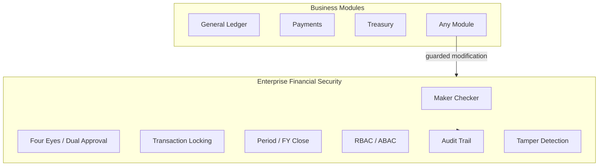

# Enterprise Financial Security — Marpich

**Status:** Canonical — financial controls and audit enforcement for all modules  
**Audience:** CFO, compliance, security, platform engineers, AI agents  
**Owner context:** `backend/contexts/financial_kernel/` (Financial Security Engine)  
**Companions:** [ENTERPRISE_FINANCIAL_KERNEL.md](ENTERPRISE_FINANCIAL_KERNEL.md) · [ENTERPRISE_AUDIT_PLATFORM.md](ENTERPRISE_AUDIT_PLATFORM.md) · [financial_kernel/SECURITY_CATALOG.yaml](financial_kernel/SECURITY_CATALOG.yaml)

**Law: Never allow financial data modification without audit. Maker cannot approve own submission.**

---

## Platform position

---

## Controls

| Control | Key | Approvers |
|---|---|---|
| Maker Checker | `maker_checker` | 1 (different from maker) |
| Four Eyes Principle | `four_eyes` | 2 independent |
| Dual Approval | `dual_approval` | 2 sequential |

---

## Capabilities

| Capability | Description |
|---|---|
| **Digital Signature** | RS256 HMAC on approved maker-checker requests |
| **Audit Trail** | Chained tamper-hash on every security action |
| **Transaction Locking** | Blocks guarded modifications while locked |
| **Period Closing** | Dual-approval period close |
| **Fiscal Year Closing** | Dual-approval FY close + all periods |
| **RBAC** | Role-based policy evaluation |
| **ABAC** | Attribute-based policy evaluation |
| **Encryption** | Payload encryption on maker-checker submit |
| **Tamper Detection** | Verify audit chain integrity |

---

## API

Prefix: `/api/v1/financial-kernel/security`

| Method | Path | Description |
|---|---|---|
| POST | `/maker-checker` | Submit for approval (encrypted payload) |
| POST | `/maker-checker/{id}/approve` | Approve (maker blocked) |
| POST | `/maker-checker/{id}/reject` | Reject |
| POST | `/locks` | Lock transaction |
| POST | `/locks/{id}/release` | Release lock |
| POST | `/period-close` | Request period/FY close |
| POST | `/period-close/{id}/approve` | Dual-approve close |
| POST | `/policies` | Create RBAC/ABAC policy |
| POST | `/policies/evaluate` | Evaluate access |
| GET | `/audit` | Audit trail |
| GET | `/audit/{id}/verify-tamper` | Tamper verification |
| POST | `/guarded-modification` | Audited modification (blocked if locked) |

---

## Integration events

- `financial_kernel.security.maker_checker.submitted`
- `financial_kernel.security.maker_checker.approved`
- `financial_kernel.security.transaction.locked`
- `financial_kernel.security.period.closed`
- `financial_kernel.security.audit.recorded`
- `financial_kernel.security.tamper.detected`
