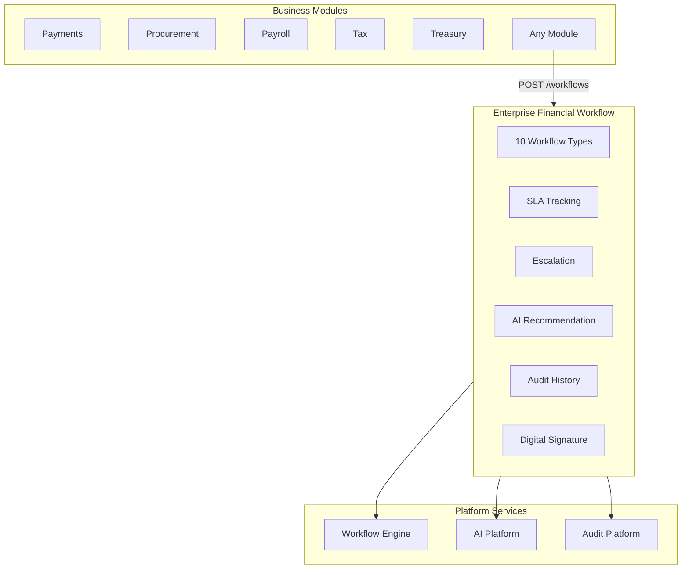

# Enterprise Financial Workflow — Marpich

**Status:** Canonical — unified financial approval orchestration for all business modules  
**Audience:** CFO, finance ops, platform engineers, module authors, AI agents  
**Owner context:** `backend/contexts/financial_kernel/` (Financial Workflow Engine)  
**Companions:** [ENTERPRISE_FINANCIAL_KERNEL.md](ENTERPRISE_FINANCIAL_KERNEL.md) · [ENTERPRISE_WORKFLOW_ENGINE.md](ENTERPRISE_WORKFLOW_ENGINE.md) · [financial_kernel/WORKFLOW_CATALOG.yaml](financial_kernel/WORKFLOW_CATALOG.yaml)

**Law: All financial approvals flow through Financial Kernel Workflow. Modules never implement local approval state machines.**

---

## Platform position



---

## Workflow types

| Type | Key | Default SLA |
|---|---|---|
| Approval | `approval` | 24h |
| Payment | `payment` | 8h |
| Purchase | `purchase` | 48h |
| Expense | `expense` | 24h |
| Transfer | `transfer` | 4h |
| Budget | `budget` | 72h |
| Invoice | `invoice` | 24h |
| Payroll | `payroll` | 48h |
| Tax | `tax` | 72h |
| Treasury | `treasury` | 4h |

---

## Universal capabilities

Every workflow type supports:

| Capability | Description |
|---|---|
| **SLA** | Configurable deadline; `sla_breached` flag on status |
| **Escalation** | Manual or auto (`POST /sla/auto-escalate`) on SLA breach |
| **AI Recommendation** | Risk-scored approve/review/escalate suggestion |
| **Audit** | Immutable history entries on every action |
| **History** | `GET /{id}/history` — full action trail |
| **Digital Signature** | RS256-labeled HMAC signature after approval |

---

## Lifecycle

`pending` → `escalated` → `approved` → `signed` → `completed` | `rejected`

---

## API

Prefix: `/api/v1/financial-kernel/workflows`

| Method | Path | Description |
|---|---|---|
| GET | `/types` | List workflow types with SLA defaults |
| POST | `/` | Start workflow (with AI recommendation) |
| GET | `/` | List workflows |
| GET | `/{id}` | Workflow detail |
| GET | `/{id}/history` | Audit history |
| GET | `/{id}/ai-recommendation` | AI recommendation |
| POST | `/{id}/approve` | Approve |
| POST | `/{id}/reject` | Reject |
| POST | `/{id}/escalate` | Escalate |
| POST | `/{id}/sign` | Digital signature |
| POST | `/{id}/complete` | Complete workflow |
| POST | `/sla/auto-escalate` | Auto-escalate SLA-breached workflows |

---

## Start example

```json
POST /api/v1/financial-kernel/workflows
{
  "workflow_type": "payment",
  "source_context": "treasury",
  "source_document_id": "pay-100",
  "assignee_id": "cfo",
  "amount": 25000,
  "currency": "USD"
}
```

---

## Integration events

- `financial_kernel.workflow.started`
- `financial_kernel.workflow.approved`
- `financial_kernel.workflow.rejected`
- `financial_kernel.workflow.escalated`
- `financial_kernel.workflow.signed`

---

## Relationship to Workflow Engine

Financial Kernel owns **financial workflow semantics** (SLA defaults, AI risk scoring, signature on approval).  
Enterprise Workflow Engine (`contexts/workflow/`) owns **generic BPM runtime** — Financial Workflow delegates complex multi-step flows in production.
