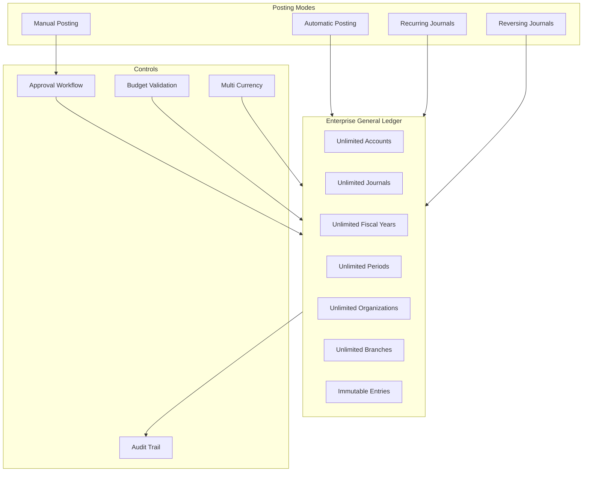
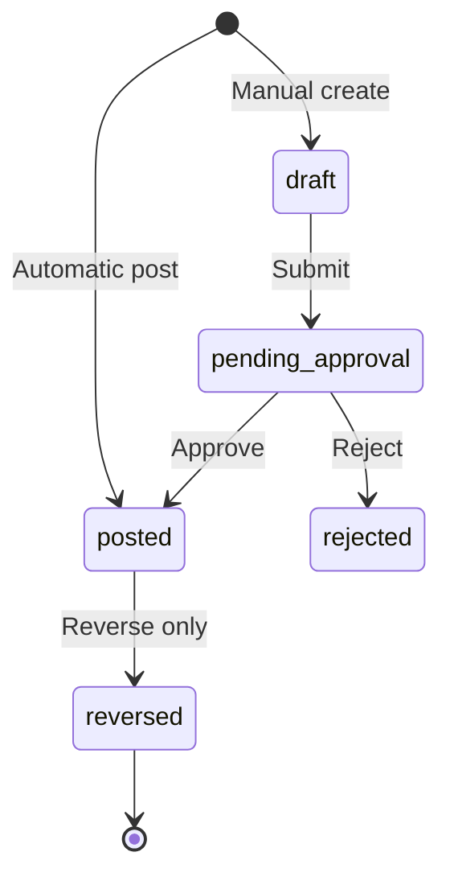

# Enterprise General Ledger — Marpich

**Status:** Canonical — immutable ledger, reversal-only corrections  
**Audience:** Chief Financial Systems Architect, CFO office, module authors, AI agents  
**Owner context:** `backend/contexts/financial_kernel/` (GL Engine)  
**Companions:** [ENTERPRISE_FINANCIAL_KERNEL.md](ENTERPRISE_FINANCIAL_KERNEL.md) · [ENTERPRISE_AUDIT_PLATFORM.md](ENTERPRISE_AUDIT_PLATFORM.md) · [ENTERPRISE_WORKFLOW_ENGINE.md](ENTERPRISE_WORKFLOW_ENGINE.md) · [ENTERPRISE_COMPLIANCE_FRAMEWORK.md](ENTERPRISE_COMPLIANCE_FRAMEWORK.md)

**Law: Generate immutable journal entries. Never delete financial transactions. Only reverse.**

---

## Platform position



---

## The law

```
Support:
  Unlimited Accounts · Journals · Fiscal Years · Periods
  Organizations · Tenants · Branches
  Automatic Posting · Manual Posting · Recurring · Reversing
  Approval Workflow · Audit Trail · Multi Currency · Budget Validation

Generate immutable journal entries.
Never delete financial transactions.
Only reverse.
```

---

## Unlimited scale model

| Entity | Scoping | Limit |
|--------|---------|-------|
| Tenants | Platform partition | Unlimited |
| Organizations | `organization_id` on journal | Unlimited per tenant |
| Branches | `branch_id` on journal | Unlimited per org |
| Accounts | `tenant_id` + optional org | Unlimited |
| Journals | Append-only per tenant | Unlimited |
| Fiscal Years | Per tenant/org | Unlimited |
| Periods | Per fiscal year | Unlimited |

No hard caps — pagination on all list APIs.

---

## Immutable journal model



| Rule | Enforcement |
|------|-------------|
| No UPDATE on posted journals | Domain — no mutator methods |
| No DELETE | Repository rejects delete |
| Correction | `POST /journals/{id}/reverse` only |
| Reversal | New immutable entry with swapped debits/credits |
| Audit | `financial_kernel.journal.posted` + `journal.reversed` |

---

## Posting modes

| Mode | Trigger | Approval |
|------|---------|----------|
| **Automatic** | Module event / `IFinancialKernel.post_journal` | None — idempotent |
| **Manual** | `POST /ledger/journals/manual` | Workflow required |
| **Recurring** | Scheduler / `POST /ledger/recurring/{id}/run` | Per template config |
| **Reversing** | `POST /ledger/journals/{id}/reverse` | Optional per policy |

---

## Multi-currency

- Transaction currency on each journal line
- Base currency conversion at posting time (rate snapshot immutable on journal)
- `exchange_rate` and `base_debit`/`base_credit` stored on immutable entry
- Trial balance in base currency with FX breakdown

---

## Budget validation

Before posting expense lines:

1. Resolve `cost_center` + `account_code` + `period_id`
2. Check budget remaining
3. If exceeded → `financial_kernel.budget.exceeded` event
4. Policy Engine may block or warn per tenant config

---

## REST API — `/api/v1/financial-kernel/ledger`

| Method | Path | Description |
|--------|------|-------------|
| POST | `/accounts` | Create account (unlimited) |
| GET | `/accounts` | List accounts |
| POST | `/fiscal-years` | Create fiscal year |
| GET | `/fiscal-years` | List fiscal years |
| POST | `/periods` | Create period |
| GET | `/periods` | List periods |
| POST | `/journals/automatic` | Automatic posting |
| POST | `/journals/manual` | Manual draft journal |
| POST | `/journals/{id}/submit` | Submit for approval |
| POST | `/journals/{id}/approve` | Approve and post |
| POST | `/journals/{id}/reverse` | Reverse (only correction) |
| GET | `/journals` | List journals |
| GET | `/journals/{id}` | Journal detail (immutable) |
| POST | `/recurring` | Create recurring template |
| POST | `/recurring/{id}/run` | Execute recurring journal |
| GET | `/recurring` | List recurring templates |
| POST | `/budgets` | Create budget line |
| GET | `/budgets/validate` | Pre-validate posting against budget |
| GET | `/trial-balance` | Trial balance |

Catalog: [`financial_kernel/GL_CATALOG.yaml`](financial_kernel/GL_CATALOG.yaml)

---

## Events

| Event | When |
|-------|------|
| `financial_kernel.journal.posted` | Immutable entry created |
| `financial_kernel.journal.reversed` | Reversal posted |
| `financial_kernel.journal.approval.requested` | Manual submit |
| `financial_kernel.journal.approved` | Workflow approved |
| `financial_kernel.recurring.executed` | Recurring run |
| `financial_kernel.budget.exceeded` | Budget validation fail |

---

## Module checklist

```markdown
- [ ] Post via kernel — never local GL
- [ ] Use automatic posting for module events
- [ ] Manual corrections via reverse only — never delete
- [ ] Pass organization_id, branch_id, period_id
- [ ] Multi-currency with rate snapshot
- [ ] Budget validation before expense posting
```

---

## Implementation status

| Area | Status |
|------|--------|
| Immutable journals | ✅ |
| Reversal-only correction | ✅ |
| Automatic + manual posting | ✅ |
| Approval workflow hooks | ✅ |
| Recurring journals | ✅ |
| Fiscal years + periods | ✅ |
| Multi-currency lines | ✅ |
| Budget validation | ✅ |
| Unlimited accounts API | ✅ |
| PostgreSQL persistence | 📋 |

---

## Related

- [ENTERPRISE_FINANCIAL_KERNEL.md](ENTERPRISE_FINANCIAL_KERNEL.md)
- [ENTERPRISE_WORKFLOW_ENGINE.md](ENTERPRISE_WORKFLOW_ENGINE.md)
- ADR-050
