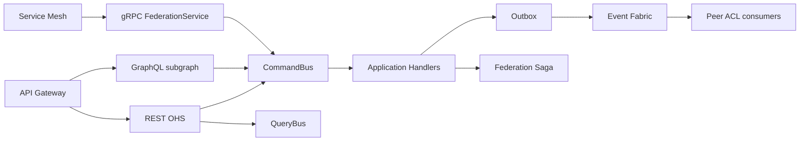

# EIFTP Open Host Service — APIs, Events, CQRS & Integration Surface

**Prompt:** P200-B10 · **ADR:** [224](../adr/224-enterprise-identity-federation-apis-events-cqrs.md)  
**Depends on:** B5–B9 laws (ADR-219–223)  
**SoR:** `backend/contexts/identity_federation/`  
**Next:** P200-B11 Deployment + Observability + DevSecOps

---

## 1. Mission

Standardize how every MEOS service **communicates with EIFTP**: API-first, event-driven, CQRS-aligned, tenant-isolated, Zero Trust–aware — as the federation **Open Host Service**, not a second Integration Platform.

---

## 2. Ownership (critical)

| Capability | Owner |
|------------|--------|
| External connectors / webhooks / sync to 3rd parties | Integration Platform |
| Cross-cutting event transport / outbox dispatch | Enterprise Event Bus |
| Resource Permit/Deny | Authorization PDP |
| Visual approval workflows | Workflow Engine |
| Federation OHS APIs · CQRS buses · event catalog · federation sagas | **This surface (B10)** |

---

## 3. Architecture

Catalog: [OHS_ARCHITECTURE.v1.yaml](identity/eiftp/OHS_ARCHITECTURE.v1.yaml)

---

## 4. Integration patterns (mandatory)

Outbox · Inbox · Idempotency · Correlation ID · Circuit breaker (mesh) · Retry / DLQ (fabric) · Tenant-aware topics · CloudEvents-compatible envelope

---

## 5. Quality gates

Reject: direct service coupling · sync-only design · CQRS violation · unversioned events · missing idempotency · tenant isolation break · Zero Trust bypass · non–horizontally scalable buses · `contexts/eiftp`

---

## Architecture validation scorecard

| Dimension | Score | Pass? |
|-----------|------:|:-----:|
| Architecture / DDD | 5 / 5 | ✓ |
| Scalability / Observability | 4 / 4 | ✓ |
| Security / Audit | 5 / 4 | ✓ |

### Verdict: ENTERPRISE_GRADE (P200-B10)
