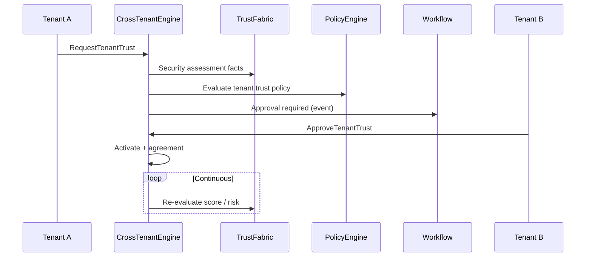

# Cross-Tenant Trust & Enterprise Delegation Platform

**Prompt:** P200-B8 · **ADR:** [222](../adr/222-enterprise-identity-federation-cross-tenant-trust.md)  
**Depends on:** [Trust Fabric](ENTERPRISE_IDENTITY_FEDERATION_TRUST_FABRIC.md) (ADR-220) · [Identity Providers](ENTERPRISE_IDENTITY_FEDERATION_IDENTITY_PROVIDERS.md) (ADR-221)  
**SoR:** `backend/contexts/identity_federation/`  
**Next:** P200-B9 Security & Zero Trust

---

## 1. Mission

Secure, governed digital relationships between independent MEOS tenants/organizations — B2B, partners, guests, services, and AI agents — with **Zero Trust**, strong isolation, delegated authority, continuous trust evaluation, and full auditability.

Cross-tenant interaction **never** bypasses MEOS governance.

---

## 2. Logical domains (same BC)

| Domain | Owns |
|--------|------|
| Cross-Tenant Trust | `TenantFederation` lifecycle + agreement + history |
| Enterprise Delegation | `DelegationAgreement` (user/org/service/AI) |
| Partner Access | `PartnerAccess` + access policy refs |
| External Identity | `ExternalIdentity` invite → activate → expire → remove |

Catalog: [CROSS_TENANT_ARCHITECTURE.v1.yaml](identity/eiftp/CROSS_TENANT_ARCHITECTURE.v1.yaml)

---

## 3. Trust establishment workflow

---

## 4. Isolation & Zero Trust

- Data / policy / credential / config / audit isolation per `tenant_id`
- Peer refs only (`partner_tenant_id`) — no peer aggregate import
- Every hop: identity · tenant · trust level · risk · device · location · behavior · policy · session · sensitivity
- **No permanent trust**; every Delegation/Partner/External requires **expiration**

---

## 5. Quality gates

Reject: implicit cross-tenant trust · broken isolation · uncontrolled delegation · missing expiration · no audit · policy bypass · ZT violation · unlimited privileges · `contexts/eiftp`

---

## Architecture validation scorecard

| Dimension | Score | Pass? |
|-----------|------:|:-----:|
| Architecture / DDD | 5 / 5 | ✓ |
| Security / Audit | 5 / 5 | ✓ |
| Multi-tenant isolation | 5 | ✓ |

### Verdict: ENTERPRISE_GRADE (P200-B8)
