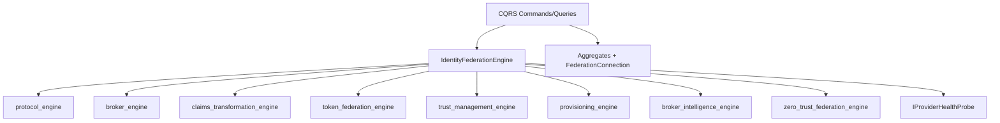

# Enterprise Identity Federation Engine

**Prompt:** P200-B5 · **ADR:** [219](../adr/219-enterprise-identity-federation-engine.md)  
**Depends on:** [Domain Model](ENTERPRISE_IDENTITY_FEDERATION_TRUST_DOMAIN_MODEL.md) (ADR-218)  
**SoR:** `backend/contexts/identity_federation/`  
**Next:** P200-B6 Trust Fabric

---

## 1. Mission

The Federation Engine is the **central federation capability** of MEOS: policy-driven identity exchange among tenants, organizations, partners, applications, services, and AI agents — with Zero Trust, tenant isolation, HA, and compliance readiness.

Comparable class: Entra / Keycloak Enterprise / Okta Workforce federation hubs — Marpich-native, standards-based, plugin-first.

---

## 2. Engine composition (reuse, do not fork)

Catalog: [ENGINE_ARCHITECTURE.v1.yaml](identity/eiftp/ENGINE_ARCHITECTURE.v1.yaml)

---

## 3. Subsystems

| # | Subsystem | Implementation |
|---|-----------|----------------|
| 1 | IdP Management | `IdentityProvider` + `FederationConnection` + CQRS |
| 2 | Connection Management | connection lifecycle on IdP |
| 3 | Protocol Integration | protocol_engine + plugins + adapters |
| 4 | Identity Mapping | claims_transformation + IdentityLink |
| 5 | Attribute Transformation | claims_transformation_engine |
| 6 | Trust Negotiation | trust_management + EstablishTrust |
| 7 | Federation Policy | ProvisioningPolicy + IPolicyEvaluator |
| 8 | Token Exchange | token_federation_engine + ExchangeFederatedToken |
| 9 | Synchronization | SynchronizationJob + ResolveSyncConflict |
| 10 | Monitoring | protocol/trust metrics + health probes |
| 11 | Audit | integration events → Audit Platform |
| 12 | Lifecycle | federation_engine transitions |

---

## 4. Quality gates

Reject: hardcoded IdP vendors in domain · broken tenant isolation · insecure tokens · ZT bypass · no audit · vendor lock-in · `contexts/eiftp`

---

## Architecture validation scorecard

| Dimension | Score | Pass? |
|-----------|-------|-------|
| Architecture / DDD | 5 / 5 | Facade + aggregates |
| Security / ZT / Audit | 5 / 5 / 4 | Probe + events |
| Scalability / AI | 5 / 5 | Multi-tenant + AI agents |

### Verdict: ENTERPRISE_GRADE (P200-B5)
