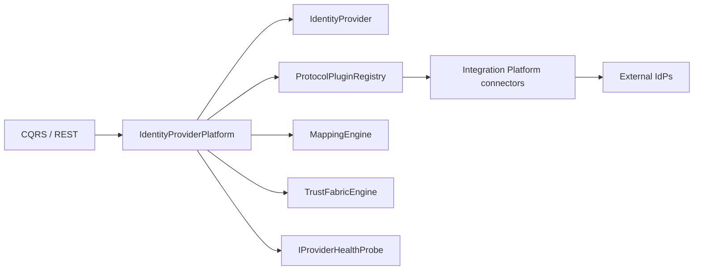

# Enterprise Identity Provider Management & Federation Protocol Layer

**Prompt:** P200-B7 · **ADR:** [221](../adr/221-enterprise-identity-federation-identity-providers.md)  
**Depends on:** [Federation Engine](ENTERPRISE_IDENTITY_FEDERATION_ENGINE.md) (ADR-219) · [Trust Fabric](ENTERPRISE_IDENTITY_FEDERATION_TRUST_FABRIC.md) (ADR-220)  
**SoR:** `backend/contexts/identity_federation/`  
**Next:** P200-B8 Cross-Tenant Trust

---

## 1. Mission

Universal, protocol-independent Identity Provider connectivity for MEOS: register, configure, trust-evaluate, activate, monitor, map, synchronize, and retire any internal, external, government, partner, machine, or AI-facing IdP — **without hardcoded vendors**.

---

## 2. Logical domains (same BC)

| Domain | Owns |
|--------|------|
| Identity Provider Management | `IdentityProvider`, configuration, credentials (refs), certificates (refs), security profile |
| Federation Connection | `FederationConnection` lifecycle · multi-tenant bindings |
| Protocol Abstraction | Plugin registry · OAuth2 / OIDC / SAML / SCIM / LDAP / future |
| Identity Mapping | Claims / schema transform · match · conflict ACL |
| Provider Trust | Trust Fabric facts for each IdP |
| Federation Policy | Attribute release / authn / token via Policy Engine port |
| Synchronization | Jobs · conflict resolution · health |

Catalog: [IDENTITY_PROVIDERS_ARCHITECTURE.v1.yaml](identity/eiftp/IDENTITY_PROVIDERS_ARCHITECTURE.v1.yaml)

---

## 3. Protocol plugins (Plugin First)

Built-ins: oauth2, oidc, saml, scim, ldap, ad, jwt. New protocols = install descriptor + Integration connector — no domain fork.

---

## 4. Provider lifecycle

`registered` → `verified` → `active` ↔ `suspended` → `deprovisioned` / `archived`

Activation requires: negotiated protocol plugin · non-empty endpoints · Trust Fabric level ≥ Limited (1) when trust_ref present (policy-driven).

---

## 5. Quality gates

Reject: hardcoded IdPs · protocol lock-in · missing plugins · weak cert handling · ignored trust evaluation · broken tenant isolation · ZT bypass · Permit/Deny in this layer · `contexts/eiftp`

---

## Architecture validation scorecard

| Dimension | Score | Pass? |
|-----------|------:|:-----:|
| Architecture / DDD | 5 / 5 | ✓ |
| Security / Audit | 5 / 5 | ✓ |
| Plugin / AI readiness | 5 / 4 | ✓ |

### Verdict: ENTERPRISE_GRADE (P200-B7)
