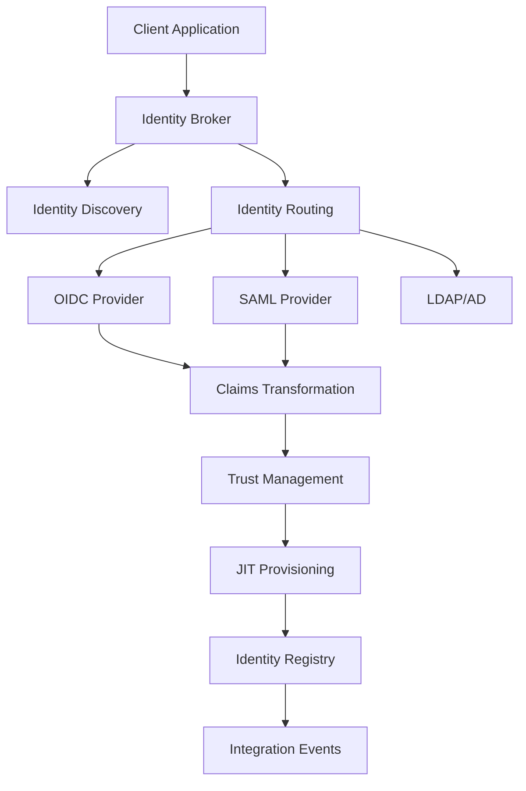

# Enterprise Identity Federation & SSO Platform — Marpich

**Status:** Canonical — central Identity Fabric  
**ADR:** [202-enterprise-identity-federation-platform.md](../adr/202-enterprise-identity-federation-platform.md) · [202b](../adr/202b-enterprise-identity-federation-protocol-engine.md) · [202c](../adr/202c-enterprise-identity-fabric-mesh-trust.md)  
**Companions:** ENTERPRISE_AUTHENTICATION_PLATFORM · ENTERPRISE_DIRECTORY_SERVICE · ENTERPRISE_DIGITAL_IDENTITY_FABRIC

## Mission

The Federation Platform is the **central Identity Fabric** of Marpich. Every application, tenant, partner organization, government agency, university, hospital, bank, ERP module, mobile app, API client, and AI agent authenticates through this platform.

## Business Capability Map

| Capability | Service |
|------------|---------|
| Identity Federation | Multi-protocol IdP integration |
| Enterprise SSO | Single sign-on across all modules |
| Identity Broker | Routing, discovery, translation |
| Identity Synchronization | Directory sync jobs |
| Cross-Tenant Federation | Shared/dedicated/regional modes |
| Cross-Organization Trust | Partner trust relationships |
| Identity Delegation | Federated session management |
| JIT Provisioning | Just-in-time user creation |
| Federated Logout | Single logout (SLO) |

### Strategic Objectives

- Centralize enterprise identity across all Marpich modules
- Enable one identity across ERP, SaaS, mobile, and AI agents
- Support federation with external organizations and government IdPs
- Reduce password management complexity
- Support Zero Trust and regulatory compliance (banking, healthcare, government)

### Business KPIs

| KPI | Target |
|-----|--------|
| SSO adoption rate | > 90% of logins |
| Federation uptime | 99.99% |
| JIT provisioning latency | < 500 ms |
| Identity discovery success | > 95% |

## Architecture



## Supported Identity Providers (Pluggable)

Active Directory · LDAP · Azure AD / Entra ID · Google Workspace · Apple · GitHub · GitLab · Keycloak · Okta · Auth0 · Amazon Cognito · Government eID · University IdP · Hospital IdP · Bank IdP · Tax Authority · National Digital Identity · Custom · Legacy · Partner

All providers registered via plugin registry — never hardcoded.

## Federation Lifecycle

```
Registration → Verification → Activation → Federation → Provisioning
    → Synchronization → Update → [Suspension ↔ Recovery/Reactivation]
    → De-Provisioning → Archiving → Deletion
```

## Trust Model

| Trust Type | Description |
|------------|-------------|
| Organization Trust | Inter-org federation |
| Partner Trust | B2B partner relationships |
| Tenant Trust | Cross-tenant federation |
| Identity Trust | User identity confidence |
| Device Trust | Device-bound federation |
| Application Trust | SP/Relying party trust |
| Certificate Trust | mTLS / cert-based federation |

Trust hierarchy uses weighted composite scoring with weakest-link detection.

## Multi-Tenant Federation Modes

| Mode | Use Case |
|------|----------|
| Dedicated | Single tenant, isolated IdPs |
| Shared | Multi-tenant shared IdP pool |
| Regional | Geo-specific federation |
| Cross-Region | Global identity fabric |
| Partner | B2B cross-organization |

Industry packs: universities, hospitals, banks, currency exchanges, construction, government agencies, NGOs, retail, manufacturing, holding companies.

## APIs

| Path | Description |
|------|-------------|
| `/federation/catalog` | Platform capabilities + plugins |
| `/federation/providers` | IdP registration |
| `/federation/partners` | Federation partner registration |
| `/federation/trust` | Trust relationship management |
| `/federation/claims/mappings` | Claims mapping configuration |
| `/federation/claims/transform` | Runtime claims transformation |
| `/federation/discover` | Identity discovery |
| `/federation/broker/authenticate` | Broker authentication flow |
| `/federation/links` | Account linking |
| `/federation/provision/jit` | JIT provisioning |
| `/federation/sessions/logout` | Federated logout (admin) |
| `/federation/jobs/sync` | Synchronization jobs (admin) |
| `/federation/tenant-federation` | Multi-tenant config |
| `/federation/trust/evaluate` | Trust hierarchy evaluation |

### Protocol Gateway (P198-B — public, tenant-scoped)

| Path | Description |
|------|-------------|
| `POST /federation/login` | External / AS login start or callback |
| `POST /federation/logout` | End-session / SLO |
| `POST /federation/token` | OAuth 2.1 token endpoint |
| `POST /federation/introspect` | Token introspection |
| `POST /federation/revoke` | Token revocation |
| `POST /federation/provision` | SCIM-style provisioning |
| `POST /federation/sync` | Directory / IdP sync |
| `GET /federation/.well-known/openid-configuration` | OIDC discovery |
| `GET /federation/jwks` | JWKS |
| `GET /identity/providers` | Public IdP list |
| `GET /identity/claims` | Claims catalog |
| `GET /identity/metadata` | Federation metadata |

Permissions: `federation.read`, `federation.write`, `federation.admin`, `federation.broker.execute`, `federation.provision.execute`, `federation.sync.execute`, `federation.trust.write`

## Events

- `federation.provider.registered`
- `federation.identity.federated`
- `federation.identity.linked`
- `federation.identity.provisioned`
- `federation.logout.completed`
- `federation.trust.established`
- `federation.external_auth.succeeded` / `failed`
- `federation.claims.mapped`
- `federation.token.exchanged`
- `federation.certificate.rotated`

Kafka catalog: `docs/architecture/identity/FEDERATION_KAFKA_TOPICS.yaml`

## Protocol Engine (P198-B)

Pluggable adapters for OAuth 2.1, OIDC, SAML 2.0, SCIM 2.0, LDAP/AD, JWT. Negotiation selects protocol by client capability. Bridge adapter ACL wires to authentication (OIDC RP) and directory (SAML/LDAP). Plugin SDK: `infrastructure/plugins/protocol_plugin_sdk.py`.

## BPMN Workflows

External Login · Enterprise SSO · Partner / Government / University / Hospital / Bank Login · Account Linking · Provisioning · Synchronization · Certificate Rotation · Trust Approval

## Database

Migration `028_enterprise_identity_federation_platform.sql` — extends `federation` schema (017) with partners, trust, mappings, links, sessions, tokens, audit, tenant federation, policies. RLS enabled.

## Policy-Driven Behavior

| Policy | Controls |
|--------|----------|
| `federation.enabled` | Platform master gate |
| `federation.broker.enabled` | Identity broker |
| `federation.jit_provisioning.enabled` | JIT user creation |
| `federation.identity_discovery.enabled` | IdP discovery |
| `federation.single_logout.enabled` | Federated logout |
| `federation.cross_tenant.enabled` | Cross-tenant federation |
| `federation.oauth.scopes.default` | Default OAuth scopes |
| `federation.oauth.token.access_ttl` | Access token TTL |
| `federation.oauth.pkce.required` | PKCE requirement |
| `federation.zero_trust.enabled` | Zero Trust federation gate |
| `federation.mesh.enabled` | Identity Fabric Mesh |
| `federation.risk.enabled` | Risk-based federation |
| `federation.risk.step_up.threshold` | Step-up risk threshold |
| `federation.risk.deny.threshold` | Deny risk threshold |
| `federation.trust.graph.enabled` | Trust graph |
| `federation.session.cross_app.enabled` | Cross-app sessions |

## DDD Bounded Context

`identity_federation` — aggregates: FederationProfile, IdentityProvider, FederationPartner, TrustRelationship, ClaimsMapping, IdentityLink, ProvisioningPolicy, SynchronizationJob, FederationSession, TenantFederation

## Identity Fabric Mesh & Trust Intelligence (P198-C1)

| Capability | Implementation |
|------------|----------------|
| Identity Fabric Mesh | Topology, discovery, routing, sync, monitoring |
| Trust Graph | Nodes/edges, neighbors, path, propagation |
| Zero Trust Federation | Dimensional verification + Adaptive Auth PDP ACL |
| Enterprise Trust Engine | 10-dimension scoring, history, recalculation |
| Risk-based Federation | Signal composite + Identity Risk `score_federation` |
| Session / Token Federation | Cross-app sessions, SLO, token exchange/translation |
| Security Dashboard | Trust, mesh health, threats, audit tail |
| Immutable Audit | `FederationAuditStore` |

API: `/api/v1/federation/fabric/*`


## AI Identity Intelligence (P198-C2)

| Capability | Path |
|------------|------|
| AI Intelligence Engine | `domain/services/ai_identity_intelligence_engine.py` |
| Analytics | `identity_analytics_engine.py` |
| Identity Copilot | `ai_identity_copilot.py` |
| AI Platform ACL | `application/ai_service.py` |
| Intelligence API | `/api/v1/federation/intelligence/*` |
| Admin Portal | `/enterprise/federation` |
| End-user Portal | `/account/security` |
| Quality Gates | `docs/architecture/identity/AI_IDENTITY_QUALITY_GATES.v1.yaml` |
| ADR | [202d](../adr/202d-ai-identity-intelligence-portals.md) |

Policies: `federation.ai.enabled`, `.confidence.threshold`, `.risk.alert.threshold`, `.explainability.required`

## Governance

- Never hardcode identity providers, trust relationships, claim mappings, or provisioning rules
- Everything configuration-driven, policy-driven, plugin-first, API-first, event-driven
- Cloud-native, multi-tenant, AI-ready, Zero Trust aligned, Identity Fabric Native
- ADR-202b: Protocol Engine & Federation Gateway
- ADR-202c: Fabric Mesh & Trust Intelligence
