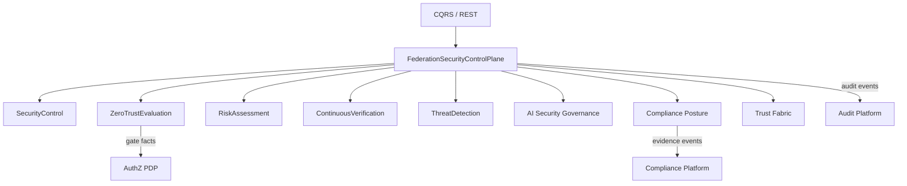

# Enterprise Security, Zero Trust & Compliance — Federation Control Plane

**Prompt:** P200-B9 · **ADR:** [223](../adr/223-enterprise-identity-federation-security-zero-trust.md)  
**Depends on:** [Trust Fabric](ENTERPRISE_IDENTITY_FEDERATION_TRUST_FABRIC.md) · [Cross-Tenant](ENTERPRISE_IDENTITY_FEDERATION_CROSS_TENANT_TRUST.md)  
**SoR:** `backend/contexts/identity_federation/`  
**Next:** P200-B10 APIs + Events + CQRS + Integration

---

## 1. Mission

Central **security control plane for EIFTP**: Zero Trust by default, continuous verification of every federation hop, enterprise risk evaluation, threat detection signals, AI security governance, and compliance posture — with immutable audit via the Audit Platform.

No user, service, device, workload, API, or AI agent is implicitly trusted.

---

## 2. Platform vs federation ownership

| Capability | Owner |
|------------|--------|
| Resource Permit/Deny | Authorization PDP (P200-A) |
| Enterprise Compliance programs | Compliance Framework |
| Immutable audit ledger | Audit Platform |
| Business policy versioning | Policy Engine |
| Federation security gates / ZT / risk / CV | **This plane (B9)** |

---

## 3. Logical domains (same BC)

Catalog: [SECURITY_ZT_ARCHITECTURE.v1.yaml](identity/eiftp/SECURITY_ZT_ARCHITECTURE.v1.yaml)

---

## 4. Zero Trust gate actions

`allow` · `allow_with_conditions` · `challenge` · `require_mfa` · `require_step_up` · `deny` · `quarantine` · `escalate`

Every evaluation considers: identity · device · location · network · risk · trust score · session · behavior · policy · resource sensitivity · time · tenant · AI context.

---

## 5. Quality gates

Reject: implicit trust · hardcoded policies · tenant isolation breaks · policy bypass · no continuous verification · weak crypto defaults · missing audit evidence · no AI governance · non–cloud-native design · `contexts/eiftp`

---

## Architecture validation scorecard

| Dimension | Score | Pass? |
|-----------|------:|:-----:|
| Architecture / DDD / Security | 5 / 5 / 5 | ✓ |
| Audit / Policy / ZT | 5 / 4 / 5 | ✓ |

### Verdict: ENTERPRISE_GRADE (P200-B9)
