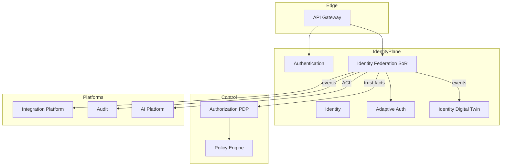
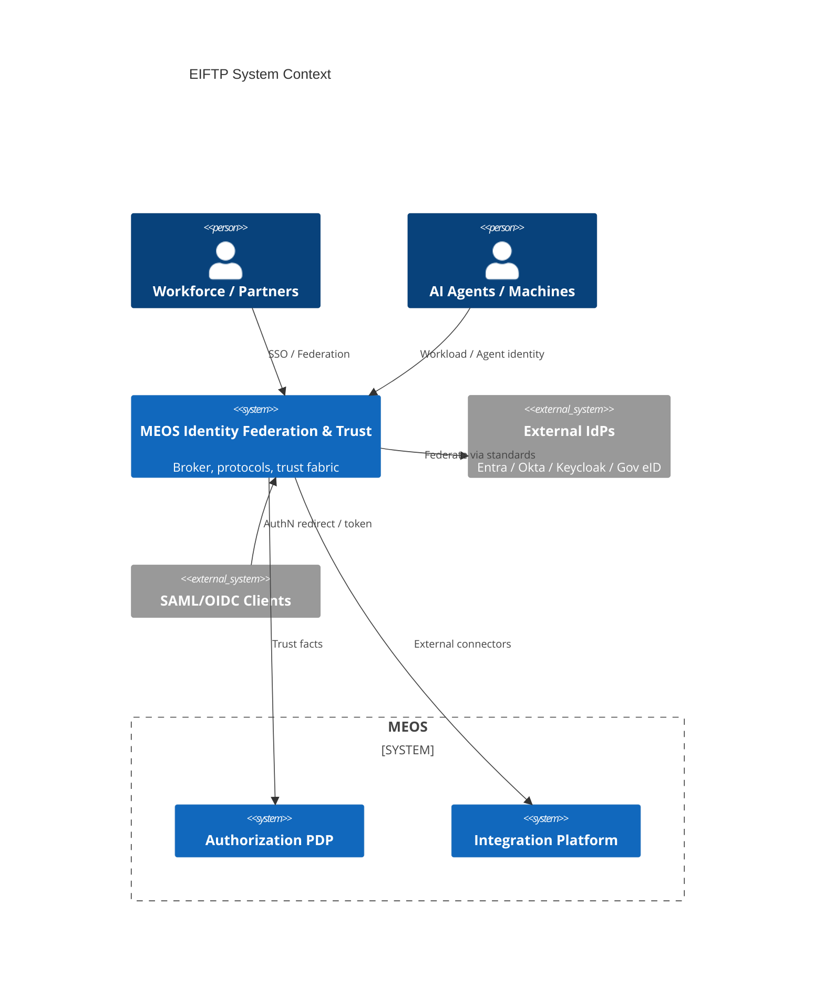
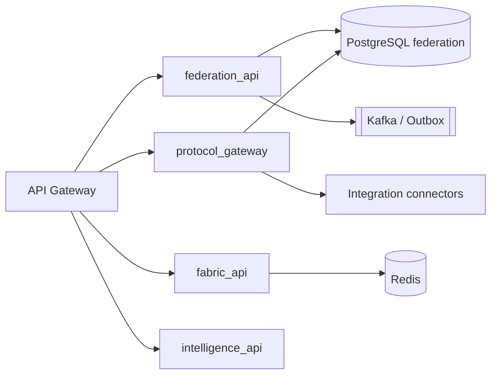
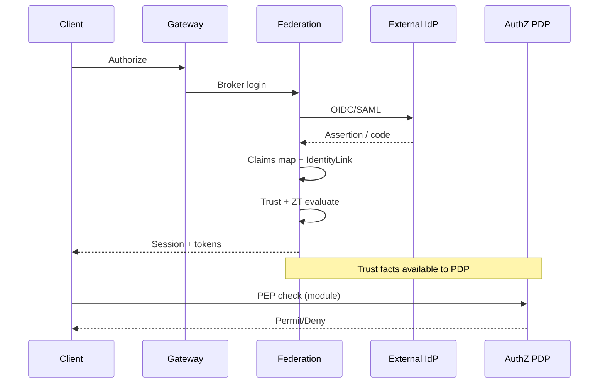
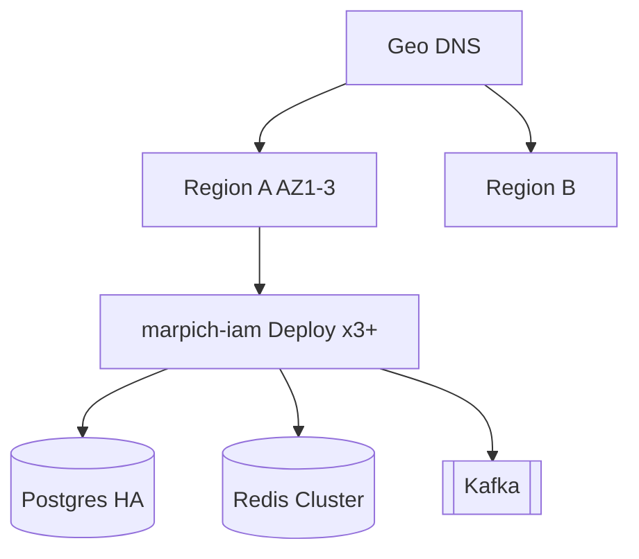

# Enterprise Identity Federation & Trust — Enterprise Architecture

**Prompt:** P200-B2 · **ADR:** [216](../adr/216-enterprise-identity-federation-trust-architecture.md)  
**Depends on:** Mission (212) · Vision (213) · Drivers (214) · Goals D1 (215)  
**SoR:** `backend/contexts/identity_federation/` — **never** `contexts/eiftp/`  
**Index of 50 views:** [identity/eiftp/ARCH_DELIVERABLES_INDEX.v1.yaml](identity/eiftp/ARCH_DELIVERABLES_INDEX.v1.yaml)

Comparable responsibility class: Microsoft Entra ID · Keycloak Enterprise · Okta Workforce · Google Cloud Identity — implemented Marpich-native (open standards, plugin ports, Core reuse).

---

## 1. Solution architecture

Identity Federation is the **trust backbone** of the MEOS Identity Plane. Every microservice authenticates principals and consumes **trust facts** from Federation; **Permit/Deny** remains Authorization PDP (ADR-204).

Details: [ARCH_SOLUTION.v1.yaml](identity/eiftp/ARCH_SOLUTION.v1.yaml)

---

## 2. C4 — System context

Canonical YAML: [ARCH_C4.v1.yaml](identity/eiftp/ARCH_C4.v1.yaml)

---

## 3. C4 — Containers

---

## 4. Federation & trust evaluation flows

---

## 5. Deployment (HA)

Extends: `FEDERATION_DEPLOYMENT_TOPOLOGY.v1.yaml` · [ARCH_DEPLOYMENT.v1.yaml](identity/eiftp/ARCH_DEPLOYMENT.v1.yaml)

---

## 6. Domain / microservice boundaries

| Owns (Federation) | Never owns |
|-------------------|------------|
| Providers, trusts, links, sessions, claims maps, fabric facts | AuthZ PDP, local password IdP SoR, vendor SDKs, audit store, vault |

Aggregates: FederationProfile · IdentityProvider · Partner · TrustRelationship · ClaimsMapping · IdentityLink · ProvisioningPolicy · SyncJob · FederationSession · TenantFederation

---

## 7. CQRS & events

- **Write:** `application/commands/` → aggregates → outbox events  
- **Read:** `application/queries/` → trust facts / admin projections  
- **Events:** `federation.*` envelope on Event Fabric (see Kafka catalog)

Consumer contract: `IFederationTrustFacts` in Shared Kernel ports.

---

## 8. Data plane

| Store | Role |
|-------|------|
| PostgreSQL `federation` | SoR (migration 028; adapters target) |
| Redis | Session / introspect / JWKS / short-TTL trust facts — keys `fed:{tenant_id}:…` |
| Kafka / outbox | Integration events |

---

## 9. Security & Zero Trust

Never trust · Always verify · Least privilege · Continuous evaluation.  
Federation evaluates and emits **facts**; AuthZ decides. Secrets only in Vault/KMS paths `marpich/${env}/iam/federation/*`.

---

## 10. Production package layout (SoR)

See [ARCH_REPO_STRUCTURE.v1.yaml](identity/eiftp/ARCH_REPO_STRUCTURE.v1.yaml). Target MODULE_ARCHITECTURE tree; incremental migration from flat routers/services is planned through B10.

---

## Architecture validation scorecard

| Dimension | Score | Pass? |
|-----------|-------|-------|
| Architecture | 5 | 50 views indexed + C4/deploy |
| DDD / Security / Audit | 5 / 5 / 4 | Boundaries explicit |
| Scalability / Observability | 5 / 4 | HA/DR/Redis/Kafka/OTel |
| AI / Plugin | 5 / 5 | Subjects + plugin SDK |

### Verdict: ENTERPRISE_GRADE (P200-B2)
