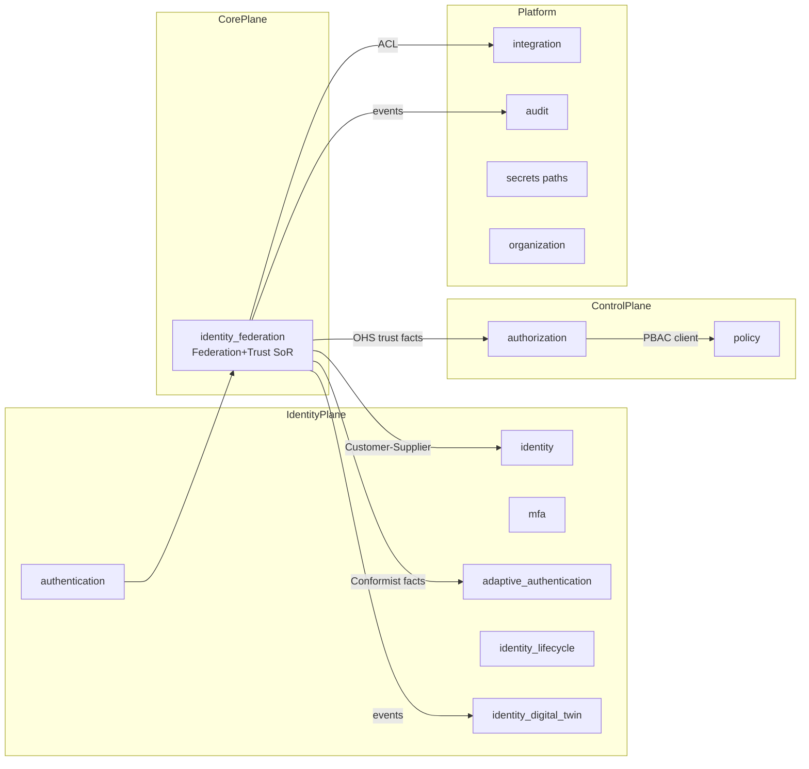

# Enterprise Identity Federation & Trust — DDD Strategic Design

**Prompt:** P200-B3 · **ADR:** [217](../adr/217-enterprise-identity-federation-trust-ddd-strategic.md)  
**Depends on:** [Enterprise Architecture](ENTERPRISE_IDENTITY_FEDERATION_TRUST_ARCHITECTURE.md) (ADR-216)  
**SoR BC:** `identity_federation` — **never** `contexts/eiftp/`  
**Next:** P200-B4 Domain Model (tactical)

---

## 1. Domain vision

EIFTP is the **enterprise trust backbone**: federate and continuously evaluate identity trust across humans, machines, AI agents, devices, partners, and tenants — without becoming the identity registry, local authenticator, or authorization PDP.

**Core domain (competitive differentiator):** Federation + Trust Fabric.  
**Everything else** is supporting/generic platform reused via events, OHS, and ports.

---

## 2. Strategic domain classification

| Type | Domains |
|------|---------|
| **Core** | Federation · Trust |
| **Supporting** | Session (fed) · Token (fed) · External Identity · Certificate · AI Identity · Machine Identity · Device Identity |
| **Generic / Platform companions** | Identity · Authentication · Authorization · Credential · MFA · Policy · Audit · Compliance · Organization · Tenant · Secrets |

Full catalog: [DDD_DOMAIN_CATALOG.v1.yaml](identity/eiftp/DDD_DOMAIN_CATALOG.v1.yaml)

---

## 3. Bounded context map (summary)

Detail: [DDD_BOUNDED_CONTEXT_MAP.v1.yaml](identity/eiftp/DDD_BOUNDED_CONTEXT_MAP.v1.yaml) · Relationships: [DDD_CONTEXT_MAPPING.v1.yaml](identity/eiftp/DDD_CONTEXT_MAPPING.v1.yaml)

---

## 4. Ubiquitous language (excerpt)

| Term | Meaning (EIFTP) |
|------|-----------------|
| Federated Subject | Any identity participating via federation (human/machine/AI/device) |
| Identity Link | Binding between local subject id and external IdP subject |
| Trust Relationship | Explicit, governed edge between parties/tenants |
| Trust Facts | Scored signals consumed by AuthZ — **not** Permit/Deny |
| Federation Session | Brokered session after successful federation |
| Claims Mapping | Deterministic transform of external claims → MEOS claims |

Dictionary: [DDD_UBIQUITOUS_LANGUAGE.v1.yaml](identity/eiftp/DDD_UBIQUITOUS_LANGUAGE.v1.yaml)

---

## 5. Aggregate boundaries (Federation SoR)

Consistency boundaries owned by `identity_federation`:

FederationProfile · IdentityProvider · FederationPartner · TrustRelationship · ClaimsMapping · IdentityLink · ProvisioningPolicy · SynchronizationJob · FederationSession · TenantFederation

Rules: one aggregate write per transaction; cross-aggregate via domain/integration events; `tenant_id` invariant on every root.

Catalog: [DDD_AGGREGATE_CATALOG.v1.yaml](identity/eiftp/DDD_AGGREGATE_CATALOG.v1.yaml)

---

## 6. Context mapping strategies (why)

| Relation | Between | Why |
|----------|---------|-----|
| Open Host Service | Federation → consumers | Stable trust-facts & federation APIs |
| Published Language | `federation.*` events + DTOs | Versioned contracts |
| Anti-Corruption Layer | Federation ↔ Integration / Adaptive / Risk | Protect domain from vendor/peer models |
| Customer-Supplier | Federation ↔ Identity | Links reference identity ids; Identity owns registry |
| Conformist | Federation ← Adaptive Auth signals | Accept risk/ZT challenge shapes as facts |
| Customer-Supplier | Modules → Authorization | PDP decisions |
| Separate Ways | Federation ⊥ AuthZ policy rules | Never merge Permit/Deny into trust engine |
| Shared Kernel | `shared.*` Money/Ids/Events only | No business aggregates in kernel |

---

## 7. Event ownership

Federation **publishes** federation lifecycle events; Identity **publishes** identity lifecycle; AuthZ **publishes** decision events. No context may emit another’s event names.

Matrix: [DDD_EVENT_MATRIX.v1.yaml](identity/eiftp/DDD_EVENT_MATRIX.v1.yaml)

---

## 8. Governance model

- Domain owners = BC owners in `registry.py`  
- Strategic changes require ADR  
- Circular dependencies = quality gate failure  
- Tenant isolation + Zero Trust are non-negotiable invariants  

[DDD_GOVERNANCE_MODEL.v1.yaml](identity/eiftp/DDD_GOVERNANCE_MODEL.v1.yaml) · Matrices: responsibility / integration

---

## Architecture validation scorecard

| Dimension | Score | Pass? |
|-----------|-------|-------|
| Architecture / DDD | 5 / 5 | Explicit core vs companions |
| Security / Audit | 5 / 4 | ZT + event ownership |
| Scalability | 5 | Aggregate + event boundaries |
| Documentation | 5 | Full strategic catalogs |

### Verdict: ENTERPRISE_GRADE (P200-B3 Strategic DDD)
