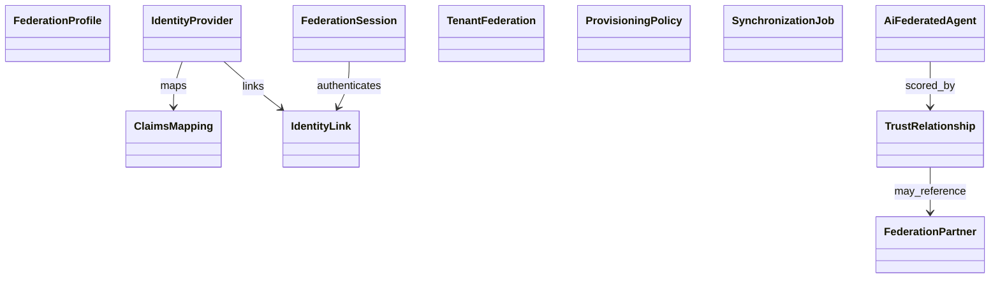

# Enterprise Identity Federation & Trust — Tactical Domain Model

**Prompt:** P200-B4 · **ADR:** [218](../adr/218-enterprise-identity-federation-trust-domain-model.md)  
**Depends on:** [Strategic DDD](ENTERPRISE_IDENTITY_FEDERATION_TRUST_DDD_STRATEGIC.md) (ADR-217)  
**SoR:** `backend/contexts/identity_federation/`  
**Next:** P200-B5 Identity Federation Engine

---

## 1. Ownership law (anti-anemic, anti-duplicate)

| Aggregate (prompt name) | Tactical home | Notes |
|-------------------------|---------------|-------|
| Identity | `identity` BC | Federation holds `IdentityLink` + subject refs |
| Tenant | `core_platform` / tenant mgmt | Federation holds `TenantFederation` |
| Organization | `organization` BC | Org ids as refs only |
| Federation | **`identity_federation`** | IdP, mapping, connection, agreement |
| Trust | **`identity_federation`** | TrustRelationship + evaluation entities |
| Credential | `authentication` / MFA | Never stored in federation tables |
| Session (federated) | **`identity_federation`** | `FederationSession` |
| Policy (federation) | **`identity_federation`** | `ProvisioningPolicy` + config; business Policy BC for PBAC |
| AI Identity | **`identity_federation`** (+ ai_governance) | `AiFederatedAgent` |

---

## 2. Federation aggregate map

Catalog: [MODEL_AGGREGATE_MAP.v1.yaml](identity/eiftp/MODEL_AGGREGATE_MAP.v1.yaml)

---

## 3. Behaviors (non-anemic)

Aggregates expose lifecycle methods that enforce invariants and raise domain events:

- `TrustRelationship.grant | revoke | suspend | reactivate | rescore`
- `FederationSession.terminate | elevate | mark_expired`
- `IdentityLink.activate | suspend | unlink`
- `IdentityProvider.enable | disable | rotate_config`
- `AiFederatedAgent.register | revoke | update_capabilities`

---

## 4. CQRS surfaces

Commands / queries catalogs drive `application/commands` and `application/queries`.  
Repos raise domain events → application maps to `federation.*` integration events.

---

## 5. Knowledge graph & digital twin

KG edges and twin projections are **read models** fed by events — not alternate write SoRs. Twin context: `identity_digital_twin`.

---

## 6. Persistence

PostgreSQL schema `federation` (migration 028) · outbox event store · Redis cache `fed:{tenant_id}:…` · Audit Platform for audit SoR.

---

## Architecture validation scorecard

| Dimension | Score | Pass? |
|-----------|-------|-------|
| DDD / Architecture | 5 / 5 | Tactical + ownership |
| Security / ZT / AI | 5 / 5 / 5 | Behaviors + AiFederatedAgent |
| Scalability | 5 | Tenant-scoped aggregates |

### Verdict: ENTERPRISE_GRADE (P200-B4)
