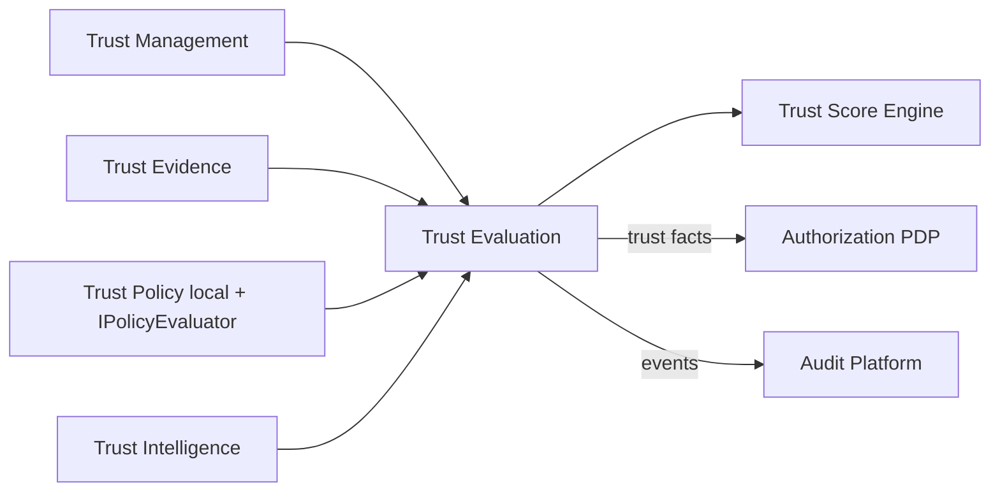

# Enterprise Trust Fabric

**Prompt:** P200-B6 · **ADR:** [220](../adr/220-enterprise-identity-federation-trust-fabric.md)  
**Depends on:** [Federation Engine](ENTERPRISE_IDENTITY_FEDERATION_ENGINE.md) (ADR-219)  
**SoR:** `backend/contexts/identity_federation/`  
**Next:** P200-B7 Identity Providers

---

## 1. Vision

A global enterprise trust network where every digital entity interacts based on **continuously evaluated**, explainable trust — never implicit or permanent.

Subjects: human · organization · tenant · application · API · service · machine · device · AI agent · digital twin · partner.

---

## 2. Core principles

1. Never Trust Automatically  
2. Always Verify  
3. Continuous Trust Evaluation  
4. Least Trust Privilege  
5. Transparent Trust Decisions  

---

## 3. Logical domains (inside federation SoR)

| Domain | Owns | Never owns |
|--------|------|------------|
| Management | TrustRelationship lifecycle, agreements | AuthZ decisions |
| Evaluation | Scores, explainability, ZT signals | Business PBAC SoR |
| Policy | Federation trust rules + Policy port | Duplicate Policy Engine |
| Evidence | Append-only evidence records | Audit SoR tables |
| Intelligence | Anomaly/recommend hooks (AI Platform ACL) | Embedded LLM |

---

## 4. Trust levels (0–5)

| Level | Name |
|-------|------|
| 0 | Unknown Trust |
| 1 | Limited Trust |
| 2 | Verified Trust |
| 3 | Enterprise Trust |
| 4 | Strategic Trust |
| 5 | Continuous Adaptive Trust |

Transitions are score + evidence + policy gated — see [TRUST_FABRIC_LEVELS.v1.yaml](identity/eiftp/TRUST_FABRIC_LEVELS.v1.yaml).

---

## 5. Quality gates

Reject: static/implicit trust · no context evaluation · no audit/history · tenant isolation break · ZT bypass · AI trust without identity · non-explainable decisions · `contexts/eiftp`

---

## Architecture validation scorecard

| Dimension | Score | Pass? |
|-----------|-------|-------|
| Architecture / DDD / Security | 5 / 5 / 5 | Continuous + Separate Ways AuthZ |
| AI / Audit / Scalability | 5 / 4 / 5 | Agent trust + events |

### Verdict: ENTERPRISE_GRADE (P200-B6)
