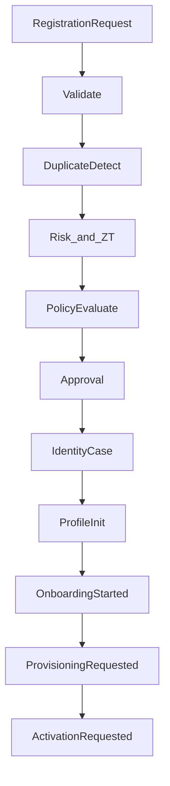

# Enterprise Identity Lifecycle Management Platform (EILMP)

**Prompt track:** P201 · **Phase:** P201-A Registration & Onboarding  
**ADR:** [227](../adr/227-enterprise-identity-lifecycle-management-platform.md) · SoR: [`identity_lifecycle`](../adr/192-enterprise-identity-lifecycle-platform.md)  
**API:** `/api/v1/identity-lifecycle` · **Forbidden:** `backend/contexts/eilmp/`

---

## 1. Mission

EILMP is the authoritative MEOS identity lifecycle engine. **P201-A** is the secure entry point: every supported identity type is registered, validated, duplicate-checked, risk/policy evaluated, approved, profile-initialized, and onboarded — policy-driven, event-driven, AI-assisted, Zero Trust — before provisioning.

---

## 2. Ownership

| Capability | Owner |
|------------|--------|
| Registration / onboarding orchestration | **identity_lifecycle (this)** |
| User account records | `identity` |
| SCIM / LDAP / AD sync | `directory` + Integration Platform |
| Access review / SoD | `identity_governance` |
| Trust / IdP federation | `identity_federation` (facts) |
| Permit/Deny | `authorization` |
| Approvals | Workflow Engine |
| Rules | Policy Engine |
| Password/passkey crypto | `authentication` |

---

## 3. Registration & onboarding flow

Catalogs: [REGISTRATION_ARCHITECTURE](identity/eilmp/REGISTRATION_ARCHITECTURE.v1.yaml) · [IDENTITY_TYPES](identity/eilmp/IDENTITY_TYPES.v1.yaml) · [ONBOARDING_WORKFLOW](identity/eilmp/ONBOARDING_WORKFLOW.v1.yaml)

---

## 4. Quality gates (P201-A)

Reject: unmanaged duplicates · skipped validation · approval bypass · Zero Trust bypass · hardcoded registration rules · broken `tenant_id` · non–event-driven · `contexts/eilmp`

---

## 5. APIs (P201-A)

| Method | Path |
|--------|------|
| GET | `/identity-lifecycle/eilmp/surface` |
| GET | `/identity-lifecycle/registration/catalog` |
| POST | `/identity-lifecycle/registration/register` |
| POST | `/identity-lifecycle/registration/{id}/validate` |
| POST | `/identity-lifecycle/registration/{id}/detect-duplicates` |
| POST | `/identity-lifecycle/registration/{id}/approve` |
| POST | `/identity-lifecycle/registration/{id}/reject` |
| POST | `/identity-lifecycle/registration/{id}/initialize-profile` |
| POST | `/identity-lifecycle/registration/{id}/start-onboarding` |
| POST | `/identity-lifecycle/registration/{id}/request-provisioning` |
| GET | `/identity-lifecycle/registration/{id}` |
| GET | `/identity-lifecycle/registration/{id}/status` |

---

## Architecture validation scorecard (P201-A)

| Dimension | Score | Pass? |
|-----------|------:|:-----:|
| Architecture / DDD / Security / Audit | 5 / 5 / 5 / 4 | ✓ |
| Workflow / Policy | 4 / 4 | ✓ |
| Testing / Documentation | 4 / 5 | ✓ |
| AI / Observability | 4 / 4 | ✓ |

### Verdict: ENTERPRISE_GRADE (P201-A)

## Reuse analysis

ADR-192 lifecycle cases · Policy evaluator · Workflow (approval intent) · Event bus · AI lifecycle assistant pattern

## Architectural decisions

- **Extend `identity_lifecycle`** — reject new `eilmp` BC  
- **Registration aggregate separate from LifecycleCase** — case opens after approval; registration is the gated entry  
- **ZT/risk as facts** — AuthZ still decides resource access
