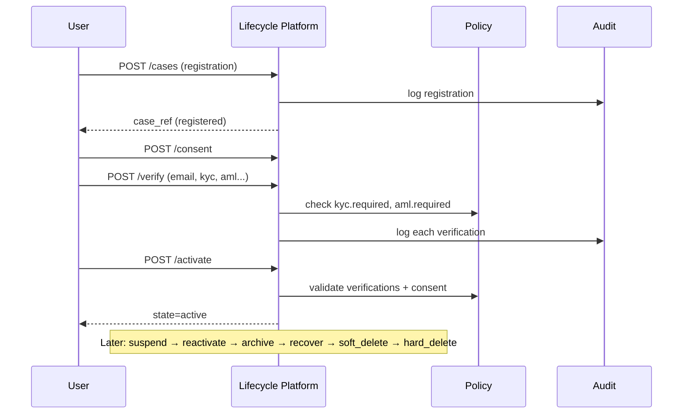

# Enterprise Identity Lifecycle Platform

**Version:** 1.0  
**Status:** Implemented  
**API:** `/api/v1/identity-lifecycle`  
**Aligns with:** ADR-190 (EIF), ADR-192  

---

## 1. Mission

The **Enterprise Identity Lifecycle Platform** governs every stage of a digital identity's existence — from registration and verification through activation, suspension, merge/split, archive, recovery, and governed deletion — with full audit trails and policy-driven controls.

### Vision

> *Every identity transition is policy-governed, auditable, explainable, and reversible until hard deletion.*

### Lifecycle Operations Supported

| Phase | Operations |
|-------|-----------|
| **Onboarding** | Registration, Invitation |
| **Verification** | Identity, Email, Phone, Government ID, KYC, AML, Background |
| **Activation** | Account Activation |
| **State Management** | Suspension, Temporary Disable, Reactivation |
| **Identity Operations** | Merge Identities, Split Identity |
| **Retention** | Archive, Recovery |
| **Deletion** | Soft Delete, Hard Delete, Identity Deletion |
| **Compliance** | Consent Management |

---

## 2. Domain-Driven Design

### Bounded Context: `identity_lifecycle`

Delegates to `identity` (user records), `directory` (catalog sync), and `policy` (governance).

### Aggregates

| Aggregate | Responsibility |
|-----------|----------------|
| `LifecycleProfile` | Tenant lifecycle configuration |
| `LifecycleCase` | Identity lifecycle state machine instance |
| `LifecycleTransition` | Immutable state transition record |
| `VerificationTask` | Email/phone/KYC/AML/background checks |
| `ConsentRecord` | GDPR/HIPAA consent tracking |
| `LifecycleAuditEntry` | Tamper-evident audit log |
| `LifecycleInvitation` | Invitation token workflow |

### 14 Platform Capabilities

1. Lifecycle Workflow Engine  
2. Registration & Invitation  
3. Verification Orchestration  
4. KYC & AML Compliance  
5. Account State Management  
6. Identity Merge & Split  
7. Archive & Recovery  
8. Deletion Governance  
9. Consent Management  
10. Lifecycle Audit Trail  
11. AI Lifecycle Assistant  
12. Policy-Driven Lifecycle  
13. Lifecycle Dashboard  
14. Lifecycle API  

### State Machine

```
draft → invited → registered → pending_verification → verified → active
active → suspended | temporarily_disabled → reactivated → active
active → merged | archived → recovery_pending → active
active | archived → soft_deleted → hard_deleted
```

---

## 3. Database

**Schema:** `identity_lifecycle` (migration `019_identity_lifecycle_platform.sql`)

| Table | Purpose |
|-------|---------|
| `profiles` | Tenant lifecycle config |
| `cases` | Lifecycle case per identity |
| `transitions` | State transition history |
| `verification_tasks` | Verification orchestration |
| `consent_records` | Consent grants/revocations |
| `audit_entries` | Immutable audit trail |
| `invitations` | Invitation tokens |

All tables: RLS via `app.tenant_id`.

---

## 4. API

| Method | Path | Permission |
|--------|------|------------|
| GET | `/identity-lifecycle/catalog` | `read` |
| POST | `/identity-lifecycle/seed` | `write` |
| GET | `/identity-lifecycle/dashboard` | `read` |
| GET/POST | `/identity-lifecycle/cases` | read / `cases.write` |
| GET | `/identity-lifecycle/cases/{ref}` | `read` |
| POST | `/identity-lifecycle/cases/{ref}/invite` | `cases.write` |
| POST | `/identity-lifecycle/cases/{ref}/verify` | `verify.execute` |
| POST | `/identity-lifecycle/cases/{ref}/activate` | `cases.write` |
| POST | `/identity-lifecycle/cases/{ref}/suspend` | `cases.write` |
| POST | `/identity-lifecycle/cases/{ref}/disable` | `cases.write` |
| POST | `/identity-lifecycle/cases/{ref}/reactivate` | `cases.write` |
| POST | `/identity-lifecycle/cases/{ref}/merge` | `merge.execute` |
| POST | `/identity-lifecycle/cases/{ref}/split` | `merge.execute` |
| POST | `/identity-lifecycle/cases/{ref}/archive` | `cases.write` |
| POST | `/identity-lifecycle/cases/{ref}/recover` | `recovery.execute` |
| POST | `/identity-lifecycle/cases/{ref}/delete` | `delete.execute` |
| POST | `/identity-lifecycle/cases/{ref}/consent` | `consent.write` |
| GET | `/identity-lifecycle/cases/{ref}/audit` | `audit.read` |
| GET | `/identity-lifecycle/cases/{ref}/workflow` | `read` |
| GET | `/identity-lifecycle/cases/{ref}/assistant` | `assistant.read` |

---

## 5. Events

| Event | Trigger |
|-------|---------|
| `identity_lifecycle.case.opened` | Registration |
| `identity_lifecycle.state.changed` | Any state transition |
| `identity_lifecycle.verification.completed` | Verification task finished |
| `identity_lifecycle.consent.recorded` | Consent grant/revoke |
| `identity_lifecycle.identity.deleted` | Soft/hard delete |

---

## 6. Workflow



---

## 7. Security

- Tenant isolation via RLS and `X-Tenant-ID`  
- Granular permissions per lifecycle operation  
- Policy keys control registration, KYC/AML requirements, consent, retention  
- Audit trail on every transition with actor ID  
- Soft delete retention period policy-governed  

---

## 8. AI

**AI Lifecycle Assistant** (`/cases/{ref}/assistant`):
- Recommends next lifecycle actions based on current state  
- Explains why each action is needed (KYC required, consent missing, etc.)  
- Flags operations requiring human review (reactivation, hard delete)  
- Policy-gated via `identity_lifecycle.ai_assistant.enabled`  

---

## 9. Frontend

- **Lifecycle Dashboard** — cases by state, pending verifications, audit count  
- **Case Detail View** — verifications, consents, transitions, workflow graph  
- **Verification Wizard** — step-through email → phone → KYC → AML  
- **AI Assistant Panel** — next-action recommendations with explanations  
- **Audit Timeline** — chronological lifecycle audit entries  

---

## 10. Testing

```bash
cd backend && .venv/bin/pytest contexts/identity_lifecycle/tests/ -q
```

| Suite | Coverage |
|-------|----------|
| `test_identity_lifecycle_unit.py` | Capabilities, workflow rules |
| `test_identity_lifecycle_api.py` | Registration→activation, suspend→delete |

---

## 11. DevSecOps

- Migration `019_identity_lifecycle_platform.sql`  
- In-memory stores for dev/test; PostgreSQL for production  
- Integration events for cross-context consumption (identity_risk, audit)  
- Correlation IDs on all mutating endpoints  

---

## 12. Documentation

- This document: `docs/architecture/ENTERPRISE_IDENTITY_LIFECYCLE_PLATFORM.md`  
- ADR: `docs/adr/192-enterprise-identity-lifecycle-platform.md`  
- Context manifest: `backend/contexts/identity_lifecycle/context.yaml`  

---

## 13. Performance

- State machine transitions: O(1) rule lookup  
- Audit queries indexed by `(tenant_id, case_ref)`  
- Dashboard aggregates in-memory for dev; SQL aggregation in production  
- Verification tasks batched per case  

---

## 14. Localization

- Consent purposes stored as tenant-defined strings  
- Verification type labels exposed via catalog API for i18n  
- Display names UTF-8 on lifecycle cases  
- Industry packs can override KYC/AML requirement labels  

---

## 15. Acceptance Criteria

- [x] Registration and invitation workflows  
- [x] 7 verification types (email, phone, gov ID, KYC, AML, background, identity)  
- [x] Account activation with policy-gated prerequisites  
- [x] Suspension, temporary disable, reactivation  
- [x] Merge identities and split identity  
- [x] Archive, recovery, soft delete, hard delete  
- [x] Consent management with grant/revoke  
- [x] Lifecycle workflow engine with 21 actions  
- [x] Lifecycle events (5 integration events)  
- [x] Immutable audit trail per case  
- [x] AI lifecycle assistant with explainable recommendations  
- [x] 14 platform capabilities  
- [x] Tenant-aware RLS schema  
- [x] Policy-driven lifecycle (7 policy keys)  
- [x] API integration tests passing  
