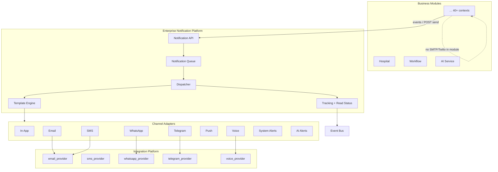
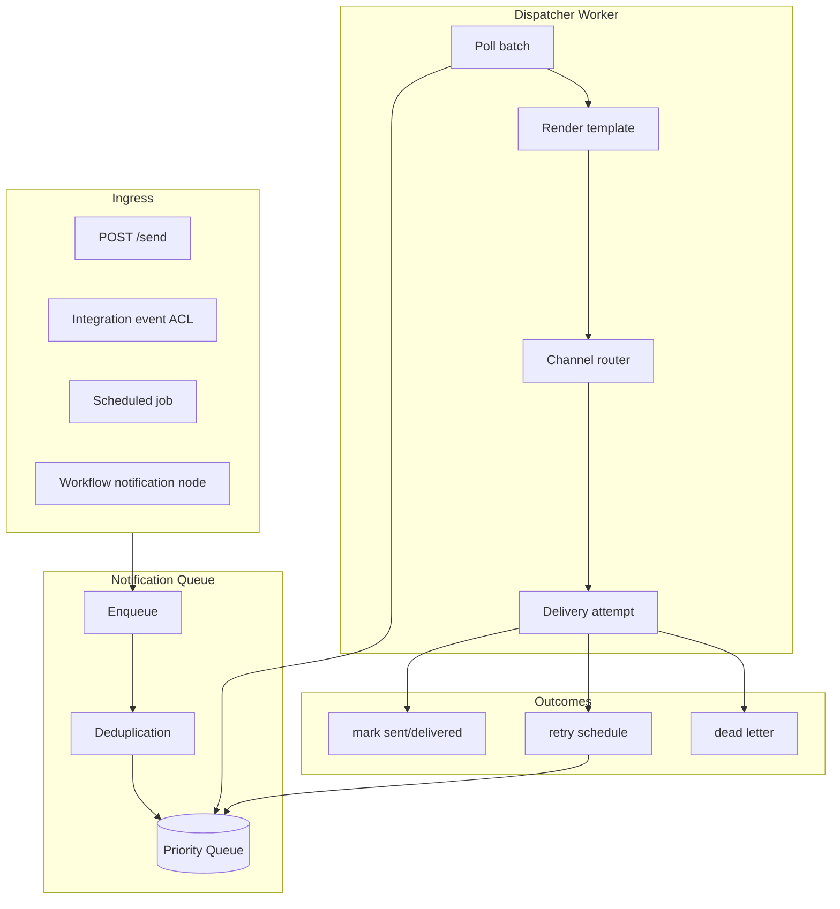
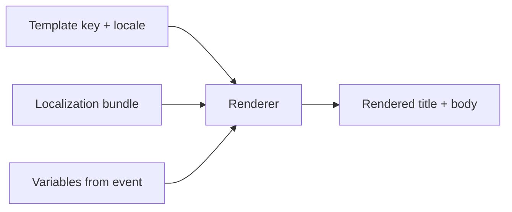
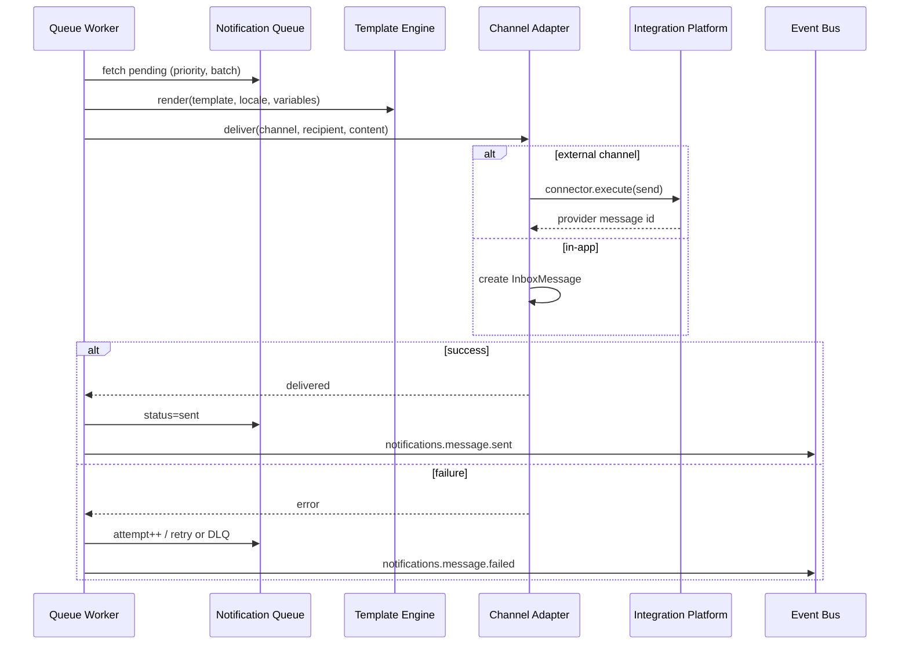
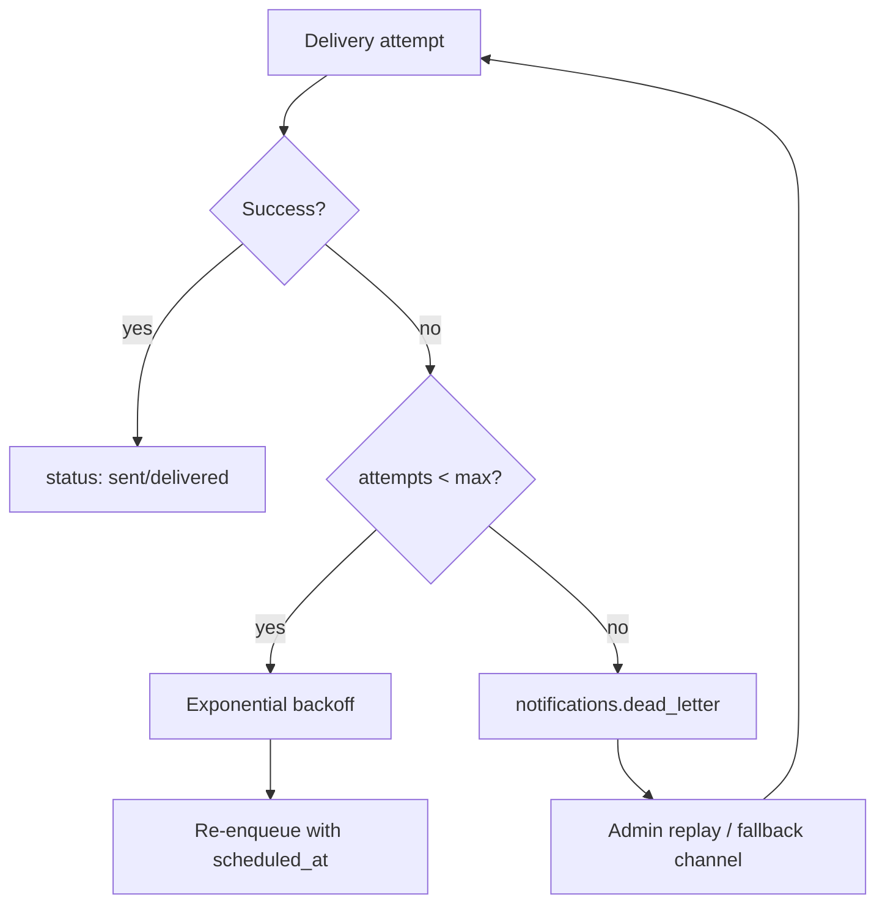
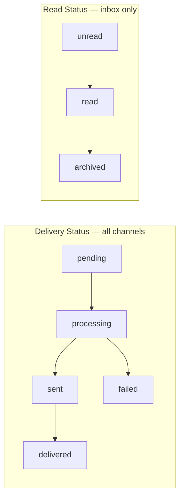

# Enterprise Notification Platform — Marpich

**Status:** Canonical — sole omnichannel notification layer  
**Audience:** Product, platform engineers, module authors, AI agents  
**Owner context:** `backend/contexts/notifications/`  
**Companions:** [INTEGRATION_PLATFORM.md](INTEGRATION_PLATFORM.md) · [ENTERPRISE_EVENT_BUS.md](ENTERPRISE_EVENT_BUS.md) · [ENTERPRISE_WORKFLOW_ENGINE.md](ENTERPRISE_WORKFLOW_ENGINE.md) · [CORE_PLATFORM.md](CORE_PLATFORM.md)

**Law: Modules never send email, SMS, push, or chat directly. Route all notifications through the Notification Platform.**

---

## Platform position



---

## The law

```
All notifications flow through the Enterprise Notification Platform.

Supported channels:
  In-App · Email · SMS · WhatsApp · Telegram · Push · Voice · System Alerts · AI Alerts

Every notification supports:
  Templates · Localization · Variables · Scheduling · Priority
  Retry · Tracking · Read Status · Delivery Status · Failure Recovery

Modules emit events or call POST /notifications/send — never embed channel SDKs.
```

---

## Notification types

| Type | Channel key | Delivery path | Read tracking |
|------|-------------|---------------|---------------|
| **In-App** | `inbox` | `InboxMessage` in notifications schema | ✅ `read_at` |
| **Email** | `email` | Integration `email_provider` connector | Open pixel optional |
| **SMS** | `sms` | Integration `sms_provider` connector | Delivery receipt |
| **WhatsApp** | `whatsapp` | Integration `whatsapp_provider` | Provider status |
| **Telegram** | `telegram` | Integration `telegram_provider` | Provider status |
| **Push** | `push` | FCM / APNs via Integration | Device ack |
| **Voice** | `voice` | Integration `voice_provider` (Twilio voice) | Call status |
| **System Alerts** | `system` | In-app + email to admins; PagerDuty hook | Audit trail |
| **AI Alerts** | `ai_alert` | From AI Service insights; multi-channel | Linked to AI job |

Catalog: [`notifications/CHANNEL_CATALOG.yaml`](notifications/CHANNEL_CATALOG.yaml)

---

## Cross-cutting capabilities

| Capability | Mechanism |
|------------|-----------|
| **Templates** | `NotificationTemplate` per channel + locale |
| **Localization** | Localization Service bundles + `Accept-Language` |
| **Variables** | `{{variable}}` substitution from event payload + context |
| **Scheduling** | Queue `scheduled_at` → Scheduling Platform worker |
| **Priority** | Queue priority: `critical` > `high` > `normal` > `low` |
| **Retry** | Exponential backoff on failed delivery attempts |
| **Tracking** | `NotificationDelivery` + attempt log |
| **Read status** | In-app `InboxMessage.status` — unread / read / archived |
| **Delivery status** | `pending` → `sent` → `delivered` / `failed` |
| **Failure recovery** | DLQ + manual replay + alternate channel fallback |

---

## Notification queue

Central async pipeline — **every outbound notification enqueues before dispatch**.



### Queue entry schema

```yaml
id: uuid
tenant_id: acme
organization_id: org-1
correlation_id: corr-uuid
priority: high          # critical | high | normal | low
channel: email          # inbox | email | sms | whatsapp | ...
template_key: task_assigned
locale: fa-IR
variables:
  step_name: "Manager approval"
  instance_id: "inst-123"
recipient:
  user_id: user-uuid
  email: user@example.com
  phone: "+98912..."
  device_token: null
scheduled_at: null      # ISO8601 or null = immediate
status: pending         # pending | processing | sent | failed | cancelled
attempt_count: 0
max_attempts: 5
source_event: workflow.task.assigned
created_at: ISO8601
```

### Queue rules

| Rule | Detail |
|------|--------|
| **Async default** | `POST /send` returns `202 Accepted` with `queue_id` |
| **Idempotency** | `(tenant_id, idempotency_key)` dedup within 24h |
| **Priority ordering** | Critical processed first within batch |
| **Tenant isolation** | Queue partition per `tenant_id` |
| **Persistence** | PostgreSQL `notifications.queue` + Redis hot queue (prod) |
| **Worker** | Core Worker Runtime or outbox-style dispatcher |

### Priority matrix

| Priority | Use case | Max latency SLA |
|----------|----------|-----------------|
| `critical` | Security breach, system down | 30 seconds |
| `high` | Workflow SLA, payment failure | 2 minutes |
| `normal` | Business events, onboarding | 15 minutes |
| `low` | Digests, marketing (opt-in) | 24 hours |

---

## Template engine



### Template model

| Field | Purpose |
|-------|---------|
| `key` | `workflow.task_assigned` |
| `channel` | `email`, `sms`, `inbox`, … |
| `locale` | `en-US`, `fa-IR`, `ar-SA` |
| `subject` | Email/push title template |
| `body` | HTML, plain text, or SMS segments |
| `variables` | Declared variable names for validation |
| `category` | `workflow`, `security`, `ai`, … |

Example:

```json
{
  "key": "workflow.task_assigned",
  "channel": "email",
  "locale": "en-US",
  "subject": "Action required: {{step_name}}",
  "body": "You have a pending task on {{instance_id}}. Due: {{due_at}}.",
  "variables": ["step_name", "instance_id", "due_at"]
}
```

**Localization:** fallback chain `fa-IR` → `fa` → tenant default → `en-US`.

---

## Dispatcher architecture



### Channel adapter interface

```python
# contexts/notifications/application/ports/channels.py
class INotificationChannel(Protocol):
    channel: str

    async def deliver(
        self,
        *,
        tenant_id: str,
        recipient: dict,
        subject: str,
        body: str,
        metadata: dict,
    ) -> Result[str]: ...  # provider message id
```

| Adapter | Location | External |
|---------|----------|----------|
| `InAppChannel` | `infrastructure/channels/in_app.py` | — |
| `EmailChannel` | `infrastructure/channels/email.py` | Integration `email_provider` |
| `SmsChannel` | `infrastructure/channels/sms.py` | Integration `sms_provider` |
| `WhatsAppChannel` | 📋 | Integration `whatsapp_provider` |
| `TelegramChannel` | 📋 | Integration `telegram_provider` |
| `PushChannel` | 📋 | FCM/APNs connector |
| `VoiceChannel` | 📋 | Integration `voice_provider` |
| `SystemAlertChannel` | 📋 | Multi-channel admin route |
| `AiAlertChannel` | 📋 | AI insight → templated alert |

---

## Retry & failure recovery



| Policy | Default |
|--------|---------|
| Max attempts | 5 |
| Initial delay | 30s |
| Multiplier | 2.0 |
| Max delay | 1 hour |
| Fallback | Optional — e.g. SMS fails → in-app + email |

### Failure recovery actions

| Action | API |
|--------|-----|
| **Auto retry** | Queue worker |
| **Manual replay** | `POST /notifications/queue/{id}/replay` |
| **Cancel** | `POST /notifications/queue/{id}/cancel` |
| **Fallback channel** | Template config `fallback_channel: inbox` |
| **DLQ alert** | `notifications.dlq.enqueued` → system alert |

---

## Read status vs delivery status

| Dimension | Applies to | States |
|-----------|------------|--------|
| **Delivery status** | All channels | `pending` · `processing` · `sent` · `delivered` · `failed` · `bounced` |
| **Read status** | In-app inbox only | `unread` · `read` · `archived` |



**WebSocket:** `GET /api/v1/ws/notifications` — real-time inbox + delivery updates (via API Gateway).

---

## AI alerts

AI Service publishes insights; Notification Platform routes as `ai_alert` channel:

| Source event | Template | Channels |
|--------------|----------|----------|
| `ai.fraud.detected` | `ai.fraud.alert` | system + email + inbox |
| `ai.insight.generated` | `ai.insight.summary` | inbox |
| `analytics.alert.triggered` | `analytics.threshold` | configurable |

**Rule:** AI generates content — Notification Platform delivers; no LLM in notification domain.

---

## System alerts

Platform operations and security — always multi-channel to admins:

| Trigger | Priority | Channels |
|---------|----------|----------|
| `identity.login.failed` (threshold) | high | inbox + email |
| `integration.dlq.enqueued` | critical | system + email |
| `workflow.sla.breached` | high | inbox + push |
| Platform health degradation | critical | system + voice (optional) |

---

## Module integration

### Pattern 1 — Event-driven (preferred)

```
Module publishes domain event → Notification ACL maps to queue entry
```

Existing routes in `infrastructure/acl/event_routes.py` ✅ partial.

### Pattern 2 — Explicit API

```http
POST /api/v1/notifications/send
{
  "channel": "email",
  "template_key": "procurement.po.approved",
  "user_id": "...",
  "variables": { "po_number": "PO-1001" },
  "priority": "normal",
  "locale": "fa-IR"
}
```

### Forbidden

```python
# ❌ FORBIDDEN — in business module
await smtp.send_mail(...)
await twilio.messages.create(...)

# ✅ ALLOWED
await notification_client.send(template_key="...", channel="sms", ...)
# or publish event consumed by Notification ACL
```

---

## Permissions

| Permission | Scope |
|------------|-------|
| `notifications.send` | Enqueue notification |
| `notifications.templates.read` | List templates |
| `notifications.templates.write` | Create/update templates |
| `notifications.deliveries.read` | Delivery log |
| `notifications.queue.admin` | Replay DLQ, cancel |
| `notifications.preferences.write` | User channel opt-in/out |
| Inbox | Authenticated user — own messages only |

User **preferences** control opt-in channels (except critical/system).

---

## REST API

Base: `/api/v1/notifications`

| Method | Path | Status |
|--------|------|--------|
| POST | `/send` | ✅ 202 async |
| GET | `/inbox` | ✅ |
| PATCH | `/inbox/{id}/read` | ✅ |
| GET | `/templates` | ✅ static list |
| POST | `/templates` | 📋 CRUD |
| GET | `/deliveries` | ✅ |
| GET | `/queue` | 📋 admin list |
| POST | `/queue/{id}/replay` | 📋 |
| GET | `/preferences` | 📋 |
| PUT | `/preferences` | 📋 |
| POST | `/send/batch` | 📋 |

---

## Events

| Published | When |
|-----------|------|
| `notifications.message.sent` | ✅ Delivery success |
| `notifications.message.failed` | ✅ Delivery failure |
| `notifications.inbox.created` | ✅ In-app message |
| `notifications.message.delivered` | 📋 Provider delivery receipt |
| `notifications.message.read` | 📋 In-app read |
| `notifications.dlq.enqueued` | 📋 Max retries exhausted |
| `notifications.queue.scheduled` | 📋 Future send registered |

| Subscribed | Action |
|------------|--------|
| `*` (routed) | ACL → enqueue |
| `workflow.task.assigned` | ✅ inbox |
| `identity.user.created` | ✅ inbox |
| `ai.fraud.detected` | 📋 AI alert |

---

## Implementation status

| Area | Today | Target |
|------|-------|--------|
| In-app inbox + read | ✅ | + WebSocket |
| Email (console adapter) | ✅ dev | Integration provider |
| Event ACL routing | ✅ partial | Full `*` rules engine |
| Delivery log | ✅ | + delivered/bounced |
| Templates | ✅ static | DB + localization |
| Notification queue | 📋 aggregate in context.yaml | Full priority queue |
| SMS / WhatsApp / Telegram | 📋 | Integration connectors |
| Push / Voice | 📋 | Channel adapters |
| Scheduling | 📋 | Queue `scheduled_at` |
| Priority | 📋 | Queue ordering |
| Retry / DLQ | 📋 partial (email try/catch) | Queue worker |
| AI / System alerts | 📋 | Dedicated templates |

---

## Module checklist

```markdown
## Notification checklist

- [ ] No SMTP/SMS/push SDK in module code
- [ ] Template key registered per event
- [ ] Variables documented
- [ ] Locale supported via Localization
- [ ] Priority appropriate (not everything critical)
- [ ] User preferences respected
- [ ] Subscribe to notifications.message.failed for ops
```

---

## Enforcement

| Mechanism | Location |
|-----------|----------|
| This document | `docs/architecture/ENTERPRISE_NOTIFICATION_PLATFORM.md` |
| Channel catalog | `docs/architecture/notifications/CHANNEL_CATALOG.yaml` |
| Context | `backend/contexts/notifications/` |
| ADR | ADR-039 |
| Cursor rule | `.cursor/rules/marpich-notification-platform.mdc` |

---

## Related

| Document | Role |
|----------|------|
| [INTEGRATION_PLATFORM.md](INTEGRATION_PLATFORM.md) | External email/SMS/voice providers |
| [ENTERPRISE_EVENT_BUS.md](ENTERPRISE_EVENT_BUS.md) | Trigger events |
| [ENTERPRISE_WORKFLOW_ENGINE.md](ENTERPRISE_WORKFLOW_ENGINE.md) | Workflow notification nodes |
| [AI_PLATFORM_STANDARD.md](AI_PLATFORM_STANDARD.md) | AI alert sources |
| [PLATFORM_CHARTER.md](PLATFORM_CHARTER.md) | No duplicate notification stack |
