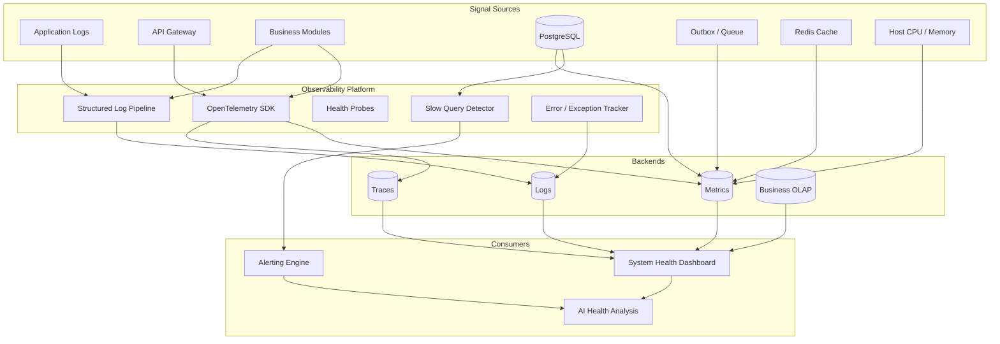
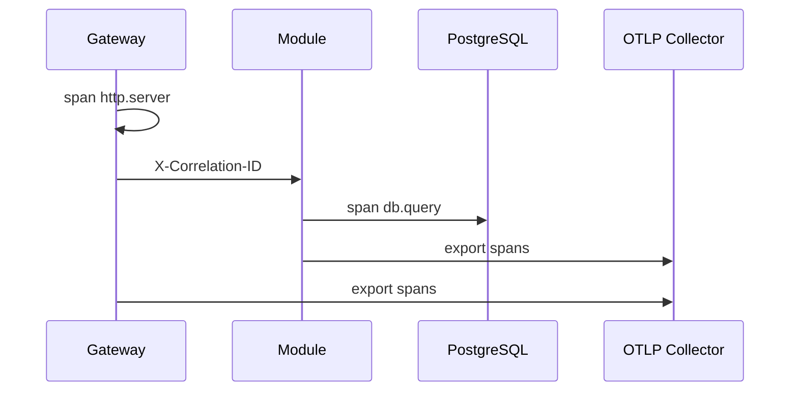
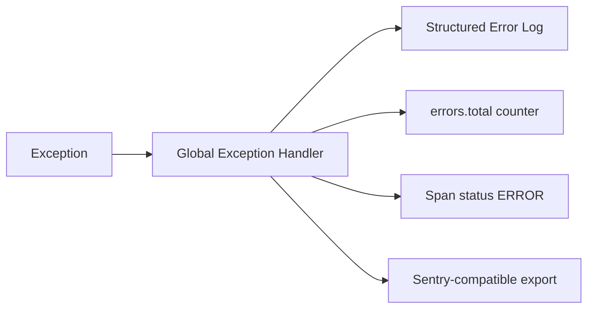
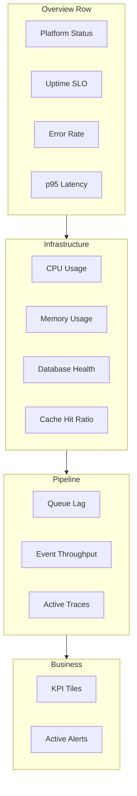
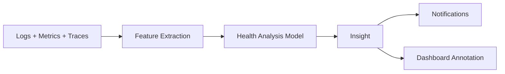

# Enterprise Observability Platform — Marpich

**Status:** Canonical — full-stack telemetry for production operations  
**Audience:** SRE, platform engineers, module authors, AI agents  
**Owner:** `shared/infrastructure/observability/` · `contexts/analytics/` · `core/health`  
**Companions:** [PERFORMANCE_STANDARD.md](PERFORMANCE_STANDARD.md) · [ENGINEERING_QUALITY_STANDARD.md](ENGINEERING_QUALITY_STANDARD.md) · [ENTERPRISE_AUDIT_PLATFORM.md](ENTERPRISE_AUDIT_PLATFORM.md) · [API_GATEWAY_ARCHITECTURE.md](API_GATEWAY_ARCHITECTURE.md) · [AI_PLATFORM_STANDARD.md](AI_PLATFORM_STANDARD.md)

**Law: Every service is observable. Logs, metrics, traces, and health signals export to a unified platform — never silent failures.**

---

## Platform position



---

## The law

```
Support:
  Application Logs · API Logs · Performance Metrics · Business Metrics
  Distributed Tracing · Health Checks · Memory Usage · CPU Usage
  Database Metrics · Queue Metrics · Cache Metrics
  Error Tracking · Exception Monitoring · Slow Query Detection · Alerting

Generate System Health Dashboard.
Generate AI Health Analysis.
```

**Observability ≠ Audit.** Audit is immutable compliance; observability is operational telemetry (sampled, shorter retention, SRE-focused). Both run in parallel.

---

## Signal types

Catalog: [`observability/METRICS_CATALOG.yaml`](observability/METRICS_CATALOG.yaml)

| Signal | Source | Export | Retention |
|--------|--------|--------|-----------|
| **Application logs** | Python `logging` (JSON) | OTLP logs / Loki | 30–90 days |
| **API logs** | `PlatformGatewayMiddleware` | Structured log + span | 30 days |
| **Performance metrics** | OTel histograms | Prometheus / OTLP | 13 months |
| **Business metrics** | Analytics `*` subscriber | OLAP + `/analytics/metrics` | Tenant policy |
| **Distributed tracing** | OTel FastAPI instrumentation | Tempo / Jaeger | 7–14 days |
| **Health checks** | `/api/v1/health`, context probes | Dashboard + alerts | Real-time |
| **Memory usage** | OTel host metrics | Prometheus | 13 months |
| **CPU usage** | OTel host metrics | Prometheus | 13 months |
| **Database metrics** | pg_stat + SQLAlchemy hooks | Prometheus | 13 months |
| **Queue metrics** | Outbox dispatcher | Prometheus counters | 13 months |
| **Cache metrics** | Redis INFO / client hooks | Prometheus | 13 months |
| **Error tracking** | Exception handler + Sentry-compatible | Error backend | 90 days |
| **Exception monitoring** | Uncaught + handled errors | Logs + metrics | 90 days |
| **Slow query detection** | SQLAlchemy event + threshold | Alert + trace span | 30 days |
| **Alerting** | Analytics `AlertRule` + infra rules | Notifications | — |

---

## Layer 1 — Telemetry bootstrap ✅

**Location:** `shared/infrastructure/observability/telemetry.py`  
**ADR:** [ADR-013](../adr/013-opentelemetry.md)

```env
OTEL_ENABLED=true
OTEL_SERVICE_NAME=marpich-backend
OTEL_SERVICE_VERSION=0.1.0
OTEL_ENVIRONMENT=production
OTEL_EXPORTER_OTLP_ENDPOINT=http://127.0.0.1:4318
OTEL_CONSOLE_EXPORT=false
OTEL_EXCLUDED_URLS=/api/v1/health,/api/docs,/api/redoc,/api/openapi.json
```

| Component | Role |
|-----------|------|
| `TracerProvider` | Distributed spans |
| `MeterProvider` | Histograms, counters, gauges |
| `FastAPIInstrumentor` | Auto route spans |
| `record_http_request()` | `http.server.duration` histogram |
| `annotate_active_span()` | tenant_id, correlation_id |

Install: `pip install marpich-backend[observability]`

---

## Layer 2 — Application logs

### Structured logging standard

Every log line includes:

```json
{
  "timestamp": "2026-07-03T10:00:00Z",
  "level": "INFO",
  "logger": "marpich.gateway",
  "message": "gateway request",
  "request_id": "uuid",
  "correlation_id": "uuid",
  "tenant_id": "acme",
  "context": "hospital",
  "duration_ms": 45.2,
  "status": 200
}
```

| Rule | Enforcement |
|------|-------------|
| JSON in production | Log formatter config |
| Never log secrets/PII | Redaction filter |
| `correlation_id` on every request | Gateway middleware |
| Context name in module logs | `logger = logging.getLogger("marpich.{context}")` |

Schema: [`observability/LOG_ENVELOPE.v1.json`](observability/LOG_ENVELOPE.v1.json)

---

## Layer 3 — API logs ✅ partial

**Source:** `PlatformGatewayMiddleware`

Captures per request:

- method, path, status, duration_ms
- request_id, correlation_id, tenant_id (header)
- Exported as structured log + OTel span + histogram

```python
logger.info("gateway request", extra={...})
record_http_request(method=..., path=..., status=..., duration_ms=...)
```

**Target:** Also emit `api.request.completed` integration event for audit (separate platform).

---

## Layer 4 — Performance metrics ✅ partial

| Metric | Type | Labels |
|--------|------|--------|
| `http.server.duration` | histogram (ms) | method, route, status |
| `http.server.requests` | counter | method, route, status |
| `db.client.duration` | histogram | operation, table 📋 |
| `cache.hit_ratio` | gauge | tenant_id 📋 |
| `queue.outbox.lag` | gauge | context 📋 |
| `process.cpu.utilization` | gauge | host 📋 |
| `process.memory.usage` | gauge | host 📋 |

SLO targets in [PERFORMANCE_STANDARD.md](PERFORMANCE_STANDARD.md): p95 API < 300ms, p99 < 1s.

---

## Layer 5 — Business metrics ✅

**Owner:** `contexts/analytics/` — subscribes to `*`, increments KPI counters.

Default metrics (tenant provision):

| Key | Pattern |
|-----|---------|
| `events.total` | `*` |
| `users.created` | `identity.user.created` |
| `users.logged_in` | `identity.user.logged_in` |
| `encounters.completed` | `hospital.encounter.completed` |
| `workflows.completed` | `workflow.process.completed` |
| `documents.uploaded` | `documents.document.uploaded` |

```
GET /api/v1/analytics/metrics
GET /api/v1/analytics/metrics/{key}/timeseries
GET /api/v1/analytics/events/summary
```

Modules register custom metrics via event patterns — never local KPI tables.

---

## Layer 6 — Distributed tracing ✅



| Span attribute | Value |
|----------------|-------|
| `marpich.tenant_id` | From JWT/header |
| `marpich.correlation_id` | Propagated |
| `marpich.context` | Bounded context name |
| `db.statement` | Parameterized query (no secrets) 📋 |

Trace lookup: Grafana Tempo / Jaeger by `correlation_id`.

---

## Layer 7 — Health checks ⚠️ partial

### Platform liveness ✅

```
GET /api/v1/health
→ { "status": "ok", "service": "marpich-backend" }
```

### Context readiness 📋

Each platform context exposes:

```
GET /api/v1/{context}/health
→ { "status": "healthy|degraded|unhealthy", "checks": [...] }
```

| Check | Pass criteria |
|-------|---------------|
| `database` | PostgreSQL ping < 100ms |
| `redis` | PING OK |
| `outbox` | Lag < threshold |
| `dependencies` | Upstream connector reachable |

Gateway excludes unhealthy upstreams — see [API_GATEWAY_ARCHITECTURE.md](API_GATEWAY_ARCHITECTURE.md).

Dashboard definition: [`observability/HEALTH_DASHBOARD.v1.yaml`](observability/HEALTH_DASHBOARD.v1.yaml)

---

## Layer 8 — Infrastructure metrics 📋

### CPU & memory

OTel host metrics or node_exporter:

| Metric | Alert threshold |
|--------|-----------------|
| `process.cpu.utilization` | > 80% for 5m |
| `process.memory.usage` | > 85% for 5m |
| `jvm.heap.used` | N/A (Python) |

### Database metrics

| Metric | Source |
|--------|--------|
| `db.connections.active` | pg_stat_activity |
| `db.connections.max` | pool config |
| `db.transactions.rate` | pg_stat_database |
| `db.deadlocks.total` | pg_stat_database |
| `db.replication.lag` | replica lag |

### Queue metrics (outbox)

| Metric | Source |
|--------|--------|
| `queue.outbox.pending` | OutboxDispatcher |
| `queue.outbox.lag_seconds` | oldest unpublished |
| `queue.outbox.failures` | dead letter count |
| `queue.consumer.throughput` | events/sec |

### Cache metrics (Redis)

| Metric | Source |
|--------|--------|
| `cache.hit_ratio` | hits / (hits + misses) |
| `cache.memory.used` | Redis INFO |
| `cache.connections.active` | pool |
| `cache.evictions.total` | Redis INFO |

---

## Layer 9 — Error & exception tracking 📋



| Field | Captured |
|-------|----------|
| exception.type | Class name |
| exception.message | Sanitized message |
| stacktrace | Full trace (no PII) |
| correlation_id | Request link |
| tenant_id | Scope |
| context | Module name |

**Rule:** Never swallow exceptions silently. Log + metric + span status.

---

## Layer 10 — Slow query detection 📋

SQLAlchemy event listener:

```python
# Threshold: settings.slow_query_ms (default 500)
if duration_ms > threshold:
    logger.warning("slow query", extra={...})
    record_slow_query(duration_ms, statement_hash)
    annotate_active_span(db.slow_query=True)
```

| Action | Trigger |
|--------|---------|
| Log | > 500ms |
| Metric | `db.query.slow` counter |
| Alert | > 2s or N slow/min |
| Trace annotation | Always on slow |

Optional: `pg_stat_statements` for top-N analysis in dashboard.

---

## Layer 11 — Alerting ✅ partial

Two alert paths:

### Business alerts (Analytics) ✅

```
POST /api/v1/analytics/alerts
{ "metric_key": "users.logged_in", "threshold": 1000, "operator": "gt" }
→ analytics.alert.triggered → Notification Platform
```

### Infrastructure alerts 📋

Prometheus Alertmanager rules → Notification Platform:

| Alert | Severity |
|-------|----------|
| High error rate | critical |
| Slow query spike | warning |
| Outbox lag > 5min | critical |
| CPU > 80% | warning |
| Health check failed | critical |

**Rule:** All alerts route through [ENTERPRISE_NOTIFICATION_PLATFORM.md](ENTERPRISE_NOTIFICATION_PLATFORM.md) — no module-local email.

---

## System Health Dashboard

**Definition:** [`observability/HEALTH_DASHBOARD.v1.yaml`](observability/HEALTH_DASHBOARD.v1.yaml)



### REST access ✅

```
GET /api/v1/analytics/dashboards          → list
GET /api/v1/analytics/dashboards/{id}     → widget data
```

Default tenant dashboard: **Overview** (provisioned on `platform.tenant.provisioned`).

### Platform ops dashboard 📋

Separate global dashboard (non-tenant):

```
GET /api/v1/observability/health-dashboard   📋 planned
Permission: observability.dashboard.read
```

---

## AI Health Analysis 📋

**Owner:** AI Service — analyzes telemetry for root cause and predictive insight.



| Capability | Input | Output |
|------------|-------|--------|
| **Anomaly detection** | Metric timeseries | `ai.insight.generated` |
| **Root cause analysis** | Error spike + traces | RCA summary |
| **Predictive alert** | Trend on queue lag | Pre-emptive notification |
| **SLO breach forecast** | p95 trend | Warning 24h ahead |
| **Incident summary** | Log + trace bundle | Natural language report |

### API 📋

```
POST /api/v1/ai/health/analyze
{ "window": "1h", "signals": ["errors", "latency", "queue"] }
→ { "status": "degraded", "findings": [...], "recommendations": [...] }

GET /api/v1/ai/insights?category=health
```

### Events

| Event | Subscribers |
|-------|-------------|
| `ai.health.anomaly.detected` | notifications, analytics |
| `ai.health.rca.completed` | notifications |
| `analytics.alert.triggered` | ai (optional auto-RCA) |

**Rule:** AI health analysis reads observability data — never writes to audit log except via standard AI audit events.

---

## Permissions

| Permission | Scope |
|------------|-------|
| `analytics.metrics.read` | Business metrics |
| `analytics.dashboards.read` | Tenant dashboards |
| `analytics.alerts.write` | Alert rules |
| `analytics.events.read` | Event volume |
| `observability.logs.read` | Application/API logs 📋 |
| `observability.traces.read` | Distributed traces 📋 |
| `observability.dashboard.read` | Platform health dashboard 📋 |
| `observability.admin` | Infra alert config 📋 |

---

## Module integration

### Required

1. Structured logging with `correlation_id`, `tenant_id`, context name
2. Publish integration events (feeds business metrics)
3. Propagate `X-Correlation-ID` on outbound HTTP
4. Never implement local metrics stores — use Analytics + OTel

### Forbidden

```python
# ❌ FORBIDDEN
print("debug")                    # unstructured
except Exception: pass            # silent failure
local_prometheus_registry = ...   # module-owned metrics

# ✅ ALLOWED
logger.info("order placed", extra={"order_id": id, "tenant_id": tid})
# OTel auto-instruments FastAPI routes
# Business KPI via integration events → Analytics
```

---

## Retention policy

| Signal | Default retention |
|--------|-------------------|
| Traces | 7 days |
| API logs | 30 days |
| Application logs | 90 days |
| Infra metrics | 13 months |
| Business metrics | Tenant-configurable |
| Error events | 90 days |

---

## Implementation status

| Area | Today | Target |
|------|-------|--------|
| OTel bootstrap + FastAPI | ✅ | SQLAlchemy + httpx instrumentation |
| Gateway API logs + histogram | ✅ | Full API log envelope |
| Platform `/health` | ✅ | Deep readiness checks |
| Business metrics + dashboards | ✅ | Custom metric registration API |
| Business alerting | ✅ | Multi-channel via notifications |
| Structured log schema | ⚠️ | JSON formatter production-wide |
| Context health probes | ⚠️ partial | Full dependency matrix |
| DB / queue / cache metrics | 📋 | Prometheus exporters |
| CPU / memory host metrics | 📋 | OTel host or node_exporter |
| Slow query detection | 📋 | SQLAlchemy listener |
| Error tracking export | 📋 | Sentry-compatible |
| Platform health dashboard API | 📋 | `/observability/health-dashboard` |
| AI health analysis | 📋 | `/ai/health/analyze` |

Legend: ✅ implemented · ⚠️ partial · 📋 designed

---

## Module checklist

```markdown
## Observability checklist

- [ ] Structured logging with correlation_id + tenant_id
- [ ] No silent exception swallowing
- [ ] Integration events for business KPIs
- [ ] X-Correlation-ID propagated on outbound calls
- [ ] Context /health endpoint with dependency checks
- [ ] No local metrics or log aggregation
- [ ] Slow queries logged when > threshold
```

---

## Enforcement

| Mechanism | Location |
|-----------|----------|
| This document | `docs/architecture/ENTERPRISE_OBSERVABILITY_PLATFORM.md` |
| Metrics catalog | `docs/architecture/observability/METRICS_CATALOG.yaml` |
| Health dashboard | `docs/architecture/observability/HEALTH_DASHBOARD.v1.yaml` |
| Log envelope | `docs/architecture/observability/LOG_ENVELOPE.v1.json` |
| OTel bootstrap | `shared/infrastructure/observability/telemetry.py` |
| Analytics service | `backend/contexts/analytics/` |
| ADR | ADR-043 |
| Cursor rule | `.cursor/rules/marpich-observability-platform.mdc` |

---

## Related

| Document | Role |
|----------|------|
| [ADR-013](../adr/013-opentelemetry.md) | OTel decision |
| [PERFORMANCE_STANDARD.md](PERFORMANCE_STANDARD.md) | SLO targets |
| [ENGINEERING_QUALITY_STANDARD.md](ENGINEERING_QUALITY_STANDARD.md) | Observable quality gate |
| [ENTERPRISE_AUDIT_PLATFORM.md](ENTERPRISE_AUDIT_PLATFORM.md) | Compliance vs ops telemetry |
| [ENTERPRISE_NOTIFICATION_PLATFORM.md](ENTERPRISE_NOTIFICATION_PLATFORM.md) | Alert delivery |
| [AI_PLATFORM_STANDARD.md](AI_PLATFORM_STANDARD.md) | AI health analysis |
| [API_GATEWAY_ARCHITECTURE.md](API_GATEWAY_ARCHITECTURE.md) | API logs + upstream health |
