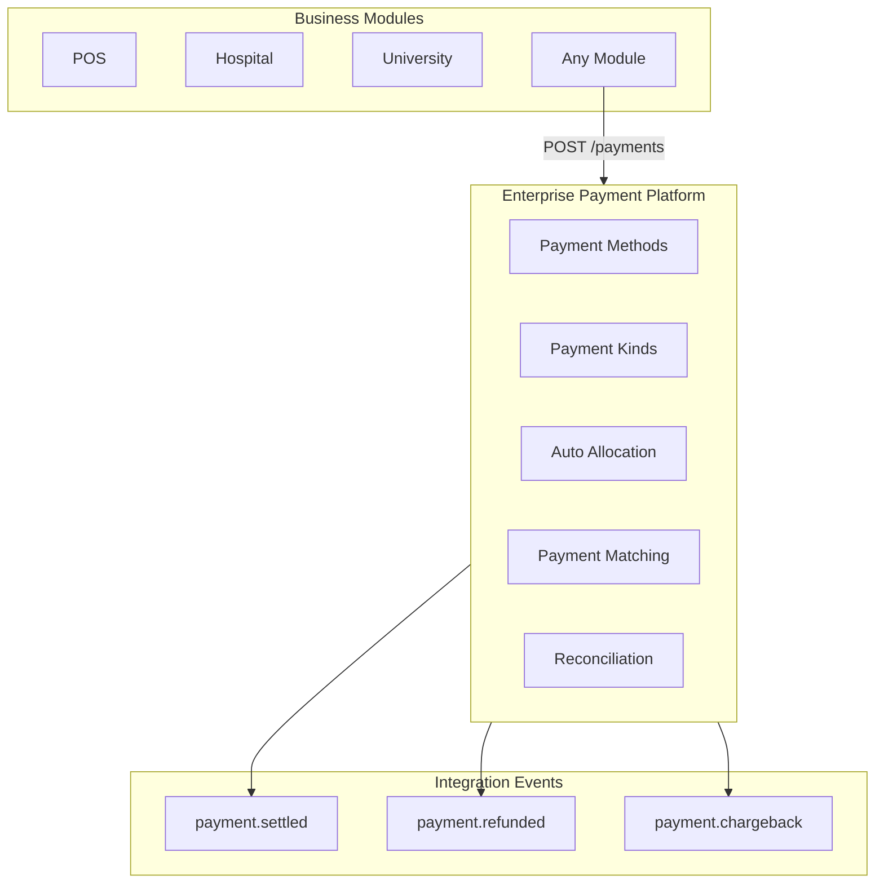

# Enterprise Payment Platform — Marpich

**Status:** Canonical — unified payment processing for all business modules  
**Audience:** CFO, payments ops, platform engineers, module authors, AI agents  
**Owner context:** `backend/contexts/financial_kernel/` (Payment Engine)  
**Companions:** [ENTERPRISE_FINANCIAL_KERNEL.md](ENTERPRISE_FINANCIAL_KERNEL.md) · [ENTERPRISE_TREASURY.md](ENTERPRISE_TREASURY.md) · [financial_kernel/PAYMENT_CATALOG.yaml](financial_kernel/PAYMENT_CATALOG.yaml)

**Law: All modules process payments through Financial Kernel. Never duplicate payment logic.**

---

## Platform position



---

## Capabilities

| Capability | Description |
|---|---|
| **Cash Payment** | `payment_method: cash` |
| **Bank Transfer** | `payment_method: bank_transfer` |
| **Cheque** | `payment_method: cheque` |
| **Card** | `payment_method: card` |
| **Wallet** | `payment_method: wallet` |
| **Mobile Money** | `payment_method: mobile_money` |
| **Split Payments** | `POST /payments/split` — multiple methods per total |
| **Partial Payments** | `paid_amount` < `amount` or `POST /{id}/partial` |
| **Installments** | `POST /payments/installments` — scheduled plan |
| **Advance Payments** | `POST /payments/advance` |
| **Refund** | `POST /{id}/refund` |
| **Chargeback** | `POST /{id}/chargeback` |
| **Auto Allocation** | FIFO across `open_items` on create |
| **Payment Matching** | `POST /matching` — match to bank items |
| **Reconciliation** | `POST /reconciliation` — full recon run |

---

## Payment methods

`cash` · `bank_transfer` · `cheque` · `card` · `wallet` · `mobile_money`

## Payment kinds

`standard` · `split` · `partial` · `installment` · `advance`

## Payment statuses

`pending` → `partial` → `allocated` → `settled` | `refunded` | `chargeback`

---

## API

Prefix: `/api/v1/financial-kernel/payments`

| Method | Path | Description |
|---|---|---|
| POST | `/` | Create payment (with optional auto-allocation) |
| POST | `/split` | Split payment across methods |
| POST | `/advance` | Advance payment |
| POST | `/installments` | Installment plan |
| GET | `/` | List payments |
| GET | `/{id}` | Payment detail (+ splits) |
| POST | `/{id}/partial` | Record partial payment |
| POST | `/{id}/allocate` | Manual/auto allocation |
| POST | `/{id}/settle` | Settle when fully paid |
| POST | `/{id}/refund` | Refund |
| POST | `/{id}/chargeback` | Chargeback |
| POST | `/matching` | Match payments to bank |
| POST | `/reconciliation` | Payment reconciliation |
| GET | `/reconciliation/list` | List reconciliations |

---

## Auto allocation example

```json
POST /api/v1/financial-kernel/payments
{
  "source_context": "pos",
  "source_document_id": "sale-100",
  "payment_method": "cash",
  "amount": 300,
  "reference": "CASH-100",
  "open_items": [
    {"document_id": "inv-1", "amount_due": 200, "due_date": "2025-07-01"},
    {"document_id": "inv-2", "amount_due": 150, "due_date": "2025-07-15"}
  ]
}
```

FIFO allocates 200 to inv-1, 100 to inv-2.

---

## Integration events

| Event | When |
|---|---|
| `financial_kernel.payment.settled` | Payment fully settled |
| `financial_kernel.payment.allocated` | Allocations applied |
| `financial_kernel.payment.refunded` | Refund processed |
| `financial_kernel.payment.chargeback` | Chargeback recorded |
| `financial_kernel.payment.reconciled` | Reconciliation completed |

---

## Gateway delegation

Card/wallet/mobile money gateway connectors live in **Integration Platform** (`payment_gateway` connector). Kernel records payment state; connector handles PSP API calls.

---

## ADR

See [ADR-054](../adr/054-enterprise-payment-platform.md).
