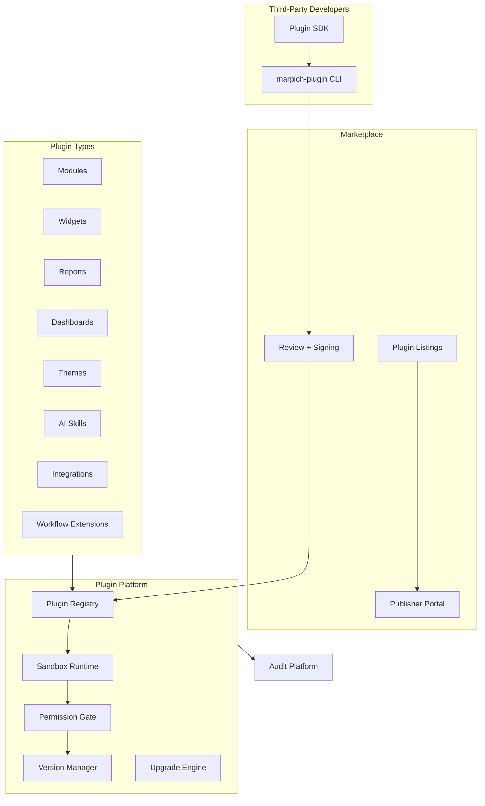
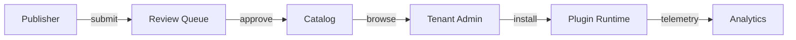

# Enterprise Plugin Platform — Marpich

**Status:** Canonical — sandboxed third-party extensions, marketplace, SDK  
**Audience:** Platform engineers, third-party developers, module authors, AI agents  
**Owner context:** `backend/contexts/plugins/`  
**Companions:** [MODULE_SYSTEM.md](MODULE_SYSTEM.md) · [INTEGRATION_PLATFORM.md](INTEGRATION_PLATFORM.md) · [ENTERPRISE_FEATURE_FLAG_SYSTEM.md](ENTERPRISE_FEATURE_FLAG_SYSTEM.md) · [ENTERPRISE_POLICY_ENGINE.md](ENTERPRISE_POLICY_ENGINE.md) · [ENTERPRISE_AUDIT_PLATFORM.md](ENTERPRISE_AUDIT_PLATFORM.md)

**Law: Third-party extensions ship ONLY through the Plugin Platform. No direct module imports, no unsigned packages, no bypassing sandbox or permission grants.**

---

## Platform position



---

## The law

```
Third-party developers can build:
  Modules · Widgets · Reports · Dashboards · Themes · AI Skills · Integrations · Workflow Extensions

Plugins must be:
  Sandboxed · Versioned · Signed · Permission Controlled · Upgradeable

Generate Plugin SDK.
Generate Marketplace Architecture.
```

**Internal modules** (first-party) use `IModuleManifest` via Module Registry. **Third-party plugins** use `IPluginManifest` via Plugin Platform — same extension points, stricter sandbox and signing.

---

## Plugin types

| Type | ID prefix | Extension point | Example |
|------|-----------|-----------------|---------|
| **Module** | `module` | `platform.module.register` | Industry add-on |
| **Widget** | `widget` | `ui.dashboard.widget` | KPI card |
| **Report** | `report` | `analytics.report.template` | Custom P&L |
| **Dashboard** | `dashboard` | `analytics.dashboard.layout` | Executive view |
| **Theme** | `theme` | `ui.theme.override` | Brand pack |
| **AI Skill** | `ai_skill` | `ai.skill.register` | Domain copilot |
| **Integration** | `integration` | `integration.connector.register` | Custom ERP bridge |
| **Workflow Extension** | `workflow_extension` | `workflow.hook.register` | Approval step |

Catalog: [`plugins/PLUGIN_CATALOG.yaml`](plugins/PLUGIN_CATALOG.yaml)

---

## Plugin manifest (SDK contract)

Schema: [`plugins/PLUGIN_MANIFEST.v1.json`](plugins/PLUGIN_MANIFEST.v1.json)

```json
{
  "pluginId": "com.acme.sales-widget",
  "pluginVersion": "1.2.0",
  "pluginType": "widget",
  "displayName": "Acme Sales KPI",
  "publisher": { "id": "com.acme", "name": "Acme Corp" },
  "permissions": ["analytics.read", "sales.orders.read"],
  "extensionPoints": ["ui.dashboard.widget"],
  "sandbox": {
    "network": false,
    "filesystem": "read_only",
    "maxMemoryMb": 128
  },
  "signature": {
    "algorithm": "ed25519",
    "publicKeyFingerprint": "sha256:abc...",
    "packageChecksum": "sha256:def..."
  }
}
```

SDK package: `packages/plugin-sdk/` — types, manifest validator, publish CLI.

---

## Sandbox profiles

Definition: [`plugins/SANDBOX_PROFILE.v1.yaml`](plugins/SANDBOX_PROFILE.v1.yaml)

| Profile | Network | Filesystem | Memory | Use case |
|---------|---------|------------|--------|----------|
| `strict` | deny | read_only | 64 MB | Widgets, themes |
| `standard` | allowlist | read_only | 256 MB | Reports, dashboards |
| `integration` | allowlist | read_write_temp | 512 MB | Connectors |
| `module` | allowlist | read_write_temp | 1024 MB | Full modules |

**Rule:** Runtime enforces sandbox before any plugin code executes. Violations → `plugin.sandbox.violation` event + auto-disable.

---

## Signing and trust

1. Developer builds package → `marpich-plugin pack`
2. Platform CI signs with publisher key → `marpich-plugin sign`
3. Marketplace review → publish listing
4. Tenant install → signature verified before activation

| Trust level | Requirement |
|-------------|-------------|
| **Community** | Self-signed + automated scan |
| **Verified** | Platform review + publisher KYC |
| **Enterprise** | Customer-approved publisher allowlist |

Unsigned packages are **rejected** at install time.

---

## Permission control

Plugins declare required permissions in manifest. Tenant admin grants subset at install:

```
POST /api/v1/plugins/{pluginId}/install
{ "granted_permissions": ["analytics.read"], "config": {} }
```

Runtime checks permissions via Authorization PDP before every extension invocation. Policy Engine may add business rules on top.

---

## Versioning and upgrades

- Semver enforced (`major.minor.patch`)
- `PluginVersion` immutable history per plugin
- Upgrade path: `GET /plugins/{id}/upgrade-path` → compatible versions
- `POST /plugins/{id}/upgrade` — atomic swap with rollback snapshot
- Breaking major upgrades require explicit tenant approval

---

## Marketplace architecture

Full spec: [`plugins/MARKETPLACE_ARCHITECTURE.md`](plugins/MARKETPLACE_ARCHITECTURE.md)



| Surface | API |
|---------|-----|
| Browse catalog | `GET /api/v1/plugins/marketplace/listings` |
| Plugin detail | `GET /api/v1/plugins/marketplace/listings/{pluginId}` |
| Publisher submit | `POST /api/v1/plugins/marketplace/submissions` |
| Tenant install | `POST /api/v1/plugins/{pluginId}/install` |
| Installed plugins | `GET /api/v1/plugins/installed` |
| Upgrade | `POST /api/v1/plugins/{pluginId}/upgrade` |
| Uninstall | `DELETE /api/v1/plugins/{pluginId}/install` |
| Marketplace dashboard | `GET /api/v1/plugins/marketplace/dashboard` |

---

## Runtime invocation

Modules and UI call extensions via port — never import plugin code directly:

```python
from shared.application.ports.plugins import IPluginRuntime

runtime = get_plugin_runtime()
widgets = await runtime.list_extensions(
    tenant_id=tenant_id,
    extension_point="ui.dashboard.widget",
)
result = await runtime.invoke(
    tenant_id=tenant_id,
    plugin_id="com.acme.sales-widget",
    extension_point="ui.dashboard.widget",
    payload={"dashboard_id": "executive"},
)
```

Port: `IPluginRuntime` in `shared/application/ports/plugins.py`

---

## REST API — `/api/v1/plugins`

| Method | Path | Permission | Description |
|--------|------|------------|-------------|
| GET | `/` | `plugins.read` | Registry (publisher view) |
| POST | `/` | `plugins.publish` | Register plugin package |
| GET | `/installed` | `plugins.read` | Tenant installations |
| GET | `/{pluginId}` | `plugins.read` | Plugin detail + versions |
| POST | `/{pluginId}/install` | `plugins.install` | Install with permission grants |
| POST | `/{pluginId}/upgrade` | `plugins.install` | Upgrade to version |
| DELETE | `/{pluginId}/install` | `plugins.install` | Uninstall |
| POST | `/{pluginId}/verify` | `plugins.admin` | Re-verify signature |
| POST | `/invoke` | `plugins.invoke` | Sandbox invocation |
| GET | `/marketplace/listings` | `plugins.marketplace.read` | Browse marketplace |
| GET | `/marketplace/listings/{pluginId}` | `plugins.marketplace.read` | Listing detail |
| POST | `/marketplace/submissions` | `plugins.publish` | Submit for review |
| GET | `/marketplace/dashboard` | `plugins.marketplace.read` | Marketplace dashboard |

---

## Events

| Event | When |
|-------|------|
| `plugin.registered` | New plugin in registry |
| `plugin.published` | Marketplace listing live |
| `plugin.installed` | Tenant activated plugin |
| `plugin.upgraded` | Version bump applied |
| `plugin.uninstalled` | Tenant removed plugin |
| `plugin.sandbox.violation` | Sandbox breach |
| `plugin.signature.invalid` | Signature check failed |

Subscribers: audit, compliance, notifications, analytics.

---

## Gateway integration

Route registry may gate module routes behind plugin activation:

```yaml
- prefix: /api/v1/acme-sales
  required_plugin: com.acme.sales-module
```

Gateway checks `GET /plugins/installed` before upstream proxy.

---

## vs related platforms

| Platform | Role |
|----------|------|
| **Module Registry** | First-party industry modules |
| **Plugin Platform** | Third-party signed extensions |
| **Integration Platform** | External system connectors (plugin type `integration` delegates here) |
| **Feature Flags** | Capability gates — `plugin.{id}.enabled` |
| **Policy Engine** | Business rules on plugin actions |
| **Audit** | Immutable install/invoke evidence |

---

## Module checklist

```markdown
## Plugin checklist

- [ ] Extension via IPluginRuntime — no direct plugin imports
- [ ] Manifest in PLUGIN_MANIFEST.v1.json
- [ ] Permissions declared and granted at install
- [ ] Sandbox profile assigned
- [ ] Signature verified before activation
- [ ] Upgrade path tested
- [ ] Audit events on install/invoke
```

---

## Implementation status

| Area | Today | Target |
|------|-------|--------|
| Plugins context | ✅ | `contexts/plugins/` |
| Plugin types (8) | ✅ | All types in catalog |
| Sandbox profiles | ✅ | 4 profiles enforced |
| Signing verification | ✅ | Checksum + fingerprint |
| Permission grants | ✅ | Install-time grants |
| Versioning + upgrade | ✅ | Semver + upgrade path |
| Marketplace API | ✅ | Listings, submissions, dashboard |
| Plugin SDK package | ✅ | `packages/plugin-sdk/` |
| IPluginRuntime port | ✅ | invoke + list_extensions |
| Gateway plugin gate | 📋 | Route registry integration |
| WASM/isolate runtime | 📋 | Production sandbox (stub today) |
| Publisher portal UI | 📋 | Admin frontend |

---

## Enforcement

| Mechanism | Location |
|-----------|----------|
| This document | `docs/architecture/ENTERPRISE_PLUGIN_PLATFORM.md` |
| Catalog | `docs/architecture/plugins/PLUGIN_CATALOG.yaml` |
| Manifest schema | `docs/architecture/plugins/PLUGIN_MANIFEST.v1.json` |
| Sandbox profiles | `docs/architecture/plugins/SANDBOX_PROFILE.v1.yaml` |
| Marketplace | `docs/architecture/plugins/MARKETPLACE_ARCHITECTURE.md` |
| SDK | `packages/plugin-sdk/` |
| Context | `backend/contexts/plugins/` |
| ADR | ADR-047 |
| Cursor rule | `.cursor/rules/marpich-plugin-platform.mdc` |

---

## Related

| Document | Role |
|----------|------|
| [MODULE_SYSTEM.md](MODULE_SYSTEM.md) | First-party module composition |
| [INTEGRATION_PLATFORM.md](INTEGRATION_PLATFORM.md) | External connectors |
| [ENTERPRISE_FEATURE_FLAG_SYSTEM.md](ENTERPRISE_FEATURE_FLAG_SYSTEM.md) | Plugin enablement flags |
| [ENTERPRISE_AUDIT_PLATFORM.md](ENTERPRISE_AUDIT_PLATFORM.md) | Install/invoke audit trail |
| [API_GATEWAY_ARCHITECTURE.md](API_GATEWAY_ARCHITECTURE.md) | Route-level plugin gates |

**Plugins extend the platform. Modules compose the platform. Integrations connect the platform.**
