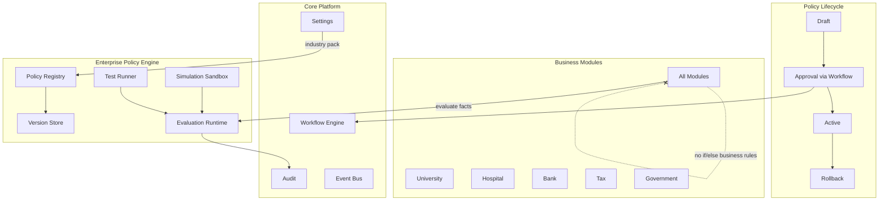
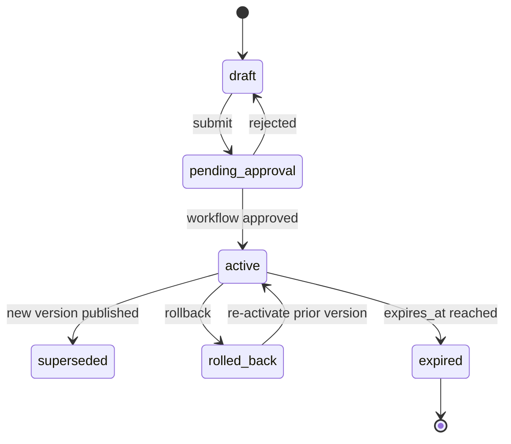

# Enterprise Policy Engine — Marpich

**Status:** Canonical — configurable business rules; no hardcoded domain logic  
**Audience:** Product, compliance, platform engineers, module authors, AI agents  
**Owner context:** `backend/contexts/policy/` (planned) · complements `identity` authorization PDP  
**Companions:** [SECURITY_STANDARD.md](SECURITY_STANDARD.md) · [ENTERPRISE_WORKFLOW_ENGINE.md](ENTERPRISE_WORKFLOW_ENGINE.md) · [INDUSTRY_CATALOG.md](INDUSTRY_CATALOG.md) · [CORE_PLATFORM.md](CORE_PLATFORM.md) · [ENTERPRISE_AUDIT_PLATFORM.md](ENTERPRISE_AUDIT_PLATFORM.md)

**Law: Policies are configurable. No hardcoded business rules in modules. Every module reads policies from the Policy Engine.**

---

## Platform position



---

## Policy Engine vs Authorization

| Concern | Service | Question |
|---------|---------|----------|
| **Authorization** (Identity PDP) | `POST /authorization/check` | *May* this user perform this action? |
| **Policy Engine** | `POST /policies/evaluate` | *What rule* applies — limit, rate, path, validation, approval requirement? |

Both are required. Authorization gates access; Policy Engine supplies **configurable business outcomes**.

---

## The law

```
Policies are CONFIGURABLE.
No hardcoded business rules in modules.

Every module reads policies from Policy Engine.

Support:
  Versioning · Effective Date · Expiration · Priority
  Conditions · Exceptions · Approval · Testing · Simulation · Rollback
```

---

## Industry policy domains

Catalog: [`policy/POLICY_DOMAIN_CATALOG.yaml`](policy/POLICY_DOMAIN_CATALOG.yaml)

| Domain | Examples | Namespace |
|--------|----------|-----------|
| **University policies** | Grading scale, enrollment caps, academic integrity | `education.*` |
| **Hospital policies** | Admission criteria, PHI access tiers, clinical pathways | `healthcare.*` |
| **Bank policies** | Lending limits, KYC thresholds, transaction caps | `banking.*` |
| **Exchange policies** | Trading hours, margin rules, settlement windows | `exchange.*` |
| **Tax policies** | VAT rates, withholding rules, filing deadlines | `tax.*` |
| **Construction policies** | Safety compliance, permit thresholds, milestone gates | `construction.*` |
| **Government policies** | Procurement thresholds, citizen service SLAs, classification | `government.*` |

Policies are tenant-scoped. Industry packs **seed** default policy sets on `platform.tenant.provisioned` — tenants customize without code changes.

---

## Policy definition model

Schema: [`policy/POLICY_DEFINITION_SCHEMA.v1.yaml`](policy/POLICY_DEFINITION_SCHEMA.v1.yaml)

```yaml
policy:
  id: pol-uuid
  tenant_id: acme
  domain: hospital
  key: admission.eligibility
  name: Emergency Admission Criteria
  version: 3
  status: active          # draft | pending_approval | active | superseded | expired | rolled_back

  effective_from: "2026-01-01T00:00:00Z"
  expires_at: "2027-01-01T00:00:00Z"    # null = no expiration
  priority: 100                          # higher wins on conflict

  conditions:
    - field: encounter.type
      operator: eq
      value: emergency
    - field: patient.age
      operator: gte
      value: 18

  rules:
    - outcome: allow_admission
      parameters:
        required_documents: [id, insurance_card]
        max_wait_minutes: 30

  exceptions:
    - id: exc-1
      name: Pediatric override
      conditions:
        - field: patient.age
          operator: lt
          value: 18
      rules:
        - outcome: allow_admission
          parameters:
            required_documents: [guardian_consent]

  approval:
    required_for_publish: true
    workflow_key: policy.hospital.admission.publish

  metadata:
    created_by: user-uuid
    approved_by: user-uuid
    change_reason: "Updated wait time SLA"
```

---

## Lifecycle capabilities



| Capability | Mechanism |
|------------|-----------|
| **Versioning** | Immutable version records; edit = new version |
| **Effective date** | `effective_from` — evaluation ignores until active window |
| **Expiration** | `expires_at` — auto-supersede; scheduler job |
| **Priority** | Numeric; highest matching policy wins |
| **Conditions** | Fact matcher on evaluation context |
| **Exceptions** | Higher-precedence override block within same policy |
| **Approval** | Workflow Engine — no direct publish without approval when required |
| **Testing** | Test cases with expected outcomes — CI + admin UI |
| **Simulation** | Dry-run evaluate with hypothetical facts — no side effects |
| **Rollback** | Activate prior version; audit + event |

---

## Evaluation runtime

### Request

```
POST /api/v1/policies/evaluate
Permission: service token or policies.evaluate

{
  "domain": "bank",
  "policy_key": "lending.single_exposure_limit",
  "facts": {
    "customer.tier": "gold",
    "loan.amount": 500000,
    "currency": "USD",
    "organization_id": "branch-01"
  },
  "as_of": "2026-07-03T10:00:00Z"
}
```

### Response

```json
{
  "data": {
    "matched": true,
    "policy_id": "pol-uuid",
    "version": 3,
    "outcome": "within_limit",
    "parameters": { "max_amount": 750000, "requires_committee": false },
    "applied_exception": null,
    "evaluation_trace": [
      { "step": "condition", "field": "customer.tier", "result": true }
    ]
  }
}
```

### Module integration (required)

```python
# ✅ REQUIRED — read from Policy Engine
decision = await policy_client.evaluate(
    domain="hospital",
    policy_key="admission.eligibility",
    facts={"encounter.type": "emergency", "patient.age": 45},
)
if not decision.matched:
    raise DomainError("No applicable admission policy")

# ❌ FORBIDDEN — hardcoded business rule
if encounter.type == "emergency" and patient.age >= 18:
    max_wait = 30  # NEVER hardcode
```

### Port interface

```python
# shared/application/ports/policy.py
class IPolicyEvaluator(Protocol):
    async def evaluate(
        self,
        *,
        tenant_id: str,
        domain: str,
        policy_key: str,
        facts: dict,
        as_of: datetime | None = None,
    ) -> PolicyDecision: ...
```

Modules depend on the **port** — never on policy storage.

---

## Simulation

```
POST /api/v1/policies/simulate
Permission: policies.simulate

{
  "domain": "tax",
  "policy_key": "vat.rate",
  "facts": { "jurisdiction": "IR", "product.category": "medical" },
  "candidate_versions": [4, 5]
}
```

Returns side-by-side outcomes for version comparison — used before publish and in admin what-if UI.

**Rule:** Simulation never writes audit entries as production decisions (logged as `policy.simulation.executed` only).

---

## Testing

```
POST /api/v1/policies/{policy_id}/test
Permission: policies.test

{
  "test_cases": [
    {
      "name": "Gold tier within limit",
      "facts": { "customer.tier": "gold", "loan.amount": 400000 },
      "expect": { "outcome": "within_limit" }
    }
  ]
}
```

| Test type | When |
|-----------|------|
| **Unit test cases** | Policy author saves draft |
| **Regression suite** | Before approval submit |
| **CI contract** | `backend/tests/contracts/policy/` — pack policies must pass |

Failed tests block approval submission when `approval.require_passing_tests: true`.

---

## Approval workflow

Policies requiring approval route through [ENTERPRISE_WORKFLOW_ENGINE.md](ENTERPRISE_WORKFLOW_ENGINE.md):

```
draft → POST /policies/{id}/submit-approval
     → workflow.process.started (policy.publish.approval)
     → compliance officer task
     → approved → policy.version.activated
     → rejected → draft (with reason)
```

| Event | Subscribers |
|-------|-------------|
| `policy.version.submitted` | workflow, audit |
| `policy.version.activated` | audit, modules (cache invalidate) |
| `policy.version.rolled_back` | audit, notifications |
| `policy.evaluation.denied` | audit, analytics |

---

## Rollback

```
POST /api/v1/policies/{policy_id}/rollback
{ "target_version": 2, "reason": "Regulatory correction" }
Permission: policies.admin
```

| Step | Action |
|------|--------|
| 1 | Validate target version exists |
| 2 | Mark current version `superseded` |
| 3 | Activate target version with new `effective_from` |
| 4 | Emit `policy.version.rolled_back` |
| 5 | Audit with old/new version + reason |

Modules invalidate policy cache on activation/rollback events.

---

## REST API — `/api/v1/policies`

| Method | Path | Permission | Description |
|--------|------|------------|-------------|
| GET | `/domains` | `policies.read` | List policy domains |
| GET | `/` | `policies.read` | List policies (filter domain, status) |
| GET | `/{id}` | `policies.read` | Policy + active version |
| GET | `/{id}/versions` | `policies.read` | Version history |
| POST | `/` | `policies.write` | Create draft policy |
| POST | `/{id}/versions` | `policies.write` | New version (draft) |
| PATCH | `/{id}/versions/{ver}` | `policies.write` | Edit draft only |
| POST | `/evaluate` | `policies.evaluate` | Runtime evaluation |
| POST | `/simulate` | `policies.simulate` | What-if simulation |
| POST | `/{id}/test` | `policies.test` | Run test cases |
| POST | `/{id}/submit-approval` | `policies.write` | Start approval workflow |
| POST | `/{id}/rollback` | `policies.admin` | Rollback to version |
| GET | `/{id}/history` | `policies.read` | Audit trail of changes |

---

## Conflict resolution

When multiple policies match the same `policy_key`:

```
1. Filter: status=active AND effective_from <= as_of AND (expires_at IS NULL OR expires_at > as_of)
2. Sort by priority DESC
3. Apply highest-priority policy
4. Within policy: evaluate exceptions before base rules (exception match wins)
5. Log evaluation_trace for audit
```

---

## Industry pack seeding

On `platform.tenant.provisioned`:

```yaml
# industry pack manifest fragment
policy_seeds:
  - domain: hospital
    pack: healthcare.hospital.defaults
  - domain: university
    pack: education.university.defaults
```

Seeds install as **draft** or **active** per pack config — regulated industries default to `pending_approval`.

---

## Caching

| Layer | TTL | Invalidate on |
|-------|-----|---------------|
| Evaluation result | 60s (optional) | `policy.version.activated`, `policy.version.rolled_back` |
| Policy definition | 5m | Same events |
| Domain catalog | 1h | Platform deploy |

**Rule:** Financial and medical policies may set `cache_allowed: false` for real-time evaluation.

---

## Permissions

| Permission | Scope |
|------------|-------|
| `policies.read` | List/view policies |
| `policies.write` | Create/edit drafts |
| `policies.evaluate` | Runtime evaluation (services) |
| `policies.simulate` | What-if simulation |
| `policies.test` | Run test cases |
| `policies.admin` | Rollback, force activate, legal override |

Authorization PDP still gates API access; Policy Engine gates **business outcomes**.

---

## Module integration

### Required

1. Declare policy dependencies in `context.yaml`:

```yaml
policies:
  domain: hospital
  keys:
    - admission.eligibility
    - billing.copay_rate
  evaluate_via: policy_engine_port
```

2. Call `evaluate()` — never embed thresholds, rates, or eligibility logic
3. React to `policy.version.activated` — refresh cached decisions
4. Publish domain events with facts used in evaluation (audit trail)

### Forbidden

```python
# ❌ FORBIDDEN
MAX_LOAN = 500_000                    # hardcoded limit
if vat_rate == 0.09: ...             # hardcoded tax
class LocalPolicyTable(Model): ...    # module-owned policy store

# ✅ ALLOWED
decision = await self._policies.evaluate(domain="tax", policy_key="vat.rate", facts=ctx)
rate = decision.parameters["rate"]
```

---

## Implementation status

| Area | Today | Target |
|------|-------|--------|
| Policy bounded context | ✅ | `contexts/policy/` |
| Versioning + effective/expire | ✅ | Immutable version store |
| Evaluate API | ✅ | Runtime + trace |
| Simulation + test runner | ✅ | Admin + CI |
| Workflow approval handler | ✅ partial | Full workflow start on submit |
| Rollback | ✅ | Version re-activation |
| Industry policy packs | ✅ | Seed on tenant provision |
| Module port `IPolicyEvaluator` | ✅ | `get_policy_evaluator()` |
| PostgreSQL persistence | ✅ | Migration `015_policy.sql` |
| Audit on policy changes | ✅ | `policy.*` integration events |

Legend: ✅ implemented · ⚠️ partial · 📋 designed

---

## Module checklist

```markdown
## Policy Engine checklist

- [ ] No hardcoded business rules (limits, rates, eligibility)
- [ ] context.yaml lists policy domain + keys
- [ ] evaluate() via IPolicyEvaluator port
- [ ] Cache invalidate on policy.version.activated
- [ ] Test cases for critical policies in CI
- [ ] No local policy tables
```

---

## Enforcement

| Mechanism | Location |
|-----------|----------|
| This document | `docs/architecture/ENTERPRISE_POLICY_ENGINE.md` |
| Domain catalog | `docs/architecture/policy/POLICY_DOMAIN_CATALOG.yaml` |
| Definition schema | `docs/architecture/policy/POLICY_DEFINITION_SCHEMA.v1.yaml` |
| Context | `backend/contexts/policy/` |
| Evaluator port | `backend/shared/application/ports/policy.py` |
| Migration | `infrastructure/docker/migrations/015_policy.sql` |
| ADR | ADR-044 |
| Cursor rule | `.cursor/rules/marpich-policy-engine.mdc` |

---

## Related

| Document | Role |
|----------|------|
| [SECURITY_STANDARD.md](SECURITY_STANDARD.md) | Authorization vs business policy |
| [ENTERPRISE_WORKFLOW_ENGINE.md](ENTERPRISE_WORKFLOW_ENGINE.md) | Policy approval |
| [ENTERPRISE_AUDIT_PLATFORM.md](ENTERPRISE_AUDIT_PLATFORM.md) | Policy change audit |
| [INDUSTRY_CATALOG.md](INDUSTRY_CATALOG.md) | Industry domains |
| [settings context](CORE_PLATFORM.md) | Tenant config (not business rules) |

**Settings vs Policy:** Settings = tenant preferences (UI theme, feature flags). Policy Engine = regulated business rules with versioning and approval.
