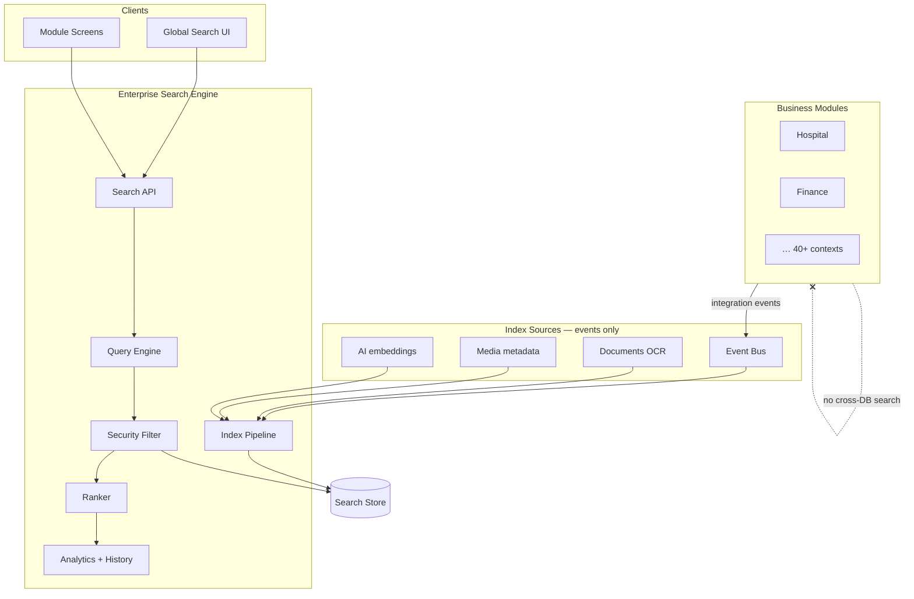
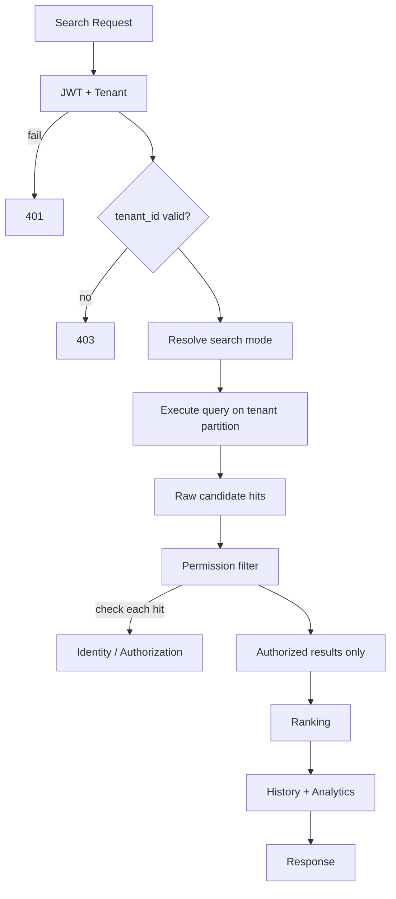
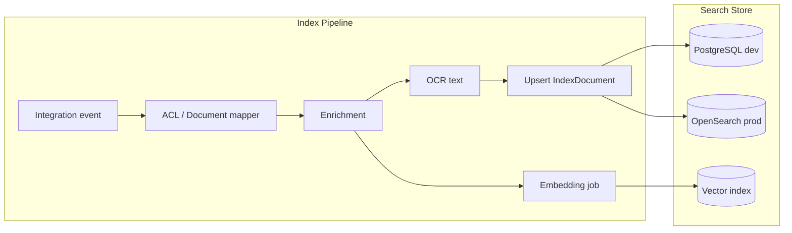
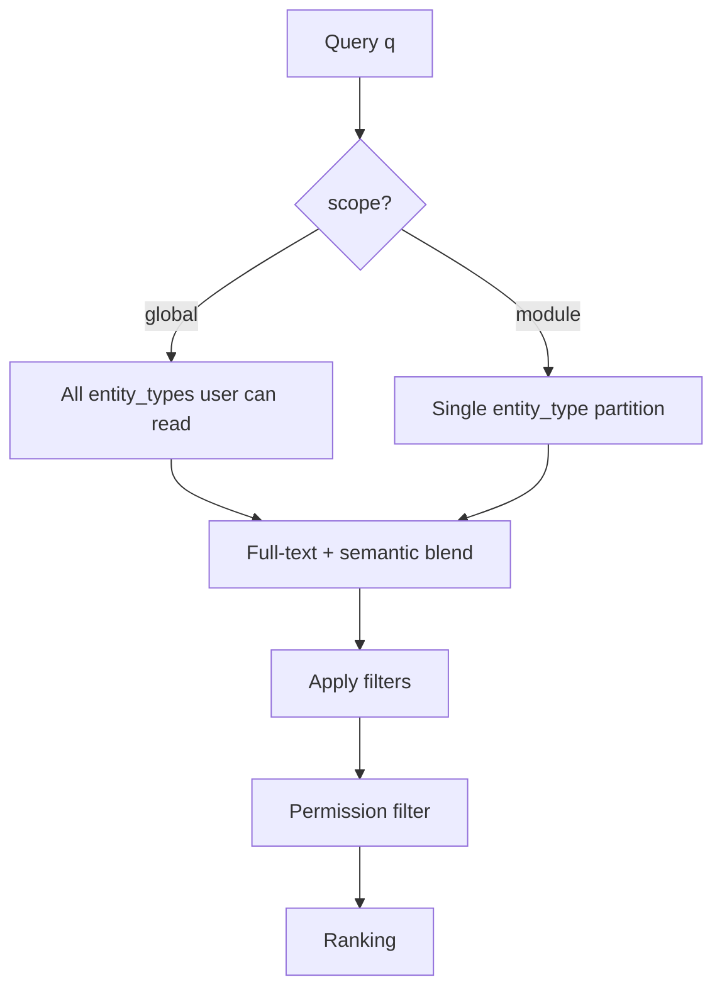
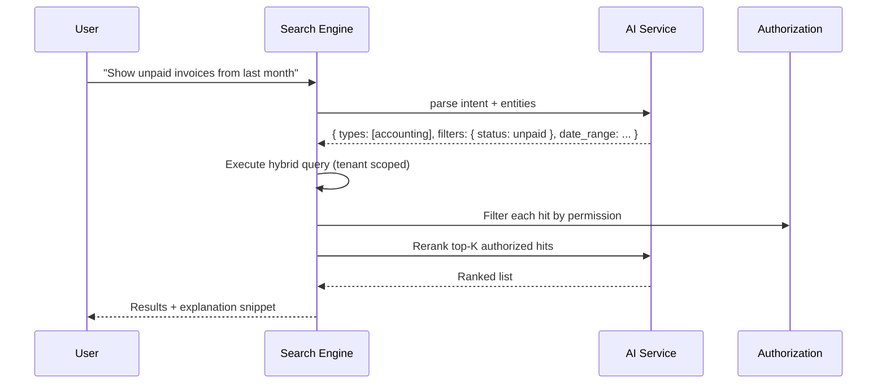
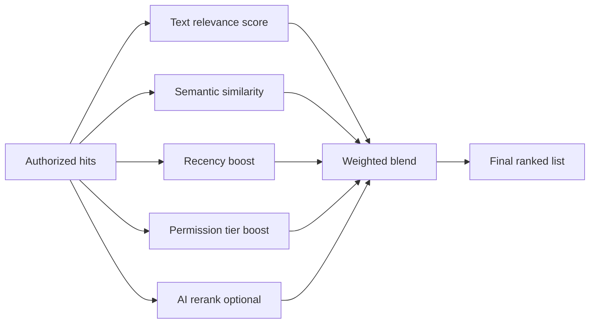

# Enterprise Search Engine — Marpich

**Status:** Canonical — sole search and discovery layer  
**Audience:** Product, platform engineers, module authors, AI agents  
**Owner context:** `backend/contexts/search/`  
**Companions:** [ENTERPRISE_EVENT_BUS.md](ENTERPRISE_EVENT_BUS.md) · [AI_PLATFORM_STANDARD.md](AI_PLATFORM_STANDARD.md) · [SECURITY_STANDARD.md](SECURITY_STANDARD.md) · [CORE_PLATFORM.md](CORE_PLATFORM.md)

**Law: Every search respects security permissions. Modules never query peer databases for search. All discovery flows through the Search Engine.**

---

## Platform position



---

## The law

```
All search flows through the Enterprise Search Engine.

Supported modes:
  Global Search · Module Search · Full Text · Semantic · AI Search
  Document Search · OCR Search · Image Metadata Search

Every search supports:
  Filters · Saved Searches · Suggestions · Ranking
  Permissions · Tenant Isolation · Analytics · History

EVERY search respects security permissions — no result without authorization.
Modules index via events — never expose DB to Search directly.
```

---

## Search modes

| Mode | Scope | Engine | Permission gate |
|------|-------|--------|-----------------|
| **Global Search** | All entity types user may access | Hybrid full-text + semantic | Per-result ACL |
| **Module Search** | Single module (`entity_type`) | Scoped index partition | Module permission |
| **Full Text Search** | Keyword match on title/body | PostgreSQL / OpenSearch | Post-filter ACL |
| **Semantic Search** | Meaning-based similarity | Vector index (AI embeddings) | Post-filter ACL |
| **AI Search** | Natural language question → ranked results | AI Service rerank + LLM query parse | Post-filter ACL |
| **Document search** | Full-text on extracted content | `documents.*.read` | See [ENTERPRISE_DOCUMENT_EXCHANGE.md](ENTERPRISE_DOCUMENT_EXCHANGE.md) |
| **OCR Search** | Scanned PDF/image text | AI OCR pipeline → index | Document permission |
| **Image Metadata Search** | EXIF, tags, labels | Media facets + AI vision tags | `media.*.read` |

Catalog: [`search/SEARCH_MODES.yaml`](search/SEARCH_MODES.yaml)

---

## Security-first query pipeline

**Every search respects permissions** — enforced before results leave the Search Engine.



### Permission rules

| Rule | Implementation |
|------|----------------|
| **API gate** | `search.query.read` minimum; mode-specific permissions |
| **Tenant isolation** | Every query includes `tenant_id` — hard filter, no cross-tenant |
| **Entity ACL** | Each hit checked: `{module}.{resource}.read` on entity |
| **Row-level** | Optional `allowed_user_ids` / `organization_id` on `IndexDocument` |
| **Admin indices** | `search.admin.read` for `/indices`, `/reindex` |
| **Fail closed** | If permission check fails → **omit hit**, never return unauthorized data |
| **Audit** | `SearchQuery` logged with user_id, filters, result_count |

```python
# Query pipeline — permission filter (conceptual)
for hit in raw_hits:
    permission = hit.facets.get("read_permission")  # e.g. hospital.patient.read
    if await authorization.check(user_id, tenant_id, permission, resource=hit.entity_id):
        authorized.append(hit)
```

Modules **must** register `read_permission` facet when indexing via event mapping.

---

## Indexing architecture

Event-driven — **never query module databases**.



### Index document model

| Field | Purpose |
|-------|---------|
| `tenant_id` | Isolation partition |
| `entity_type` | Module scope (`hospital`, `finance`, …) |
| `entity_id` | Source record ID |
| `title` | Primary display |
| `body` | Full-text content |
| `facets` | Filters — status, date, category, tags |
| `ocr_text` | Extracted scan text |
| `image_metadata` | EXIF, dimensions, AI labels |
| `embedding_ref` | Vector ID for semantic search |
| `read_permission` | ACL permission string |
| `organization_id` | Org-scoped visibility |
| `source_event` | Provenance |

### Index sources

| Source | Trigger | Content indexed |
|--------|---------|-----------------|
| Domain events | `*` subscription | Event payload denormalized ✅ |
| Documents | `documents.document.uploaded` | Text + OCR |
| Media | `media.asset.uploaded` | Metadata + AI vision tags |
| Users | `identity.user.created` | Profile fields |
| Manual | Module `search.index.requested` | Custom entity |

**Rule:** Modules publish events with indexable fields — Search maps via ACL in `infrastructure/acl/index_mappers/`.

---

## Query engine

### Global vs module search



| Parameter | Global | Module |
|-----------|--------|--------|
| `scope` | `global` (default) | `module` |
| `types` | optional filter | required `entity_type` |
| `q` | cross-module keywords | module-specific |
| UI | AppShell search bar | Module list filters |

### Full-text search

| Tier | Backend | Use |
|------|---------|-----|
| Dev / SMB | PostgreSQL `ILIKE` / tsvector | ✅ current |
| Enterprise | OpenSearch / Elasticsearch | Production scale |

Query: `GET /api/v1/search/query?q=invoice&mode=fulltext`

### Semantic search

1. AI Service generates query embedding
2. Vector similarity against `embedding_ref` index
3. Permission filter on candidates
4. Blend with full-text score (hybrid)

```
GET /api/v1/search/query?q=patient discharge summary&mode=semantic
```

### AI search

Natural language → structured query + semantic rerank:



Permission: `search.ai.read` in addition to entity read permissions.

### Document & OCR search

| Stage | Owner |
|-------|-------|
| Upload | Documents Service |
| OCR / extract | AI Service `documents/extract` |
| Index | Search ingests `documents.document.indexed` event |
| Query | `mode=document` searches `body` + `ocr_text` |

### Image metadata search

| Field | Source |
|-------|--------|
| EXIF | Media Service extraction |
| AI labels | AI vision on `media.asset.uploaded` |
| Facets | `image_metadata.tags`, `camera`, `location` (if permitted) |

Query: `GET /api/v1/search/query?q=sunset&mode=image&filters[tag]=landscape`

---

## Filters

| Filter type | Example | Facet field |
|-------------|---------|-------------|
| Entity type | `types=hospital,finance` | `entity_type` |
| Date range | `filters[created_after]=2026-01-01` | `facets.created_at` |
| Status | `filters[status]=active` | `facets.status` |
| Category | `filters[category]=clinical` | `facets.category` |
| Organization | `filters[organization_id]=org-1` | `organization_id` |
| Module custom | Registered in index mapping | module-specific facets |

OpenAPI: structured `filters` object on query endpoint.

---

## Saved searches

| Field | Purpose |
|-------|---------|
| `id` | Saved search UUID |
| `user_id` | Owner |
| `name` | "My open POs" |
| `query` | Stored query + filters + mode |
| `notify` | Optional alert on new matches |

```
POST /api/v1/search/saved
GET  /api/v1/search/saved
DELETE /api/v1/search/saved/{id}
```

Scheduled worker re-runs saved queries → Notification if new hits (respects permissions).

---

## Search suggestions

| Type | Endpoint | Source |
|------|----------|--------|
| **Autocomplete** | `GET /suggest?q=inv` | Prefix index + popular queries ✅ |
| **Recent** | `GET /history?limit=10` | User search history |
| **Popular** | Analytics aggregation | Tenant-wide trending (anonymized) |
| **Did you mean** | Spell correction | OpenSearch suggester |

---

## Ranking



| Signal | Weight (default) | Configurable |
|--------|------------------|--------------|
| Full-text BM25 | 0.40 | per tenant |
| Semantic cosine | 0.30 | per index |
| Recency | 0.15 | decay function |
| Entity type priority | 0.10 | module weights |
| AI rerank | 0.05 | AI search mode only |

---

## Tenant isolation

| Layer | Enforcement |
|-------|-------------|
| Index | `tenant_id` on every document — composite key |
| Query | `X-Tenant-ID` + JWT tenant match |
| OpenSearch | Index alias per tenant or filtered alias |
| Vector | Namespace `{tenant_id}:*` |
| Analytics | Aggregates scoped to tenant |
| Reindex | `POST /reindex` clears **one tenant only** ✅ |

**Forbidden:** Cross-tenant search, shared index without tenant filter, global admin bypass without audit.

---

## Search analytics

| Metric | Source |
|--------|--------|
| Queries per day | `SearchQuery` aggregate |
| Zero-result queries | `result_count = 0` |
| Top queries | Aggregated `query_text` |
| Click-through | UI beacon → `search.result.clicked` |
| Latency p99 | OTel spans on query engine |
| Index lag | Event timestamp vs `indexed_at` |

```
GET /api/v1/search/analytics?period=7d
Permission: search.analytics.read
```

Publishes: `search.analytics.snapshot` → Analytics Service.

---

## Search history

| Field | Storage |
|-------|---------|
| `user_id` | Who searched |
| `query_text` | What they searched |
| `mode` | fulltext, semantic, ai, … |
| `filters` | Applied filters |
| `result_count` | Outcome |
| `created_at` | When |

```
GET /api/v1/search/history
DELETE /api/v1/search/history  # user clears own history
```

**Privacy:** History per user per tenant; not shared; retention configurable in Settings.

Uses `SearchQuery` aggregate ✅ — extend with `user_id`, `mode`.

---

## REST API summary

Base: `/api/v1/search`

| Method | Path | Permission | Status |
|--------|------|------------|--------|
| GET | `/query` | `search.query.read` | ✅ |
| GET | `/suggest` | `search.query.read` | ✅ |
| GET | `/indices` | `search.admin.read` | ✅ |
| POST | `/reindex` | `search.admin.write` | ✅ |
| GET | `/history` | authenticated | 📋 |
| POST | `/saved` | authenticated | 📋 |
| GET | `/saved` | authenticated | 📋 |
| GET | `/analytics` | `search.analytics.read` | 📋 |
| POST | `/query/ai` | `search.ai.read` | 📋 |

Query parameters:

```
GET /query?q=invoice&scope=global&mode=hybrid&types=accounting,finance
    &filters[status]=open&limit=50&offset=0
```

---

## Module integration

### Index registration

```yaml
# context.yaml
search:
  entity_type: hospital
  index_events:
    - hospital.admission.registered
    - hospital.encounter.completed
  read_permission: hospital.patient.read
  facets: [status, department, admission_date]
```

### Forbidden

```python
# ❌ FORBIDDEN — cross-module DB search
await session.execute("SELECT * FROM finance.invoices WHERE title ILIKE %s", q)

# ❌ FORBIDDEN — module-local Elasticsearch
es.search(index="my-module", ...)

# ✅ ALLOWED — publish rich integration event; Search indexes
await publish_integration_event(PatientAdmittedIntegration(...))

# ✅ ALLOWED — query Search API
GET /api/v1/search/query?types=hospital&q=smith
```

---

## Implementation status

| Area | Today | Target |
|------|-------|--------|
| Event indexing | ✅ `*` subscription | Per-module mappers |
| Full-text (simple) | ✅ substring match | OpenSearch + tsvector |
| Suggest | ✅ prefix | + popular + spellcheck |
| Tenant partition | ✅ | OpenSearch aliases |
| Query audit | ✅ SearchQuery | + user_id, mode, history API |
| Permission filter | ⚠️ API auth only | Per-hit ACL |
| Global vs module scope | ⚠️ `types` param | Explicit `scope` |
| Semantic / vector | 📋 | AI embeddings index |
| AI search | 📋 | NL query + rerank |
| OCR / document | 📋 | AI extract pipeline |
| Image metadata | 📋 | Media + vision tags |
| Saved searches | 📋 | CRUD + alerts |
| Ranking blend | 📋 | Configurable weights |
| Analytics dashboard | 📋 | `/analytics` |

Legend: ✅ implemented · ⚠️ partial · 📋 designed

---

## Module checklist

```markdown
## Search checklist

- [ ] Entity types registered in search config
- [ ] Integration events carry indexable title/body/facets
- [ ] read_permission facet on every indexed document
- [ ] No module-local search DB queries
- [ ] Module UI uses Search API (global + module scope)
- [ ] Sensitive fields excluded from index body
```

---

## Enforcement

| Mechanism | Location |
|-----------|----------|
| This document | `docs/architecture/ENTERPRISE_SEARCH_ENGINE.md` |
| Search modes | `docs/architecture/search/SEARCH_MODES.yaml` |
| Context | `backend/contexts/search/` |
| ADR | ADR-040 |
| Cursor rule | `.cursor/rules/marpich-search-engine.mdc` |

---

## Related

| Document | Role |
|----------|------|
| [ADR-012](../adr/012-search-and-gateway.md) | Event indexing foundation |
| [ENTERPRISE_EVENT_BUS.md](ENTERPRISE_EVENT_BUS.md) | Index triggers |
| [AI_PLATFORM_STANDARD.md](AI_PLATFORM_STANDARD.md) | OCR, embeddings, AI search |
| [SECURITY_STANDARD.md](SECURITY_STANDARD.md) | AuthZ on every query |
| [SERVICE_BOUNDARIES.md](SERVICE_BOUNDARIES.md) | No cross-DB queries |
