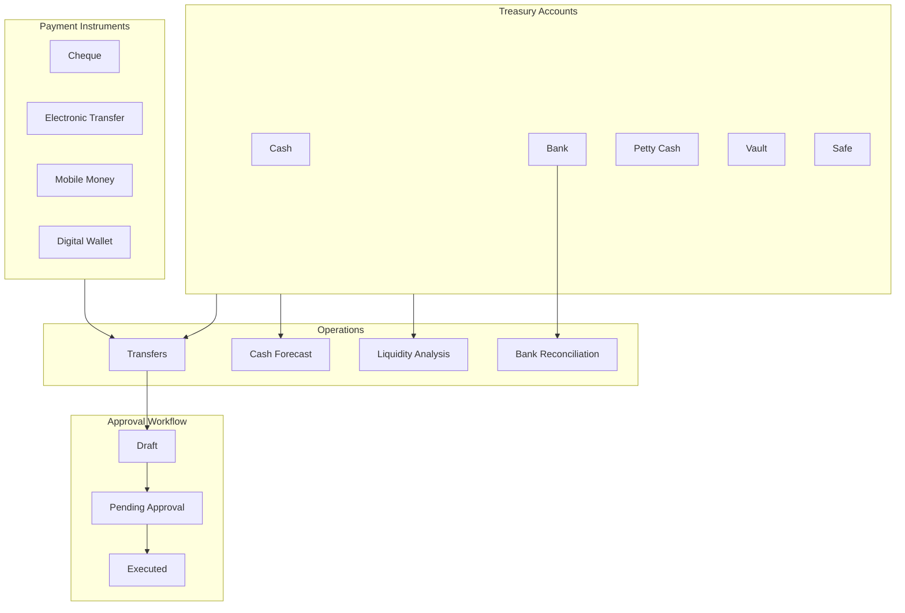

# Enterprise Treasury — Marpich

**Status:** Canonical — cash management, liquidity, reconciliation, forecasting  
**Audience:** CFO, treasury managers, platform engineers, module authors, AI agents  
**Owner context:** `backend/contexts/treasury/`  
**Companions:** [ENTERPRISE_FINANCIAL_KERNEL.md](ENTERPRISE_FINANCIAL_KERNEL.md) · [ENTERPRISE_WORKFLOW_ENGINE.md](ENTERPRISE_WORKFLOW_ENGINE.md) · [treasury/TREASURY_CATALOG.yaml](treasury/TREASURY_CATALOG.yaml)

**Law: Treasury owns cash positions and transfers. Journal posting stays in Financial Kernel. Never duplicate cash logic in business modules.**

---

## Platform position



---

## Capabilities

| Capability | Description |
|---|---|
| **Cash** | Physical cash accounts |
| **Banks** | Operating and settlement bank accounts |
| **Petty Cash** | Small disbursement floats |
| **Vault** | Secured high-value storage |
| **Safe** | Office safe accounts |
| **Cheque** | Cheque transfers with cheque number |
| **Electronic Transfer** | Wire/ACH/SEPA style transfers |
| **Mobile Money** | M-Pesa, bKash, etc. |
| **Digital Wallet** | PayPal, Stripe balance, etc. |
| **Bank Reconciliation** | Statement vs book matching |
| **Cash Forecast** | Multi-period cash flow projection |
| **Liquidity Analysis** | Liquid vs restricted balance ratio |
| **Treasury Dashboard** | Unified cash position view |
| **Approval Workflow** | Draft → submit → approve → execute |

---

## Account types

| Type | Purpose | Liquidity class |
|---|---|---|
| `cash` | Physical cash | Liquid |
| `bank` | Bank accounts | Liquid |
| `petty_cash` | Small expenses | Liquid |
| `vault` | Secured storage | Restricted |
| `safe` | Office safe | Restricted |

---

## Transfer workflow

```
draft → submit → pending_approval → approve → executed
                                  ↘ reject
```

Auto-execute when `require_approval: false`.

Workflow engine integration: pass `workflow_instance_id` on approve.

---

## API

Prefix: `/api/v1/treasury`

| Method | Path | Description |
|---|---|---|
| GET | `/dashboard` | Treasury dashboard |
| GET | `/liquidity` | Liquidity analysis |
| GET/POST | `/accounts` | Treasury accounts |
| GET/POST | `/transfers` | Payment transfers |
| POST | `/transfers/{id}/submit` | Submit for approval |
| POST | `/transfers/{id}/approve` | Approve and execute |
| POST | `/transfers/{id}/reject` | Reject transfer |
| GET/POST | `/reconciliations` | Bank reconciliation |
| GET/POST | `/forecasts` | Cash flow forecasts |

---

## Cash flow forecast

```json
POST /api/v1/treasury/forecasts
{
  "name": "Q3 Forecast",
  "period_start": "2025-07-01",
  "period_end": "2025-09-30",
  "scenario": "base",
  "projected_lines": [
    {"date": "2025-07-15", "label": "Payroll", "outflow": 15000},
    {"date": "2025-08-01", "label": "Receipts", "inflow": 25000}
  ]
}
```

Scenarios: `base`, `optimistic`, `pessimistic`.

---

## Integration events

| Event | When |
|---|---|
| `treasury.transfer.executed` | Transfer completed |
| `treasury.liquidity.updated` | Balance change |
| `treasury.transfer.approval.requested` | Submitted for approval |

---

## Financial Kernel bridge

- Treasury manages **cash positions** and **movements**
- Financial Kernel manages **GL journal entries**
- Future: treasury transfer executed → kernel auto-posts cash journal (via integration event handler)

---

## ADR

See [ADR-053](../adr/053-enterprise-treasury.md).
