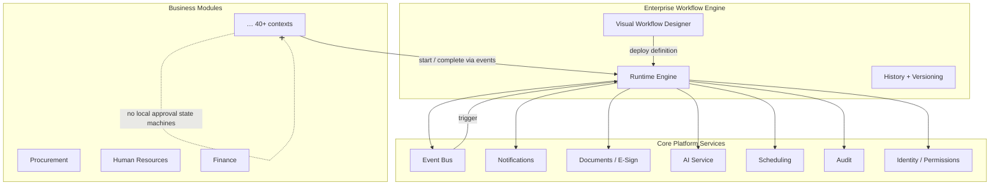
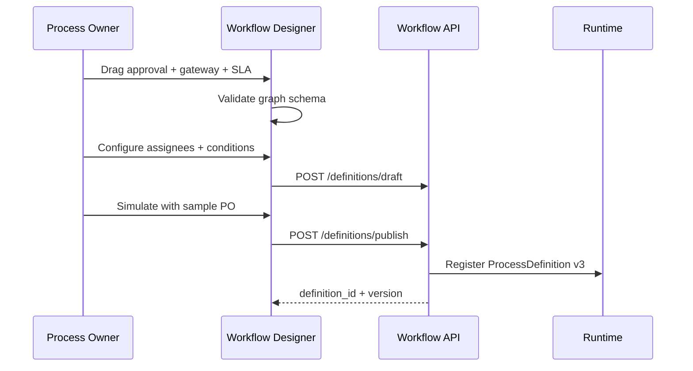
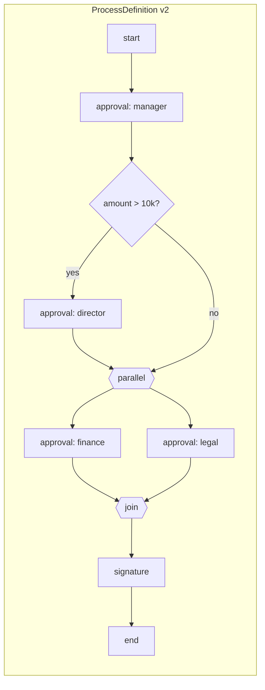
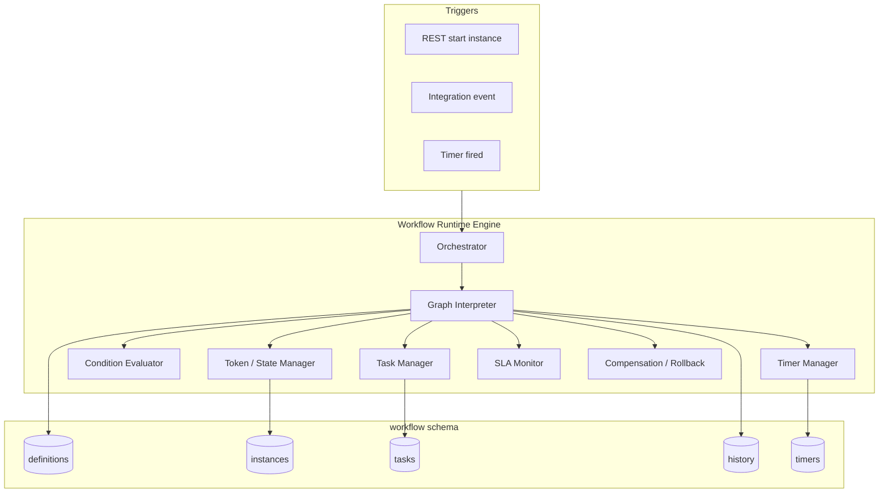
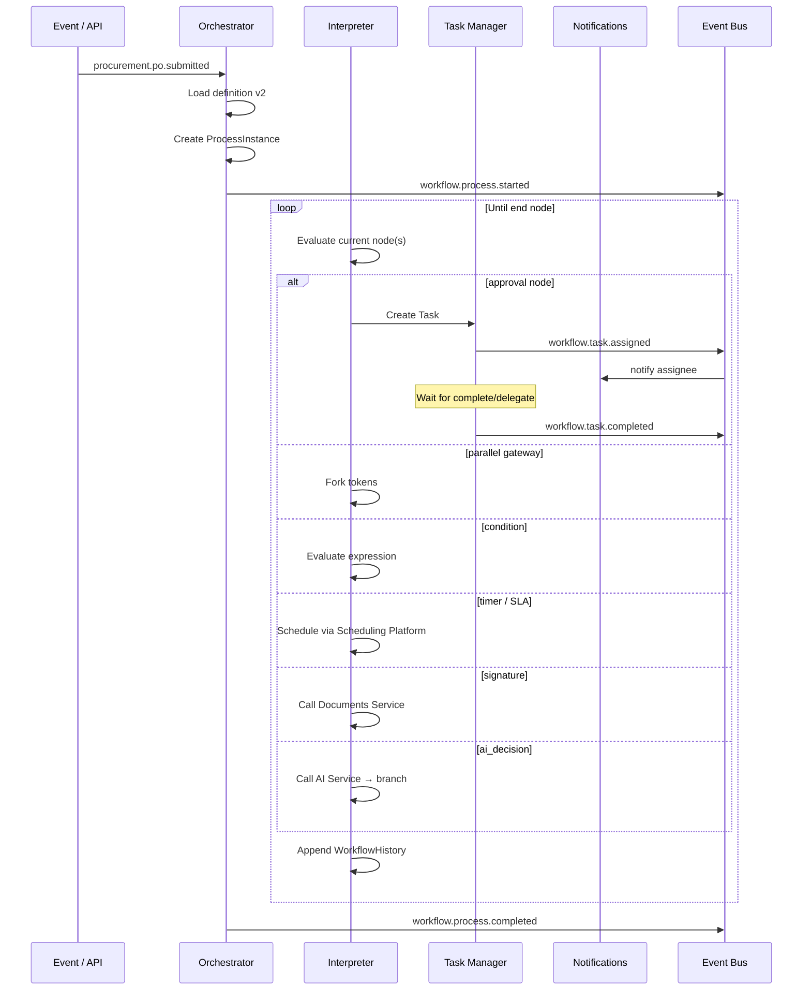
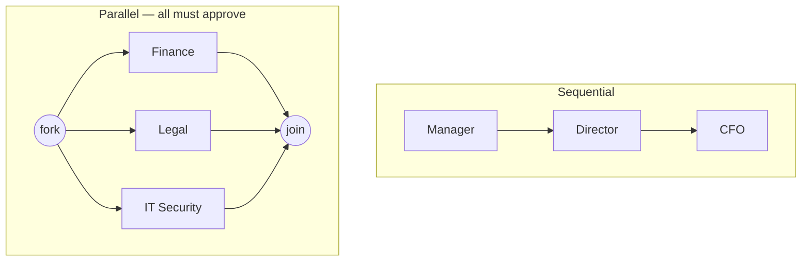
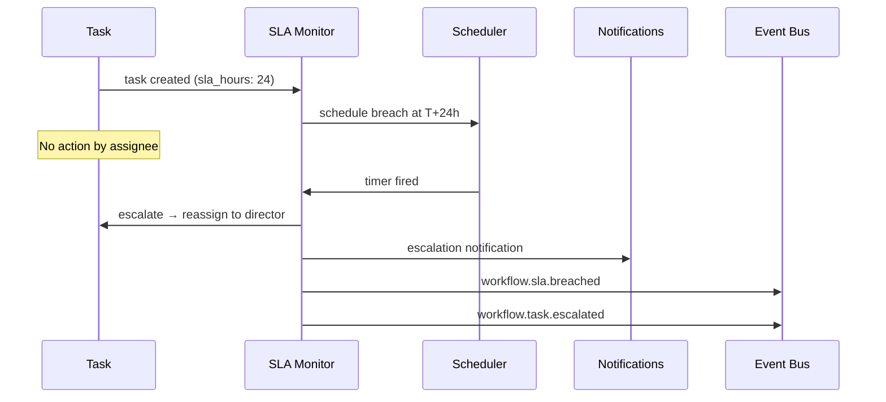
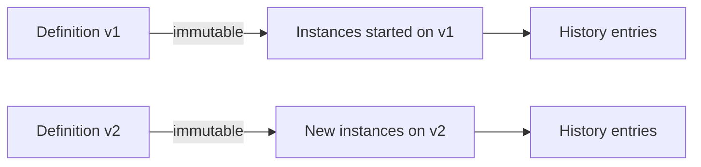
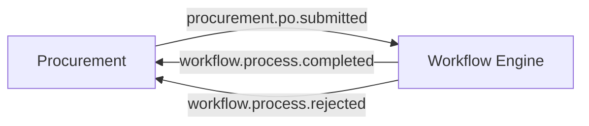

# Enterprise Workflow Engine — Marpich

**Status:** Canonical — all approvals, orchestration, and human tasks flow through Workflow  
**Audience:** Product, platform engineers, module authors, AI agents  
**Owner context:** `backend/contexts/workflow/` · `modules/platform/workflow/`  
**Companions:** [ENTERPRISE_EVENT_BUS.md](ENTERPRISE_EVENT_BUS.md) · [AI_PLATFORM_STANDARD.md](AI_PLATFORM_STANDARD.md) · [CORE_PLATFORM.md](CORE_PLATFORM.md) · [SECURITY_STANDARD.md](SECURITY_STANDARD.md)

**Law: Business modules never implement their own approval engines. Use the Enterprise Workflow Engine.**

---

## Platform position



---

## The law

```
Every workflow supports:
  Conditions · Approvals · Escalations · Delegation
  Parallel Approval · Sequential Approval · Branching
  Timers · SLA · Notifications · Digital Signature
  AI Decisions · Rollback · History · Versioning
  Audit Logs · Permissions

Workflow Builder MUST be visual — Drag & Drop.

Modules emit facts (events) and react to workflow outcomes — never duplicate BPM logic.
```

---

## Capability matrix

| Capability | Runtime mechanism | Designer node | Integration |
|------------|-------------------|---------------|-------------|
| **Conditions** | Expression evaluator on gateway | `exclusive_gateway` + `condition` edge | Context variables |
| **Approvals** | Human task | `approval` | Assignee / role |
| **Escalations** | Timer → reassign / notify manager | `escalation` on task | Scheduling + Identity |
| **Delegation** | Task reassignment | Task action (runtime) | `POST /tasks/{id}/delegate` ✅ |
| **Parallel approval** | Parallel gateway + join | `parallel_gateway` | N assignees |
| **Sequential approval** | Sequence flow | chained `approval` nodes | Ordered steps |
| **Branching** | Exclusive / inclusive gateway | `gateway` | Multiple exits |
| **Timers** | Scheduled job / boundary timer | `timer` | Scheduling Platform |
| **SLA** | SLA timer + breach event | `sla` on task/process | `workflow.sla.breached` |
| **Notifications** | Service task | `notification` | Notification Service |
| **Digital signature** | Service task | `signature` | Documents Service |
| **AI decisions** | Service task | `ai_decision` | AI Service |
| **Rollback** | Compensation subgraph | `rollback` handler | Saga / compensating cmd |
| **History** | Append-only audit trail | read-only timeline | `WorkflowHistory` |
| **Versioning** | Immutable definition versions | publish draft → vN | `ProcessDefinition.version` ✅ |
| **Audit logs** | Integration events | — | Audit + Event Bus |
| **Permissions** | RBAC on API + task assignee | designer ACL | `workflow.*` |

---

## Visual Workflow Designer

### Requirements

| Requirement | Detail |
|-------------|--------|
| **Visual** | Canvas-based — not JSON/YAML editing for business users |
| **Drag & Drop** | Palette → canvas; connect with edges |
| **Validation** | Real-time — orphan nodes, missing assignee, cycles |
| **Simulate** | Dry-run with sample context before publish |
| **Permissions** | `workflow.definitions.write` to publish |
| **Tenant-scoped** | Every definition belongs to one tenant |

### Designer architecture

```mermaid
flowchart TB
    subgraph ui [Workflow Designer — Web App]
        PAL[Node Palette]
        CAN[React Flow Canvas]
        PROP[Properties Panel]
        VAL[Schema Validator]
        SIM[Simulator]
    end

    subgraph api [Workflow API]
        DRAFT[POST /definitions/draft]
        PUB[POST /definitions/publish]
        GET[GET /definitions/{key}/versions]
    end

    subgraph storage [Workflow Context]
        DEF[ProcessDefinition]
        GRAPH[workflow_definitions graph JSON]
    end

    PAL --> CAN
    CAN --> PROP
    CAN --> VAL
    VAL --> DRAFT
    SIM --> CAN
    DRAFT --> GRAPH
    PUB --> DEF
```

### Node palette (drag & drop)

| Category | Node type | Icon / label |
|----------|-----------|--------------|
| **Flow** | `start`, `end` | Start / End |
| **Human** | `approval` | Approval |
| **Control** | `exclusive_gateway`, `parallel_gateway`, `inclusive_gateway` | Branch / Parallel / Multi-branch |
| **Logic** | `condition` (edge label) | If / Else |
| **Time** | `timer`, `sla` | Wait / SLA |
| **Action** | `notification`, `signature`, `ai_decision`, `service_task` | Notify / Sign / AI / Custom |
| **Recovery** | `rollback`, `compensation` | Rollback |

### Designer UX flow



### Frontend stack (target)

| Layer | Technology |
|-------|------------|
| Canvas | **React Flow** (or equivalent) — nodes, edges, zoom, minimap |
| State | Designer store — graph JSON in memory |
| Validation | `docs/architecture/workflow/DEFINITION_SCHEMA.v1.yaml` |
| API client | `/api/v1/workflow/definitions/*` |
| Location | `apps/web/workflow-designer/` or module widget in AppShell |

**Rule:** Designer produces **graph JSON** only — runtime interprets; designer never executes business rules.

---

## Workflow definition model

Definitions are **versioned, immutable** after publish. Edits create a new version.



### Graph schema (canonical)

See [`workflow/DEFINITION_SCHEMA.v1.yaml`](workflow/DEFINITION_SCHEMA.v1.yaml).

```yaml
key: procurement.po.approval
name: Purchase Order Approval
version: 2
nodes:
  - id: start_1
    type: start
  - id: mgr_approval
    type: approval
    config:
      assignee_role: procurement.manager
      sla_hours: 24
      escalation:
        after_hours: 24
        reassign_to_role: procurement.director
        notify: true
  - id: amount_branch
    type: exclusive_gateway
  - id: parallel_review
    type: parallel_gateway
edges:
  - from: start_1
    to: mgr_approval
  - from: mgr_approval
    to: amount_branch
  - from: amount_branch
    to: parallel_review
    condition: "context.amount <= 10000"
permissions:
  deploy: workflow.definitions.write
  start: procurement.po.submit
  admin: workflow.instances.admin
```

---

## Runtime engine

### Engine architecture



### Execution loop



### Runtime components

| Component | Responsibility | Location |
|-----------|----------------|----------|
| **Orchestrator** | Start, signal, cancel, rollback | `application/orchestrator.py` |
| **Graph interpreter** | Walk nodes, fork/join | `domain/services/process_interpreter.py` |
| **Condition evaluator** | Safe expression on `context` | `domain/services/condition_evaluator.py` |
| **Task manager** | Create, complete, delegate | `application/service.py` ✅ partial |
| **Timer manager** | Register SLA/wait timers | `infrastructure/scheduling/timer_adapter.py` |
| **History writer** | Append-only transitions | `domain/aggregates/workflow_history.py` |
| **Compensation** | Rollback subgraph | `domain/services/compensation_handler.py` |

### Process instance state

| Status | Meaning |
|--------|---------|
| `running` | Active tokens |
| `waiting` | Blocked on human task or timer |
| `completed` | Reached end node |
| `rejected` | Terminal reject outcome |
| `rolled_back` | Compensation completed |
| `cancelled` | Admin cancel |

---

## Feature deep-dives

### Conditions

```javascript
// Safe expression language — no arbitrary code execution
"context.amount > 10000 && context.currency == 'USD'"
"context.department == 'finance' || context.priority == 'urgent'"
```

| Rule | Detail |
|------|--------|
| Input | `ProcessInstance.context` — set at start + updated by service tasks |
| Evaluator | Sandboxed — whitelist operators, field access only |
| Gateway | `exclusive_gateway` chooses first matching edge |

### Parallel vs sequential approval



**Join rule:** `parallel_gateway` join waits for **all** incoming branches (AND). Configurable to N-of-M via `inclusive_gateway`.

### Escalation & SLA



### Digital signature

Service task calls Documents Service — see [ENTERPRISE_DOCUMENT_EXCHANGE.md](ENTERPRISE_DOCUMENT_EXCHANGE.md)

```
POST /api/v1/documents/signatures/request
→ workflow waits on documents.document.signed event
→ continues to next node
```

### AI decisions

Service task invokes AI Service with **human-in-the-loop** option:

```yaml
- id: fraud_check
  type: ai_decision
  config:
    model_ref: tenant:fraud-classifier
    input_mapping:
      amount: context.amount
      vendor: context.vendor_id
    outcomes:
      - label: approve
        condition: "ai.score < 0.3"
      - label: review
        condition: "ai.score >= 0.3"
      - label: reject
        condition: "ai.score >= 0.8"
    fallback: review  # human task if AI unavailable
```

See [AI_PLATFORM_STANDARD.md](AI_PLATFORM_STANDARD.md) — AI is platform service, not embedded in workflow domain.

### Rollback

| Trigger | Action |
|---------|--------|
| Reject at approval | Terminal `rejected` + optional compensation |
| Admin rollback | Execute `rollback` subgraph |
| Module saga | Subscribe to `workflow.process.rejected` |

Compensation publishes module-specific events — e.g. `procurement.po.approval.revoked`.

### History & versioning



| Artifact | Rule |
|----------|------|
| **Definition version** | Immutable after publish; new edit = v+1 |
| **Running instances** | Pinned to definition version at start |
| **History** | Append-only: `{ timestamp, node_id, action, actor, payload }` |
| **Audit** | Every transition → integration event → Audit Service |

---

## Events & integration

### Published events

| Event | When |
|-------|------|
| `workflow.process.started` | Instance created ✅ |
| `workflow.task.assigned` | Human task created ✅ |
| `workflow.task.completed` | Task approved/rejected ✅ |
| `workflow.task.delegated` | Delegation ✅ (via task update) |
| `workflow.task.escalated` | SLA escalation |
| `workflow.process.completed` | Success end ✅ |
| `workflow.process.rejected` | Terminal reject |
| `workflow.process.rolled_back` | Compensation done |
| `workflow.sla.breached` | SLA timer fired |
| `workflow.definition.published` | New version deployed |

### Module integration pattern



**Module rules:**
1. Start workflow via event or `POST /workflow/instances` — pass `context` + `assignees`
2. Subscribe to `workflow.process.completed` / `rejected` with ACL
3. Never store approval state in module tables — reference `instance_id` only

---

## Permissions

| Permission | Scope |
|------------|-------|
| `workflow.definitions.read` | List/view definitions |
| `workflow.definitions.write` | Designer publish |
| `workflow.instances.read` | View instance + history |
| `workflow.instances.write` | Start process |
| `workflow.instances.admin` | Cancel, rollback, reassign |
| `workflow.tasks.complete` | Complete assigned tasks (or assignee match) |
| `workflow.tasks.delegate` | Delegate own tasks ✅ |

Designer and runtime enforce Identity RBAC + task assignee check.

---

## REST API

Base: `/api/v1/workflow`

| Method | Path | Status |
|--------|------|--------|
| POST | `/definitions` | ✅ deploy (steps) |
| GET | `/definitions` | ✅ |
| POST | `/definitions/draft` | 📋 designer save |
| POST | `/definitions/publish` | 📋 designer publish graph |
| GET | `/definitions/{key}/versions` | 📋 |
| POST | `/instances` | ✅ |
| GET | `/instances/{id}` | ✅ |
| GET | `/instances/{id}/history` | 📋 |
| POST | `/instances/{id}/cancel` | 📋 |
| POST | `/instances/{id}/rollback` | 📋 |
| GET | `/tasks` | ✅ inbox |
| POST | `/tasks/{id}/complete` | ✅ |
| POST | `/tasks/{id}/delegate` | ✅ |
| GET | `/designer/palette` | 📋 node metadata for UI |

---

## Implementation status

| Area | Today | Target |
|------|-------|--------|
| Sequential approval | ✅ step list | Graph interpreter |
| Delegation | ✅ | ✅ |
| Definition versioning | ✅ | + immutable publish |
| Visual designer | 📋 | React Flow app |
| Conditions / branching | 📋 | Gateway + evaluator |
| Parallel approval | 📋 | Parallel gateway + join |
| Timers / SLA | 📋 | Scheduling adapter |
| Notifications | 📋 via events | Service task node |
| Digital signature | 📋 | Documents integration |
| AI decisions | 📋 | AI service task |
| Rollback | 📋 | Compensation handler |
| History API | 📋 | WorkflowHistory aggregate |
| Graph schema | 📋 | DEFINITION_SCHEMA.v1.yaml |

Legend: ✅ implemented · 📋 designed

---

## Module checklist

```markdown
## Workflow integration checklist

- [ ] No local approval state machine in module
- [ ] Process definition registered or event-triggered
- [ ] Context schema documented for conditions
- [ ] Subscribe to workflow.process.completed / rejected
- [ ] Permissions mapped (start + admin)
- [ ] Rollback / compensation event if needed
- [ ] Audit via workflow + module integration events
```

---

## Enforcement

| Mechanism | Location |
|-----------|----------|
| This document | `docs/architecture/ENTERPRISE_WORKFLOW_ENGINE.md` |
| Graph schema | `docs/architecture/workflow/DEFINITION_SCHEMA.v1.yaml` |
| Context | `backend/contexts/workflow/` |
| ADR | ADR-038 |
| Cursor rule | `.cursor/rules/marpich-workflow-engine.mdc` |

---

## Related

| Document | Role |
|----------|------|
| [ENTERPRISE_EVENT_BUS.md](ENTERPRISE_EVENT_BUS.md) | workflow.* events |
| [AI_PLATFORM_STANDARD.md](AI_PLATFORM_STANDARD.md) | AI decision nodes |
| [CORE_PLATFORM.md](CORE_PLATFORM.md) | Workflow REST detail |
| [PLATFORM_CHARTER.md](PLATFORM_CHARTER.md) | No duplicate workflow in modules |
| [ENTERPRISE_POLICY_ENGINE.md](ENTERPRISE_POLICY_ENGINE.md) | Policy publish approval workflows |
