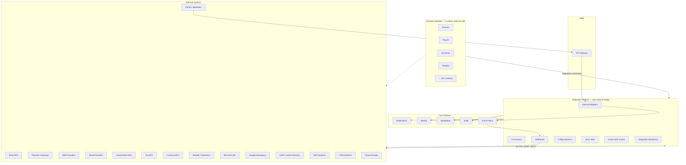
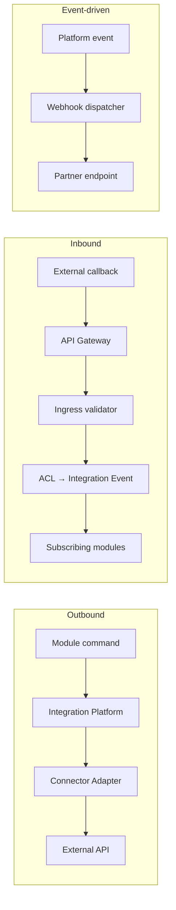
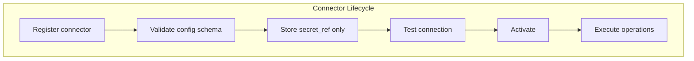
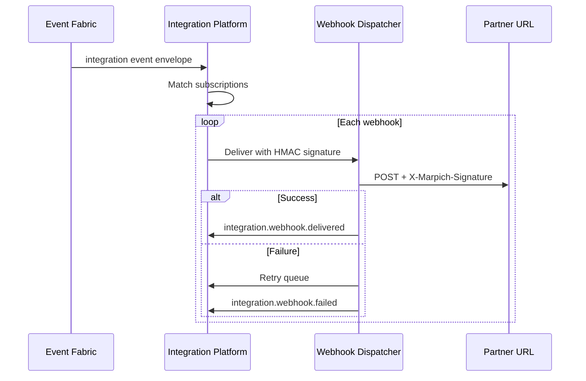
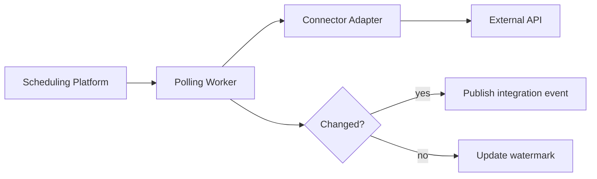
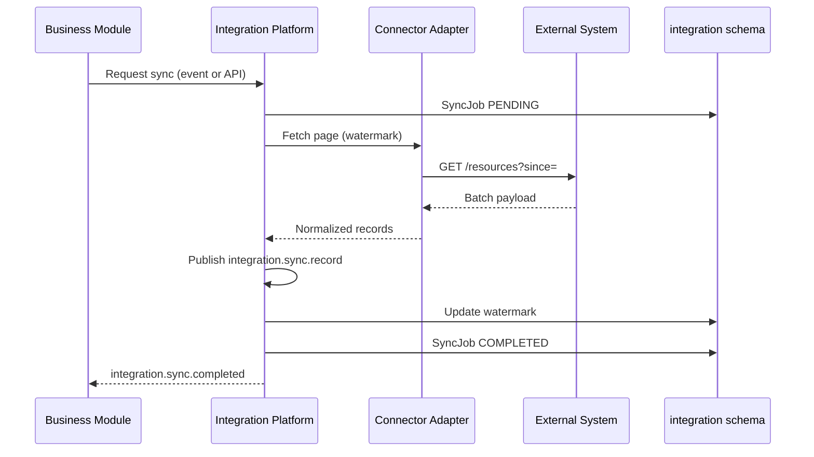
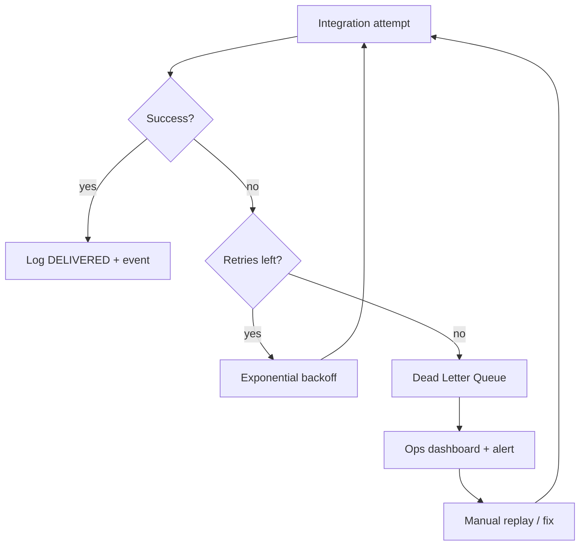
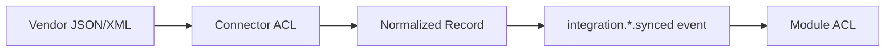
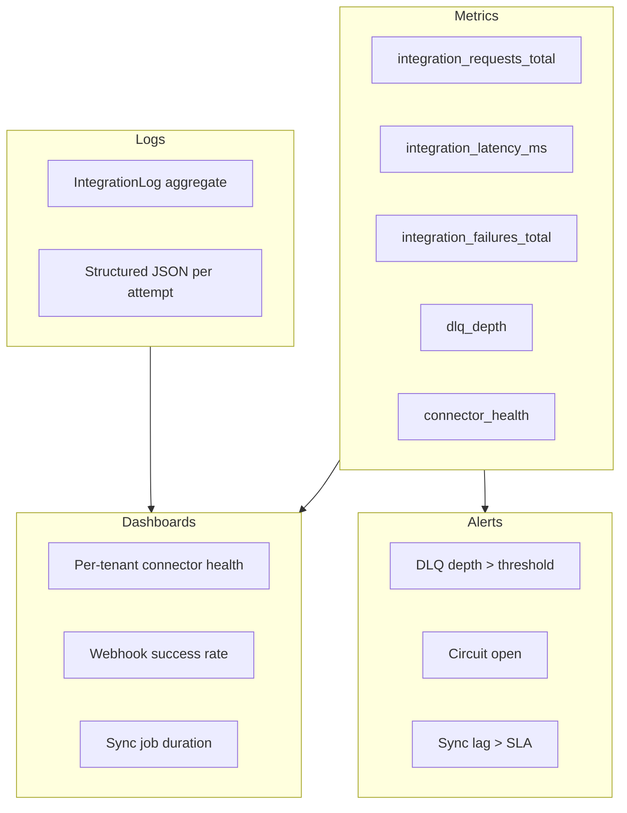

# Integration Platform — Marpich Enterprise

**Status:** Canonical — sole bridge to external systems  
**Audience:** Platform engineers, integrators, module authors, AI agents  
**Owner context:** `backend/contexts/integration/`  
**Companions:** [API_GATEWAY_ARCHITECTURE.md](API_GATEWAY_ARCHITECTURE.md) · [COMMUNICATION_ARCHITECTURE.md](COMMUNICATION_ARCHITECTURE.md) · [CORE_PLATFORM.md](CORE_PLATFORM.md) · [SECURITY_STANDARD.md](SECURITY_STANDARD.md)

**Law: External systems connect ONLY through the Integration Platform. Business modules never call third-party APIs directly.**

---

## Platform position



**Forbidden:** Finance calling a bank API · Hospital calling government API · University calling Moodle SDK from domain code.

---

## The law

```
External systems connect ONLY through the Integration Platform.

Business modules request integrations via:
  • Integration REST API (admin / ops)
  • Integration commands (application ports)
  • Integration events (async outcomes)

Integration Platform owns:
  Connectors · Webhooks · Polling · Sync Jobs
  Error Recovery · Retry Policies · Dead Letter Queue
  API Contracts · Monitoring

Modules NEVER embed HTTP clients to third parties in domain/application layers.
```

---

## Integration patterns

| Pattern | Direction | Use case | Marpich artifact |
|---------|-----------|----------|------------------|
| **Connector** | Outbound (Marpich → external) | Bank transfer, tax filing, LDAP sync | `Connector` aggregate + adapter |
| **Webhook (outbound)** | Marpich → partner | Event fan-out to tenant URL | `WebhookSubscription` |
| **Webhook (inbound)** | External → Marpich | Payment callback, government push | `/api/v1/integrations/ingress/{connector}` |
| **Polling service** | Outbound scheduled | Status checks, rate feeds | `PollingJob` + Scheduling Platform |
| **Sync job** | Bidirectional batch | CRM contacts, ERP items | `SyncJob` + watermark cursor |
| **File exchange** | Batch | Cloud storage import/export | Connector `cloud_storage` + sync |



---

## Supported integrations

Canonical catalog: [`integration/CONNECTOR_CATALOG.yaml`](integration/CONNECTOR_CATALOG.yaml)

| Category | Connector type | Examples | Typical module consumer |
|----------|----------------|----------|-------------------------|
| **Banking** | `bank_api` | ACH, wire, statement import | finance, treasury |
| **Payments** | `payment_gateway` | Stripe, PayPal, local PSP | finance, pos |
| **Messaging** | `sms_provider` | Twilio, Kavenegar, SNS | notifications (via Integration) |
| **Messaging** | `email_provider` | SendGrid, SES, SMTP relay | notifications (via Integration) |
| **Government** | `government_api` | Tax ID verify, license registry | government, municipality |
| **Tax** | `tax_api` | e-Filing, VAT validation | tax, accounting |
| **Currency** | `currency_api` | FX rates, central bank feeds | finance, treasury |
| **Education** | `moodle` | Courses, enrollments, grades | university, school |
| **Education** | `google_classroom` | Rosters, assignments | school |
| **Productivity** | `microsoft_365` | Teams, Outlook, SharePoint | hr, organization |
| **Productivity** | `google_workspace` | Gmail, Drive, Calendar | organization |
| **Directory** | `ldap` | User/group sync | identity |
| **Directory** | `active_directory` | AD sync, SSO bridge | identity |
| **ERP** | `erp_connector` | SAP, Odoo, Dynamics | procurement, inventory |
| **CRM** | `crm_connector` | Salesforce, HubSpot | crm, sales |
| **Storage** | `cloud_storage` | S3, GCS, Azure Blob | documents, media |
| **Custom** | `custom` | Partner REST/GraphQL | integration |

### Provider vs platform service

| Concern | Owner | Rule |
|---------|-------|------|
| **SMS / email / push / voice delivery** | Notification Service | Modules use Notification API — Integration supplies provider adapters |
| **Bank / tax / government** | Integration Platform | Modules emit domain events → Integration executes |
| **LDAP / AD** | Integration Platform | Identity subscribes to `integration.directory.synced` |
| **LMS (Moodle, Classroom)** | Integration Platform | Education modules consume normalized events |

---

## Connectors

### Connector model



| Field | Purpose |
|-------|---------|
| `connector_type` | Catalog type — `bank_api`, `moodle`, … |
| `name` | Tenant display name |
| `config` | Non-secret settings (base URL, region, tenant slug) |
| `secret_ref` | Vault reference — **never** raw API key in DB |
| `is_active` | Enable/disable without delete |
| `health_status` | `healthy` · `degraded` · `unreachable` |

### Connector adapter interface

```python
# contexts/integration/application/ports/connectors.py (target)
class IConnectorAdapter(Protocol):
    connector_type: str

    async def test_connection(self, config: dict, secret: str) -> Result[dict]: ...
    async def execute(
        self,
        *,
        operation: str,
        payload: dict,
        idempotency_key: str,
    ) -> Result[dict]: ...
```

### Adapter layout

```
backend/contexts/integration/infrastructure/adapters/
├── bank/
│   ├── ach_adapter.py
│   └── statement_import_adapter.py
├── payment/
│   └── stripe_adapter.py
├── directory/
│   ├── ldap_adapter.py
│   └── active_directory_adapter.py
├── education/
│   ├── moodle_adapter.py
│   └── google_classroom_adapter.py
├── productivity/
│   ├── microsoft_365_adapter.py
│   └── google_workspace_adapter.py
├── government/
│   └── tax_filing_adapter.py
├── erp/
│   └── generic_erp_adapter.py
├── crm/
│   └── salesforce_adapter.py
└── storage/
    └── s3_adapter.py
```

**Rule:** One adapter per external system variant; shared HTTP client in `infrastructure/http/` with retries, tracing, and circuit breaker.

---

## Webhooks

### Outbound (Marpich → external)

Platform events matching `event_pattern` trigger signed HTTP POST to `target_url`.



| Header | Purpose |
|--------|---------|
| `X-Marpich-Signature` | HMAC-SHA256 of body + `secret` |
| `X-Marpich-Event` | `event_name` |
| `X-Marpich-Delivery-ID` | Unique delivery attempt |
| `X-Correlation-ID` | Trace propagation |

**Implementation:** `contexts/integration/infrastructure/channels/` · subscribes to `*` per tenant patterns.

### Inbound (external → Marpich)

```
POST /api/v1/integrations/ingress/{connector_id}
```

| Step | Action |
|------|--------|
| 1 | API Gateway — auth optional per connector (HMAC / mTLS / IP allowlist) |
| 2 | Integration validates signature + payload schema |
| 3 | ACL maps to `integration.{connector_type}.{operation}.received` event |
| 4 | Modules subscribe — never parse raw vendor JSON |

---

## Polling services

**When:** External system has no webhooks (FX rates, government status, mailbox poll).



| Field | Purpose |
|-------|---------|
| `poll_interval` | Cron expression or seconds |
| `watermark` | Last seen cursor / timestamp |
| `connector_id` | Which connector to poll |
| `operation` | Adapter operation name |

**Registration:** `POST /api/v1/integrations/polling-jobs` (planned) or Scheduling Platform tenant job.

---

## Synchronization jobs

**When:** Batch import/export — CRM contacts, ERP items, directory users, cloud files.



| Job type | Example | Consumer |
|----------|---------|----------|
| `contacts_sync` | CRM → platform | crm |
| `items_sync` | ERP → inventory | inventory |
| `users_sync` | LDAP → identity | identity |
| `courses_sync` | Moodle → university | university |
| `rates_sync` | Currency API → finance | finance |
| `statements_import` | Bank → finance | finance |

**Idempotency:** `(tenant_id, connector_id, external_id)` dedup ledger in `integration.sync_dedup`.

**Current API:** `POST /api/v1/integrations/sync-jobs` · aggregate `SyncJob`.

---

## Error recovery



### Recovery actions

| Action | API / mechanism |
|--------|-----------------|
| **Automatic retry** | Retry policy on failed delivery |
| **Manual replay** | `POST /integrations/logs/{id}/replay` |
| **Skip** | Mark DLQ entry resolved |
| **Circuit open** | Pause connector after N failures |
| **Compensate** | Publish `integration.operation.compensated` for sagas |

---

## Retry policies

| Policy | Default | Configurable per connector |
|--------|---------|----------------------------|
| **Max attempts** | 5 | `retry.max_attempts` |
| **Initial delay** | 1s | `retry.initial_delay_ms` |
| **Multiplier** | 2.0 (exponential) | `retry.multiplier` |
| **Max delay** | 5 min | `retry.max_delay_ms` |
| **Jitter** | ±20% | `retry.jitter` |
| **Idempotency** | Required on POST | `Idempotency-Key` header |

### Retryable vs non-retryable

| HTTP / error | Retry? |
|--------------|--------|
| 408, 429, 5xx | Yes |
| 400, 401, 403, 404, 422 | No — DLQ immediately |
| Timeout / connection reset | Yes |
| Invalid signature (inbound) | No — reject at ingress |

```yaml
# Default retry policy — integration/CONNECTOR_CATALOG.yaml
default_retry:
  max_attempts: 5
  initial_delay_ms: 1000
  multiplier: 2.0
  max_delay_ms: 300000
  jitter: 0.2
```

---

## Dead letter queue

| Store | Purpose |
|-------|---------|
| `integration.dead_letter` | Failed webhook/sync/poll after max retries |
| `platform.dead_letter_events` | Event fabric DLQ (cross-cutting) |

### DLQ entry schema

```json
{
  "id": "uuid",
  "tenant_id": "acme",
  "connector_id": "uuid",
  "operation": "webhook.deliver",
  "payload": { },
  "error": "HTTP 503",
  "attempts": 5,
  "first_failed_at": "ISO8601",
  "last_failed_at": "ISO8601",
  "status": "open"
}
```

### Events

| Event | When |
|-------|------|
| `integration.dlq.enqueued` | Max retries exhausted |
| `integration.dlq.replayed` | Manual or auto replay succeeded |
| `integration.connector.circuit_open` | Health threshold breached |

---

## API contracts

### Contract locations

| Type | Path |
|------|------|
| Connector config schemas | `docs/architecture/integration/connectors/{type}.v1.json` |
| Ingress payload schemas | `docs/architecture/integration/ingress/{type}.v1.json` |
| Normalized sync records | `docs/architecture/integration/records/{type}.v1.json` |
| Integration events | `docs/architecture/events/integration.*.json` |
| Catalog registry | `docs/architecture/integration/CONNECTOR_CATALOG.yaml` |

### Normalized record principle

Adapters translate **vendor format → Marpich contract**. Modules consume contracts only.



Example: Moodle course → `integration.moodle.course.synced.v1` → University module enrolls students.

### Contract requirements

| Requirement | Detail |
|-------------|--------|
| Versioned | `*.v{n}.json` |
| Validated | CI contract tests |
| Documented | OpenAPI for Integration REST |
| Secret-free | Schemas never include API keys |

---

## Integration monitoring



| Signal | Source | Alert |
|--------|--------|-------|
| Request count / latency | OTel + `record_http_request` | p99 > SLA |
| Webhook delivery rate | `integration.webhook.*` events | < 95% success |
| Sync job failures | `SyncJob` status | Any FAILED in 1h |
| DLQ depth | `integration.dead_letter` count | > 100 |
| Connector health | Periodic `test_connection` | `unreachable` |

**REST:** `GET /api/v1/integrations/logs` · `GET /api/v1/integrations/health` (planned) · `GET /api/v1/integrations/metrics` (planned)

**Permissions:** `integration.logs.read` · `integration.monitoring.read`

---

## Module author rules

1. **Never** import `httpx`/`requests` in domain or application for external systems.
2. **Emit** domain/integration events; Integration Platform executes outbound calls.
3. **Subscribe** to normalized `integration.*` events via ACL — not vendor payloads.
4. **Request** sync via Integration API or `integration.sync.requested` event — not cron in module.
5. **Configure** connectors via Settings + Integration admin UI — not env vars in module code.
6. **Use** Notification Service for SMS/email — Integration supplies the provider connector.

### Port pattern (module → Integration)

```python
# application/ports/external_bank.py
class IBankTransferPort(Protocol):
    async def initiate_transfer(self, command: TransferCommand) -> Result[str]: ...

# infrastructure wired to Integration client — NOT direct bank HTTP
```

---

## Security

| Control | Implementation |
|---------|----------------|
| Secrets | `secret_ref` → Secrets Service / Vault |
| Outbound auth | OAuth2 client credentials, API keys, mTLS per connector |
| Inbound auth | HMAC, JWT, IP allowlist at API Gateway |
| Tenant isolation | Every connector scoped to `tenant_id` |
| Audit | All operations → `integration.*` events → Audit Service |
| PII | Minimize payload in logs; encrypt at rest |

See [SECURITY_STANDARD.md](SECURITY_STANDARD.md) · [API_GATEWAY_ARCHITECTURE.md](API_GATEWAY_ARCHITECTURE.md).

---

## REST API summary

Base: `/api/v1/integrations` · Gateway-routed · Tenant-scoped

| Method | Path | Status |
|--------|------|--------|
| POST | `/connectors` | ✅ |
| GET | `/connectors` | ✅ |
| POST | `/connectors/{id}/test` | 📋 planned |
| POST | `/webhooks` | ✅ |
| GET | `/webhooks` | ✅ |
| POST | `/webhooks/{id}/test` | ✅ |
| POST | `/sync-jobs` | ✅ |
| GET | `/sync-jobs` | 📋 planned |
| POST | `/polling-jobs` | 📋 planned |
| POST | `/ingress/{connector_id}` | 📋 planned |
| GET | `/logs` | ✅ |
| GET | `/dlq` | 📋 planned |
| POST | `/dlq/{id}/replay` | 📋 planned |
| GET | `/health` | 📋 planned |

---

## Integration checklist

```markdown
## New external system checklist

- [ ] Connector type in CONNECTOR_CATALOG.yaml
- [ ] Config + ingress JSON schemas versioned
- [ ] Adapter in infrastructure/adapters/
- [ ] secret_ref — no keys in connector.config
- [ ] Retry policy defined
- [ ] Normalized record contract
- [ ] integration.* events published
- [ ] DLQ + monitoring alerts
- [ ] Contract tests
- [ ] No module direct HTTP to vendor
```

---

## Enforcement

| Mechanism | Location |
|-----------|----------|
| This document | `docs/architecture/INTEGRATION_PLATFORM.md` |
| Connector catalog | `docs/architecture/integration/CONNECTOR_CATALOG.yaml` |
| Context | `backend/contexts/integration/` |
| ADR | ADR-036 |
| Cursor rule | `.cursor/rules/marpich-integration-platform.mdc` |

---

## Related

| Document | Role |
|----------|------|
| [COMMUNICATION_ARCHITECTURE.md](COMMUNICATION_ARCHITECTURE.md) | Module-to-module channels |
| [API_GATEWAY_ARCHITECTURE.md](API_GATEWAY_ARCHITECTURE.md) | Ingress edge |
| [CORE_PLATFORM.md](CORE_PLATFORM.md) | Integration Service REST detail |
| [DOMAIN_EVENTS_CATALOG.md](DOMAIN_EVENTS_CATALOG.md) | Event index |
| [ADR-010](../adr/010-event-fabric.md) | Outbox + DLQ foundation |
| [ENTERPRISE_EVENT_BUS.md](ENTERPRISE_EVENT_BUS.md) | Publisher/subscriber architecture |
