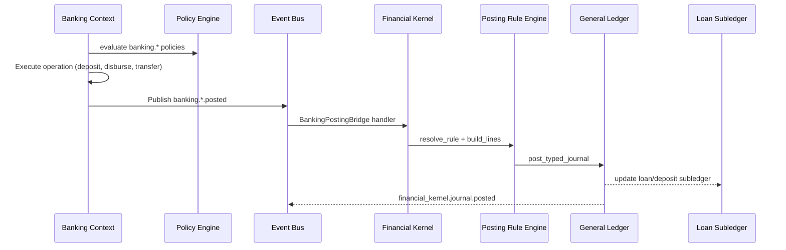

# Banking ↔ General Ledger Bridge — Marpich

**Status:** Canonical — mandatory auto-posting law  
**Owner:** `backend/contexts/financial_kernel/application/banking_posting_bridge.py`  
**Companion:** [ENTERPRISE_BANKING_PLATFORM.md](../ENTERPRISE_BANKING_PLATFORM.md) · [POSTING_RULE_CATALOG.yaml](../financial_kernel/POSTING_RULE_CATALOG.yaml)

**Law: Every banking transaction that changes financial position auto-posts to GL via Financial Kernel. Banking never duplicates financial logic.**

---

## Architecture



---

## Event → posting rule map

| Banking event | Posting rule | Journal type | Notes |
|---|---|---|---|
| `banking.deposit.posted` | `bank_deposit` | `bank` | Customer deposit |
| `banking.withdrawal.posted` | `bank_withdrawal` | `bank` | Customer withdrawal |
| `banking.transfer.posted` | `bank_transfer` | `bank` | Inter-account / inter-bank |
| `banking.loan.disbursed` | `loan_disbursement` | `general` | Dr loans_receivable / Cr cash |
| `banking.loan.repayment.posted` | `loan_repayment` | `general` | Dr cash / Cr loans_receivable + interest |
| `banking.interest.accrued` | `interest_accrual` | `general` | Dr interest_receivable / Cr interest_income |
| `banking.fee.charged` | `bank_fee` | `general` | Dr customer / Cr fee_income |
| `banking.card.settlement.posted` | `card_settlement` | `bank` | Card network settlement |
| `banking.fx.conversion.posted` | `exchange_transaction` | `foreign_currency` | Via Currency Engine |

Events that **do not** post: `banking.account.opened`, `banking.kyc.verified`, `banking.policy.evaluated`, AML alerts (audit only).

---

## Account resolution

1. **`gl_account_code`** on product configuration (tenant-configured COA mapping)
2. **Product type fallback** via posting rule `account_key` slots (`customer_deposits`, `loans_receivable`, `interest_income`)
3. **Explicit lines** in event payload when both sides are known (kernel validates)

Banking never stores GL balances — customer operational balances are banking subledger; GL is source of truth for financial statements.

---

## Subledger integration

| Subledger type | Control account | Owner |
|---|---|---|
| `customer_deposits` | `customer_deposits` | banking |
| `loans` | `loans_receivable` | banking |
| `cards` | `card_receivable` | banking |

Subledger posting triggered by kernel handler after journal post (ADR-067 pattern).

---

## Idempotency

```
idempotency_key = posting:{rule_id}:{source_document_id}
```

Bridge handlers are idempotent — duplicate events do not double-post.

---

## What banking bridge must NOT do

- Build journal lines directly
- Call `_post()` bypassing posting rules
- Store GL balances or trial balance
- Duplicate validation, audit, dimension, or period-close logic
- Hardcode regulatory posting treatment

---

## Dimension propagation

Every posting command carries:

| Dimension | Source |
|---|---|
| `tenant_id` | Request header / event envelope |
| `organization_id` | Banking org (bank entity within tenant) |
| `branch_id` | Branch or agency outlet |
| `channel` | `retail`, `corporate`, `digital`, `branch`, `agency`, `microfinance` |
| `product_code` | Deposit/loan/card product |

---

## Treasury boundary

`banking.transaction.posted` is consumed by **Treasury** for corporate liquidity position updates only. Treasury does not post customer banking journals. Banking does not manage corporate cash pools.
