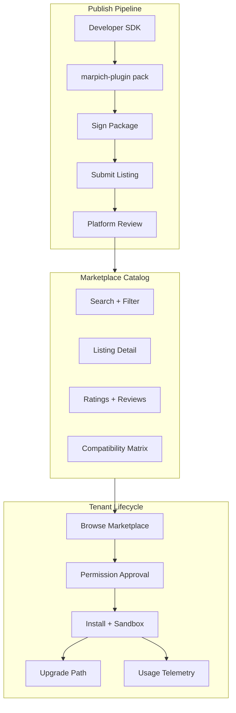
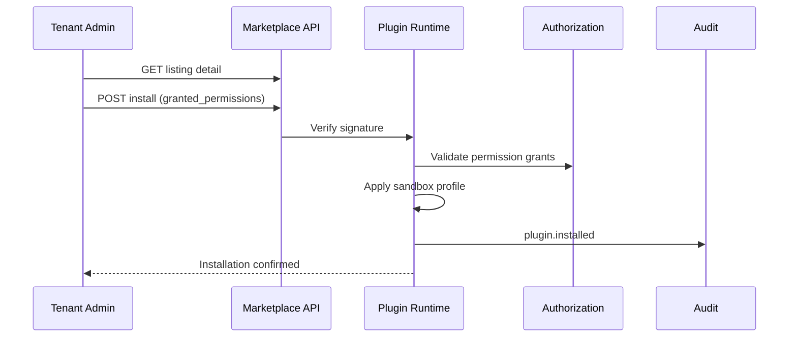

# Marpich Plugin Marketplace — Architecture

**Companion:** [ENTERPRISE_PLUGIN_PLATFORM.md](../ENTERPRISE_PLUGIN_PLATFORM.md)  
**Status:** Canonical

---

## Overview

The Marpich Plugin Marketplace is the distribution layer for third-party extensions. It separates **discovery** (marketplace) from **runtime** (plugin platform) while sharing the same registry backend.

---

## Listing model

| Field | Description |
|-------|-------------|
| `pluginId` | Globally unique (`com.publisher.name`) |
| `pluginType` | One of 8 plugin types |
| `currentVersion` | Latest published semver |
| `publisher` | Verified publisher profile |
| `trustLevel` | `community` · `verified` · `enterprise` |
| `pricing` | `free` · `subscription` · `one_time` |
| `industryPacks` | Compatible industry packs |
| `permissions` | Required permission declarations |
| `sandboxProfile` | Assigned sandbox tier |
| `screenshots` | Media asset URLs |
| `changelog` | Per-version release notes |

---

## Review workflow

1. **Automated scan** — manifest schema, signature, permission audit, dependency check
2. **Security review** — sandbox profile validation, network allowlist
3. **Functional review** — extension point compatibility (verified/enterprise only)
4. **Publish** — listing goes live; `plugin.published` event

Community listings skip step 3; enterprise customers may require custom approval gates via Policy Engine.

---

## Search and discovery

`GET /api/v1/plugins/marketplace/listings`

Query parameters:

| Param | Values |
|-------|--------|
| `type` | module, widget, report, dashboard, theme, ai_skill, integration, workflow_extension |
| `industry` | hospital, bank, university, … |
| `trust` | community, verified, enterprise |
| `q` | Full-text search on name/description |
| `sort` | popular, recent, rating |

Indexed by Search Engine on `plugin.published` events.

---

## Install flow

**Rollback:** Each install snapshots previous state. Failed upgrade auto-rolls back.

---

## Publisher portal (Phase 2 UI)

| Screen | Purpose |
|--------|---------|
| Dashboard | Downloads, active installs, revenue |
| Submissions | Draft → review → published |
| Versions | Upload new semver, changelog |
| Analytics | Invoke counts, error rates |
| Keys | Signing key management |

API-backed today; admin UI planned.

---

## Revenue model (optional)

| Model | Integration |
|-------|-------------|
| Free | Default — no billing |
| Subscription | Finance billing module webhook |
| One-time | Invoice on install |

Billing integration via Integration Platform — marketplace does not process payments directly.

---

## Dashboard widgets

Definition: [`PLUGIN_MARKETPLACE_DASHBOARD.v1.yaml`](PLUGIN_MARKETPLACE_DASHBOARD.v1.yaml)

`GET /api/v1/plugins/marketplace/dashboard` returns:

- Total listings by type
- Installed plugins per tenant
- Pending submissions
- Sandbox violations (24h)
- Top publishers
- Upgrade backlog

---

## Multi-tenancy

- Marketplace catalog is **global** (platform-scoped)
- Installations are **tenant-scoped**
- Publisher accounts are **organization-scoped**
- Enterprise allowlists filter catalog per tenant via Policy Engine

---

## Anti-patterns (forbidden)

- Direct npm/pip install into module runtime
- Unsigned packages in production
- Plugin code with platform DB credentials
- Bypassing permission grant UI
- Mutable plugin versions (always append-only version history)

---

## Related

- [PLUGIN_SDK.md](../../../packages/plugin-sdk/README.md) — developer toolkit
- [PLUGIN_CATALOG.yaml](PLUGIN_CATALOG.yaml) — type and permission catalog
- [INTEGRATION_PLATFORM.md](../INTEGRATION_PLATFORM.md) — connector plugins
